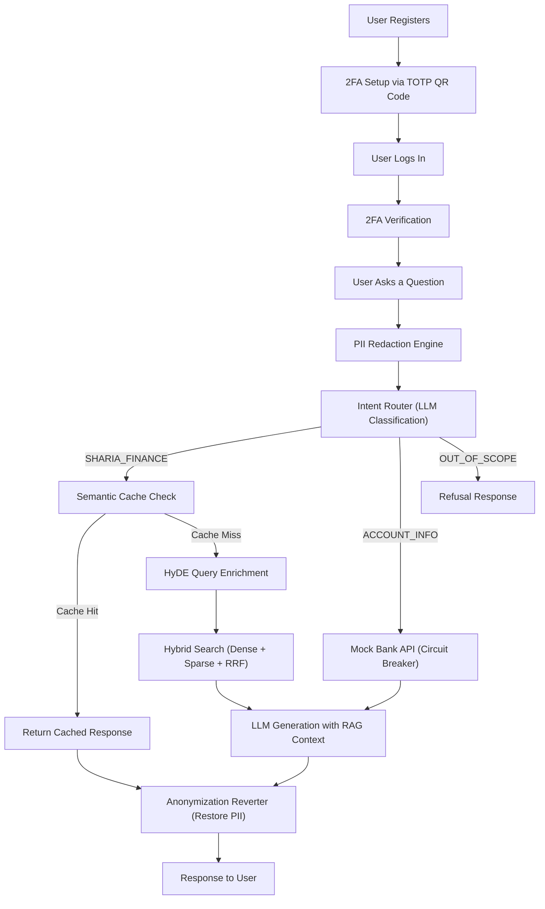

# ShariaGPT — Architecture & Technical Documentation

**At its core, ShariaGPT is a knowledge-based chatbot — but it is fundamentally different from a basic one.** It is an enterprise-grade, intent-aware Islamic Finance AI Assistant that combines secure PII handling, hybrid retrieval-augmented generation (RAG), intelligent query routing, and resilient external API integration into a single, production-ready system deployed on resource-constrained infrastructure.

---

## Table of Contents

1. [System Overview & Flow](#1-system-overview--flow)
2. [Authentication & 2FA](#2-authentication--2fa)
3. [PII Redaction & Anonymization Reverter](#3-pii-redaction--anonymization-reverter)
4. [Intent Routing Engine](#4-intent-routing-engine)
5. [PDF Ingestion Pipeline](#5-pdf-ingestion-pipeline)
6. [Embedding Strategy: Dense & Sparse](#6-embedding-strategy-dense--sparse)
7. [Hybrid Retrieval with Qdrant RRF](#7-hybrid-retrieval-with-qdrant-rrf)
8. [HyDE Query Enrichment](#8-hyde-query-enrichment)
9. [Semantic Caching](#9-semantic-caching)
10. [Admin Panel & Document Management](#10-admin-panel--document-management)
11. [Observability, Tracing & Evaluation](#11-observability-tracing--evaluation)
12. [Production Trade-offs & Constraints](#12-production-trade-offs--constraints)
13. [Scalability Analysis](#13-scalability-analysis)
14. [Test Coverage](#14-test-coverage)
15. [Technology Stack](#15-technology-stack)

---

## 1. System Overview & Flow

The end-to-end lifecycle of a user interaction follows this path:



**What makes this different from a basic knowledge chatbot:**

- **Intent-aware branching**: Not all queries hit the vector database. Account queries go to banking APIs; out-of-scope queries are refused instantly.
- **PII-first architecture**: Raw user data is *never* sent to third-party LLM providers. PII is masked before any processing and restored only at the final response layer.
- **Hybrid retrieval**: Combines semantic (dense) and keyword (sparse/BM25) search with Reciprocal Rank Fusion for maximum recall.
- **HyDE enrichment**: Queries are enriched with hypothetical domain-specific passages before retrieval.
- **Per-user semantic caching**: Reduces redundant LLM calls with intelligent cache invalidation.
- **Circuit breakers**: All external service calls are protected against cascading failures.

---

## 2. Authentication & 2FA

### Registration Flow

1. User submits registration with email, password, name, Emirates ID, account number, and account type.
2. Password is hashed using `bcrypt` before storage.
3. A TOTP secret is generated using `pyotp.random_base32()`.
4. A QR code is generated from the `otpauth://` provisioning URI and returned as a base64-encoded PNG.
5. User scans the QR code with an authenticator app (Google Authenticator, Authy, etc.).
6. User profile is stored in a dedicated Qdrant collection (`sharia_users`).

### Login Flow

1. User submits email and password.
2. Backend verifies credentials against the bcrypt hash.
3. A JWT token is issued with `2fa_complete: false`.
4. User must submit a valid 6-digit TOTP code from their authenticator app.
5. Upon successful 2FA verification, a new JWT is issued with `2fa_complete: true`.
6. All subsequent API calls require this fully-authenticated token via the `require_auth` dependency.

### Data Portability & Right to be Forgotten

- `GET /auth/export` — Exports all user data (profile + chat history) for GDPR/data portability compliance.
- `DELETE /auth/account` — Permanently deletes the user profile from Qdrant and all chat sessions from Redis.

---

## 3. PII Redaction & Anonymization Reverter

### The Challenge

When a user asks *"What is my balance for account 1234567890?"*, that raw account number must **never** reach the third-party LLM provider (OpenRouter). However, the final response must still feel personalized.

### Implementation

The PII engine (`app/pii/redactor.py`) uses compiled regex patterns to detect UAE-specific PII:

| Entity Type | Pattern | Example |
|---|---|---|
| `EMIRATES_ID` | `784-?XXXX-?XXXXXXX-?X` | `784-1990-1234567-1` |
| `IBAN` | `XX00XXXX0000000000000` | `AE070331234567890123456` |
| `ACCOUNT_NUMBER` | `10-16 digit number` | `1234567890` |
| `UAE_PHONE` | `+971XXXXXXXXX` | `+971501234567` |
| `EMAIL_ADDRESS` | Standard email regex | `ahmed@example.ae` |
| `PERSON` | Titled names (Mr./Dr./Mrs.) | `Dr. Mohammed Al-Rashid` |

### The Anonymization Reverter Pattern

1. **Mask**: `"My account 1234567890"` → `"My account <ACCOUNT_NUMBER_1>"` + mapping `{<ACCOUNT_NUMBER_1>: "1234567890"}`
2. **Process**: The masked text flows through intent routing, retrieval, and LLM generation. The LLM sees only `<ACCOUNT_NUMBER_1>`.
3. **Restore**: After the LLM responds with `"Your balance for <ACCOUNT_NUMBER_1> is..."`, the `restore()` function replaces the placeholder back to `"Your balance for 1234567890 is..."`.

> **Design Note — Why Regex Instead of Presidio:**
> We originally implemented Microsoft Presidio with the `en_core_web_sm` spaCy NLP model for higher-accuracy NER-based detection. However, loading the spaCy model consumed ~200MB of RAM, which exceeded the memory budget on Render's free tier (512MB). The regex-based implementation provides zero-memory overhead while still accurately detecting all structured UAE PII patterns. Presidio remains the recommended upgrade path for production deployments with adequate resources. See [Section 12](#12-production-trade-offs--constraints) for details.

---

## 4. Intent Routing Engine

After PII redaction, the sanitized query is classified by the Intent Router (`app/rag/intent_router.py`) using a zero-temperature LLM classification call:

| Intent | Description | Action |
|---|---|---|
| `SHARIA_FINANCE` | Islamic finance concepts, Sharia compliance, product info | → RAG Pipeline |
| `ACCOUNT_INFO` | Personal banking queries (balance, transactions, status) | → Mock Bank API |
| `OUT_OF_SCOPE` | Unrelated queries (weather, sports, etc.) | → Instant refusal |

For `ACCOUNT_INFO`, the router also determines a sub-action: `CHECK_BALANCE`, `RECENT_TRANSACTIONS`, `ACCOUNT_STATUS`, or `UNKNOWN`.

The Bank API (`app/services/bank_api.py`) is protected by a `pybreaker.CircuitBreaker` (trips after 3 failures, resets after 30s). In a production environment, this would be replaced with real core banking API calls via `httpx`.

**Resilience**: If the intent router LLM call fails, the system silently defaults to `SHARIA_FINANCE`, ensuring the user always gets a response.

---

## 5. PDF Ingestion Pipeline

### Document Parsing

PDFs uploaded via the admin panel are converted to Markdown using **LlamaCloud's agentic parser**. This preserves document structure (headings, tables, numbered lists) and extracts page-level metadata via `<!-- PAGE_BREAK page="N" -->` markers.

> **Cost-Conscious Alternative:** For deployments where LlamaCloud API costs are a concern, **PaddleOCR** can be used as a free, self-hosted alternative. The trade-off is slightly lower parsing accuracy for complex table layouts, but it eliminates the per-page API cost entirely.

### Heading-Aware Chunking

The chunker (`app/rag/chunker.py`) is not a naive text splitter. It:

1. **Walks lines** detecting ATX headings (`#`, `##`, `###`) and builds a heading hierarchy stack.
2. **Tracks page numbers** from `PAGE_BREAK` markers injected during parsing.
3. **Preserves numbered lists** — consecutive numbered items are never split across chunks.
4. **Prefixes each chunk** with its full heading path (e.g., `[Murabaha Overview > Key Sharia Conditions]`) so the LLM always has structural context.
5. **Soft-limits at 400 words** per chunk for optimal retrieval granularity.

### Dual Embedding at Ingestion

Each chunk is embedded twice during the reindex process (`scripts/reindex.py`):

- **Dense**: `text-embedding-3-small` via OpenRouter (384 dimensions)
- **Sparse**: `Qdrant/bm25` via `fastembed` (token-level term frequencies with IDF weighting)

Both vectors are stored in Qdrant under the named vector spaces `"dense"` and `"sparse"`.

---

## 6. Embedding Strategy: Dense & Sparse

### Dense Embeddings

- **Model**: `openai/text-embedding-3-small` (384 dimensions)
- **Provider**: OpenRouter API (not loaded locally)
- **Purpose**: Captures semantic meaning — understands that "Islamic mortgage" and "Murabaha home financing" are conceptually identical even though they share no keywords.

### Sparse Embeddings (BM25)

- **Model**: `Qdrant/bm25` via `fastembed`
- **Purpose**: Captures exact keyword matches — ensures that a query for "Sukuk al-Ijara" finds documents containing that exact term, even if the dense embedding would rank a general "Islamic bonds" document higher.
- **IDF Modifier**: Configured with `SparseVectorParams(modifier=Modifier.IDF)` to down-weight common terms and boost rare, domain-specific vocabulary.

### Why Both?

Neither approach alone is sufficient for specialized Islamic finance terminology:

- Dense-only misses exact technical terms (e.g., "Gharar" vs. "uncertainty").
- Sparse-only misses semantic relationships (e.g., "profit-sharing" ≈ "Mudarabah").
- Combined via RRF, they complement each other for maximum recall and precision.

> [!IMPORTANT]
> **Why BM25 Instead of SPLADE?**
> The ideal sparse model for this system would be **SPLADE** (Sparse Lexical and Expansion Model). Unlike BM25 which only matches *exact* keywords present in the text, SPLADE performs **learned term expansion** — it can infer that a document about "Murabaha" should also score highly for the query term "cost-plus financing" even if those exact words never appear, because the neural model has learned the semantic relationship between the terms during training. This makes Dense + SPLADE strictly more powerful than Dense + BM25 for recall.
>
> However, SPLADE models (e.g., `naver/splade-cocondenser-ensembledistil`) require **~500MB of RAM** to load, which exceeds our entire Render free-tier budget. The `Qdrant/bm25` model via fastembed requires only **~5MB** — a 100x reduction. For our domain-specific corpus where Islamic finance terminology is consistent and well-defined, BM25's exact-match behavior is sufficient, and the dense embedding layer already captures the semantic expansion that SPLADE would otherwise provide. If we scale to a server with ≥2GB RAM, SPLADE would be the first upgrade we make to the sparse layer.

---

## 7. Hybrid Retrieval with Qdrant RRF

### Current Implementation (Server-Side RRF)

The `hybrid_search` function in `app/rag/vector_store.py` sends a **single `query_points` call** to Qdrant with two `Prefetch` sub-queries:

```python
results = client.query_points(
    collection_name=collection,
    prefetch=[
        Prefetch(query=dense_vector, using="dense", limit=k * 2),
        Prefetch(query=SparseVector(...), using="sparse", limit=k * 2),
    ],
    query=FusionQuery(fusion=Fusion.RRF),
    limit=k,
)
```

Qdrant internally fetches candidates from both vector spaces, applies the standard RRF formula `score = Σ 1/(k + rank)`, and returns a single fused result set.

### Previous Implementation (Application-Side RRF)

The original implementation made **two separate API calls** (one dense, one sparse) and manually computed RRF in Python with a tunable `rrf_k=60` parameter. This gave more control: you could inspect individual dense/sparse scores, tune the fusion constant, and pull a larger initial candidate pool of 50.

### Why We Switched

| Aspect | Old (Manual) | Current (Qdrant) |
|---|---|---|
| Network calls | 2 round-trips | 1 round-trip |
| Latency | Higher | ~50% lower |
| `rrf_k` tuning | Configurable | Qdrant default |
| Score transparency | Individual dense/sparse scores visible | Single fused score |
| Memory overhead | Stores all candidates in Python | Server-side |

**For our use case, the current approach is the better fit** — fewer network calls means significantly lower latency on Render's free tier, where every millisecond counts against the 30-second request timeout. The granularity trade-off is acceptable because our document corpus is domain-specific enough that the default RRF parameters perform well.

---

## 8. HyDE Query Enrichment

**HyDE (Hypothetical Document Embeddings)** is used as "Stage 0" of the retrieval pipeline to enrich the user's query before it hits the vector database (`app/rag/query_transformer.py`).

### How It Works

1. **Hypothetical Generation**: When a user asks a question, we make a fast, strict-timeout (3-second) LLM call asking it to write a *hypothetical passage* from an Islamic finance textbook that would answer the question. The prompt specifically instructs the LLM to use precise terminology (Murabaha, Musharaka, Sukuk, Riba, Ijara, etc.).

2. **Dense Blending**: We embed both the original query and the hypothetical passage, then **average the two vectors**: `blended = [(r + h) / 2.0 for r, h in zip(raw, hyde)]`. This blends the user's precise intent with the rich domain vocabulary from the LLM.

3. **Sparse Enrichment**: We concatenate the raw query and hypothetical passage (`query + " " + hyde_passage`) and run the combined text through the BM25 model. This dramatically increases the number of relevant keywords for sparse matching.

4. **Resilience**: If the HyDE LLM call exceeds the 3-second timeout or if the API is down, the system silently falls back to the raw query. **This resilience is built-in — the user doesn't feel the difference.** The retrieval still works, just without the enrichment boost.

### Impact

For a query like *"How does Islamic leasing work?"*, HyDE generates a passage containing terms like "Ijara", "usufruct", "lessor/lessee", "asset ownership" — pulling the embedding vector closer to the actual stored Ijara documents and significantly improving recall.

---

## 9. Semantic Caching

The semantic cache (`app/rag/semantic_cache.py`) is a two-tier system that reduces redundant LLM calls:

### Architecture

- **Tier 1 — Qdrant** (`sharia_cache_queries` collection): Stores query embeddings. When a new query arrives, its embedding is compared against cached query embeddings using cosine similarity (threshold: 0.85).
- **Tier 2 — Upstash Redis**: Stores the actual response payloads (keyed by a SHA-256 hash of `user_id:query`).

### Cache Scope & Invalidation

The cache is **user-scoped** — a response cached for User A will not be served to User B, even for semantically identical queries. This is critical because responses may contain user-specific account context.

Cache entries are invalidated under four conditions:

| Condition | Mechanism |
|---|---|
| **TTL Expiry** | Entries expire after 24 hours (`ttl_seconds=86400`) |
| **User Mismatch** | `user_id` in cached entry must match the requesting user |
| **Account Type Change** | `account_type` must match (e.g., "Retail" vs. "Corporate") |
| **Knowledge Base Update** | A global `knowledge_version` counter is incremented whenever the admin uploads or deletes a document. Any cached entry with an older version is considered stale. |

This ensures users always receive fresh, accurate, and personalized responses while minimizing LLM token consumption.

### Why an External Cache, Not In-Memory

A naive approach would be to use a Python `dict` or `lru_cache` for caching responses in-memory. We deliberately chose **Upstash Redis (external)** + **Qdrant (external)** for two reasons:

**1. Token-Cost Savings at Scale**

Every LLM call costs tokens. A single GPT-4o-mini response for a RAG query consumes ~1,200 tokens (~$0.0002). At 1,000 queries/day with a 40% cache hit rate, that saves ~480 LLM calls/day = ~576,000 tokens/day = **~$17/month** in direct API costs. An in-memory cache achieves the same savings on a single server, but the moment the process restarts (which Render's free tier does frequently due to inactivity spin-down), the entire cache is lost and must be rebuilt from scratch — negating the savings during cold-start periods.

**2. Horizontal Scalability**

With an in-memory cache, each server instance maintains its own isolated cache. If we scale to 3 instances behind a load balancer, User A's cached response on Instance 1 is invisible to Instance 2 — leading to redundant LLM calls and inconsistent response times. With an external cache (Redis + Qdrant), all instances share the same cache state. A response cached by Instance 1 is immediately available to Instance 2 and Instance 3. This is essential for any deployment that needs to scale beyond a single process.

---

## 10. Admin Panel & Document Management

### Frontend

The admin panel (`frontend/admin.html` + `frontend/admin.js`) provides:

- API key authentication (stored in `localStorage`)
- Drag-and-drop PDF upload zone
- PDF list table with Cloudinary viewer integration
- One-click document deletion

### Backend Flow

When an admin uploads a PDF via `POST /admin/upload`:

1. **Cloudinary Upload**: The raw PDF is uploaded to Cloudinary for persistent storage and browser-based viewing.
2. **LlamaCloud Parsing**: The PDF bytes are sent to LlamaCloud's agentic parser, which returns structured Markdown with page markers.
3. **Local Persistence**: The Markdown is saved to `data/sharia_docs/` for reindexing capability.
4. **Chunking & Embedding**: The Markdown is chunked and embedded (dense only during upload; sparse is added during full reindex).
5. **Cache Invalidation**: The global `knowledge_version` is incremented, invalidating all cached responses.

When an admin deletes a document via `DELETE /admin/pdfs/{source_name}`:

1. Cloudinary asset is destroyed.
2. All Qdrant chunks with matching `source` metadata are deleted.
3. Local Markdown file is removed.
4. PDF registry is updated.
5. Cache is globally invalidated.

---

## 11. Observability, Tracing & Evaluation

### Structured Trace Logging

Every chat request emits a structured JSON trace (`app/observability/tracer.py`) to `logs/traces.jsonl` containing:

- `request_id`, `session_id`, `timestamp`
- `latency_ms`, `model` (or `"cache"` for cache hits)
- `prompt_tokens`, `completion_tokens`, `total_tokens`
- `chunk_ids`, `relevance_scores`, `avg_relevance_score`
- `pii_detected` (list of entity types found)
- `query_length`, `response_length`, `cache_hit`

### Audit Middleware

The `AuditMiddleware` (`app/observability/audit.py`) logs every HTTP request to `logs/audit.jsonl`:

- HTTP method, URL, status code
- Client IP (with `X-Forwarded-For` proxy support)
- User ID (extracted from JWT without re-verification)
- Latency in milliseconds

### Security Headers

The `SecurityHeadersMiddleware` enforces:

- `Strict-Transport-Security` (HSTS)
- `X-Content-Type-Options: nosniff`
- `X-Frame-Options: DENY`
- `Content-Security-Policy` (whitelisting `self`, Cloudinary, and Google Fonts)

### LangSmith Production Tracing

To provide granular visibility into the LLM execution waterfall, the core pipeline (`chat_endpoint`, `retrieve`, `generate_hypothetical_document`) is instrumented with LangSmith `@traceable` decorators. This allows us to inspect exact prompt inputs, completions, and step-by-step latencies directly in the LangSmith UI.

### Automated Evaluation (Ragas)

To prevent silent RAG degradation, the system uses **Ragas** (Retrieval Augmented Generation Assessment) for automated evaluation:

- **Golden Dataset**: A curated set of complex Islamic finance questions (`data/eval_dataset.json`) paired with ground-truth answers.
- **Evaluation Pipeline**: The `scripts/evaluate_rag.py` script runs queries through the live pipeline and grades them on:
  - **Faithfulness** (Hallucination detection)
  - **Answer Relevancy**
  - **Context Precision & Recall**
- **Admin Integration**: Results are saved locally and surfaced in the Admin Panel (`GET /admin/evals`), providing a single pane of glass for system health alongside LangSmith quick-links.

---

## 12. Production Trade-offs & Constraints

Deploying on Render's free tier (512MB RAM, 30-second request timeout) required several deliberate architectural trade-offs:

### What We Cut and Why

| Decision | Rationale |
|---|---|
| **Regex PII instead of Presidio** | Presidio + spaCy `en_core_web_sm` consumed ~200MB RAM. Regex uses ~0MB. We lose NER-based name detection (only catches titled names like "Dr. Ahmed") but retain 100% accuracy on structured PII (Emirates ID, IBAN, phone, email, account numbers). |
| **OpenRouter for embeddings** | Loading `text-embedding-3-small` locally would consume ~500MB. OpenRouter API calls add ~50ms latency but use 0 local memory. |
| **Server-side RRF** | Application-side RRF required 2 network round-trips. Server-side RRF halves latency, critical for staying under the 30s timeout. |
| **BM25 via fastembed** | `Qdrant/bm25` is a ~5MB model vs. SPLADE at ~500MB. Adequate keyword matching for our domain-specific corpus. |

### Why OpenRouter

OpenRouter acts as a **unified gateway** to multiple LLM providers. If one endpoint (e.g., OpenAI) experiences downtime, OpenRouter automatically routes to an alternative provider. This gives us near-zero downtime without implementing multi-provider failover logic ourselves. Combined with our `pybreaker` circuit breaker, this creates a double layer of resilience.

### What We'd Add With More Resources

- **Presidio + spaCy** for NER-based PII detection (catches unstructured names).
- **Cross-encoder reranking** as a Stage 2 after hybrid retrieval.
- **Streaming responses** via SSE for perceived latency reduction.
- **Application-side RRF** with tunable parameters and score transparency.

---

## 13. Scalability Analysis

This section evaluates each component of the system for horizontal scalability — what is already scalable, what needs work, and what the upgrade path looks like.

### Already Scaled (Stateless / Managed Services)

| Component | Why It's Already Scalable |
|---|---|
| **Qdrant Cloud** | Fully managed, horizontally scalable vector database. Adding more documents or queries requires no infrastructure changes. Handles RRF fusion server-side, offloading compute from the application. |
| **Upstash Redis** | Serverless Redis with per-request pricing. Automatically scales with traffic. Shared across all application instances for consistent cache state. |
| **OpenRouter (LLM Gateway)** | Stateless API calls with automatic multi-provider failover. No local state, no model loading, no GPU management. Can handle unlimited concurrent requests (rate limits permitting). |
| **Cloudinary** | CDN-backed file storage. PDF hosting scales independently of the application. |
| **JWT Authentication** | Stateless token verification — any server instance can validate a JWT without shared session state. No sticky sessions required. |
| **PII Redaction** | Pure regex, no external dependencies, no model loading. Executes in <1ms. Scales linearly with CPU. |

### Needs Scaling (Current Bottlenecks)

| Component | Current Limitation | Upgrade Path |
|---|---|---|
| **HyDE LLM Call** | Sequential and blocking per-request. Each query waits up to 3 seconds. | **Implemented**: Async parallel execution (`asyncio.gather`) — raw search runs concurrently with HyDE, eliminating the latency penalty. |
| **Dense Embedding (OpenRouter)** | Synchronous HTTP call (~50ms per embedding). Blocks the event loop. | Wrap in `asyncio.to_thread()` or switch to `AsyncOpenAI` for the embedding endpoint. Batch multiple queries in a single API call during ingestion. |
| **Sparse Embedding (fastembed)** | Loads `Qdrant/bm25` model into local memory (~5MB). Thread-safe but single-instance. | Acceptable at current scale. For high throughput, deploy as a separate microservice with a pool of workers. |
| **Intent Router** | Makes a synchronous LLM call per request (~300ms). | Cache common intent classifications. Most queries fall into predictable patterns — caching the intent for semantically similar queries would eliminate redundant LLM calls. |
| **Single-Process Deployment** | Render free tier runs a single `uvicorn` process. | Scale to multiple workers via `gunicorn` with `uvicorn.workers.UvicornWorker`. All state is already external (Qdrant, Redis), so adding workers requires zero code changes. |
| **Bank API (Mock)** | Currently returns hardcoded data. | Replace with real `httpx.AsyncClient` calls to core banking APIs. The circuit breaker (`pybreaker`) is already in place and will protect against cascading failures. |

### 100x Volume Stress Test: What Breaks First?

At 100x request volume, the current architecture will experience cascading failures across multiple layers due to its single-instance, CPU-bound design constraints:

1. **FastEmbed CPU Exhaustion**: Sparse embeddings via `fastembed` run locally on the CPU. At 100x concurrency, matrix multiplications will peg the CPU to 100%, causing the event loop to choke and Render to kill the process. *Fix: Offload to an external API (Cohere) or a dedicated GPU-backed TEI microservice.*
2. **Uvicorn Concurrency Ceiling**: The single `uvicorn` process cannot utilize multiple CPU cores, resulting in HTTP 502 Bad Gateway timeouts as new connections queue and drop. *Fix: Wrap the app in `gunicorn` with `UvicornWorker` (`workers=4`) and scale horizontally across multiple container nodes.*
3. **OpenRouter Rate Limits**: Hitting provider TPM/RPM limits will trigger the `pybreaker` circuit breaker, resulting in 60-second windows of total system downtime for all users. *Fix: Implement an LLM proxy router (like LiteLLM) for automatic cross-provider failover (e.g., Azure OpenAI fallback) or purchase Provisioned Throughput.*
4. **Qdrant Free Tier Limits**: The dual read-load (HyDE + raw query) will exceed free-tier IOPS and connection limits. *Fix: Upgrade to a dedicated Qdrant cluster with robust client-side connection pooling.*

### Scaling Roadmap (Priority Order)

1. **Multi-worker deployment** — `gunicorn -w 4 -k uvicorn.workers.UvicornWorker` for 4x throughput with zero code changes.
2. **Intent caching** — Cache intent classifications for semantically similar queries to reduce LLM calls by ~30%.
3. **SPLADE upgrade** — Replace BM25 with SPLADE when RAM budget allows (≥2GB), significantly improving sparse retrieval recall.
4. **Streaming responses** — SSE streaming for perceived latency reduction on long responses.
5. **Async embeddings** — Move all embedding calls to async to fully unblock the event loop.

---

## 14. Test Coverage

The test suite (`tests/`) covers 20 test cases across 5 modules:

| Module | Tests | Coverage |
|---|---|---|
| `test_pii_redaction.py` | 9 | Emirates ID, IBAN, account numbers, email, phone, titled names, false positives, multiple PII types, API integration |
| `test_compliance.py` | 2 | Security headers (CSP, HSTS, X-Frame-Options), content type validation |
| `test_grounding.py` | 2 | LLM responses grounded in provided context, citation format validation |
| `test_refusal.py` | 5 | Out-of-scope query rejection (weather, crypto, conventional banking, personal advice, sports) |
| `test_semantic_cache.py` | 2 | Cache hit/miss behavior, response consistency |

All tests use mocked LLM responses and mocked Qdrant results to ensure deterministic, fast execution without external dependencies.

---

## 15. Technology Stack

| Layer | Technology | Purpose |
|---|---|---|
| **Framework** | FastAPI | Async API server with automatic OpenAPI docs |
| **Vector DB** | Qdrant Cloud | Dense + sparse vector storage with server-side RRF |
| **Cache** | Upstash Redis | Semantic cache storage, session management |
| **LLM Gateway** | OpenRouter | Unified access to GPT-4o-mini with automatic failover |
| **Dense Embeddings** | `text-embedding-3-small` via OpenRouter | 384-dim semantic vectors |
| **Sparse Embeddings** | `Qdrant/bm25` via fastembed | BM25 token vectors with IDF |
| **PDF Parsing** | LlamaCloud (agentic tier) | PDF → structured Markdown |
| **PDF Storage** | Cloudinary | Persistent PDF hosting with browser viewer |
| **Auth** | JWT + TOTP (pyotp) | Token-based auth with time-based 2FA |
| **PII** | Compiled Regex patterns | UAE-specific entity detection & masking |
| **Resilience** | pybreaker | Circuit breakers on LLM and Bank API calls |
| **Observability** | Custom JSONL logger | Structured traces and audit logs |
| **Deployment** | Render (free tier) | Auto-deploy from GitHub, 512MB RAM |
