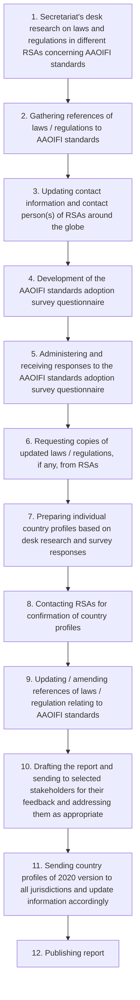
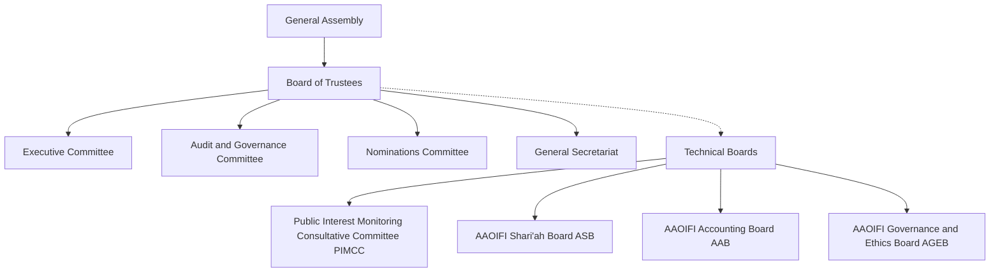

<!-- PAGE_BREAK page="1" -->
AAOIFI - Accounting and Auditing Organization for Islamic Financial Institutions logo
Geometric Islamic pattern with chevron overlays
# AAOIFI Footprint Report 2022
A study on the adoption status of AAOIFI standards across jurisdictions of various regulatory and supervisory authorities
Ver. 2.0

<!-- PAGE_BREAK page="2" -->
**Prepared by: AAOIFI Secretariat**
© The Accounting and Auditing Organization for Islamic Financial Institutions 2022
First edition (e-copy): Published October 2020
2nd edition (hard and e-copy): Published November 2022
P.O. Box: 1176, Manama, Kingdom of Bahrain.
Tel.: +97317244496
Fax: +97317250194
Website: 
[www.aaoifi.com](http://www.aaoifi.com)
Email: 
<rsas@aaoifi.com>
Disclaimer: Readers and all concerned are hereby informed that the study is based on primary research (i.e. information provided by the regulatory and supervisory bodies via the questionnaire sent to them for response, and their confirmation of their respective country profiles; and in-house secondary research (involving sourcing and compilation of information available on the internet). While utmost care has been taken to ensure the authenticity and correctness of the information provided in this report, readers are requested to highlight any information that is incorrect or outdated together with suitable references. As AAOIFI do not claim every information given in the report is 100% correct or up to date, therefore stands corrected if brought to the notice of its secretariat. Any corrections and updates will be incorporated, in the subsequent version / issue of the report. The information published is in good faith for supporting, encouraging and gauging the level of penetration and adoption of AAOIFI standards around the globe. Hence, AAOIFI does not make any warranties about the completeness, reliability and accuracy of the information presented here. Any action taken based on the information presented here is strictly at your risk and AAOIFI will not be liable for any losses and damages in connection with the use of the data presented in this report. Please get in touch with AAOIFI secretariat with regards to the report via 
<rmalik@aaoifi.com>
 or 
<ssiddiq@aaoifi.com>
.

<!-- PAGE_BREAK page="3" -->
Arabic calligraphy of the Bismillah
<mark>In the name of Allah, the most gracious, the most merciful</mark>

<!-- PAGE_BREAK page="4" -->
# Contents
* Message from the Chairman of AAOIFI Board of Trustees 8
* Message from the Chairman of AAOIFI Shariah Board 10
* Message from the Chairman of AAOIFI Accounting Board (AAB) 11
* Message from the Chairman of AAOIFI Governance and Ethics Board (AGEB) 12
* Messages from selected Islamic finance stakeholders 13
* About AAOIFI 24
* AAOIFI objectives 25
* AAOIFI historical timeline 26
* AAOIFI key facts and figures 28
* AAOIFI membership 29
* AAOIFI boards' members 32
* Acknowledgements 40
* Acronyms 41
* Executive Summary 44
* Terminologies 46
* Brief report 47
  * 1. Introduction 47
  * 2. Methodology 49
AAOIFI - Accounting and Auditing Organization for Islamic Financial Institutions logo

<page_number>4</page_number>

AAOIFI Footprint Report 2022

<!-- PAGE_BREAK page="5" -->
* 3. Summary of AAOIFI standards adoption status 53
  * Table 3.1 List of countries and regulatory jurisdictions that have full adoption of AAOIFI standards 53
  * Table 3.2 List of countries and regulatory jurisdictions that have partial adoption of AAOIFI standards 55
  * Table 3.3 List of countries and regulatory jurisdictions adopting AAOIFI standards as guidelines or as reference material 56
  * Table 3.4 List of countries and regulatory jurisdictions that have local standards / regulations based on AAOIFI standards 57
  * Table 3.5 List of countries and regulatory jurisdictions that adopt AAOIFI standards as guidelines and have local standards / regulations based on AAOIFI standards 58
  * Table 3.6 List of countries and regulatory jurisdictions where supplementary reporting is allowed as per AAOIFI standards 58
* 4. Potential countries / regulatory jurisdictions that are presently considering adopting AAOIFI standards 59
* 5. The way forward 60
* 6. Country profiles 63
  * 6.1. Afghanistan, Islamic Republic of 64
  * 6.2. Bahrain, Kingdom of 68
  * 6.3. Bangladesh, People's Republic of 71
  * 6.4. Brunei Darussalam 75
AAOIFI Footprint Report 2022 | <page_number>5</page_number>

AAOIFI - Accounting and Auditing Organization for Islamic Financial Institutions logo

<!-- PAGE_BREAK page="6" -->
6.5. Djibouti, Republic of 78
6.6. Egypt, Arab Republic of 80
6.7. Indonesia, Republic of 83
6.8. Iraq, Republic of 87
6.9. IsDB (Kingdom of Saudi Arabia) 94
6.10. Jordan, Hashemite Kingdom of 97
6.11. Kazakhstan, Republic of 101
6.12. Kuwait, State of 106
6.13. Kyrgyz Republic 110
6.14. Lebanon, Republic of 114
6.15. Libya 116
6.16. Malaysia 118
6.17. Maldives, Republic of 125
6.18. Mauritius, Republic of 130
6.19. Nigeria, Federal Republic of 133
6.20. Oman, Sultanate of 137
6.21. Pakistan, Islamic Republic of 141
6.22. Palestine, State of (Palestinian Authority) 146
6.23. Qatar, State of 150
AAOIFI logo

<page_number>6</page_number>

AAOIFI Footprint Report 2022

<!-- PAGE_BREAK page="7" -->
6.24. Russian Federation............................................................................................................................................................................................................................... 155
6.25. Saudi Arabia, Kingdom of................................................................................................................................................................................................................ 157
6.26. Seychelles, Republic of...................................................................................................................................................................................................................... 161
6.27. Singapore, Republic of....................................................................................................................................................................................................................... 163
6.28. Sudan, Republic of the ...................................................................................................................................................................................................................... 165
6.29. Syrian Arab Republic........................................................................................................................................................................................................................... 169
6.30. Tajikistan, Republic of ........................................................................................................................................................................................................................ 174
6.31. Tunisia, Republic of ............................................................................................................................................................................................................................. 177
6.32. Turkey, Republic of ............................................................................................................................................................................................................................... 179
6.33. United Arab Emirates ......................................................................................................................................................................................................................... 185
6.34. West African Monetary Union (BCEAO) ............................................................................................................................................................................... 194
6.35. Yemen, Republic of .............................................................................................................................................................................................................................. 196
* Appendices ........................................................................................................................................................................................................................................................................... 199

  * Appendix A - AAOIFI standards and technical pronouncements in issue as of August 2020............................................................ 200

  * Appendix B - AAOIFI members as of August 2020 ............................................................................................................................................................ 208

  * Appendix C - AAOIFI organizational structure ...................................................................................................................................................................... 218

  * Appendix D - AAOIFI standards adoption survey questionnaire ............................................................................................................................ 219

  * Appendix E - AAOIFI standards publications ......................................................................................................................................................................... 221

  * Appendix F - AAOIFI other publications.................................................................................................................................................................................... 222
AAOIFI Footprint Report 2022

<page_number>7</page_number>

AAOIFI - Accounting and Auditing Organization for Islamic Financial Institutions logo

<!-- PAGE_BREAK page="8" -->
8 AAOIFI Footprint Report 2022
Photograph of several ornate, glowing lanterns with colorful glass panels and intricate metalwork patterns.

<!-- PAGE_BREAK page="9" -->
Close-up of an ornate lantern with geometric patterns
# Messages for AAOIFI Footprint Report 2022
Continuation of the lantern image showing warm light and shadows
AAOIFI Footprint Report 2022 <page_number>9</page_number>

<!-- PAGE_BREAK page="10" -->
# Message from the Chairman of AAOIFI Board of Trustees
Praise be to Allah and prayers and peace be upon our Prophet Muhammad and his noble household and companions.
Ebrahim Bin Khalifa Al Khalifa
It gives me utmost pleasure to present this second edition of the AAOIFI Footprint Report to you. This report was well received by the industry, which, set the tone for enhanced and renewed engagement between AAOIFI and regulatory and supervisory authorities around the globe and provided impetus to expand the footprint of AAOIFI further.
**Ebrahim Bin Khalifa Al Khalifa**
*Chairman of the AAOIFI Board of Trustees*
AAOIFI has been in existence for more three decades now. Only through the rigorous efforts of the team and an unparalleled support by the regulators and market players, as well as, the scholars, professionals and experts in the field of Islamic finance, it has been able to achieve a great feat in the development, growth, standardization and harmonization of Islamic finance in light of the divine guidance and the best industry practices. This study has been conducted to measure such impact that AAOIFI has made to the Islamic finance industry and economies of the Muslim countries to a reasonable, measurable degree.
AAOIFI aims to develop globally consistent and harmonized standards in order to develop and maintain the industry’s relevance for the benefit of various industry stakeholders and to contribute to the Islamic financial economy around the globe. Another objective that this report has successfully achieved is creating a channel of communication of AAOIFI with around 90 regulators and supervisory authorities around the globe, who were part of the background work performed for the purpose of this report.
This report sheds light on an important and untold synopsis on the extent of adoption of AAOIFI standards
around the globe, a process that is complex in this growing industry aiming for harmonization of practices which are open to various Shari’ah interpretations. It is true that adoption and implementation of standards require years of advocacy, outreach, partnership, scholarship and capacity building, among others, AAOIFI is glad that in the past three decades of its existence it has been successful in all these fronts.
AAOIFI has currently 117 standards and technical pronouncements in issue which are followed in more than 60 regulatory jurisdictions globally with different levels of adoption. In addition, AAOIFI has made a significant contribution by guiding and inculcating Islamic finance thought among the conventional counterparts to recognize Islamic finance industry’s distinct position as an alternate to conventional banking and finance that is in line with Shari’ah principles and rules. AAOIFI standards and its various initiatives including its capacity building programs, events, conferences and journal publication has enhanced the observance of the core Islamic finance principles, rules and practices worldwide.
I am glad that this study made a humble attempt to quantify and measure the level of adoption of AAOIFI standards globally by different jurisdictions. It also encourages and provides a roadmap for more and more Islamic finance jurisdictions to adopt AAOIFI standards to leapfrog their efforts towards building a sizable Islamic finance industry. This will be an ongoing exercise carried out periodically by the AAOIFI secretariat that will provide insights to all those regulatory jurisdictions that are aiming to offer Islamic finance products and services in their respective markets.
AAOIFI logo

<page_number>10</page_number>

AAOIFI Footprint Report 2022

<!-- PAGE_BREAK page="11" -->
AAOIFI Footprint Report 2022
Aerial night photograph of a modern city skyline with illuminated skyscrapers and light trails from traffic on highways, oriented upside down.
<page_number>

11
</page_number>

<!-- PAGE_BREAK page="12" -->
# Secretary General’s message
Photograph of Mr. Omar Mustafa Ansari
Praise be to Allah SWT that we are able to have this updated version of AAOIFI Footprint Report brought to you. In 2020, AAOIFI published the AAOIFI Footprint Report for the first time, and this 2022 version of the report is the an updated and enhanced version of the same. We believe this provides valuable source of important information and data not only to regulatory and supervisory authorities (RSAs) around the globe, but also to all stakeholders of Islamic finance at large, including those in the emerging markets.
As the report provides vital source of information to RSAs in the form of links to their regulations, statutes, guidelines etc. related to Islamic finance within their jurisdictions, it is expected that this publication will enhance the level of implementation of AAOIFI standards.
**Mr. Omar Mustafa Ansari**
*Secretary General, AAOIFI*
Since the publication of AAOIFI Footprint Report 2020, AAOIFI embarked on engaging with RSAs more actively than before. We hope that such enhanced engagement will support for AAOIFI to respective regulator on quality standards development, as well as, providing necessary implementation support including, regulatory capacity building.
Some of the main updates that have been made to this version of the report has been highlighted below:
* country profiles and their references have been updated and / or reconfirmed with the respective regulatory jurisdictions;

* AAOIFI global collaborations footprint has been added to show AAOIFI’s engagement with RSAs, government, infrastructure, accounting bodies, among others;

* number of AAOIFI fellows, CIPA and CSAA in countries around the globe have been added to showcase the footprint of AAOIFI capacity building initiatives, and to demonstrate the presence of AAOIFI capacity building programmes in such jurisdictions; and

* list of AAOIFI training, registration and exam centers around the globe have been added.
I wish you a productive read of the report. Any constructive feedback for further enhancement for the next version of the report is most welcome.
AAOIFI logo

<page_number>12</page_number>

AAOIFI Footprint Report 2022

<!-- PAGE_BREAK page="13" -->
Photograph of a geometric lantern with intricate patterns casting shadows on a wall
AAOIFI Footprint Report 2022 <page_number>13</page_number>

<!-- PAGE_BREAK page="14" -->
# Message from the Chairman of AAOIFI Shari’ah Board
The age of COVID-19 had agonizingly exposed and widened the existing economic and social divisions. Regulatory and supervisory authorities around the globe are doing their best to tackle the financial repercussions of this pandemic. The crisis calls for re-thinking of our priorities and reconsidering the very structure of the world economy towards a future that is more equitable, resilient and sustainable.
Sheikh Muhammad Taqi Usmani
**Sheikh Muhammad Taqi Usmani**
*Chairman, AAOIFI Shari’ah Board*
Similar to the 2007-08 global financial crisis, this pandemic has provided another opportunity for the Islamic financial industry to prove its worth to the global banking and finance stakeholders. Islamic economic system based on Shari’ah principles have the innate ability to build a more sustainable, inclusive, and socially responsible economic and financial system. It is really up to its stakeholders to embrace this as a challenge and demonstrate that Islamic finance can help withstand the test in the times of such crises. The revival of the economies may lie in going back to the basics, with concepts inherent to Islamic finance such as risk-sharing, linking financial system with the real economy and ensuring an interest-free economy, social responsibility, etc.
AAOIFI Shari’ah Board on its part has carried out its mandate to provide harmonized and Shari’ah compliant standards to help the development of global Islamic financial industry without compromising on Shari’ah rules and principles. AAOIFI has a remarkable distinction of bringing scholars from different jurisdictions and from different schools of thoughts under its Shari’ah board, and has fostered international cooperation not only
among the regulatory and supervisory bodies but also various stakeholders at different levels of the financial industry.
These standards are developed for the industry. As such, adoption of AAOIFI standards plays an important role not only for jurisdictions aiming to diversify their economies to accommodate Islamic finance structures, but also to those that seek to have internationally recognized and harmonized standards for their banking and financial needs in line with global best practices together with robust Shari’ah compliance.
I pray and hope that the world will soon emerge resilient from this dark patch of COVID-19.
AAOIFI - ACCOUNTING AND AUDITING ORGANIZATION FOR ISLAMIC FINANCIAL INSTITUTIONS logo

<page_number>14</page_number>

AAOIFI Footprint Report 2022

<!-- PAGE_BREAK page="15" -->
# Message from the Chairman of AAOIFI Accounting Board
Mr. Hamad Abdulla Al-Oqab
**Mr. Hamad Abdulla Al-Oqab**
Chairman, AAOIFI Accounting Board
Deputy CEO, Al Baraka Banking Group
It gives me an immense pleasure that this report is able to quantify the level of adoption of AAOIFI standards around the globe. AAOIFI Financial Accounting Standards (FAS) are developed to mainly cater to the information needs of the users of financial statements of Islamic Financial Institutions (IFIs), particularly considering the nature of the relationships, transactions, events or conditions in accordance with Shari’ah principles of rules. It is widely acknowledged that Islamic finance transactions and products have certain fundamental differences with conventional counterparts, and consequently their accounting treatment can be quite challenging in real-life applications.
As part of its mandate, AAOIFI Accounting Board (AAB) seeks to phase in continuous improvements in the existing financial accounting standards and guidelines and embarked on a comprehensive project that aims to revisit and revise the existing conceptual framework in line with the global good practices. The improved framework will provide a wider anchor of reference on the fundamental principles and underpinnings for developing accounting standards, as well as a basis for improved recognition, measurement and presentation, and in specific situations where Shari’ah principles and rules permit, towards reconciling differences with good practices in the field. This reflects the overarching role of AAB in promoting harmonization of practices and where possible moving closer to the global good practices.
We also expect that revised FASs and framework will also further widen the adoption of AAOIFI standards worldwide, as this set of standards constitutes a part of the whole universe of standards issued by AAOIFI which compliments each other in multiple areas- Shari’ah, accounting, auditing,
and governance standards. In this regard, AAB encourages regulatory jurisdictions that aim to embrace Islamic finance in their markets to adopt AAOIFI FAS, and welcomes any feedback relating to application / implementation by institutions facing challenges in their attempts to initiate conversions to AAOIFI standards.
Another prime example where the board has been proactive to serve the needs of the broader stakeholders in the industry is the financial accounting standard on first time adoption of AAOIFI’s accounting standards, which has been developed to provide a principle-based guidance to IFIs to smoothly transition from other accounting framework(s) to AAOIFI framework, that would enable such institutions to prepare their financial statements according to AAOIFI FASs. Likewise, and in a timely response to the COVID-19 pandemic, AAB formed a special-purpose taskforce that worked diligently to develop and issue a statement that provides guidance, clarifications and interpretations on accounting treatments in addressing the impact of this global pandemic on the individual institutions.
I would like to reiterate here that AAB is wholeheartedly committed to meeting the high expectations of the industry in order to ensure the continuing progress of Islamic financial institutions and the broader industry around the globe. On behalf of the board, I would also like to commend and appreciate all stakeholders for their usual support and contribution in its activities and initiatives, including standards development and adoption. I wish everybody safety and well-being in these unprecedented times and in the years to come.
AAOIFI Footprint Report 2022

<page_number>15</page_number>

AAOIFI logo - Accounting and Auditing Organization for Islamic Financial Institutions

<!-- PAGE_BREAK page="16" -->
# Message from the Chairman of AAOIFI Governance and Ethics Board
Photograph of Mr. Farrukh Raza
**Mr. Farrukh Raza**
Chairman, AAOIFI Governance and Ethics Board
Group CEO, Islamic Finance Advisory & Assurance Services (IFAAS), UK
AAOIFI’s footprint report is a very encouraging evidence of an increasing consistency and harmonization across the rapidly growing Islamic finance industry worldwide. As Islamic finance becomes more mainstream in many countries and spreads beyond the traditional borders as an inclusive and ethical option for people and businesses of diverse backgrounds, it requires a continuously evolving support system to ensure its integrity, growth and direction. This is precisely where AAOIFI has played a centric role in providing guidance and support to all stakeholders in the critical matters of Shariah, accounting, auditing, governance and ethics. Collectively, these standards have facilitated the development of the industry on sound foundations and with strong guard rails.
Having such footprint, as demonstrated by this report, is a remarkable achievement. Our focus lies on increasing the adoption of AAOIFI standards, across all jurisdictions, working in collaboration with all stakeholders and partner organizations, and producing standards that are well-grounded to respond adequately to today’s needs but also forward looking in readiness of addressing the future trends and technology revolutions happening. At AGEB, we strive for making Islamic finance a world class solution and the financial option of first choice for everyone.
AAOIFI’s Governance and Ethics Board (or AGEB) is charged with the responsibility of developing standards that warrant and promote highest levels of transparency, responsibility, accountability, professionalism and ethics amongst the financial institutions offering Islamic financial products and services. These standards also aim to put fore the true spirit of Shariah in financial operations and the industry best practices, helping Islamic financial institutions to become the most trusted, competitive and sustainable players within the financial sector. AGEB is committed to work tirelessly with the industry stakeholders to ensure their evolving needs with regards to governance and ethics are optimally met, the industry flourishes worldwide with the Maqasid (objectives) of Shariah at its heart and Islamic finance serves as a real driver of change and growth in social, moral and economic development of individuals, businesses and countries.
AAOIFI Logo - Accounting and Auditing Organization for Islamic Financial Institutions

<page_number>16</page_number>

AAOIFI Footprint Report 2022

<!-- PAGE_BREAK page="17" -->
# Messages from selected Islamic finance stakeholders
Photograph of H.E. Mr. Rasheed M. Al Maraj
“Central Bank of Bahrain was the first jurisdiction that fully adopted AAOIFI’s Shari’ah, Accounting and Governance standards. We have witnessed the widespread benefit of these standards for guidance, reporting and disclosure of Islamic financial institutions in Bahrain over the past three decades. We believe that the global Islamic finance industry will be well served in the future as an increasing number of countries decide to adopt AAOIFI standards”
**H.E. Mr. Rasheed M. Al Maraj**
Governor, Central Bank of Bahrain
Photograph of H.E. Dr. Bandar M. H. Hajjar
“As a founding member of AAOIFI, we are pleased to commend the important role AAOIFI has played in the last three decades in providing benchmark standard-setting guidance to the global Islamic finance industry. AAOIFI, in-line with its mandate, has developed robust accounting, auditing, governance, ethics, Shari’ah and other topical standards that comply with Shari’ah rules and principles. The Islamic Development Bank Group will continue its support, helping AAOIFI to execute its mandate for the further development and strengthening of the global Islamic finance industry. We encourage the Islamic financial institutions in our member countries to adopt and implement the various AAOIFI standards.”
**H.E. Dr. Bandar M. H. Hajjar**
Former President, Islamic Development Bank Group
AAOIFI Footprint Report 2022

<page_number>17</page_number>

AAOIFI logo

<!-- PAGE_BREAK page="18" -->
Photograph of H.E. Sh. Abdulla Saoud Al-Thani
“Qatar Central Bank, as the regulatory and supervisory authority for banks and Islamic banks operating in the State of Qatar, including banks and Islamic banks, is eager to implement the best international accounting standards, especially in the Islamic banking sector, and in this regard we affirm our complete keenness to apply the standards issued by the Accounting and Auditing Organization for Islamic financial institutions (AAOIFI), Qatar Central Bank also seeks, within the framework of the strategic plan for the financial sector in the State of Qatar (2017-2020), to develop Islamic finance, diversification and innovation in the field of Islamic financial services and products, and we are pleased in this field to affirm full cooperation with AAOIFI to achieve the full compliance with [its] accounting standards. The great challenges facing Islamic banking require more efforts and devising appropriate solutions that contribute to reshaping the Islamic banking environment, such as financial technology, digital finance, social responsibility, and other initiatives.”
**H.E. Sh. Abdulla Saoud Al-Thani**
*Former Governor, Qatar Central Bank*
Photograph of Prof. Ahmad A. Al-Melhem
“Capital Markets Authority Kuwait has recently become a member of AAOIFI. We truly believe that harmonization of practices across jurisdictions is key for the greater benefit of the Islamic finance industry. The technical boards of AAOIFI consisting of experienced and sought after scholars and professionals haves assisted in the development of the industry in a significant manner. CMA Kuwait encourages a collective effort in this direction.”
**Prof. Ahmad A. Al-Melhem**
*Chairman of Board of Commissioners & Managing Director, Capital Markets Authority Kuwait*
AAOIFI logo

<page_number>18</page_number>

AAOIFI Footprint Report 2022

<!-- PAGE_BREAK page="19" -->
Photograph of H.E. Mr. Tahir bin Salem bin Abdullah Al-Amri
“Central Bank of Oman congratulates AAOIFI on the completion of three decades of its establishment as a pioneer Islamic finance standard setting body and applauds its accomplishments for the development and propagation of Shari’ah, accounting, governance and ethics standards for Islamic financial institutions. Similarly, its capacity building and knowledge sharing work program through certifications, workshops and conferences has greatly benefited the global Islamic finance industry. Islamic Banking Entities in Oman follow AAOIFI for the preparation of their books of accounts and use its other standards as a reference. Central Bank of Oman wishes AAOIFI well for its enhanced and effective role in the future.”
**H.E. Mr. Tahir bin Salem bin Abdullah Al-Amri**
*Executive President, Central Bank of Oman*
Photograph of H.E. Mr. Tolkunbek Abdygulov
“In the Kyrgyz Republic, AAOIFI standards are recognized at the legislative level. To date, all the necessary legal framework has been developed on the Islamic principles of banking and financing. Regulatory legal acts of the National Bank of the Kyrgyz Republic in terms of Sharia standards, accounting for banks operating in accordance with Islamic principles of financing are developed in accordance with AAOIFI standards. In 2019, within the framework of the CIPA AAOIFI program, employees of the National Bank, representatives of financial and credit institutions and the Islamic University of Kyrgyzstan were trained in the following areas: “Sharia Standards” and “Accounting and Reporting”. Currently, Islamic financial products are provided to the population by two commercial banks and five microcredit companies.”
**H.E. Mr. Tolkunbek Abdygulov**
*Former Chairman, National Bank of the Kyrgyz Republic*
AAOIFI Footprint Report 2022

<page_number>19</page_number>

AAOIFI logo

<!-- PAGE_BREAK page="20" -->
Photograph of H.E. Dr. Ishrat Husain
“As Chairman of AAOIFI Governance and Ethics Board it was a great privilege to have been a first-hand witness to the process of the formulation, discussion, finalization, and dissemination of the process of standard setting under AAOIFI. The selection of top experts on the Board, the high-quality internal debate and consultations with relevant stakeholders made it sure that the standards were transparent, easy to comprehend, enforceable and benefitted from the feedback received. The success measure was as to how many jurisdictions adopted these standards.”
**H.E. Dr. Ishrat Husain**
*Former Adviser to the Prime Minister on Institutional Reforms and Austerity, Islamic Republic of Pakistan*
Photograph of H.E. Mr. Mehmet Ali Akben
“As an alternative financial system, participation banking and interest-free finance has become one of the strategically supported sectors for many countries today. The importance of the participation finance sector, which has a long history in Turkey, is increasing with each day. We believe that we have a significant potential for the participation finance sector, which we see as one of the most important components of our Istanbul International Financial Center goal, and we work towards this goal. BRSA has always given great importance to establishing close relationships with AAOIFI in order to develop the participation finance sector in accordance with international best practices and regulations. Turkey is significantly compliant with the standards of AAOIFI, and our compliance process continues in the framework of the roadmap determined for our country. In addition, AAOIFI standards have always been a very important reference source for us in our studies.”
**H.E. Mr. Mehmet Ali Akben**
*Chairman, Banking Regulation and Supervision Agency of Turkey*
AAOIFI logo

<page_number>20</page_number>

AAOIFI Footprint Report 2022

<!-- PAGE_BREAK page="21" -->
Photograph of H.E. Sheikh Abdulla Bin Saoud Al-Thani
“As Islamic banking business develops around the globe, there is a need for IFIs to prepare and keep their disclosures and statements in accordance with the accounting standards in a manner that is Shari’ah compliant. AAOIFI’s standards provide the required guidance for the development of the industry. This report is very timely and provides a gauge to industry stakeholders on the relevance of AAOIFI and its standards of coverage.”
**H.E. Sheikh Abdulla Bin Saoud Al-Thani**
*Former Chairman, Qatar Financial Centre Regulatory Authority*
Photograph of Dr. Bello Lawal Danbatta
“We acknowledge AAOIFI’s efforts which have served as one of the major standard benchmarks for the Islamic finance industry for three decades. As the industry size increases, it becomes increasingly necessary to tangibly demonstrate its value addition in terms of resilience and stability, financial inclusion, sustainable development and social finance. Meaningful partnerships will bring synergies and move us closer to our shared interests and objectives, and the IFSB is pleased to be working jointly with AAOIFI to produce a revised set of Guiding Principles on Shari’ah Governance Framework for Institutions Offering Islamic Financial Services.”
**Dr. Bello Lawal Danbatta**
*Secretary General, Islamic Financial Services Board (IFSB)*
AAOIFI logo
AAOIFI Footprint Report 2022

<page_number>21</page_number>

<!-- PAGE_BREAK page="22" -->
Photograph of Mr. Ventje Rahardjo
“As the oldest standards setting organization in Islamic financial industry, AAOIFI has made great strides when it comes to regulations in the Islamic financial industry by developing standards in five very specific areas—Shariah, accounting, auditing, governance, and code of ethics—which are all interlinked to form a bouquet of standards for the regulators trying to protect and enhance the integrity of their local Islamic financial industry. The National Committee for Islamic Economy and Finance (KNEKS), the Republic of Indonesia as the coordinator of Islamic economy and finance development in Indonesia, also has been actively collaborating with AAOIFI in the areas of common interest that support the development of Islamic banking and financial Industry in Indonesia such as making guidelines for Interim Financial Reporting, as well as translating and advocating AAOIFI’s Zakah standard to Bahasa Indonesia to be used as a reference for Islamic finance stakeholders in Indonesia. We wish all the best for the AAOIFI which always gives constant contribution towards the development of Islamic financial industry.”
**Mr. Ventje Rahardjo**
Executive Director, National Committee for Islamic Economy and Finance (KNEKS), Republic of Indonesia
Photograph of Mr. Adnan Ahmed Yousif
“The rapid growth of the Islamic Financial Services Industry at international and regional levels continues to exponentially day by day, even in times of crises, thanks to the firm foundation and robust concepts on which this industry is built. The role played by various experts and scholars at AAOIFI in support of the Islamic banking sector to reflect the true principles of Islam has been the cornerstone for the development of this industry. This is evident in the Shari’a, accounting, auditing & governance standards and codes of ethics issued by the Accounting and Auditing Organization for Islamic Financial Institutions (AAOIFI). Al Baraka Banking Group with its subsidiary banking units and representative offices spread across seventeen countries, is proud to be a founding member of AAOIFI and affirms its full support to strengthen the cause of AAOIFI.”
**Mr. Adnan Ahmed Yousif**
Chairman, Bahrain Association of Banks
Former Board Member aChairmannd President & Chief Executive, Al Baraka Banking Group
AAOIFI logo

<page_number>22</page_number>

AAOIFI Footprint Report 2022

<!-- PAGE_BREAK page="23" -->
Photograph of Mr. Mukhtar Bubeyev
“The AFSA has facilitated development of Islamic finance in AIFC jurisdiction by creating Islamic finance framework based on standards of AAOIFI. This enables access to financial services for Shari’ah-sensitive clients and businesses. AFSA has accommodated AAOIFI standards to be followed in its jurisdiction through its AIFC Islamic Finance Rules and Takaful Prudential Rules, which include requirements applicable to parties conducting financial services or offering financial products in a Shari’ah-compliant manner. AFSA also praises the positive steps taken by AAOIFI in translating the AAOIFI standards to Russian as this will play a positive role in spreading the standards in Eurasia.”
**Mr. Mukhtar Bubeyev**
*Former Chief Executive Officer, Astana Financial Services Authority (AFSA)*
Photograph of Mr. Abdulla Al Awar
“Since AAOIFI’s establishment in 1991, it has worked diligently to develop and spread various sets of sharia standards, accounting standards, as well as auditing and governance standards, and codes of ethics. DIEDC is delighted to have signed an MoU with AAOIFI in 2019 to leverage this long-standing expertise in further developing the Islamic Finance and Islamic Economy sectors with likeminded stakeholders.”
**Mr. Abdulla Al Awar**
*Former Chief Executive Officer, Dubai Islamic Economy Development Centre (DIEDC)*
AAOIFI Footprint Report 2022

<page_number>23</page_number>

AAOIFI logo: ACCOUNTING AND AUDITING ORGANIZATION FOR ISLAMIC FINANCIAL INSTITUTIONS

<!-- PAGE_BREAK page="24" -->
Photograph of Mr. Simon T. Gray
“The IMF has endorsed the use of the “Core Principles for Islamic Finance Regulation” (Banking Sector), which was developed by the IFSB, and their assessment methodology for the purpose of undertaking financial sector assessments. Close cooperation between relevant key institutions is important to develop comprehensive standards for Islamic financial services. The AAOIFI plays a key role in the improvement and implementation of the relevant framework for the Islamic banking industry across jurisdictions. We look forward to continuing collaboration with AAOIFI in its work to promote the safe development of this industry.”
**Mr. Simon T. Gray**
*Former Regional Advisor for Africa, the Middle East and Central Asia, International Monetary Fund (IMF)*
Photograph of Mr. Shadi Zaharan
“AAOIFI as a standard setting-body for Islamic financial institutions has played a vital role and has facilitated the development of Islamic finance industry globally in the last three decades. KFH is glad that it has been one of the founding members of AAOIFI and the collective wisdom and efforts of its founding members have been fruitful. AAOIFI standards has not only been a guiding light for the Islamic financial industry but have also been instrumental in introducing Shari’ah rules and principles to wider banking and finance stakeholders around the globe. It is important for AAOIFI to continue harmonizing its standards in line with other global international standards-setting bodies.”
**Mr. Shadi Zaharan**
*Group Chief Financial Officer, Kuwait Finance House*
AAOIFI logo

<page_number>24</page_number>

AAOIFI Footprint Report 2022

<!-- PAGE_BREAK page="25" -->
Photograph of Mr. Khalilullah Shaikh
“ The Institute of Chartered Accountants of Pakistan (ICAP) has a long association with AAOIFI of mutual collaboration in the field of accountancy and audit. AAOIFI has recently done commendable work in revising the accounting standards and aligning them as closely as possible to the requirements of IFRS, in making them truly global standards. ICAP through its representation on the AAOIFI Accounting Board is part of the standard setting process and is pleased to be contributing to improving the global Islamic financial reporting.”
**Mr. Khalilullah Shaikh**
*Former President, The Institute of Chartered Accountant of Pakistan (ICAP)*
Photograph of Mr. Rıza Çelen
“AAOIFI’s standards setting process adopts inclusive approach with different stakeholders around the globe. Increased convergence with international accounting standards will ensure wide-spread acceptance to AAOIFI standards. AAOIFI may consider to collaborate and coordinate the development of standards with IASB and IAASB to ensure synergies are explored for a wide ranging Shariah-compliant transactions and events. Islamic finance is growing in many parts of the globe and hence AAOIFI’s role is of paramount importance for the growth of the industry. We hope and support AAOIFI in increasing its footprint and adoption of its technical standards.”
**Mr. Rıza Çelen**
*Chairman, Public Oversight, Accounting and Auditing Standards Authority of Turkey (KGK)*
AAOIFI Footprint Report 2022

<page_number>25</page_number>

AAOIFI logo

<!-- PAGE_BREAK page="26" -->
Photograph of Mr. Ijlal Ahmed Alvi
“For nearly three decades, AAOIFI has significantly contributed to the development of the Islamic Financial Services Industry. Standard-setting organizations, due to their neutral and developmental focus, play an important role in the establishment of a sound, transparent and harmonized financial system. The collaboration between standard-setting organizations is essential for the progression of a robust Islamic finance industry and AAOIFI and IIFM recent collaborative efforts and their continuation will be key to achieving common goals and objectives of expanding the reach of Islamic finance globally.”
**Mr. Ijlal Ahmed Alvi**
*Chief Executive Officer, International Islamic Financial Market (IIFM)*
Photograph of Mr. Md. Abdullah Sharif
“AAOIFI standards have the highest level of acceptance within the Islamic financial institutions in Bangladesh. Bangladesh Bank and CSBIB also promote adoption of AAOIFI standards. These standards are referred to in Bangladesh Bank’s guidelines and quarterly reports on Islamic Banking. Recently, three commercial banks obtained AAOIFI membership as per advice of Bangladesh Bank. CSBIB also exclusively pursues its member banks and financial institutions to obtain AAOIFI membership and adopt AAOIFI standards. CSBIB started to offer CIPA and CSAA programs for capacity building. Thus far the programs have attracted a large number of candidates showing the market demand for AAOIFI certifications.”
**Mr. Md. Abdullah Sharif**
*Secretary General, Central Shariah Board for Islamic Banks of Bangladesh*
AAOIFI logo

<page_number>26</page_number>

AAOIFI Footprint Report 2022

<!-- PAGE_BREAK page="27" -->
Photograph of Dr. Omar Zuhair Hafiz
“IIRA has been providing independent rating assessments to its various clients that conform to principles of Islamic finance that help their stakeholders make informed decisions and manage risks. As Islamic finance infrastructure institutions IIRA and AAOIFI share common goals to develop Islamic finance markets with robust practices while harmonizing with wider financial industry’s good practices. AAOIFI standards have been a source of guidance for financial institutions not only in developed Islamic finance markets, but also for markets that aim to give way to Islamic finance products and services within their jurisdictions. As such, adoption of AAOIFI standards by the respective regulatory authorities will not only prevent reinventing the wheel, but will also promote standardization, uniformity, [better] comparability and reporting of Islamic finance transactions across jurisdictions, which will in-turn help the industry grow at a much faster rate. An independent review of the implementation of these standards enables IIRA to add value to the Islamic financial system by promoting transparency and raising the confidence of the investors.”
**Dr. Omar Zuhair Hafiz**
Chairman, Islamic International Rating Agency (IIRA)
Photograph of Krish Narayanaswami
“The biggest proponent of Islamic banking is its ability to ethically serve the underserved. The growing acceptance for Islamic banking products stems from their adherence to Shariah law. In these times, when conventional banking far outpaces Islamic banking in terms of agility and innovation, Islamic banking requires financial innovation with customer-facing digital channels and Shariah-compliant finance products that promote inclusion and social solidarity to achieving inclusive and sustainable growth. The adoption of new technology is becoming a priority for Islamic financial institutions in keeping with the spirit of a modern institution, as they strive to make banking as ethical, as convenient, as technology-enabled and cost-effective as possible. This requires dedicated software systems to cater to the different interpretations of Shariah in various jurisdictions and ensure full compliance with the accounting standards of AAOIFI, and the risk management and capital adequacy standards as prescribed by IFSB. By securing an AAOIFI-certified core banking platform, Islamic financial institutions can refine offerings to increase customer satisfaction, boost their operations and mitigate risks, while promoting prudence and transparency in financial transactions as predicated in Ahkam al-Iqtisad wa al-Muamalah of Fiqh al-Muamalat. Recognizing the demand for Islamic financial services, financial players are fostering a more systematic approach to shaping the dynamic scene with Shariah-compliant technology becoming a key enabler to gaining a foothold in this emerging industry”.
**Krish Narayanaswami**
Managing Director - Banking, Financial Services, and Insurance at Azentio Software
AAOIFI Logo: Accounting and Auditing Organization for Islamic Financial Institutions
AAOIFI Footprint Report 2022 | <page_number>27</page_number>

<!-- PAGE_BREAK page="28" -->
# About AAOIFI
Accounting and Auditing Organization for Islamic Financial Institutions (AAOIFI), established in 1991 and based in the Kingdom of Bahrain, is the leading international not-for-profit organization primarily responsible for development and issuance of standards for the global Islamic finance industry. It has 117 standards and technical pronouncement in issue in the areas of Shari’ah, accounting, auditing, governance and ethics. It is supported by a number of institutional members, including central banks and regulatory authorities, financial institutions, accounting and auditing firms, Shariah advisory and legal firms, from over 45 countries. Its standards are currently followed by a large number of leading Islamic financial institutions across the world and have introduced a progressive degree of harmonization of international Islamic finance practices.
## 1. Standards development
The standards are developed and issued to achieve AAOIFI’s overall objectives to standardize and harmonize international Islamic finance practices and financial reporting, in accordance with Shari’ah rules and principles,
so as to support growth and expansion of the international Islamic finance industry.
The standards are followed as part of mandatory regulatory requirement or Islamic financial institutions’ internal guidelines in various regulatory jurisdictions, and are adopted on a voluntary basis or used as guidelines in Islamic financial institutions across the globe. Consequently, the standards have introduced greater harmonization of Islamic finance practices across the world.
## 2. Capacity building
In order to support understanding and application of the standards, AAOIFI also offers professional development programs, i.e. Certified Shari’ah Adviser and Auditor (CSAA) and Certified Islamic Professional Accountant (CIPA) – which includes both certification/examination as well as trainings. In addition, to inculcate and develop scientific debate in the areas of Islamic finance accountancy and the areas of AAOIFI’s mandate, AAOIFI publishes Journal of Islamic Finance Accountancy (JOIFA), which is a double-blind peer-reviewed research journal.
## 3. AAOIFI members
AAOIFI is currently supported by more than 160 institutional members – including central banks, Islamic financial institutions and other participants of the international Islamic finance industry – from over 37 countries. Its standards are fully or partially adopted by multiple regulators in more than 18 countries, besides several others who follow these as guidelines or adapt them to develop their own standards and regulations.
## 4. Awareness and advocacy
AAOIFI also coordinates initiatives on industry-related issues, including organizing of two of its flagship annual conferences, roundtables, public-hearings, seminars for regulators and industry stakeholders. This endeavor is deeply rooted in continuous industry engagement that brings together relevant international, regional and national stakeholders, research / educational institutions and market participants to discuss relevant and evolving issues for the continuous development of the Islamic finance industry on an inclusive and sustainable basis.
AAOIFI logo

<page_number>28</page_number> AAOIFI Footprint Report 2022

<!-- PAGE_BREAK page="29" -->
# AAOIFI objectives
Target icon
## Primary objectives
AAOIFI’s primary objectives are development, advocacy, and promulgation of accounting, auditing, governance, ethics and Shari’ah standards for Islamic financial institutions and Islamic finance transactions and structures, including Waqf and other ancillary institutions, in line with Shari’ah principles and rules. As an institution, AAOIFI operates strictly in accordance with the Shari’ah principles and rules.
Eye icon
## Ancillary objectives
1. Creating awareness in respect of its primary objectives through, but not limited to, conferences, training programs, seminars, publications, journals, and magazines, etc..

2. Developing human resources and building capacity at institutional level through offering professional development, educational and training programs in support of its primary objectives.

3. Providing certification, advisory and assurance services in furtherance of its primary objectives.
AAOIFI Footprint Report 2022

<page_number>29</page_number>

AAOIFI - Accounting and Auditing Organization for Islamic Financial Institutions logo

<!-- PAGE_BREAK page="30" -->
# AAOIFI historical timeline
| Year | Event                                                                                                                                                                                                                                                    |
| ---- | -------------------------------------------------------------------------------------------------------------------------------------------------------------------------------------------------------------------------------------------------------- |
| 1987 | IRTI commissioned a study on the need of accounting standards to cater to the needs of Islamic banks                                                                                                                                                     |
| 1990 | Memo signed in Algeria to establish an Islamic accounting and auditing organization                                                                                                                                                                      |
| 1991 | AAOIFI was founded by Islamic Development Bank Group, Al-Baraka Banking Group, Al-Rajhi Bank, Kuwait Finance House, Dal Al Maal Al-Islami, AlBukhary Foundation                                                                                          |
| 1993 | Issued two Statements of Financial Accounting (SFAs) and a standard on General Presentation and Disclosure in the Financial Statements of Islamic Banks and Financial Institutions, both in Arabic and English languages                                 |
| 1996 | ● Issued first accounting standard on Murabaha, Mudharaba and Musharaka ● Also issued first auditing standard on Objective and Principles of Auditing                                                                                                |
| 1997 | Issued first governance standard on Shari'ah Supervisory Board: Appointment, Composition and Report.                                                                                                                                                     |
| 1998 | ● Established a separate Shari'ah Board to develop Shari'ah standards ● Issued first code of ethics for accountants and auditors of Islamic financial institutions                                                                                   |
| 2000 | Issued first Shari'ah standard on Trading in Currencies                                                                                                                                                                                                  |
| 2002 | Held first AAOIFI Shari'ah conference                                                                                                                                                                                                                    |
| 2005 | Introduced professional qualifications (CIPA and CSAA)                                                                                                                                                                                                   |
| 2006 | Held first AAOIFI - World Bank conference                                                                                                                                                                                                                |
| 2009 | Launched first French translation of Shari'ah standards                                                                                                                                                                                                  |
| 2011 | Certified first core Islamic banking industry software to facilitate Islamic banks' operations                                                                                                                                                           |
| 2015 | ● Launched AAOIFI transformation strategy project ● Launched Russian translation and initiated Chinese translation of Shari'ah standards ● Launched revised Shari'ah standards in French ● Launched JOIFA and formulated its Editorial Board |
| 2017 | Bifurcated AASB into AAOIFI Accounting Board (AAB) and AAOIFI Governance and Ethics Board (AGEB)                                                                                                                                                         |
| 2018 | ● Launched revamped CIPA program ● Formulated AAOIFI Education Board (AEB) ● Launched Urdu and Turkish translations of Shari'ah standards ● Started joint standard development with IFSB                                                     |
| 2019 | Commenced translation of AAOIFI Shari'ah standards in Bengali                                                                                                                                                                                            |
| 2020 | Launched first study to assess the level of adoption of AAOIFI standards around the globe                                                                                                                                                                |
<page_number>30</page_number> AAOIFI Footprint Report 2022

<!-- PAGE_BREAK page="31" -->
31
| Year | Milestone                                                                                                                                                                                                                                                |
| ---- | -------------------------------------------------------------------------------------------------------------------------------------------------------------------------------------------------------------------------------------------------------- |
| 1987 | ● IRTI commissioned a study on the need of accounting standards to cater to the needs of Islamic banks                                                                                                                                                   |
| 1990 | ● AAOIFI was founded by Islamic Development Bank Group, Al-Baraka Banking Group, Al-Rajhi Bank, Kuwait Finance House, Dar Al Maal Al-Islami, AlBukhary Foundation                                                                                        |
| 1991 | ● Memo signed in Algeria to establish an Islamic accounting and auditing organization                                                                                                                                                                    |
| 1993 | ● Issued two Statements of Financial Accounting (SFAs) and a standard on General Presentation and Disclosure in the Financial Statements of Islamic Banks and Financial Institutions, both in Arabic and English languages                               |
| 1996 | ● Issued first accounting standard on Murabaha, Mudharaba and Musharaka ● Also issued first auditing standard on Objective and Principles of Auditing                                                                                                |
| 1997 | ● Issued first governance standard on Shari'ah Supervisory Board: Appointment, Composition and Report.                                                                                                                                                   |
| 1998 | ● Established a separate Shari'ah Board to develop Shari'ah standards ● Issued first code of ethics for accountants and auditors of Islamic financial institutions                                                                                   |
| 2000 | ● Issued first Shari'ah standard on Trading in Currencies                                                                                                                                                                                                |
| 2002 | ● Held first AAOIFI Shari'ah conference                                                                                                                                                                                                                  |
| 2005 | ● Held first AAOIFI - World Bank conference                                                                                                                                                                                                              |
| 2006 | ● Introduced professional qualifications (CIPA and CSAA)                                                                                                                                                                                                 |
| 2009 | ● Certified first core Islamic banking industry software to facilitate Islamic banks' operations                                                                                                                                                         |
| 2011 | ● Launched first French translation of Shari'ah standards                                                                                                                                                                                                |
| 2015 | ● Launched AAOIFI transformation strategy project ● Launched Russian translation and initiated Chinese translation of Shari'ah standards ● Launched revised Shari'ah standards in French ● Launched JOIFA and formulated its Editorial Board |
| 2017 | ● Bifurcated AASB into AAOIFI Accounting Board (AAB) and AAOIFI Governance and Ethics Board (AGEB)                                                                                                                                                       |
| 2018 | ● Launched revamped CIPA program ● Formulated AAOIFI Education Board (AEB) ● Launched Urdu and Turkish translations of Shari'ah standards ● Started joint standard development with IFSB                                                     |
| 2019 | ● Commenced translation of AAOIFI Shari'ah standards in Bengali                                                                                                                                                                                          |
| 2020 | ● Launched first study to assess the level of adoption of AAOIFI standards around the globe                                                                                                                                                              |
AAOIFI Footprint Report 2022 31

<!-- PAGE_BREAK page="32" -->
# AAOIFI key facts and figures
1991 logo
## Founding year
Not-for-profit standard-setting organization based in the Kingdom of Bahrain
160+ logo
## Member institutions\*
In 37 countries which includes 17% central banks, regulatory authorities, and other Islamic financial institutions
5 icon
## Areas of standard development
Standards and technical pronouncements in issue (Shari’ah - 59, Accounting - 31, Governance, Auditing & Ethics - 24)
117 icon
## Standards and techical pronouncements in issue
By a team of 50+ Shari’ah Scholars & 60+ professionals (besides 100+ working group members) representing 20+ countries
3 icon
## Technical boards
* AAOIFI Shariah Board (20 members)

* AAOIFI Accounting Board (15 members)

* AAOIFI Governance & Ethics Board (15 members)
35+ icon
## Countries / regulatory jurisdictions Footprint
Where AAOIFI standards are either adopted in full or partial or where it is used as guidelines
\* Active members only
(Full list of AAOIFI standards and technical pronouncements in issue is available in the appendices)
AAOIFI logo

<page_number>32</page_number>

AAOIFI Footprint Report 2022

<!-- PAGE_BREAK page="33" -->
# AAOIFI membership
## Founding members
IsDB Islamic Development Bank logo
Kuwait Finance House logo
Al Rajhi Bank logo
alBaraka logo
Al-Faisal Group logo
YAYASAN ALBUKHARY FOUNDATION logo
## Membership distribution
| Category           | Percentage |
| ------------------ | ---------- |
| Founding members   | 4          |
| Regulatory members | 16         |
| Common members     | 80         |
(Full list of AAOIFI members is available in appendix B)
AAOIFI Footprint Report 2022
33
AAOIFI logo

<!-- PAGE_BREAK page="34" -->
Close-up of an ornate, lit lantern against a dark purple background with bokeh light spots

<!-- PAGE_BREAK page="35" -->
Abstract photograph of decorative lights and lanterns
# AAOIFI boards’ members
Abstract photograph of a glowing traditional lantern with bokeh lights
AAOIFI Footprint Report 2022 <page_number>35</page_number>

<!-- PAGE_BREAK page="36" -->
# AAOIFI Board of Trustees
Photograph of H.E. Shaikh Ebrahim Bin Khalifa Al-Khalifa
**H.E. Shaikh Ebrahim Bin Khalifa Al-Khalifa**
Chairman, AAOIFI Board of Trustees, Former Minister of Housing
and Former Deputy Governor of Central Bank of Bahrain
Photograph of Mr. Abdulmohsen A. Al-Fares
**Mr. Abdulmohsen A. Al-Fares**
Ex-CEO, Alinma Bank
Photograph of Mr. Irfan Siddiqui
**Mr. Irfan Siddiqui**
President & CEO, Meezan Bank Ltd
Photograph of Mr. Abdulrazzak M. Alkhraijy
**Mr. Abdulrazzak M. Alkhraijy**
Kingdom of Saudi Arabia
Photograph of Shaikh Prof. Dr. Mohamed Ali Elgari
**Shaikh Prof. Dr. Mohamed Ali Elgari**
AAOIFI Shari’ah Board representative, KSA
Photograph of Mr. Hamza Bawazir
**Mr. Hamza Bawazir**
Executive Vice President, Head, Sharia’h Group, The
National Commercial Bank
Photograph of Mr. Musa Abdelaziz Mohammed Shihadeh
**Mr. Musa Abdelaziz Mohammed Shihadeh**
Chairman
Jordan Islamic Bank, Jordan
AAOIFI Logo: Accounting and Auditing Organization for Islamic Financial Institutions

<page_number>36</page_number>

AAOIFI Footprint Report 2022

<!-- PAGE_BREAK page="37" -->
Photograph of Mr. Nasser Al Awadhi
**Mr. Nasser Al Awadhi**
Group Chief Executive Officer of Abu Dhabi Islamic Bank (ADIB)
Photograph of Shaikh Dr. Sayyed Mohammed Al-Sayyed Abdulrazzaq Al-Tabtabae
**Shaikh Dr. Sayyed Mohammed Al-Sayyed Abdulrazzaq Al-Tabtabae**
Chairman, Supreme Advisory Committee
Photograph of Mr. Yahya Aleem ur Rehman
**Mr. Yahya Aleem ur Rehman**
Global Lead Islamic Finance Advisory Knowledge Solutions Islamic Development Bank Institute, Kingdom of Saudi Arabia
Photograph of Prof. Dr. Necdet Sensoy
**Prof. Dr. Necdet Sensoy**
Member, Board of Directors, Central Bank of Turkey and former Accounting Professor in Turkish and Malaysian universities
Photograph of Mr. Samar Hasnain
**Mr. Samar Hasnain**
Executive Director, State Bank of Pakistan
Photograph of Shaikh Yousif Khalawi
**Shaikh Yousif Khalawi**
Shari'ah Scholar
Photograph of Mr. Noor Abid
**Mr. Noor Abid**
Former Managing Partner, EY Middle East and North Africa (MENA)
Photograph of Mr. Shadi Ahmad Zahran
**Mr. Shadi Ahmad Zahran**
CFO, KFH Group
Photograph of Mr. Omar Mustafa Ansari
**Mr. Omar Mustafa Ansari**
Secretary General, AAOIFI
AAOIFI logo: هيئة المحاسبة والمراجعة للمؤسسات المالية الإسلامية ACCOUNTING AND AUDITING ORGANIZATION FOR ISLAMIC FINANCIAL INSTITUTIONS
AAOIFI Footprint Report 2022

<page_number>37</page_number>

<!-- PAGE_BREAK page="38" -->
#
AAOIFI Shari’ah Board
Photograph of Sh. Mufti Muhammad Taqi Usmani
Sh. Mufti Muhammad Taqi Usmani
Chairman and member of IFIs’ Shari’ah supervisory boards, Pakistan
Chairman, AAOIFI Shari’ah board
Photograph of Sh. Dr. Abdul Rahman Al Atram
Sh. Dr. Abdul Rahman Al Atram
Deputy Chairman and Chairman and member of IFIs’ Shari’ah supervisory boards, KSA
Photograph of Sh. Abdulla Bin Sulaiman Al Manea
Sh. Abdulla Bin Sulaiman Al Manea
Member, Council of senior scholars, and advisor to Saudi Arabia Royal Court, KSA
Photograph of Sh. Dr. Abdullah AlMutlaq
Sh. Dr. Abdullah AlMutlaq
Member, Council of senior scholars, and advisor to Saudi Arabia Royal Court, KSA
Photograph of Sh. Dr. Abdullah Al Zubair
Sh. Dr. Abdullah Al Zubair
Chairman, Supreme authority for the legal supervision of banks and financial institutions of the Central Bank of Sudan, Sudan
Photograph of Sh. Dr. Abdullah Muhammad
Sh. Dr. Abdullah Muhammad
Islamic Development Bank, KSA
Photograph of Sh. Dr. Ahmed Bin Abdul Aziz AlHaddad
Sh. Dr. Ahmed Bin Abdul Aziz AlHaddad
Head of supreme board, Central Bank of UAE, member of the higher committee for fatwa, Dubai
Photograph of Sh. Dr. Aznan Hasan
Sh. Dr. Aznan Hasan
Chairman, Securities Commission Shari’ah board, Malaysia
AAOIFI logo
<page_number>38</page_number> 

 AAOIFI Footprint Report 2022

<!-- PAGE_BREAK page="39" -->
Photograph of Sh. Dr. Basheer Ezzeddine AlGhariani
**Sh. Dr. Basheer Ezzeddine AlGhariani**
Deputy Chairman, Central authority for legal supervision, Central Bank of Libya, Libya
Photograph of Shaikh Prof. Dr. Mohamed Ali Elgari
**Shaikh Prof. Dr. Mohamed Ali Elgari**
Chairman and member of IFIs’ Shari’ah supervisory boards, KSA
Photograph of Prof. Dr. Saleh Bin Abdullah Alheidan
**Prof. Dr. Saleh Bin Abdullah Alheidan**
General Manager, Sharia group, member and secretary of the Sharia Board, Al Rajhi Bank, KSA
Photograph of Sh. Dr. Esam Al Enezi
**Sh. Dr. Esam Al Enezi**
Professor, University of Kuwait, Chairman and member of IFIs’ Shari’ah supervisory boards, Kuwait
Photograph of Sh. Dr. Mohamed Jamil Mubarak
**Sh. Dr. Mohamed Jamil Mubarak**
Member, Higher scientific council and chairman of Agadir local scientific council, Morocco
Photograph of Sh. Dr. Walid Bin Hadi
**Sh. Dr. Walid Bin Hadi**
Chairman, Shari’ah board Qatar Islamic Bank, Qatar
Photograph of Sh. Esam Ishaq
**Sh. Esam Ishaq**
Shari’ah Scholar Discover Islam, chairman and member of IFIs’ Shari’ah supervisory boards, Bahrain
Photograph of Sh. Nizam Mohammad Yaqubi
**Sh. Nizam Mohammad Yaqubi**
Chairman and member of IFIs’ Shari’ah supervisory boards, Bahrain
Photograph of Sh. Dr. Yousef al Shubaily
**Sh. Dr. Yousef al Shubaily**
Chairman and member of IFIs’ Shari’ah supervisory boards, KSA
Photograph of Sh. Dr. Kahlan Al Kharusi
**Sh. Dr. Kahlan Al Kharusi**
Assistant grand Mufti, Oman
Photograph of Sh. Dr. Osaid Muhammad Adeeb Kailani
**Sh. Dr. Osaid Muhammad Adeeb Kailani**
Global head of Shari’ah, Abu Dhabi Islamic Bank Group, UAE
AAOIFI logo

AAOIFI Footprint Report 2022

<page_number>39</page_number>

<!-- PAGE_BREAK page="40" -->
# AAOIFI Accounting Board
Mr. Hamad Abdulla Al Oqab
**Mr. Hamad Abdulla Al Oqab**
Deputy CEO, Al Baraka Banking Group, Bahrain
Chairman, AAB
Mr. Syed Najmul Hussain
**Mr. Syed Najmul Hussain**
Partner, KPMG Taseer Hadi & Co, Chartered Accountants, Pakistan
Deputy Chairman, AAB
Mr. Abdelhalim Elsayed Elamin
**Mr. Abdelhalim Elsayed Elamin**
Principal Partner, Abdelhalim Elsayed & Co, Sudan
Mr. Abdulmalik Alsuwayni
**Mr. Abdulmalik Alsuwayni**
Financial Economic Researcher
Saudi Arabian Monetary Authority (SAMA)
KSA
Dr. Abdulrahman M. Alrazeen
**Dr. Abdulrahman M. Alrazeen**
Assistant Secretary General, SOCPA,
KSA
Ms. Amal Al Masri
**Ms. Amal Al Masri**
Head of Supervision Department – Islamic Banks,
Central Bank of Syria, Syria
AAOIFI logo

<page_number>40</page_number>

AAOIFI Footprint Report 2022

<!-- PAGE_BREAK page="41" -->
Photograph of Dr. Bello Lawal Danbatta
**Dr. Bello Lawal Danbatta**
Secretary Genaral, IFSB, Malaysia
Photograph of Mr. Hondamir Nusratkhujaev
**Mr. Hondamir Nusratkhujaev**
Manager – Accounting and Reporting Division, Islamic Development Bank, KSA
Photograph of Mr. Saud Al Busaidi
**Mr. Saud Al Busaidi**
Manager, Islamic Banking Department, Central Bank of Oman, Oman
Photograph of Mr. Firas Hamdan
**Mr. Firas Hamdan**
Executive Director - HR, Banque Du Liban, Lebanon
Photograph of Mr. Irshad Mahmood
**Mr. Irshad Mahmood**
Partner, Deloitte Middle East, Bahrain
Photograph of Mr. Yousif Ahmed Ebrahim
**Mr. Yousif Ahmed Ebrahim**
CFO, Al Salam Bank, Bahrain
Photograph of Mr. Imtiaz Ibrahim
**Mr. Imtiaz Ibrahim**
Partner, EY, Qatar
Photograph of Dr. Muhammad Beltagi
**Dr. Muhammad Beltagi**
General Manager, Shari'a Supervisory Central Administration, Banque Misr, Egypt
AAOIFI Footprint Report 2022 <page_number>41</page_number>

AAOIFI - Accounting and Auditing Organization for Islamic Financial Institutions logo

<!-- PAGE_BREAK page="42" -->
# AAOIFI Governance and Ethics Board
Mr. Farrukh Raza
**Mr. Farrukh Raza**
Group CEO, Islamic Finance Advisory & Assurance Services (IFAAS), United Kingdom
Chairman, AGEB
Dr. Walid Hegazy
**Dr. Walid Hegazy**
Managing Partner & Co-Founder, Hegazy & Partners, Egypt
Deputy Chairman, AGEB
Dr. Abdulbari Mashal
**Dr. Abdulbari Mashal**
Founder and Managing Partner, Raqaba Group, United States of America
Mr. Abdullah Almoqbel
**Mr. Abdullah Almoqbel**
Head of Financial and Economic Research, Capital Market Authority (CMA), KSA
Dr. Ahmet Albayrak
**Dr. Ahmet Albayrak**
Deputy CEO, Kuveyt Turk Participation Bank, Turkey
Dr. Ali Sartawi
**Dr. Ali Sartawi**
Chairman of Shariah Supervisory Board, Palestine Islamic Bank, Palestine
AAOIFI logo

<page_number>42</page_number> | AAOIFI Footprint Report 2022

<!-- PAGE_BREAK page="43" -->
decorative header element
Photograph of Mr. Ebrahim Sidat
**Mr. Ebrahim Sidat**
(Former) Country Managing Partner and Chief Executive, Ernst & Young Ford Rhodes, Pakistan
Photograph of Prof. Mohammad Kabir Hassan
**Prof. Mohammad Kabir Hassan**
Professor of Finance, The University of New Orleans, United States of America
Photograph of Mr. Sohaib Umar
**Mr. Sohaib Umar**
Advisor, Islamic Financial Services Development, Central Bank of Bahrain, Kingdom of Bahrain
Photograph of Ms. Ibtihal Alshamali
**Ms. Ibtihal Alshamali**
Governance Manager, Capital Markets Authority, Kuwait
Photograph of Mr. Moosa Khoory
**Mr. Moosa Khoory**
Head of Internal Shari’ah Audit, Dubai Islamic Bank, United Arab Emirates
Photograph of Mr. Wael Merza
**Mr. Wael Merza**
Islamic Finance Consultant, Saudi Arabian Monetary Authority (SAMA), KSA
Photograph of Mr. Abozer Magzoub Mohammed
**Mr. Abozer Magzoub Mohammed**
Senior Islamic Finance Specialist, Islamic Finance Advisory and Technical Assistance IFATA, IsDB, Kingdom of Saudi Arabia
Photograph of Mr. Muzammil Kasbati
**Mr. Muzammil Kasbati**
Senior Manager, EMEIA, United Kingdom
Photograph of Dr. Zahid Ur Rehman Khokher
**Dr. Zahid Ur Rehman Khokher**
Islamic Banking Expert, Central Bank of Oman, Oman
AAOIFI Logo

AAOIFI Footprint Report 2022

<page_number>43</page_number>

<!-- PAGE_BREAK page="44" -->
# Acknowledgements
Firstly, AAOIFI would like to thank Allah SWT for His mercy and blessings in guiding us through this exercise of publishing AAOIFI Footprint Report 2022.
Secondly, AAOIFI would like to thank all the regulatory and supervisory authorities (RSAs) for their participation in and responding to AAOIFI standards adoption survey questionnaire, and also confirming the country profiles for their respective regulatory jurisdictions. Without their assistance this report could not have reached a reasonable level of accuracy.
Thirdly, much gratitude is due to all institutional members of AAOIFI for their extraordinary support for the cause of AAOIFI and for playing a strong advocate role for AAOIFI in their respective jurisdictions.
Fourthly, AAOIFI Secretariat offers its sincere thanks to all members of the AAOIFI Board of Trustees, AAOIFI Shari’ah Board, AAOIFI Accounting Board (AAB), AAOIFI Governance and Ethics Board (AGEB), AAOIFI Education Board (AEB), AAOIFI’s JOIFA Editorial Board, and members of all the working groups and committees for their unstinted and continuous guidance, support and blessings.
Last but not the least, special appreciation is due to all the AAOIFI stakeholders in the industry and also academia, as well as, leaders from regulatory institutions and respective governments for their continuous support in the growth and adoption of AAOIFI standards globally.
AAOIFI - Accounting and Auditing Organization for Islamic Financial Institutions logo

<page_number>44</page_number>

AAOIFI Footprint Report 2022

<!-- PAGE_BREAK page="45" -->
Acronyms
| AAOIFI | Accounting and Auditing Organization for Islamic Financial Institutions                              |
| ------ | ---------------------------------------------------------------------------------------------------- |
| FAS    | AAOIFI Accounting standards and pronouncements                                                       |
| AFSA   | Astana Financial Services Authority                                                                  |
| ASIFI  | Auditing Standard for Islamic financial Institutions                                                 |
| BCBS   | Basel Committee for Banking Supervision                                                              |
| FSB    | Financial Stability Board                                                                            |
| GS     | AAOIFI Governance standards (as well as auditing and codes of ethics for the purpose of this report) |
| GSIFI  | Governance standard for Islamic financial Institutions                                               |
| IAASB  | International Auditing and Assurance Standards Board                                                 |
| IASB   | International Accounting Standards Board                                                             |
| IFIs   | Islamic Financial Institutions                                                                       |
| IFRS   | International Financial Reporting Standards                                                          |
| IFSB   | Islamic Financial Services Board                                                                     |
| IRTI   | Islamic Research and Training Institute                                                              |
| IsDB   | Islamic Development Bank                                                                             |
| RSAs   | Regulatory and Supervisory Authorities                                                               |
| SS     | AAOIFI Shari’ah standards                                                                            |
AAOIFI Footprint Report 2022

<page_number>45</page_number>

AAOIFI - Accounting and Auditing Organization for Islamic Financial Institutions logo

<!-- PAGE_BREAK page="46" -->
Close-up photograph of a geometric, star-shaped lantern with perforated metal panels glowing from within against a blurred warm background.
<page_number>46</page_number> AAOIFI Footprint Report 2022

<!-- PAGE_BREAK page="47" -->
Close-up photograph of a decorative lantern with warm lights
# AAOIFI Footprint Report 2022
Close-up photograph of glowing lights inside a lantern
AAOIFI Footprint Report 2022 <page_number>47</page_number>

<!-- PAGE_BREAK page="48" -->
# Executive summary
Islamic banking and finance industry has reached the shores of numerous financial economies and its market is expected to grow even further. Driven by Shari’ah compliance, various stakeholders increasingly seek clear guidance on practices to be applied aiming at standardization and harmonization with the widely accepted standards and best practices. AAOIFI standards address this need by providing a harmonized and quality standards approved by world renowned Shari’ah scholars and industry experts in Shari’ah, accounting and governance areas. AAOIFI standards provides much needed guidance to strengthen Shari’ah compliance among the financial institutions which forms the bedrock of Islamic banking and finance industry.
Accordingly, it was important to assess the footprint of AAOIFI standards being adopted by regulators and supervisors around the globe and to further develop standards in line with the demands of the industry. It gives me immense pleasure to present to you this study that captures the level of adoption of AAOIFI standards by various regulatory jurisdictions around the globe. I must admit that developing such a report was not easy as this has been one of the first attempts by AAOIFI in the last thirty years or so. AAOIFI standards have been adopted by various countries which have seen many peaks and valleys over time in their local and regional markets, in addition to global economic uncertainties which seem to have varied the level
of adoption of AAOIFI standards over the years, and therefore this report might not be totally flawless in its first attempt.
AAOIFI has been devoted to its cause with the help of its three technical boards: Shari’ah Board, Accounting Board and Governance and Ethics board, spearheaded by tremendous support from its Board of Trustees. I would like to take this opportunity to express my sincere gratitude for their abundant support, guidance, cooperation, and for providing far-sighted direction to AAOIFI to carry out its mandate to develop relevant and updated standards for Islamic banking and finance industry.
## Summary of methodology
The work on the report began by researching on the existing documentation of regulatory and supervisory bodies around the globe that incorporate AAOIFI standards in their laws and regulations. This provided an initial outline on where AAOIFI standards are being adopted and their different levels of adoption. The next step lead to creating a record of information on laws and regulation governing the Islamic finance market in different countries and regulatory jurisdictions, with special focus on AAOIFI’s mention in these laws and regulations.
An extensive exercise was undertaken to update the contact information of relevant departments at various RSAs around the globe. This proved an important initiative in communicating with these institutions in the following phases of study. The next step was construction of standards adoption survey questionnaire to assess the level of adoption of different standards developed by AAOIFI both with open and closed- ended questions. The questionnaire was sent to over 90 regulatory jurisdictions around the globe. The responses received varied from jurisdictions to jurisdiction but provided first-hand information.
It was noted that there is lack of awareness on the adoption and / or there is a lack of enforcement of the standards in certain jurisdiction although the regulation paves the way for it. Some information provided under open-ended questions gave insights on local regulatory practices and the areas of divergence in standards and practices adopted by them. AAOIFI will continue to evaluate this information to help achieve greater level of adoption and also assist in enhancing awareness about AAOIFI standards and its other activities.
Additional efforts were made to gather updated information on laws and regulations that RSAs apply to govern and guide Islamic finance / banking activities which has helped in building references to support the findings of the report. In the next step individual country profiles were created based on the primary and secondary information gathered. In certain cases, other sources of information were also used to update the country profiles, including industry practitioners and experts.
AAOIFI - Accounting and Auditing Organization for Islamic Financial Institutions logo

<page_number>48</page_number> AAOIFI Footprint Report 2022

<!-- PAGE_BREAK page="49" -->
Following this exercise, RSAs were again contacted with the country profiles to confirm / update the information in these profiles. All the regulatory jurisdictions in a country were included in the country profile,
including offshore regulatory jurisdictions. The confirmation of the country profiles was an important step as RSAs had an opportunity to confirm their responses to the questionnaire that was sent earlier and also some updated /
additional information. Based on these steps a draft report was prepared and feedback was sought from selected stakeholders for their comments to improve it.
| Level of AAOIFI standards adoption                   | No. of regulatory jurisdictions SS | No. of regulatory jurisdictions FAS | No. of regulatory jurisdictions GS | No. of countries SS | No. of countries FAS | No. of countries GS |
| ---------------------------------------------------- | -------------------------------------- | --------------------------------------- | -------------------------------------- | ----------------------- | ------------------------ | ----------------------- |
| Adoption as part of law                              | 1                                      | -                                       | -                                      | 1                       | 1                        | 1                       |
| Full adoption                                        | 20                                     | 26                                      | 18                                     | 16                      | 19                       | 15                      |
| Partial adoption                                     | 6                                      | 10                                      | 11                                     | 5                       | 10                       | 11                      |
| Guidance / reference material                        | 11                                     | 8                                       | 10                                     | 11                      | 8                        | 10                      |
| Local standards based on AAOIFI standards            | 6                                      | 7                                       | 6                                      | 6                       | 7                        | 6                       |
| Guidance & local standards based on AAOIFI standards | 1                                      | 3                                       | 5                                      | 1                       | 3                        | 5                       |
| Supplementary reporting                              | -                                      | 1                                       | 1                                      | -                       | 1                        | 1                       |
| **Total**                                            | **45**                                 | **55**                                  | **51**                                 | **39**                  | **48**                   | **48**                  |
(SS – AAOIFI Shari’ah Standards, FAS – AAOIFI Financial Accounting Standards, GS – AAOIFI Governance Standards)
## Summary of updates to AAOIFI Footprint Report 2022 from the previous version
below enhancements and updates have been made to this version.
As stated above, the format and flow of the AAOIFI Footprint Report 2022 remains that of its previous version issued in 2020. However,
1. Country profiles and their references have been updated or reconfirmed for 30 countries and their jurisdictions, for the rest have maintained same as no response received after multiple follow ups. Six new
countries and 10 new jurisdictions have been added, and accordingly, summary and other tables have been amended / updated.
2. A new table 3.8 where jurisdictions have clearly indicated that AAOIFI standards are in-progress of adoption has been added.

3. Testimonials and messages from the selected
AAOIFI Footprint Report 2022

<page_number>49</page_number>

AAOIFI logo

<!-- PAGE_BREAK page="50" -->
Islamic finance and regulatory stakeholders have been maintained as it is, except where the positions have changed, amendments have been made accordingly.
4. Information on AAOIFI Board of Trustees, and members of AAOIFI technical boards have been updated.

5. Messages from the chairmen of boards have been maintained as it is, as they are time neutral, only very slight amendments to Covid-19 related references have been made.

6. Number of AAOIFI fellows, CIPA and CSAA in countries around the globe have been added. This will provide a good source of encouragement to jurisdictions who already have the required capacity to develop their Islamic finance market.

7. List of AAOIFI training, registration and exam centers around the globe have been added to depict AAOIFI footprint in terms of its capacity building outreach and availability. This will help prospective candidates wishing to acquire the AAOIFI professional certifications to get in touch with training, registration, and exam centers in their respective countries (this information is also available on AAOIFI website).

8. List of AAOIFI global collaborations with institutions and organisations in different countries around the globe (Memorandums of Association signed) have been added.

9. List of AAOIFI standards and technical pronouncements in issue have been updated.

10. While classifying the jurisdictions, those that are not aligned with AAOIFI standards have been deleted.

11. AAOIFI organizational structure has been updated to include the newly constituted Public Interest Monitoring Board (PIMCC).

12. List of AAOIFI members have been updated. AAOIFI will be pleased to offer institutional membership to the both regulatory and supervisory authorities (RSAs), and to individual institutions involved in Islamic banking, finance and also education, subject to certain criteria being met.

13. Lastly, AAOIFI footprint with the RSAs and international bodies and organisations and their representation on AAOIFI’s boards’ is depicted under Appendix I.
# Summary of findings
AAOIFI standards are adopted by more than 40 regulatory jurisdictions either fully or partially, as guidelines / reference, supplementary reporting basis or local standards / regulations, based on AAOIFI standards, with 18 of them fully adopting either Shari’ah, accounting or governance standards. Regulatory jurisdictions that adopt individual AAOIFI Shari’ah, accounting and governance standards are 21, 26 and 18, and number of countries that adopt them are 16, 19 and 15, respectively. The below table summarizes the different levels of adoption of AAOIFI standards.
AAOIFI logo

<page_number>50</page_number>

AAOIFI Footprint Report 2022

<!-- PAGE_BREAK page="51" -->
# Terminologies
**Full adoption of AAOIFI standards**
This essentially means that a regulatory jurisdiction adopts respective set of AAOIFI standards viz. AAOIFI Shari’ah standards, AAOIFI Accounting standards, AAOIFI Governance standards, AAOIFI Auditing standards and AAOIFI Code of Ethics. Whenever a regulatory jurisdiction says it adopts / follows AAOIFI standards without specifying which set of standards it adopts, it is taken as it adopts all three sets of AAOIFI standards.
**Partial adoption of AAOIFI standards**
Where a regulatory jurisdiction adopts a certain or few AAOIFI standard(s) on a selective basis. For example, it may adopt a Governance Standard for Islamic Financial Institutions on Shari’ah Supervisory Board: Appointment, Composition and Report (AAOIFI GS 1) and may not adopt other AAOIFI governance standards. The regulatory jurisdiction may also adopt AAOIFI standards with certain modifications to suit their local market conditions (these modifications are highlighted in individual country profile references, where applicable).
**Adoption as guidelines or reference material**
Where a regulatory jurisdiction adopts AAOIFI standards as a set of guidelines or as use / recommend them as reference to their Islamic financial institutions. There might not be specific regulatory requirement for reporting or disclosure as per the AAOIFI standards. However, RSAs may allow financial institutions offering Islamic finance products and services in their regulatory jurisdictions to follow AAOIFI standards as guidelines. Financial institutions may also adopt AAOIFI standards on a voluntary basis.
**Local standards based on AAOIFI standards**
There are many regulatory jurisdictions where AAOIFI standards are used as a basis of developing their local standards for the Islamic financial transactions. These jurisdictions do not fall under any of the categories and refer to or rely on AAOIFI standards.
**Supplementary reporting allowed**
Where regulatory jurisdictions allow financial institutions to report and/or audit as per AAOIFI standards. Formal reporting and disclosure will be done as per their local / other international standards.
**Regulatory jurisdiction**
For the purpose of this report a regulatory jurisdiction is defined as a jurisdiction or a territory, which has an authority to grant licenses and administer / supervise their commercial operations and activities. There can be multiple regulatory jurisdictions in a country. Legislation on regulatory rules and treatments of transactions and operations may be significantly different among the jurisdictions within the same country. For example, In Malaysia, Bank Negara Malaysia is a different regulatory jurisdiction from Labuan Financial Services Authority. Regulatory jurisdiction may also signify supra-national institution such as Islamic Development Bank which operate in multiple stakeholder countries and adopt its own reporting and disclosure mechanism in-line with its statute.
AAOIFI Footprint Report 2022

<page_number>51</page_number>

AAOIFI - Accounting and Auditing Organization for Islamic Financial Institutions logo

<!-- PAGE_BREAK page="52" -->
Brief report
# 1. Introduction
## 1.1 Background
AAOIFI which made its humble beginnings to support the Islamic finance industry is considered as a major international body that guides the Islamic finance industry. With much effort and hard work done over the past three decades, to codify, standardize and harmonize Islamic finance practices, many in the industry now consider AAOIFI standards as a market authority on Islamic finance practices, perhaps the most authoritative since the civil code of Al-Majalla Al-Ahkam Al-Adliyyah, of the late 19th and early 20th century.
In these three decades, AAOIFI has worked with sustained efforts and consistently developed world-class standards and technical pronouncements. Definitions, concepts and principles of Islamic finance, as well as industry-specific rules developed by AAOIFI are considered as a widespread benchmark for the industry.
All AAOIFI’s technical standards i.e. Shari’ah, accounting, auditing, ethics and governance standards complement each other to ensure that disclosures and reporting of financial transactions is done in line with the Shari’ah principles, and at the same time adoptable by various markets around the globe.
AAOIFI’s standards on governance, auditing and codes of ethics to guide and help to maintain all round robustness and development of the
industry practices. In addition, AAOIFI’s focus has been towards a harmonized approach for its standards in addition to convergence with the standards issued by other prominent global standards-setting bodies, where applicable.
While it is important to note that many regulatory jurisdictions adopt AAOIFI standards with different levels of adoption there are RSAs that despite strong political and government encouragement to promote Islamic finance do not adopt AAOIFI standards. They may be committed to adopting conventional international standards for two basic presumptions:
a) reporting and disclosure principles of conventional reporting standards do not conflict with Shari’ah; and
b) financial reporting is a recording function that neither sanctifies nor nullifies the Shari’ah validity of a transaction. However, these jurisdictions may still adopt AAOIFI Shari’ah and governance standards which will provide guidance for their Islamic finance industry needs.
In addition, certain jurisdictions are committed to conventional reporting standards for their affiliation to international treaties and conventions which bind them morally and politically to follow conventional reporting standards. However, many experts including conventional finance
professionals believe that Islamic finance is driven by unique set of principles and that Islamic financial transactions should be presented and reported based on a separate framework suitable for fulfilling the information needs of Shari’ah sensitive users, and presented in a way that reflects the true nature and form of these transactions.
AAOIFI’s technical standards development, be it Shari’ah, accounting or governance standards, requires continuous efforts to review, revise, and formally incorporate updated requirements, in line with the industry developments and market demands. Standards developed in Arabic are translated in English and vice versa, in addition to translating in other languages.
A historical timeline chart given on pages 26-27 provides a snapshot of major milestones reached by AAOIFI since its inception.
## 1.2. Rationale of the study
AAOIFI is considered as a global standard-setting body for Islamic finance industry. Since its establishment, it has developed numerous standards in the areas of Shari’ah, accounting, auditing and governance and ethics. AAOIFI standards are considered as a reliable source of guidelines for various regulatory and supervisory authorities (RSAs), organizations, Shari’ah scholars,
AAOIFI logo

<page_number>52</page_number> AAOIFI Footprint Report 2022

<!-- PAGE_BREAK page="53" -->
53
institutions of learning, other individuals and stakeholders for Shari’ah compliant finance practices and Islamic finance transactions.
AAOIFI standards are being followed by these stakeholders in varying degrees, ranging from full adoption in as-is form to partial adoption, to extracting guidance from them to suit their local market conditions of Islamic finance and / or apply it with some modifications to them. AAOIFI standards have also been used as reference in drafting their jurisdiction-specific standards, laws and regulations.
However, prior to this exercise it was unclear where AAOIFI standards are being followed and to their extent of adoption by the industry participants around the globe. This study, therefore, is a first such formal attempt to take a stock of the level of adoption of AAOIFI standards around the globe.
It has been noticed that, while many regulatory jurisdictions adopt AAOIFI standards directly, some of them have provided generalized responses having selected multiple options from among
the answers provided in the questionnaire. This may be because of various limitations, including differences in their economic and regulatory environments and perhaps their hesitation to follow other reporting standards from the one followed traditionally within their jurisdiction.
This may also be because every regulatory jurisdiction applies their own understanding and interpretation of principles of Shari’ah, and / or following their own (or international) accounting standards for Islamic financial institutions (IFIs) in their regulatory frameworks in compliance with country-specific professional practices and regulatory considerations. Another reason could be language barrier and lack of trained and equipped human resources to understand the nuance of the Islamic finance principles and contracts.
It is also noted that most regulatory jurisdictions including leading financial hubs of conventional finance, recognize that Islamic finance (Also called with other terminologies, such as interest-free finance, participation finance etc.) is driven by a unique set of principles and rules and hence
they appreciate the need of developing technical industry standards based on these principles by AAOIFI.
These regulatory jurisdictions have played a positive and constructive role in AAOIFI’s strive to develop the standards giving due consideration to their local standards and practices. Some regulatory jurisdictions also base their local standards on AAOIFI standards with an acknowledgement that AAOIFI standards play an important role in drafting their local laws and regulations on Islamic finance and as one of the sources in consideration in preparing and issuing Fatwas and providing inputs in Shari’ah accounting standards.
Therefore, gauging the level of adoption of AAOIFI standards by these RSA’s plays an important role in furthering AAOIFI’s mandate to cater to the requirements of the Islamic finance industry and its stakeholders in a focused manner.
AAOIFI - Accounting and Auditing Organization for Islamic Financial Institutions logo

AAOIFI Footprint Report 2022

<page_number>53</page_number>

<!-- PAGE_BREAK page="54" -->
# 2. Methodology

Chart 1.1: Steps undertaken for the study
AAOIFI - Accounting and Auditing Organization for Islamic Financial Institutions logo

<page_number>54</page_number>

AAOIFI Footprint Report 2022

<!-- PAGE_BREAK page="55" -->
# Methodology steps
The study is based on various steps, from gathering existing publicly available information to a survey questionnaire and confirmation of the information with the regulatory and supervisory bodies. The methodology flowchart (Chart No. 1.1) provides various steps that were undertaken to get the best possible and most accurate picture of adoption of AAOIFI standards by different regulatory jurisdictions. A separate segregation is also made to capture different set of AAOIFI standards i.e. Shari’ah standards, accounting standards and governance and auditing standards.
## Step 1 Secretariat’s desk research on laws and regulations in different RSAs concerning AAOIFI standards
At the outset, AAOIFI’s secretariat undertook a study of related laws and regulations of various regulatory jurisdictions that have Islamic finance markets reviewing publicly available information, documents, copies of laws and regulations etc., including websites and portals of regulatory and supervisory bodies. Preliminary research also included speaking with industry experts and professionals where necessary. This helped to develop an initial framework on where AAOIFI standards are being adopted and their level of adoption, including any or all of the AAOIFI Shari’ah, accounting, auditing and governance standards.
## Step 2 Gathering references of laws / regulation to AAOIFI standards
This formed the initial content of the report where the Secretariat gathered information on laws and regulation governing the Islamic finance market and transactions in different countries and regulatory jurisdictions. These documents and information were studied to ascertain if these laws and regulations mentioned AAOIFI standards and to the extent these were applied in these countries and jurisdictions.
## Step 3 Updating contact information and contact person(s) of at RSAs around the globe
A review and updating of list of various regulatory jurisdictions was undertaken to ensure maximum participation in the AAOIFI standards adoption survey. This included the contacts at the supervision department, governor’s office or relevant department in charge of Islamic finance / banking.
## Step 4 Development of the AAOIFI standards adoption survey questionnaire
The questionnaire was developed based on AAOIFI’s different sets of standards with both open and closed- ended questions asking the respondents the level of adoption in varying degrees of adoption of AAOIFI standards. The open-ended questions were asked to provide RSAs explanation on each set of AAOIFI standards
and provide references of their laws / regulations. A copy of the AAOIFI standards adoption questionnaire is provided in the appendices.
## Step 5 Administering and receiving responses to the AAOIFI standards adoption survey questionnaire
The questionnaire was then sent to more than 90 regulatory and supervisory bodies around the globe to understand their views and to further ascertain their level of adoption of AAOIFI standards. This exercise was again one of the first attempts to reach out to the global RSAs to voice their opinions regarding adoption of AAOIFI standards in their jurisdictions. A follow up communication was also done to increase the response rate and also to understand and clarify where responses provided were not consistent with the previous step, preliminary research.
The responses not only provided first-hand information on the level of adoption of AAOIFI standards but also information on their individual challenges and suggestions that hindered the adoption and implementation of AAOIFI standards across jurisdictions. These included challenges such as low level of awareness of Islamic finance products, scarcity and undersupply of human capital, legal impediments hindering adoption of AAOIFI standards etc.
AAOIFI has started using their feedback to work on the areas including holding public hearings
AAOIFI Footprint Report 2022

<page_number>55</page_number>

AAOIFI logo: ACCOUNTING AND AUDITING ORGANIZATION FOR ISLAMIC FINANCIAL INSTITUTIONS

<!-- PAGE_BREAK page="56" -->
of exposure drafts of its standards in various markets where they were not focused earlier, in addition to enhancing capacity building initiatives to train and equip human resources to cater to the needs of the Islamic finance industry.
The comments received provided information on local regulatory practices and in future may assist in narrowing down the areas of differences and divergence in practices, in addition to areas of mutual agreement. It is expected that this will not only help in persuading the regulatory jurisdictions to achieve greater level of adoption but also assist in enhancing awareness and information in their markets about AAOIFI standards and its activities.
## Step 6 Requesting copies of updated laws / regulations, if any, from RSAs
Additional effort was made to gather updated information on laws and regulations that RSAs apply to govern and guide Islamic finance / banking activities. This was done for two reasons. Firstly, as a reference to support the responses provided in the questionnaire. Secondly, to ascertain their local practices for Islamic finance products / services / transactions / governance practices, and if there are adequate checks in place to ensure their Shari’ah compliance. For example, presence of Shari’ah governance framework, guidelines for recording Islamic finance transactions, flexibility for accounting treatments as per Shari’ah, availability of array
of Islamic finance contracts in their regulations, modes of Islamic finance transactions operating under conventional legal system etc.
## Step 7 Preparing individual country profiles based on desk research and survey responses
Based on the information gathered with regards to respective laws and regulations along with the references provided by the regulatory jurisdictions in the standards adoption survey questionnaires, country profiles were developed. In certain cases, some other sources of information were also used to update the country profiles. For example, information provided by industry practitioners and experts was used if the regulatory jurisdictions did not respond to the standards adoption survey questionnaire or did not provide confirmation of their country profiles.
## Step 8 Contacting RSAs for confirmation of country profiles
As and when the country profiles were prepared these were sent to the respective jurisdictions for their confirmation. All the regulatory jurisdictions in a country were included in the country profile, including offshore regulatory jurisdictions, such as DFSA, LFSA etc. These country profiles reflect the country’s position on adoption of AAOIFI standards. It may be that one regulatory jurisdiction adopts AAOIFI standards in a country and another jurisdiction
does not. Country profiles also include the level of adoption of AAOIFI standards in individual regulatory jurisdictions in a country. (For definition of regulatory jurisdiction please refer to terminologies).
## Step 9 Updating / amending references of laws / regulation relating to AAOIFI standards
Relevant laws and regulations were updated based on the information confirmed by the RSAs in the individual country profiles. The links to these are provided for with reference numbers under ‘References’ in the country profiles.
## Step 10 Drafting the report and sending to selected stakeholders for their feedback and addressing them as appropriate
The draft of the report was sent to select stakeholders to request their feedback and comments, if any.
It may be noted that information on adoption of auditing standards is merged and considered under the governance standards. This is done for two reasons. Firstly, because development of auditing standards is not currently AAOIFI’s main focus area, and secondly because AAOIFI Governance and Ethics Board (AGEB) is responsible for developing both governance and auditing standards. For example, ASIFI 6 “External Shari’ah Audit (Independent Assurance Engagement on an Islamic Financial Institution’s Compliance with Shari’ah Principles and Rules)”,
AAOIFI logo

<page_number>56</page_number> AAOIFI Footprint Report 2022

<!-- PAGE_BREAK page="57" -->
and internal Shari’ah audit standard were developed by AGEB. The response rate of the questionnaire was close to 50% and is considered fairly successful due to the fact that it was sent to many RSAs which have very small or no Islamic finance market.
AAOIFI will endeavor to periodically update this report on the status of adoption of its standards,
and seek the support of all RSAs, including banking, non-banking, capital and securities markets, insurance / Takaful regulators, and other government agencies to ensure consistency and correctness of the information provided in this report.
Step 11. (2022 version)
Respective country profiles along and their
references that were published in the AAOIFI Footprint Report 2020, along with a blank profiles pages and questionnaire were sent to respective jurisdictions requesting them to advise AAOIFI Secretariat of any change(s) or amendment(s) in their regulation or law that has taken place since the publication of the report in 2020. Report was updated based on their replies and clarification sought, if any.
AAOIFI logo

AAOIFI Footprint Report 2022

<page_number>57</page_number>

<!-- PAGE_BREAK page="58" -->
# 3. Summary of AAOIFI standards adoption status
The tables in this chapter provides a summary of regulatory jurisdictions that adopt AAOIFI standards, and the extent of their adoption. These tables also indicate which of the standards they adopt – AAOIFI Shari’ah standards, AAOIFI accounting standards, or AAOIFI governance standards. These are categorized as regulatory jurisdictions that have full adoption, partial adoption, and adoption as guidelines or use AAOIFI standards to develop their own local standards. As this report demonstrates, many regulatory jurisdictions, both from developed and developing Islamic finance markets are committed to or using AAOIFI standards as their guidelines to strengthen market practices and to meet Shari’ah compliance requirements.
AAOIFI Code of Ethics may formally be an integral part of AAOIFI Governance Standards (GS), however, many RSAs may not have mentioned about this. Since they are cross-referenced in many places, comprehensive revision has not been conducted for them.
## Table 3.1 Country and jurisdiction where AAOIFI standards are adopted as part of law
| # | Country             | Regulatory jurisdiction | SS  | FAS | GS |
| - | ------------------- | ----------------------- | --- | --- | -- |
| 1 | Bahrain, Kingdom of | Central Bank of Bahrain | Yes | -   | -  |
## Table 3.2 List of countries and regulatory jurisdictions that have full adoption of AAOIFI standards
| # | Countries                        | Regulatory jurisdictions                   | SS  | FAS | GS  |
| - | -------------------------------- | ------------------------------------------ | --- | --- | --- |
| 1 | Afghanistan, Islamic Republic of | Da Afghanistan Bank                        | Yes | Yes | Yes |
| 2 | Bahrain, Kingdom of              | Central Bank of Bahrain                    | -   | Yes | Yes |
| 3 | Iraq, Republic of                | Central Bank of Iraq                       | Yes | Yes | Yes |
| 4 | Jordan, Hashemite Kingdom of     | Central Bank of Jordan                     | Yes | Yes | Yes |
|   |                                  | Jordan Securities Commission               | -   | Yes | Yes |
| 5 | Kazakhstan, Republic of          | Astana Financial Services Authority (AFSA) | Yes | -   | -   |
| 6 | Kyrgyz Republic                  | National Bank of the Kyrgyz Republic       | Yes | Yes | Yes |
| 7 | Libya                            | Central Bank of Libya                      | Yes | Yes | Yes |
|   |                                  | Libyan Capital Market Authority            | Yes | Yes | Yes |
AAOIFI logo
<page_number>58</page_number>

AAOIFI Footprint Report 2022

<!-- PAGE_BREAK page="59" -->
| #     | Countries                         | Regulatory jurisdictions                                  | SS  | FAS | GS  |
| ----- | --------------------------------- | --------------------------------------------------------- | --- | --- | --- |
| 8     | Malaysia                          | Labuan Financial Services Authority (LFSA)                | -   | Yes | -   |
| 9     | Nigeria, Federal Republic of      | Central Bank of Nigeria                                   | Yes | Yes | -   |
|       |                                   | Securities and Exchange Commission Nigeria                | Yes | -   | -   |
|       |                                   | National Insurance Commission                             | Yes | Yes | Yes |
| 9     | Nigeria, Federal Republic of      | National Pension Commission (PenCom)                      | Yes | Yes | Yes |
| 10    | Oman, Sultanate of                | Central Bank of Oman                                      | -   | Yes | Yes |
|       |                                   | Capital Market Authority Oman                             | -   | Yes | -   |
| 11    | Palestine (Palestinian Authority) | Palestine Monetary Authority                              | Yes | Yes | Yes |
|       |                                   | Palestine Capital Market Authority                        | Yes | Yes | Yes |
| 12    | Qatar, State of                   | Qatar Central Bank                                        | -   | Yes | -   |
|       |                                   | Qatar Financial Centre Regulatory Authority               | Yes | Yes | Yes |
| 13    | IsDB (Kingdom of Saudi Arabia)    | Islamic Development Bank                                  | -   | Yes | -   |
| 14    | Sudan, Republic of the            | Central Bank of Sudan                                     | Yes | Yes | -   |
| 15    | Syrian Arab Republic              | Central Bank of Syria                                     | Yes | Yes | Yes |
| 16    | Tunisia, Republic of              | Banque Centrale de Tunis                                  | Yes | Yes | Yes |
| 17    | Türkiye, Republic of              | Banking Regulation and Supervision Authority (BRSA) (KGK) | -   | Yes | Yes |
| 18    | United Arab Emirates              | Central Bank of United Arab Emirates                      | Yes | -   | -   |
|       |                                   | Dubai Financial Services Authority (DFSA)                 | -   | Yes | -   |
|       |                                   | UAE Insurance Authority                                   | Yes | Yes | -   |
| 19    | Yemen, Republic of                | Central Bank of Yemen                                     | Yes | Yes | Yes |
| Total |                                   |                                                           | 20  | 26  | 18  |
(SS – AAOIFI Shari’ah Standards, FAS – AAOIFI Financial Accounting Standards, GS – AAOIFI Governance Standards)
(No. of countries: SS - 16; FAS - 19; GS- 15)
AAOIFI logo

AAOIFI Footprint Report 2022

<page_number>59</page_number>

<!-- PAGE_BREAK page="60" -->
Table 3.3 List of countries and regulatory jurisdictions that have partial adoption of AAOIFI standards
| #     | Countries                        | Regulatory jurisdictions                       | SS  | FAS | GS  |
| ----- | -------------------------------- | ---------------------------------------------- | --- | --- | --- |
| 1     | Bangladesh, People’s Republic of | Bangladesh Bank                                | -   | -   | Yes |
|       |                                  | Bangladesh Securities and Exchange Commission  | Yes | Yes | -   |
| 2     | Brunei Darussalam                | Brunei Darussalam Central Bank                 | -   | Yes | -   |
| 3     | Jordan, Hashemite Kingdom of     | Jordan Securities Commission                   | -   | -   | Yes |
| 4     | Kazakhstan, Republic of          | Astana Financial Services Authority (AFSA)     | -   | Yes | Yes |
| 5     | Kuwait, State of                 | Capital Market Authority Kuwait                | -   | -   | Yes |
| 6     | Mauritius, Republic of           | Bank of Mauritius                              | Yes | Yes | Yes |
| 7     | Nigeria, Federal Republic of     | Central Bank of Nigeria                        | -   | -   | Yes |
| 8     | Oman, Sultanate of               | Central Bank of Oman                           | -   | -   | Yes |
| 9     | Pakistan, Islamic Republic of    | State Bank of Pakistan                         | Yes | Yes | -   |
|       |                                  | Securities and Exchange Commission of Pakistan | Yes | Yes | -   |
| 10    | Qatar, State of                  | Qatar Central Bank                             | -   | -   | Yes |
| 11    | Sudan, Republic of the           | Central Bank of Sudan                          | -   | -   | Yes |
|       |                                  | Khartoum Stock Exchange                        | -   | Yes | -   |
| 12    | Tajikistan, Republic of          | National Bank of Tajikistan                    | -   | Yes | -   |
| 13    | Tunisia, Republic of             | Banque Centrale de Tunis                       | Yes | Yes | Yes |
| 14    | United Arab Emirates             | Abu Dhabi Global Market (ADGM)                 | Yes | -   | Yes |
|       |                                  | Securities and Commodities Authority (SCA)     | -   | Yes | -   |
| Total |                                  |                                                | 6   | 10  | 11  |
(SS – AAOIFI Shari’ah Standards, FAS – AAOIFI Financial Accounting Standards, GS – AAOIFI Governance Standards)
(No. of countries: SS - 5; FAS - 10; GS- 11)
AAOIFI - Accounting and Auditing Organization for Islamic Financial Institutions logo

<page_number>60</page_number>

AAOIFI Footprint Report 2022

<!-- PAGE_BREAK page="61" -->
Table 3.4 List of countries and regulatory jurisdictions adopting AAOIFI standards as guidelines or as reference material
| #     | Countries                                    | Regulatory jurisdictions                                  | SS  | FAS | GS  |
| ----- | -------------------------------------------- | --------------------------------------------------------- | --- | --- | --- |
| 1     | Algeria, The People’s Democratic Republic of | Bank of Algeria                                           | Yes | -   | Yes |
| 2     | Bangladesh, People’s Republic of             | Bangladesh Bank                                           | Yes | Yes | -   |
| 3     | Brunei Darussalam                            | Brunei Darussalam Central Bank                            | -   | Yes | -   |
| 4     | Djibouti, Republic of                        | Central Bank of Djibouti                                  | Yes | Yes | Yes |
| 5     | Jordan, Hashemite Kingdom of                 | Insurance Commission of Jordan                            | -   | -   | Yes |
| 6     | IsDB (Kingdom of Saudi Arabia)               | Islamic Development Bank                                  | Yes | -   | Yes |
| 7     | Indonesia, Republic of                       | Bank Indonesia                                            | -   | Yes | -   |
|       |                                              | Otoritas Jasa Keuangan (OJK)                              | Yes | -   | Yes |
| 8     | Lebanon, Republic of                         | Banque du Liban                                           | Yes | Yes | Yes |
| 9     | Maldives, Republic of                        | Capital Market Development Authority                      | Yes | -   | -   |
| 10    | Mauritius, Republic of                       | Bank of Mauritius                                         | Yes | Yes | Yes |
| 11    | Oman, Sultanate of                           | Central Bank of Oman                                      | Yes | -   | -   |
| 12    | Pakistan, Islamic Republic of                | Securities Exchange Commission                            | -   | -   | Yes |
| 13    | Sudan, Republic of the                       | Khartoum Stock Exchange                                   | -   | Yes | Yes |
| 14    | Türkiye, Republic of                         | Banking Regulation and Supervision Authority (BRSA) (KGK) | Yes | Yes | Yes |
| 15    | United Arab Emirates                         | Securities and Commodities Authority                      | Yes | -   | -   |
| Total |                                              |                                                           | 11  | 8   | 10  |
(SS – AAOIFI Shari’ah Standards, FAS – AAOIFI Financial Accounting Standards, GS – AAOIFI Governance Standards)
(No. of countries: SS - 11; FAS - 8; GS- 10)
AAOIFI Footprint Report 2022

<page_number>61</page_number>

AAOIFI logo: ACCOUNTING AND AUDITING ORGANIZATION FOR ISLAMIC FINANCIAL INSTITUTIONS

<!-- PAGE_BREAK page="62" -->
# Table 3.5 List of countries and regulatory jurisdictions that have local standards / regulations based on AAOIFI standards
| #         | Countries                | Regulatory jurisdictions                         | SS    | FAS   | GS    |
| --------- | ------------------------ | ------------------------------------------------ | ----- | ----- | ----- |
| 1         | Brunei Darussalam        | Brunei Darussalam Central Bank                   | Yes   | -     | Yes   |
| 2         | Indonesia, Republic of   | Otoritas Jasa Keuangan (OJK)                     | -     | Yes   | -     |
| 3         | Iraq, Republic of        | Central Bank of Iraq                             | Yes   | Yes   | Yes   |
| 4         | Kazakhstan, Republic of  | National Bank of the Republic of Kazakhstan      | Yes   | Yes   | -     |
| 5         | Lebanon, Republic of     | Banque du Liban                                  | -     | Yes   | -     |
| 6         | Morocco, Kingdom of      | Bank Al-Maghrib                                  | -     | Yes   | -     |
| 7         | Philippine, The Republic | Bangko Sentral ng Pilipinas                      | Yes   | Yes   | Yes   |
| 8         | Qatar, State of          | Qatar Central Bank                               | -     | -     | Yes   |
| 9         | Tajikistan, Republic of  | National Bank of Tajikistan                      | Yes   | -     | Yes   |
| 10        | Turkey, Republic of      | Banking Regulation and Supervision Agency (BRSA) | -     | Yes   | Yes   |
| 11        | United Arab Emirates     | Securities and Commodities Authority (SCA)       | Yes   | -     | -     |
| **Total** |                          |                                                  | **6** | **7** | **6** |
(SS – AAOIFI Shari’ah Standards, FAS – AAOIFI Financial Accounting Standards, GS – AAOIFI Governance Standards)
(No. of countries: SS - 6; FAS - 7; GS- 6)
AAOIFI logo

<page_number>62</page_number> | AAOIFI Footprint Report 2022

<!-- PAGE_BREAK page="63" -->
**Table 3.6 List of countries and regulatory jurisdictions that adopt AAOIFI standards as guidelines and have local standards / regulations based on AAOIFI standards**
| #     | Countries                        | Regulatory jurisdictions                       | SS  | FAS | GS  |
| ----- | -------------------------------- | ---------------------------------------------- | --- | --- | --- |
| 1     | Bangladesh, People’s Republic of | Bangladesh Bank                                | -   | Yes | Yes |
| 2     | Brunei Darussalam                | Autoriti Monetari Brunei Darussalam            | Yes | -   | Yes |
| 3     | Kuwait, State of                 | Central Bank of Kuwait                         | -   | -   | Yes |
| 4     | Pakistan, Islamic Republic of    | State Bank of Pakistan                         | -   | Yes | Yes |
| 5     | Pakistan, Islamic Republic of    | Securities and Exchange Commission of Pakistan | -   | Yes | Yes |
| Total |                                  |                                                | 1   | 3   | 5   |
(SS – AAOIFI Shari’ah Standards, FAS – AAOIFI Financial Accounting Standards, GS – AAOIFI Governance / Auditing Standards)
(No. of countries: SS - 1; FAS - 3; GS- 5)
**Table 3.7 List of countries and regulatory jurisdictions where supplementary reporting is allowed as per AAOIFI standards**
| #     | Countries             | Regulatory jurisdictions                 | FAS / AAOIFI auditing standars |
| ----- | --------------------- | ---------------------------------------- | ------------------------------ |
| 1     | Maldives, Republic of | Maldives Inland Revenue Authority (MIRA) | Yes                            |
| 2     | United Arab Emirates  | Securities and Commodities Authority UAE | Yes                            |
| Total |                       | 2                                        |                                |
AAOIFI logo

AAOIFI Footprint Report 2022

<page_number>63</page_number>

<!-- PAGE_BREAK page="64" -->
# 4. Potential countries / regulatory jurisdictions that are presently considering adopting AAOIFI standards
**Republic of the Philippines**
Bangko Sentral Pilipinas’s (BSP) has on 1st March 2020 approved introductory regulations on Islamic banks and Islamic banking units. These preliminary policy initiatives of the BSP are expected to jumpstart the ensuing implementation of Republic Act (R.A.) No. 11439 providing for the regulation and facilitation of establishment of Islamic banks in the Philippines and the relevant provisions on Islamic banking under R.A. No. 11054, for the Bangsamoro autonomous region in Muslim Mindanao. BSP aims to create an enabling environment to allow Islamic banks to operate in the country taking into consideration the unique features of the Islamic banking operations.
AAOFI is in communication with the BSP’s integrated supervision department to provide any required assistance through AAOIFI capacity building initiatives that may facilitate adoption of AAOIFI standards in the Philippines.
**Russian Federation**
A working group has been formed to explore partnership banking under the auspices of the Bank of Russia (BoR), which has approved the road map on development of partnership banking and related financial services in the Russian Federation. AAOIFI has been informed that this road map sets out steps to explore options of implementing AAOIFI’s governance and accounting standards and to establish a position on the adoption of AAOIFI and IFSB international standards.
AAOIFI has been informed that this work is carried out by external participants of the working group on a voluntary basis and they have not yet finalized their analysis of the matter. AAOIFI remains in contact with the relevant stakeholder at the BoR to facilitate any implementation and /or capacity building measures needed for the adoption of AAOIFI standards in the Federation.
**West African Economic Monetary Union (WAEMU)**
Banque Centrale Des Etats de L’afrique de L’ouest (BCEAO) (Central Bank of West African States) is the common institution of the member States of the West African Monetary Union (WAMU) comprising the Republics of Côte d’Ivoire, Benin, Burkina Faso, Mali, Niger, Mauritania, Senegal (headquarters) and Togo. As per the délégation du Gouverneur, l’Adjoint au Directeur des Institutions de Crédit et du Financement des Economies (delegation of the Governor, Deputy to the Director of Credit Institutions and Financing of Economies), BCEAO is conducting work towards the adoption of AAOIFI standards for Islamic financial institutions, it further says, Islamic banking standards are being developed in the WAEMU area, the banking regulation, especially the prudential and the accounting frameworks, are being supplemented and/or revised to take into account the specific aspects of Islamic banking, according to international standards like those of AAOIFI.
**List of countries and jurisdictions where adoption of AAOIFI standards is in-progress**
Since the publication of AAOIFI Footprint Report 2020, AAOIFI embarked on engaging with RSAs more actively than before. COVID-19 played a role as a catalyst to enhance AAOIFI’s interaction and engagement with them virtually (via videoconferencing). Many jurisdictions have showed interest and enthusiasm to adopt AAOIFI standards to develop their Islamic finance market and benefit from the value proposition it offers. Among the jurisdictions that have initiated the process of adoption is Service for Regulation and Supervision of Financial Market (SRSFM) of Krygyz Republic, Republic of Bank of Somaliland, and Republic of the Central Bank of Sudan, and
AAOIFI logo

<page_number>64</page_number>

AAOIFI Footprint Report 2022

<!-- PAGE_BREAK page="65" -->
United Arab Emirates Securities & Commodities Authority at various levels.
It would be worth mentioning that about 40
RSAs participated in the Regulatory Roundtable organized by AAOIFI to discuss the exposure draft of AAOIFI Financial Accounting Standards
(FAS) 1 "General Presentation and Disclosures in the Financial Statements of Islamic Banks and Financial Institutions" in June 2021.
# Table 3.8 List of countries and jurisdictions where adoption of AAOIFI standards is in-progress
| #     | Countries               | Regulatory jurisdictions                                           | SS  | FAS | GS  |
| ----- | ----------------------- | ------------------------------------------------------------------ | --- | --- | --- |
| 1     | Krygyz Republic         | Service for Regulation and Supervision of Financial Market (SRSFM) | Yes | Yes | Yes |
| 2     | Somaliland, Republic of | Bank of Somaliland                                                 | Yes | Yes | Yes |
| 3     | Sudan, Republic of the  | Central Bank of Sudan                                              | -   | -   | Yes |
| 4     | United Arab Emirates    | Securities & Commodities Authority                                 | -   | -   | Yes |
| Total |                         |                                                                    | 2   | 2   | 4   |
## Other countries
In addition to the above countries, AAOIFI has plans to explore and promote adoption of its standards in other developing Islamic finance
markets such as Aljeria, Kenya, Tanzania, Uganda and CIS countries etc. in cooperation with local Islamic finance stakeholders, and support and strengthen implementation of its standards in existing regulatory jurisdictions where it already
has a footprint.
AAOIFI endeavors to continue engaging with relevant stakeholders to provide any required technical assistance for adoption of its standards.
AAOIFI Footprint Report 2022

<page_number>65</page_number>

AAOIFI logo

<!-- PAGE_BREAK page="66" -->
# 5. The way forward
The role of the regulators is paramount in ensuring that AAOIFI standards (or any other standards) are implemented in letter and spirit, as not being implemented in its true spirit can mean violation of set rules and regulations. AAOIFI can develop the best of the standards in collaboration with the best of scholars, experts and industry stakeholders, however if they are not implemented with its true essence and nature, their objectives will not be met.
It is therefore important for the regulators and supervisory authorities to enforce the standards and proper reporting and disclosures are made in compliance with Shari’ah requirements as set out in AAOIFI standards. Any additional guidance in the form of technical assistance and resolution of specific queries are welcome by AAOIFI secretariat as has been the practice.
AAOIFI Shari’ah standards are available in Arabic (official), English, French, Russian, Turkish and Urdu languages, while the translation in Chinese (Mandarin) and Bangali languages are being finalized. Translation in Bahasa Indonesia has also commenced which will initially target a few selected standards, before translating all AAOIFI standards in future. The availability of AAOIFI standards in different languages have helped in the penetration of its standards in various jurisdictions. AAOIFI would welcome collaboration
with industry stakeholders to translate its standards in other languages.
As part of awareness and advocacy programmes AAOIFI has also planned initiatives to connect and promote dialogue between regulatory and supervisory authorities to increase adoption of AAOIFI standards in various markets, including the newer entrants to the Islamic finance industry.
AAOIFI has and will encouraged relevant and high industry experts to be part of its standards development process by becoming members of the various working groups. AAOIFI seeks to receive nominations from qualified Shari’ah and other industry professionals, including from among RSAs to be part of AAOIFI’s standards development.
AAOIFI contiunes to collaborate with numerous institutions with an ultimate aim to develop Islamic finance industry and entered into Memorandums of Understanding (MoU). Such ongoing initiatives will strengthen AAOIFI’s relationship with the industry stakeholders to lean and benefit from each other’s strengths.
To ensure sufficient human capital and equip the Islamic finance industry to apply its standards, a robust, up to date capacity building structure is made available by AAOIFI. AAOIFI’s capacity building programmes coupled with the AAOIFI’s
publications, including the Journal of Islamic finance accountancy (JOIFA) that aims to promote scientific dialogue and scrutiny of areas of AAOIFI mandate, and newsletters that provide periodic updates on AAOIFI activities and initiatives, provide much needed insights to its stakeholders.
AAOIFI certifications—Certified Islamic Professional Accountant (CIPA) and Certified Shari’ah Adviser and Auditor (CSAA) are being considered by regulators under their fit and proper criteria to hire qualified Islamic finance professionals in their jurisdictions. Many international qualifications including ACCA have regarded AAOIFI’s public hearing events of its exposure drafts to qualify for their CPD hours.
AAOIFI has held and will continue to hold, its public hearings in newer jurisdictions as a medium to spread information and awareness of its standards. With the onset of Covid-19 pandemic, digital channels have gained more popularity and prominence. AAOIFI has and continue to avail this opportunity to conduct more of its public hearings / workshops and other industry engagements virtually.
AAOIFI logo

<page_number>66</page_number> AAOIFI Footprint Report 2022

<!-- PAGE_BREAK page="67" -->
# AAOIFI global collaborations footprint
The Islamic finance industry continued to deliver on its development commitments against a backdrop of increasing global and political uncertainty. In this context, AAOIFI recognises that greater collaborations with existing and newer market participants is paramount in increasing the adoption of AAOIFI standards, and spreading the value proposition of Islamic finance. AAOIFI continued to deepen its engagements and partnership with regulatory and supervisory institutions, government infrastructure and regulatory agencies and authorities and other stakeholders.
AAOIFI’s engagement with RSAs and other
infrastructure institutions received increased focus with the launch of the first AAOIFI Footprint Report in 2020. AAOIFI stepped it activities and joint collaborations in the form of jointly organizing events, including conferences, roundtables, public hearing events of its exposure drafts, capacity building workshops, online webinars etc. AAOIFI also reached out to RSAs for advocacy, including physical visits and inviting governors and high officials to participate in AAOIFI flagship conferences. This also included AAOIFI’s participation in other international events and conferences as part of advocacy and support Islamic finance industry in its efforts for
further development.
AAOIFI has also signed multiple memoranda of understanding to formalise its relationship and collaboration. AAOIFI’s active membership based also saw a strong increase in the past few years, in addition to their representation on AAOIFI Board of Trustees, technical boards and committees. AAOIFI’s footprint and other collaborations also saw a significant increase with the global infrastructure institutions. The below list summarises AAOIFI footprint with various institutions.
| # | Regulators and international bodies / organisations                                           | AAOIFI member | MoU signed | Representation on AAOIFI boards | Other collaborations | Countries                                |
| - | --------------------------------------------------------------------------------------------- | ------------- | ---------- | ------------------------------- | -------------------- | ---------------------------------------- |
| 1 | Bank of Algeria                                                                               | -             | Yes        | -                               | -                    | Algeria, People's Democratic Republic of |
| 2 | Bahrain Association of Banks                                                                  | -             | -          | PIMCC                           | -                    | Bahrain, Kingdom of                      |
| 3 | Central Bank of Bahrain                                                                       | Yes           | -          | BOT and AGEB                    | -                    | Bahrain, Kingdom of                      |
| 4 | General Council for Islamic Banks and Financial Institutions                                  | Yes           | Yes        | PIMCC                           | -                    | Bahrain, Kingdom of                      |
| 5 | Bangladesh Bank                                                                               | Yes           | -          | -                               | -                    | Bangladesh, People's Republic of         |
| 6 | Brunei Institute of Leadership & Islamic Finance (BILIF) under Brunei Darussalam Central Bank | -             | Yes        | -                               | -                    | Brunei Darussalam                        |
| 7 | Central Bank of Djibouti                                                                      | Yes           | Yes        | -                               | -                    | Djibouti, Republic of                    |
| 8 | Komite Nasional Ekonomi dan Keuangan Syariah (KNEKS)                                          | -             | Yes        | -                               | -                    | Indonesia, Republic of                   |
AAOIFI Footprint Report 2022

<page_number>67</page_number>

AAOIFI logo

<!-- PAGE_BREAK page="68" -->
| 9  | Securities & Exchange Organization of Iran                                              | Yes | -   | -            | Iran, Islamic Republic of       |
| -- | --------------------------------------------------------------------------------------- | --- | --- | ------------ | ------------------------------- |
| 11 | Iranian Association of Islamic finance                                                  | -   | Yes | -            | Iran, Islamic Republic of       |
| 10 | Central Bank of Iraq                                                                    | Yes | -   | -            | Iraq, Republic of               |
| 12 | Central Bank of Jordan                                                                  | Yes | -   | -            | Jordan, Hashemite Kingdom of    |
| 13 | Agency of the Republic of Kazakhstan for Regulation and Development of Financial Market | -   | Yes | -            | Kazakhstan, Republic of         |
| 14 | Astana Financial Services Authority                                                     | Yes | -   | -            | Kazakhstan, Republic of         |
| 15 | International Islamic Financial Market (IIFM)                                           | -   | Yes | -            | Kingdom of Bahrain              |
| 16 | International Islamic Rating Agency (IIRA)                                              | -   | Yes | -            | Kingdom of Bahrain              |
| 17 | Capital Markets Authority, Kuwait                                                       | Yes | -   | AGEB         | Kuwait, State of                |
| 18 | Banque Du Liban                                                                         | -   | -   | AAB          | Lebanon, Republic of            |
| 19 | United Nations Statistical Commission (UNSD)                                            | -   | Yes | -            | Lebanon, Republic of            |
| 20 | Central Bank of Libya                                                                   | Yes | -   | ASB          | Libya                           |
| 21 | Libyan Capital Markets Authority (LCMA)                                                 | -   | Yes | -            | Libya                           |
| 22 | Central Bank of Libya                                                                   | Yes | -   | -            | Libya                           |
| 23 | International Shari'ah Research Academy for Islamic Finance                             | -   | -   | PIMCC        | Malaysia                        |
| 24 | Islamic Financial Services Board (IFSB)                                                 | -   | Yes | AAB          | Malaysia                        |
| 25 | Securities Commission Malaysia Shari'ah board                                           | -   | -   | ASB          | Malaysia                        |
| 26 | Capital Market Development Authority of Maldives                                        | -   | -   | PIMCC        | Maldives, Republic of           |
| 27 | Maldives Monetary Authority                                                             | Yes | -   | -            | Maldives, Republic of           |
| 28 | Central Bank of Mauritania                                                              | Yes | -   | -            | Mauritania, Islamic Republic of |
| 29 | Bank Al-Maghrib                                                                         | Yes | -   | -            | Morocco, Kingdom of             |
| 30 | Central Bank of Oman                                                                    | Yes | -   | AAB and AGEB | Oman, Sultanate of              |
| 31 | Capital Market Authority - Oman                                                         | Yes | -   | -            | Oman, Sultanate of              |
AAOIFI logo
<page_number>68</page_number> 

 AAOIFI Footprint Report 2022

<!-- PAGE_BREAK page="69" -->
| 32 | State Bank of Pakistan                                                                                          | Yes | -   | BOT                        | -   | Pakistan, Islamic Republic of     |
| -- | --------------------------------------------------------------------------------------------------------------- | --- | --- | -------------------------- | --- | --------------------------------- |
| 33 | Securities and Exchange Commission of Pakistan                                                                  | Yes | -   | -                          | -   | Pakistan, Islamic Republic of     |
| 34 | Palestine Monetary Authority                                                                                    | Yes | Yes | -                          | -   | Palestine (Palestinian Authority) |
| 35 | Bangko Sentral ng Pilipinas                                                                                     | -   | Yes | -                          | -   | Philippines, Republic of the      |
| 36 | Qatar Financial Centre Regulatory Authority (QFCRA)                                                             | Yes | Yes | -                          | -   | Qatar, State of                   |
| 37 | Qatar Central Bank                                                                                              | Yes | -   | -                          | -   | Qatar, State of                   |
| 39 | Tatarstan Investment Development Agency (TIDA)                                                                  | -   | Yes | -                          | -   | Russian Federation                |
| 40 | Capital Market Authority, Saudi Arabia                                                                          | Yes | -   | AGEB                       | -   | Saudi Arabia, Kingdom of          |
| 41 | Islamic Development Bank Group (IsDB)                                                                           | Yes | -   | BOT, ASB, AAB and AGEB | -   | Saudi Arabia, Kingdom of          |
| 42 | Saudi Central Bank (SAMA)                                                                                       | Yes | -   | AAB and AGEB               | -   | Saudi Arabia, Kingdom of          |
| 43 | Saudi Organization for Chartered and Professional Accountants (SOCPA)                                       | -   | -   | AAB                        | -   | Saudi Arabia, Kingdom of          |
| 44 | The Islamic Chamber of Commerce, Industry and Agriculture (ICCIA)                                           | -   | -   | BOT                        | -   | Saudi Arabia, Kingdom of          |
| 45 | United Nations High Commissioner for Refugees (UNHCR)                                                       | -   | Yes | -                          | Yes | Saudi Arabia, Kingdom of          |
| 46 | Capital Market Authority - Saudi Arabia                                                                         | Yes | -   | -                          | -   | Saudi Arabia, Kingdom of          |
| 47 | Saudi Central Bank (SAMA)                                                                                       | Yes | -   | -                          | -   | Saudi Arabia, Kingdom of          |
| 48 | Bank of Somaliland                                                                                              | Yes | -   | -                          | -   | Somalialand, Republic of          |
| 49 | Central Bank of Sudan (Supreme authority for the legal supervision of banks and financial institutions) | -   | -   | ASB                        | -   | Sudan, Republic of the            |
| 50 | Central Bank of Syria                                                                                           | Yes | -   | AAB                        | -   | Syrian Arab Republic              |
| 51 | Banking Regulation and Supervision Agency (BRSA)                                                                | Yes | -   | PIMCC                      | -   | Türkiye, Republic of              |
| 52 | Insurance and Private Pension Regulation and Supervision Agency (IPRSA)                                     | Yes | Yes | -                          | -   | Türkiye, Republic of              |
AAOIFI Footprint Report 2022 | <page_number>69</page_number>

AAOIFI - Accounting and Auditing Organization for Islamic Financial Institutions logo

<!-- PAGE_BREAK page="70" -->
| 53 | Participation Banks Association of Türkiye (TKBB)                                                                      | -                   | Yes | -     | -   | Türkiye, Republic of     |
| -- | ---------------------------------------------------------------------------------------------------------------------- | ------------------- | --- | ----- | --- | ------------------------ |
| 54 | Public Oversight, Accounting & Auditing Standards Authority of Türkiye                                             | -                   | -   | AAB   | -   | Türkiye, Republic of     |
| 55 | Standing Committee for Economic and Commercial Cooperation of the Organisation of Islamic Cooperation (COMCEC) | -                   | -   | -     | Yes | Türkiye, Republic of     |
| 56 | Arab Monetary Fund (AMF)                                                                                               | -                   | Yes | PIMCC | -   | United Arab Emirates     |
| 57 | Association of the Chartered Certified Accountants (ACCA)                                                          | -                   | Yes | -     | -   | United Arab Emirates     |
| 58 | Central Bank of UAE (Higher Shariah Authority)                                                                         | -                   | -   | ASB   | -   | United Arab Emirates     |
| 59 | Dubai Department of Economic Development (Dubai Economy) formerly DIEDC                                            | -                   | Yes | -     | -   | United Arab Emirates     |
| 60 | International Islamic Centre for Reconciliation and Arbitration (IICRA)                                            | -                   | Yes | -     | -   | United Arab Emirates     |
| 61 | Securities and Commodities Authority                                                                                   | Yes                 | -   | -     | -   | United Arab Emirates     |
| 62 | International Monetary Fund                                                                                            | Observer member | -   | -     | -   | United States of America |
| 63 | The World Bank                                                                                                         | -                   | Yes | -     | Yes | United States of America |
| Legend                                                   | Legend |
| -------------------------------------------------------- | ------ |
| AAOIFI Board of Trustees                                 | BOT    |
| AAOIFI Shari'ah Board                                    | ASB    |
| AAOIFI Accounting Board                                  | AAB    |
| AAOIFI Governance and Ethics Board                       | AGEB   |
| AAOIFI Public Interest Monitoring Consultative Committee | PIMCC  |
AAOIFI logo
<page_number>70</page_number> AAOIFI Footprint Report 2022

<!-- PAGE_BREAK page="71" -->
# AAOIFI CIPA and CSAA fellows as of 31 August 2022
| #  | Country                                         | No. of CIPA fellows | No. of CSAA fellows | Total |
| -- | ----------------------------------------------- | ------------------- | ------------------- | ----- |
| 1  | Afghanistan, Islamic Republic of                | 1                   | 4                   | 5     |
| 2  | Bahrain, Kingdom of                             | 174                 | 144                 | 318   |
| 3  | Bangladesh, People’s Republic of                | 15                  | 209                 | 224   |
| 5  | Djibouti, Republic of                           | -                   | 2                   | 2     |
| 6  | Egypt, Arab Republic of                         | 68                  | 57                  | 125   |
| 7  | Indonesia, Republic of                          | 2                   | 8                   | 10    |
| 8  | Iraq, Republic of                               | -                   | 25                  | 25    |
| 10 | Jordan, Hashemite Kingdom of                    | 18                  | 55                  | 73    |
| 11 | Kazakhstan, Republic of                         | 1                   | 4                   | 5     |
| 12 | Kuwait, State of                                | 45                  | 76                  | 121   |
| 14 | Lebanon, Republic of                            | 11                  | 5                   | 16    |
| 15 | Libya                                           | 4                   | 25                  | 29    |
| 16 | Malaysia                                        | 8                   | 90                  | 98    |
| 17 | Maldives, Republic of                           | -                   | 2                   | 2     |
| 19 | Nigeria, Federal Republic of                    | 19                  | 37                  | 56    |
| 20 | Oman, Sultanate of                              | 13                  | 56                  | 69    |
| 21 | Pakistan, Islamic Republic of                   | 32                  | 190                 | 222   |
| 22 | Palestine, State of (Palestinian Authority) | 2                   | 13                  | 15    |
| #  | Country                                 | No. of CIPA fellows | No. of CSAA fellows | Total |
| -- | --------------------------------------- | ------------------- | ------------------- | ----- |
| 23 | Qatar, State of                         | 16                  | 28                  | 44    |
| 24 | Russian Federation                      | -                   | 9                   | 9     |
| 25 | Saudi Arabia, Kingdom of                | 112                 | 284                 | 396   |
| 67 | Singapore                               | 5                   | 9                   | 14    |
| 27 | Somalia, Federal Republic of            | 2                   | 25                  | 27    |
| 29 | Sudan, Republic of the                  | 7                   | 30                  | 37    |
| 30 | Syrian Arab Republic                    | 72                  | 31                  | 103   |
| 32 | Tunisia, Republic of                    | 3                   | 12                  | 15    |
| 33 | Türkiye, Republic of                    | 1                   | 16                  | 17    |
| 34 | United Arab Emirates                    | 90                  | 207                 | 297   |
| 35 | Uzbekistan, Republic of                 | -                   | 4                   | 4     |
| 36 | Yemen, Republic of                      | -                   | 7                   | 7     |
| 37 | West African Monetary Union (BCEAO) | 1                   | -                   | 1     |
| 38 | Algeria                                 | 5                   | 42                  | 47    |
| 39 | USA                                     | 1                   | 8                   | 9     |
| 40 | Australia                               | 1                   | 3                   | 4     |
| 41 | Canada                                  | 2                   | 3                   | 5     |
| 42 | France                                  | 1                   | 2                   | 3     |
AAOIFI logo: Accounting and Auditing Organization for Islamic Financial Institutions
AAOIFI Footprint Report 2022 | <page_number>71</page_number>

<!-- PAGE_BREAK page="72" -->
| #  | Country            | No. ofCIPAfellows | No. ofCSAAfellows | Total |
| -- | ------------------ | ----------------- | ----------------- | ----- |
| 43 | Azerbaijan         | -                 | 1                 | 1     |
| 44 | Ethiopia           | 1                 | -                 | 1     |
| 45 | Gambia             | 1                 | 3                 | 4     |
| 46 | Denmark            | -                 | 1                 | 1     |
| 47 | Burkina Faso       | -                 | 1                 | 1     |
| 48 | Ivory coast        | -                 | 3                 | 3     |
| 49 | India              | 4                 | 7                 | 11    |
| 50 | Germany            | -                 | 7                 | 7     |
| 52 | Hong Kong          | -                 | 1                 | 1     |
| 53 | Morroco            | 3                 | 51                | 54    |
| 54 | Philippines        | 0                 | 1                 | 1     |
| 55 | Kenya              | 2                 | 9                 | 11    |
| 56 | Senegal            | -                 | 3                 | 3     |
| 57 | Srilanka           | 3                 | 4                 | 7     |
| 58 | Republic of Guinea | -                 | 1                 | 1     |
| 59 | Poland             | -                 | 1                 | 1     |
| 60 | Reunion island     | -                 | 1                 | 1     |
| 61 | Suriname           | -                 | 1                 | 1     |
| #         | Country        | No. ofCIPAfellows | No. ofCSAAfellows | Total     |
| --------- | -------------- | ----------------- | ----------------- | --------- |
| 62        | Tatarstan      | -                 | 2                 | 2         |
| 63        | Uganda         | -                 | 1                 | 1         |
| 64        | Tanzania       | -                 | 2                 | 2         |
| 65        | Switzerland    | -                 | 2                 | 2         |
| 66        | Nairobi        | -                 | 1                 | 1         |
| 67        | Singapore      | 5                 | 9                 | 14        |
| 68        | Mauritania     | 3                 | 9                 | 12        |
| 69        | United Kingdom | 5                 | 26                | 31        |
| 70        | Netherlands    | -                 | 1                 | 1         |
| 71        | South Africa   | 6                 | 16                | 22        |
| 72        | Luxembourg     | -                 | 1                 | 1         |
| 73        | Iran           | -                 | 1                 | 1         |
| 74        | Portugal       | -                 | 1                 | 1         |
| **Total** |                | **765**           | **1,890**         | **2,655** |
AAOIFI logo
<page_number>72</page_number> | AAOIFI Footprint Report 2022

<!-- PAGE_BREAK page="73" -->
Photograph of an ornate metal lantern casting intricate geometric shadows
# Country profiles
Continuation of the lantern photograph with shadows
AAOIFI Footprint Report 2022 <page_number>73</page_number>

<!-- PAGE_BREAK page="74" -->
Flag of the Islamic Republic of Afghanistan
# Islamic Republic of Afghanistan
Last updated: 31 Aug 2022
| Are AAOIFI standards incorporated as law / regulation?                       | Yes          |
| ---------------------------------------------------------------------------- | ------------ |
| Does the jurisdiction implements (or plan to implement) AAOIFI standards?    | Yes          |
| What is the membership profile of the regulating authority(ies) with AAOIFI? | Not a member |
| Are AAOIFI standards translated / available in local language?               | No           |
| Is there a central Shari’ah board?                                           | Yes \[1]     |
| Jurisdiction, its role and mandate                                                            | Da Afghanistan Bank – Regulator of financial sector                                                                                                      |
| --------------------------------------------------------------------------------------------- | ------------------------------------------------------------------------------------------------------------------------------------------------------------ |
| Has the jurisdiction made public commitment to apply AAOIFI standards?                        | Yes                                                                                                                                                          |
| Extent of application of AAOIFI standards?                                                    | • Shari’ah standards: Adopt \[2] • Financal accounting standards: Adopt \[2] • Governance standards: Adopt \[2] • Auditing standards: Adopt \[2] |
| Has the jurisdiction made any modifications to any AAOIFI standards to suit its requirements? | Yes\[3]                                                                                                                                                      |
| Are all or some financial institutions required or permitted to apply AAOIFI standards?       | Yes                                                                                                                                                          |
| Does the jurisdiction allow dual reporting?                                                   | Yes                                                                                                                                                          |
AAOIFI - Accounting and Auditing Organization for Islamic Financial Institutions logo

<page_number>74</page_number>

AAOIFI Footprint Report 2022

<!-- PAGE_BREAK page="75" -->
| No.  | Description / extract from source document(s)                                                                                                                                                                                                                                                                                                                                                                                                                                                                                                                                                                                                                                                                                                                                                                                                                                                                                                                                                                                                         | Reference(s)                                                                                                                                                                                                                                                                                                                                                                                                                                                                                                                                   |
| ---- | ----------------------------------------------------------------------------------------------------------------------------------------------------------------------------------------------------------------------------------------------------------------------------------------------------------------------------------------------------------------------------------------------------------------------------------------------------------------------------------------------------------------------------------------------------------------------------------------------------------------------------------------------------------------------------------------------------------------------------------------------------------------------------------------------------------------------------------------------------------------------------------------------------------------------------------------------------------------------------------------------------------------------------------------------------- | ---------------------------------------------------------------------------------------------------------------------------------------------------------------------------------------------------------------------------------------------------------------------------------------------------------------------------------------------------------------------------------------------------------------------------------------------------------------------------------------------------------------------------------------------- |
| \[1] | 5. Custodian of the Document The Guideline shall be under the safe custody of the Islamic Banking Division (“IBD”) of DAB. Any changes to the Guideline shall be made by the IBD with prior consultation with the SSB, as reviewed by the DAB Executive Board and upon approval by DAB Supreme Council. A copy of the amended Guideline shall be made available to all stakeholders and SSB members for reference and implementation. 4.3 c) iii. Shariah resolutions of the DAB SSB and the Bank’s Shariah Board;                                                                                                                                                                                                                                                                                                                                                                                                                                                                                                                            | Guidelines on Appointment of External Shariah Auditors for Islamic Bank/Window https\://dab.gov.af/sites/default/files/32/12-2018GuidelinesonAppointmentofExternalShariahAuditorv5f121201611258498553325325.pdf                                                                                                                                                                                                                                                                                                                            |
| \[2] | PART A: Preamble 2. Purpose and Application a) These Guidelines provide the considerations and criteria for appointment of an external Shariah auditor for Islamic bank/window with the aim of ensuring that the auditor is capable of obtaining sufficient appropriate audit evidence that the Bank’s financial statements have been prepared in accordance with the AAOIFI Financial Accounting Standards and relevant national standard and practices in Afghanistan as well as relevant statutory requirements.  PART B: POLICY AND PROCEDURES 5 4.1. Conduct of audit in accordance with the Auditing Standards approved by the AAOIFI and other approved standards or forms by the regulator 4.3 d) Pursuant to AAOIFI Standards on Auditing Standard 4/1: The auditor should comply with the “Code of Ethics for Professional Accountants” issued by the AAOIFI and the International Federation of Accountants which do not contravene Islamic rules and principles.  3.0                                     | Da Afghanistan Bank Guidelines on Appointment of External Shariah Auditors for Islamic Bank/Window https\://dab.gov.af/sites/default/files/32/12-2018GuidelinesonAppointmentofExternalShariahAuditorv5f121201611258498553325325.pdf                                                                                                                                                                                                                                                                                                    |
|      | 5. The bank should form Shariah Committee and internal Shariah compliance department in accordance the National Shariah Governance Framework (NSGF) and governance standards issued by AAOIFI for Islamic financial institutions wherever applicable.  B. Conversion of Conventional Bank into Islamic Bank v. The bank shall follow the AAOIFI Shariah standard No. (6): for conversion of a conventional bank to an Islamic Bank, during the process of conversion  2. Basis of Shariah Compliance from International Practises a) Shariah Compliance under the Accounting and Auditing Organization for Islamic Financial Institutions (“AAOIFI”): Shariah compliance under AAOIFI Governance Standard for Islamic Financial Institutions No. 2 (hereinafter referred to as “the Standard”) describes the principles of Shariah compliance (termed as Shari’a Review under AAOIFI) explaining the nature and objective of the compliance, its responsibilities, procedures, quality assurance and the reporting processes. | Da Afghanistan Bank Financial Supervision Department Islamic Banking Division Regulation for Conversion of a Conventional Bank into an Islamic Bank https\://dab.gov.af/sites/default/files/01-2019/Regulation20%for20%Conversion20%of20%a20%Conventional20%Bank20%into20%an20%Islamic20%Bank-converted29%281%20%.pdf  Da Afghanistan Bank Shariah Compliance Manual https\://dab.gov.af/sites/default/files/41/12-2018ShariahComplianceManualv10finalversion1212016114225198553325325.pdf Da Afghanistan Bank |
AAOIFI logo
AAOIFI Footprint Report 2022

<page_number>75</page_number>

<!-- PAGE_BREAK page="76" -->
| No.  | Description / extract from source document(s)                                                                                                                                                                                                                                                                                                                                                                                                                                                                                                                                                                                                                                                                                                                                                                                                                                                                                                                                                                                                                                                                                                                                                                                                                                                                                                                                                                                                                                                                                                                                                                                                                                                                                                                                                                                                                                                                                                                                                                                                                                                                                                                                                                                                                                                                                                                                                                                                                                                                                            | Reference(s)                                                                                                                                                                                                                                                                                                                                                                                                                                                                                                                                                                                                                                                                                                                                                                                                                                                                                                                                                                                                                                                                                                                                                                                                                                                                                                                                                                                                                                                                              |
| ---- | ---------------------------------------------------------------------------------------------------------------------------------------------------------------------------------------------------------------------------------------------------------------------------------------------------------------------------------------------------------------------------------------------------------------------------------------------------------------------------------------------------------------------------------------------------------------------------------------------------------------------------------------------------------------------------------------------------------------------------------------------------------------------------------------------------------------------------------------------------------------------------------------------------------------------------------------------------------------------------------------------------------------------------------------------------------------------------------------------------------------------------------------------------------------------------------------------------------------------------------------------------------------------------------------------------------------------------------------------------------------------------------------------------------------------------------------------------------------------------------------------------------------------------------------------------------------------------------------------------------------------------------------------------------------------------------------------------------------------------------------------------------------------------------------------------------------------------------------------------------------------------------------------------------------------------------------------------------------------------------------------------------------------------------------------------------------------------------------------------------------------------------------------------------------------------------------------------------------------------------------------------------------------------------------------------------------------------------------------------------------------------------------------------------------------------------------------------------------------------------------------------------------------------------------- | ----------------------------------------------------------------------------------------------------------------------------------------------------------------------------------------------------------------------------------------------------------------------------------------------------------------------------------------------------------------------------------------------------------------------------------------------------------------------------------------------------------------------------------------------------------------------------------------------------------------------------------------------------------------------------------------------------------------------------------------------------------------------------------------------------------------------------------------------------------------------------------------------------------------------------------------------------------------------------------------------------------------------------------------------------------------------------------------------------------------------------------------------------------------------------------------------------------------------------------------------------------------------------------------------------------------------------------------------------------------------------------------------------------------------------------------------------------------------------------------- |
| \[2] | 6. Responsibility of Shariah Compliance - The primary objective of Shariah compliance is to ensure that the Shariah compliant activities do not contravene the principles of Shariah with the Management of the Bank, as per the practise under AAOIFI...  7. Shariah Compliance Procedures a) The procedures of the Shariah compliance shall be carried out pursuant to the rules applicable in the AAOIFI, Governance Standard for Financial Institutions No. 2 on Shari’a Review\...  7.13 b) For the purpose of application of the AAOIFI rules under Clause 7(a) above for the practice in the Islamic Republic of Afghanistan the following substitutions, unless expressly stated otherwise, shall apply..  2.1 The basis of this On-Site Examination Manual is established under item No. 2 of the Governance Standard for Islamic Financial Institutions (GSIFI) No. 4 of the Accounting and Auditing Organization for Islamic Financial Institutions (“AAOIFI”) (hereinafter referred to as “the Standard”).  1.4 In drafting the Product Outline, references have been made to the Accounting and Auditing Organization for Islamic Financial Institutions (“AAOIFI”) Shari’a Standard No. 30 on Monetization (Tawarruq) and Shari’a Standards No. 8 on Murabaha in bringing the internationally accepted best practises of both standards to the Product Outline.  POST-REQUIREMENTS Islamic Banking Division (iv) The IBD must ensure that the submission of statistical report to Da Afghanistan Bank is complete, accurate and timely. They are also required to ensure that the AAOIFI accounting standards, legal and regulatory requirements, directives and guidelines issued by Da Afghanistan Bank,  2.5 However in accordance with Clause 5 of the AAOIFI Governance Standards for Islamic Financial Institutions No.2 Shariah Review (hereinafter referred to as “the Governance Standard”) the responsibility for compliance rests with the Management Board of the Bank (hereinafter referred to as “the Management”).  7.2 Basic Conditions of a Valid Sale 7.2.1 Following are the key conditions that have to be complied with for a Murabaha sale transaction to be in line with Shariah principles (as per AAOIFI Standards).  2. International Practices on Ibra: Basis of the Imposition of Late Payment Charges a) Standard on Ibra’ by Accounting and Auditing Organization for Islamic Financial Institutions (“AAOIFI”): | On-Site Examination Manual 37/12Onsitetr756uyuexaminationgj3%Beirti4121201612338535553325325.pdf  Da Afghanistan Bank Product Outline: Murabaha Tawarruq (Cash Financing / Working Capital Financing)  https\://dab.gov.af/sites/default/files/30/12-2018GuidelinesonLatepaymentchargesAfghanistanv8121201611334267553325325.pdf  Da Afghanistan Bank - Financial Supervision Department Supervisory Circular 04-89 “Instruction on establishment of a Islamic Banking Window” https\://dab.gov.af/sites/default/files/04-2019/SupervisoryCircular28%Pashto04-2989%.pdf  Da Afghanistan Bank Verification Process Manual for Islamic Banking Products https\://dab.gov.af/sites/default/files/43/12-2018VerificationProcessforIslamicBankingProductsv12finalversion121201610153463553325325.pdf  Da Afghanistan Bank Murabaha Product Guide https\://dab.gov.af/sites/default/files/20/12-2018MurabahaProductGuide131201611152840553325325.pdf  Guidelines on Ibra’ (Rebate) for Islamic Debt-Based Financing Products https\://dab.gov.af/sites/default/files/27/12-2018GuidelinesonIbra%E28%99%80%2Rebate29%forIslamicDebt-BasedFinancingProducts121201614541203553325325.pdf  Approval Procedure Manual for Islamic Financial Products https\://dab.gov.af/sites/default/files/42/12-2018Approvalproceduremanualhjtyyutyforfinancialproductsv-11gdffinalversion12120161042647553325325.pdf |
AAOIFI logo
<page_number>76</page_number> AAOIFI Footprint Report 2022

<!-- PAGE_BREAK page="77" -->
77
| No.  | Description / extract from source document(s)                                                                                                                                                                                                                                                                                                                                                                                                                                                                                                                                                                                                                                                                                                                                                                                                                                                                                                                                                                                                                                                                                                                                                                                                                                                                                                                                                   | Reference(s)                                                                                                                                                                                                               |
| ---- | ----------------------------------------------------------------------------------------------------------------------------------------------------------------------------------------------------------------------------------------------------------------------------------------------------------------------------------------------------------------------------------------------------------------------------------------------------------------------------------------------------------------------------------------------------------------------------------------------------------------------------------------------------------------------------------------------------------------------------------------------------------------------------------------------------------------------------------------------------------------------------------------------------------------------------------------------------------------------------------------------------------------------------------------------------------------------------------------------------------------------------------------------------------------------------------------------------------------------------------------------------------------------------------------------------------------------------------------------------------------------------------------------- | -------------------------------------------------------------------------------------------------------------------------------------------------------------------------------------------------------------------------- |
| \[2] | The practice of granting customers an Ibra’ is acceptable to international Shariah standard provided that this has not been agreed upfront or made contractual by the contracting parties. This is essentially based on AAOIFI Shariah Standard on “Murabaha to the Purchase Orderer” item 9/5 which states as follows:… 2. Basis of Approval Procedures from International Practices 2.1 The basis of these approval procedures for Shariah compliant products is established under item No. 4 of the Governance Standard for Islamic Financial Institutions (GSIFI) No. 2 of the Accounting and Auditing Organization for Islamic Financial Institutions (AAOIFI) (hereinafter referred to as “the Standard”).                                                                                                                                                                                                                                                                                                                                                                                                                                                                                                                                                                                                                                                                        | Qard Product Guide https\://dab.gov.af/sites/default/files/21/12-2018QardProductGuide1212016151522432553325325.pdf                                                                                                     |
|      | External audit regulation which is applicable for both conventional and Islamic , article 3.3-3.2                                                                                                                                                                                                                                                                                                                                                                                                                                                                                                                                                                                                                                                                                                                                                                                                                                                                                                                                                                                                                                                                                                                                                                                                                                                                                               | https\://dab.gov.af/sites/default/files/01-2021/External20%Audit20%Regulation.pdf                                                                                                                                          |
| \[3] | 1. BACKGROUND AND PREAMBLE 1.7. In this Product Guide, text on the treatment of Qard as outlined in AAOIFI Shariah Standard No. (19) (hereinafter referred to as “the Standard”) has been referred to extensively.  2. International Practices on Late Payment Charges 2.1. Basis of the Imposition of Late Payment Charges a) Standard of Late Payment Charges by AAOIFI: The practice of imposing the Late Payment Charges has been accepted by international Shariah scholars and applied in many institutions offering Islamic products worldwide... b) Modified Practice of AAOIFI Standard: Some Shariah Boards of Islamic Financial Institutions (hereinafter referred to as “IFI”) have modified the abovementioned item 6/5 of AAOIFI on the Late Payment Charges to make it more flexible to suit the financial conditions of the defaulting customer. For this purpose, the customer will provide an undertaking either in the main document or in the schedule of any debt-based financing document as follows: 2.3. The Usage of Late Payment Charges d) DAB Adopted Practice on the Usage of Late Payment Charges: As DAB shall adopt the modified practise of AAOIFI, the entire Late Payment Charges as collected shall follow the practise as stipulated under Clause 2.3(b) above, and more particularly explained under Clause 3 hereto. | Da Afghanistan Bank Guidelines on Late Payment Charges for Islamic Financing Products https\://dab.gov.af/sites/default/files/-201830/12GuidelinesonLatepaymentchargesAfghanistanv0\_8121201611334267553325325.pdf |
AAOIFI logo: Accounting and Auditing Organization for Islamic Financial Institutions
AAOIFI Footprint Report 2022 <page_number>77</page_number>

<!-- PAGE_BREAK page="78" -->
Flag of Algeria
# The People’s Democratic Republic of Algeria
Last updated: 31 Aug 2022
| Are AAOIFI standards incorporated as law / regulation?                       | No                      |
| ---------------------------------------------------------------------------- | ----------------------- |
| Does the jurisdiction implements (or plan to implement) AAOIFI standards?    | No                      |
| What is the membership profile of the regulating authority(ies) with AAOIFI? | Not a member            |
| Are AAOIFI standards translated / available in local language?               | Yes (Arabic and French) |
| Is there a central Shari’ah board?                                           | Yes \[1]                |
| Jurisdiction, its role and mandate                                                            | Bank of Algeria - central bank of Algeria                                                                                                                                                                                                             |
| --------------------------------------------------------------------------------------------- | ----------------------------------------------------------------------------------------------------------------------------------------------------------------------------------------------------------------------------------------------------- |
| Has the jurisdiction made public commitment to apply AAOIFI standards?                        | No                                                                                                                                                                                                                                                    |
| Extent of application of AAOIFI standards?                                                    | \* Shari’ah standards: Follow as guidelines / reference material \[2] \* Financal accounting standards: Do not adopt \[4] \* Governance standards: Follow as guidelines / reference material\[3] \* Auditing standards: Do not adopt \[4] |
| Has the jurisdiction made any modifications to any AAOIFI standards to suit its requirements? | Yes\[3]                                                                                                                                                                                                                                               |
| Are all or some financial institutions required or permitted to apply AAOIFI standards?       | Yes                                                                                                                                                                                                                                                   |
| Does the jurisdiction allow dual reporting?                                                   | Yes                                                                                                                                                                                                                                                   |
AAOIFI Logo - Accounting and Auditing Organization for Islamic Financial Institutions
<page_number>78</page_number> | AAOIFI Footprint Report 2022

<!-- PAGE_BREAK page="79" -->
| No.  | Description / extract from source document(s)                                                                                                                                                                                                                                                                                                                                                                                                                                                                                                                                                                                                                                                                                                                                                                                                                                                                                                                                                                                                                                                                                                                                                                                                                                                                                                   | Reference(s)                                                                                                                                               |
| ---- | ----------------------------------------------------------------------------------------------------------------------------------------------------------------------------------------------------------------------------------------------------------------------------------------------------------------------------------------------------------------------------------------------------------------------------------------------------------------------------------------------------------------------------------------------------------------------------------------------------------------------------------------------------------------------------------------------------------------------------------------------------------------------------------------------------------------------------------------------------------------------------------------------------------------------------------------------------------------------------------------------------------------------------------------------------------------------------------------------------------------------------------------------------------------------------------------------------------------------------------------------------------------------------------------------------------------------------------------------- | ---------------------------------------------------------------------------------------------------------------------------------------------------------- |
| \[1] | المادة 14: قبل تقديم طلب الترخيص لدى بنك الجزائر لتسويق منتجات الصيرفة الإسلامية، يجب على البنك أو المؤسسة المالية أن يحصل على شهادة المطابقة لأحكام الشريعة، تُسلّم له من طرف الهيئة الشرعية الوطنية للإفتاء للصناعة المالية الإسلامية.  Article 14: Before submitting an application for a license to the Bank of Algeria to market Islamic banking products, the bank or the financial institution must obtain a certificate of conformity with the provisions of Sharia, which will be delivered to it by the National Sharia Board for fatwas for the Islamic financial industry.                                                                                                                                                                                                                                                                                                                                                                                                                                                                                                                                                                                                                                                                                                                                                  | https\://www\.bank-of-algeria.dz/pdf/reglements2020arabe.pdf                                                                                               |
| \[2] | Regulation number 02-20, issued on the 15th of March, 2020, defining the Islamic finance products and their practicing rules by Islamic financial institutions.  - Instruction number 2020-03, issued in the 2nd of April, 2020, defining the Islamic finance products, the procedures and technical characteristics of their implementing by Islamic financial institutions.                                                                                                                                                                                                                                                                                                                                                                                                                                                                                                                                                                                                                                                                                                                                                                                                                                                                                                                                                           | https\://www\.bank-of-algeria.dz/pdf/reglements2020arabe.pdf  https\://www\.bank-of-algeria.dz/pdf/instructions2020ar.pdf                          |
| \[3] | Regulation number 02-20, issued on the 15th of March, 2020, defining the Islamic finance products and their practicing rules by Islamic financial institutions. (See articles 14 and 15 related to the Central/National Sharia’ah Board/authority and the Shari’ah Supervisory Board                                                                                                                                                                                                                                                                                                                                                                                                                                                                                                                                                                                                                                                                                                                                                                                                                                                                                                                                                                                                                                                        | https\://www\.bank-of-algeria.dz/pdf/reglements2020arabe.pdf  (Also extracted from the response to AAOIFI standards adoption survey questionnaire) |
| \[4] | At the moment, regulations related to the accounting & auditing aspects haven’t been set yet. In the future inchAllah, Bank of Algeria plans to take advantage of AAOIFI’s accounting & auditing standards and to implement a set of standards that comply with the Algerian economy. At the present time, the legal and regulatory framework for Islamic banking in Algeria is implemented within the Regulation number 20-02, issued on the 15th of March, 2020, defining the Islamic banking products and their practicing rules by Islamic financial institutions, in addition to the Instruction number 03-2020 issued on the 2nd of April, 2020, giving the definition of products related to Islamic banking and specifying the procedures and technical characteristics for their implementation by banks and financial institutions, pending the implementation of the accounting and auditing standards. It is worth noting that the Bank of Algeria has signed a memorandum of understanding for cooperation and coordination with the Accounting and Auditing Organization for Islamic Financial Institutions (AAOIFI), concerned with setting standards for Islamic finance, as part of their efforts to further promote Islamic banking and finance market in Algeria, and strengthen ties between the two organizations. | (Extracted from the response to AAOIFI standards adoption survey questionnaire)                                                                            |
AAOIFI Footprint Report 2022 | <page_number>79</page_number>
AAOIFI - Accounting and Auditing Organization for Islamic Financial Institutions logo

<!-- PAGE_BREAK page="80" -->
Flag of Bahrain
# Kingdom of Bahrain
Last updated: 31 Aug 2022
| Are AAOIFI standards incorporated as law / regulation?                       | Yes \[¹]                                                   |
| ---------------------------------------------------------------------------- | ---------------------------------------------------------- |
| Does the jurisdiction implements (or plan to implement) AAOIFI standards?    | Yes. It implements AAOIFI standards                        |
| What is the membership profile of the regulating authority(ies) with AAOIFI? | Regulator member                                           |
| Are AAOIFI standards translated / available in local language?               | Yes. All AAOIFI standards are available in Arabic language |
| Is there a central Shari’ah board?                                           | Yes \[²]                                                   |
| Jurisdiction, its role and mandate                                                            | Central Bank of Bahrain (CBB)- the sole regulator of Bahrain’s financial sector.                                                                                            |
| --------------------------------------------------------------------------------------------- | --------------------------------------------------------------------------------------------------------------------------------------------------------------------------- |
| Has the jurisdiction made public commitment to apply AAOIFI standards?                        | Yes                                                                                                                                                                         |
| Extent of application of AAOIFI standards?                                                    | \* Shari’ah standards: Adopt \[³] \* Financial accounting standards: Adopt \[⁴] \* Governance standards: Partially adopt \[⁵] \* Auditing standards: Adopt \[⁶] |
| Has the jurisdiction made any modifications to any AAOIFI standards to suit its requirements? | No                                                                                                                                                                          |
| Are all or some financial institutions required or permitted to apply AAOIFI standards?       | Yes                                                                                                                                                                         |
| Does the jurisdiction allow dual reporting?                                                   | Yes                                                                                                                                                                         |
AAOIFI - Accounting and Auditing Organization for Islamic Financial Institutions logo

<page_number>80</page_number> | AAOIFI Footprint Report 2022

<!-- PAGE_BREAK page="81" -->
| No.  | Description / extract from source document(s)                                                                                                                                                                                                                                                                                                                                                                                                                                                                                                                                                                                                                                                                                                     | Reference(s)                                                                                                                                                                                                                                                                              |
| ---- | ------------------------------------------------------------------------------------------------------------------------------------------------------------------------------------------------------------------------------------------------------------------------------------------------------------------------------------------------------------------------------------------------------------------------------------------------------------------------------------------------------------------------------------------------------------------------------------------------------------------------------------------------------------------------------------------------------------------------------------------------- | ----------------------------------------------------------------------------------------------------------------------------------------------------------------------------------------------------------------------------------------------------------------------------------------- |
| \[1] | Governor of the Central Bank of Bahrain After reviewing the Central Bank of Bahrain and Financial Institutions Law promulgated by Law No. (64) of 2006, and its amendments, The following was decided Article one All transactions and contracts concluded by licensees who provide financial services in accordance with the provisions of Islamic Sharia are subject to Sharia standards issued by the Accounting and Auditing Organization for Islamic Financial Institutions, and published on the bank’s website.... Issued on: Dhu al-Hijjah 2, 1441 AH Corresponding to: 23 July 2020 AD                                                                                                                           | Central Bank of Bahrain official gazette https\://www\.bna.bh/.aspx?cms=q8FmFJgiscL2fwIzON2%1bDmkZZGDcugQ2%8fIM4v3F7zRw3%d                                                                                                                                                            |
| \[2] | Resolution No. (20) for the year 2015: In Respect of the Establishment of a Centralized Shari’a Supervisory Board  Sharia Governance Module – Volume 2 of the CBB Rulebook SG2.10- SSB Relationship with the CBB’s Centralised SSB (CSSB) SG2.10.1- In all cases, Bahraini Islamic bank licensees must comply with the Shari’a pronouncements and opinions issued by the CSSB. SG2.10.2- In case of a conflict between the opinion or interpretation of the CSSB and the SSB of the Bahraini Islamic bank licensee with respect to any Shari’a matter, the opinion of the CSSB shall prevail.                                                                                                                             | https\://cbben.thomsonreuters.com/sites/default/files/net\_file\_store/ResolutionNo20fortheyear2015inRespectoftheEstablishmentofaCentralizedShariaSupervisoryBoard.pdf  https\://cbben.thomsonreuters.com/sites/default/files/net\_file\_store/Vol\_2\_SG\_Jan\_2020\_Updated.pdf |
| \[3] | Sharia Governance Module – Volume 2 of the CBB Rulebook SG2.1.2- Bahraini Islamic bank licensees must comply with the Shari’a rules and principles as expressed in AAOIFI Shari’ah standards and in the rulings of the Centralized Shari’a Supervisory Board and their respective SSB.  Resolution No. (18) of 2020: Where licensees are undertaking regulated activities in accordance with Shari’a, all transactions and contracts concluded the licensees must comply with Sharia standards issued by the Accounting and Auditing Organisation for Islamic Financial Institutions (AAOIFI). The validity of the contract or transaction is not impacted, if at a later date, the relevant AAOIFI Sharia standards are amended. | https\://cbben.thomsonreuters.com/sites/default/files/net\_file\_store/Vol\_2\_SG\_Jan\_2020\_Updated.pdf  https\://cbben.thomsonreuters.com/sites/default/files/net\_file\_store/Resolution\_18\_of\_2020\_Arabic.pdf                                                            |
| \[4] | Auditors and Accounting Standards Module – Volume 2 of the CBB Rulebook AU4.1.1- Islamic bank licensees must comply with Financial Accounting Standards (FAS) issued by the Accounting and Auditing Organisation for Islamic Financial Institutions (AAOIFI). For products and activities not covered by AAOIFI, International Financial Reporting Standards (IFRS) / International Accounting Standards (IAS) must be followed.                                                                                                                                                                                                                                                                                                              | https\://cbben.thomsonreuters.com/sites/default/files/net\_file\_store/Vol\_2\_AU\_July\_2021.pdf                                                                                                                                                                                         |
AAOIFI logo
AAOIFI Footprint Report 2022 | <page_number>81</page_number>

<!-- PAGE_BREAK page="82" -->
| No.  | Description / extract from source document(s)                                                                                                                                                                                                                                                                                                                                                                                                                                                                                                                                                                                                                                                                                                                                                                                                                                                                                                                                                                                                                                                                                                                                                                                                                                                                                                                               | Reference(s)                                                                                         |
| ---- | --------------------------------------------------------------------------------------------------------------------------------------------------------------------------------------------------------------------------------------------------------------------------------------------------------------------------------------------------------------------------------------------------------------------------------------------------------------------------------------------------------------------------------------------------------------------------------------------------------------------------------------------------------------------------------------------------------------------------------------------------------------------------------------------------------------------------------------------------------------------------------------------------------------------------------------------------------------------------------------------------------------------------------------------------------------------------------------------------------------------------------------------------------------------------------------------------------------------------------------------------------------------------------------------------------------------------------------------------------------------------- | ---------------------------------------------------------------------------------------------------- |
| \[5] | High Level Controls Module – Volume 2 of the CBB Rulebook  HC-9.2.1 of Volume 2 (Rulebook for Islamic Banks) of the CBB Rulebook Islamic bank licensees which are guided by the principles of Islamic Shari’a have additional responsibilities to their stakeholders. Islamic bank licensees which refer to themselves as “Islamic“ are subject to additional governance requirements and disclosures to provide assurance to stakeholders that they are following Shari’a Principles. In ensuring compliance with Shari’a principles, each Islamic bank licensee must establish an independent Shari’a Supervisory Board consisting of at least three Shari’a scholars and complying with AAOIFI’s Governance Standards for Islamic Financial Institutions No.1 and No.2.  HC-9.2.6 of Volume 2 (Rulebook for Islamic Banks) of the CBB Rulebook All Islamic Bank Licensees must comply with all AAOIFI issued accounting standards as well as applicable Shari’a pronouncements issued by the Shari’a Board of AAOIFI. The Islamic Bank Licensee must have a separate function of Shari’a review to verify compliance with the above. The internal Shari’a review must be carried out in accordance with AAOIFI governance standard No.3. The Shari’a review function may be located in the Internal audit function of the Islamic Bank Licensee. | https\://cbben.thomsonreuters.com/sites/default/files/net\_file\_store/Vol\_2\_HC\_January\_2022.pdf |
| \[6] | Public Disclosure Requirements – Volume 2 of the CBB Rulebook  PD1.2.4- The newspaper disclosures should include a reference to the fact that the published figures “have been extracted from financial statements audited by XYZ auditor, who expressed an unqualified opinion on (dated report)”. Banks must disclose in full any audit qualifications or matter of emphasis paragraphs contained within the auditor’s opinion. The auditor’s opinion must be made in accordance with AAOIFI’s Standards on Auditing and the International Standards on Auditing as established by the International Federation of Accountants (as appropriate).                                                                                                                                                                                                                                                                                                                                                                                                                                                                                                                                                                                                                                                                                                                  | https\://cbben.thomsonreuters.com/sites/default/files/net\_file\_store/Vol\_2\_PD\_Oct\_2020.pdf     |
AAOIFI logo

<page_number>82</page_number> AAOIFI Footprint Report 2022

<!-- PAGE_BREAK page="83" -->
Flag of Bangladesh
# People’s Republic of Bangladesh
Last updated: 31 Aug 2022
| Are AAOIFI standards incorporated as law / regulation?                       | No                                                          |
| ---------------------------------------------------------------------------- | ----------------------------------------------------------- |
| Does the jurisdiction implements (or plan to implement) AAOIFI standards?    | Yes. It implements AAOIFI standards                         |
| What is the membership profile of the regulating authority(ies) with AAOIFI? | Regulator member                                            |
| Are AAOIFI standards translated / available in local language?               | Translation in Bengali language in progress                 |
| Is there a central Shari’ah board (CSB)?                                     | No CSB established at central bank. Private CSB exists.\[1] |
| Jurisdiction, its role and mandate                                                            | Bangladesh Bank –the central bank and apex regulatory body for the country’s monetary and financial system                                                                                                                                                                                                             |
| --------------------------------------------------------------------------------------------- | ---------------------------------------------------------------------------------------------------------------------------------------------------------------------------------------------------------------------------------------------------------------------------------------------------------------------- |
| Has the jurisdiction made public commitment to apply AAOIFI standards?                        | No                                                                                                                                                                                                                                                                                                                     |
| Extent of application of AAOIFI standards?                                                    | \* Shari’ah standards: Follow as guidelines / reference material \[2] \[4] \* Financial accounting standards: Follow as guidelines / reference material \[3] \* Governance standards: Follow as guidelines / reference material \[4] \* Auditing standards: Follow as guidelines / reference material \[4] |
| Has the jurisdiction made any modifications to any AAOIFI standards to suit its requirements? | Yes                                                                                                                                                                                                                                                                                                                    |
| Are all or some financial institutions required or permitted to apply AAOIFI standards?       | All Islamic banks are permitted to apply AAOIFI standards as reference or supplementary guidelines.                                                                                                                                                                                                                    |
| Does the jurisdiction allow dual reporting?                                                   | No                                                                                                                                                                                                                                                                                                                     |
AAOIFI Footprint Report 2022 | <page_number>83</page_number>

AAOIFI Logo

<!-- PAGE_BREAK page="84" -->
Flag of Bangladesh
# People’s Republic of Bangladesh
Last updated: 31 Aug 2020\*
| Jurisdiction, its role and mandate                                                            | Bangladesh Securities and Exchange Commission                                                                                                                                           |
| --------------------------------------------------------------------------------------------- | --------------------------------------------------------------------------------------------------------------------------------------------------------------------------------------- |
| Has the jurisdiction made public commitment to apply AAOIFI standards?                        | Yes                                                                                                                                                                                     |
| Extent of application of AAOIFI standards?                                                    | • Shari’ah standards: Partial adoption \[5] • Financial accounting standards: Partial adoption \[6] • Governance standards: Do not adopt • Auditing standards: Do not adopt |
| Has the jurisdiction made any modifications to any AAOIFI standards to suit its requirements? | No                                                                                                                                                                                      |
| Are all or some financial institutions required or permitted to apply AAOIFI standards?       | Yes                                                                                                                                                                                     |
| Does the jurisdiction allow dual reporting?                                                   | Yes                                                                                                                                                                                     |
\* Respective regulator has not provided an update and hence presumed that the status of adoption is remains unchanged.
AAOIFI Logo

<page_number>84</page_number>

AAOIFI Footprint Report 2022

<!-- PAGE_BREAK page="85" -->
| No.  | Description / extract from source document(s)                                                                                                                                                                                                                                                                                                                                                                                                                                                                                                                                                                                                                                                                                                                                                                                                                                                                                                                                                                                                                                                                                         | Reference(s)                                                                                                                                                                                                                    |
| ---- | ------------------------------------------------------------------------------------------------------------------------------------------------------------------------------------------------------------------------------------------------------------------------------------------------------------------------------------------------------------------------------------------------------------------------------------------------------------------------------------------------------------------------------------------------------------------------------------------------------------------------------------------------------------------------------------------------------------------------------------------------------------------------------------------------------------------------------------------------------------------------------------------------------------------------------------------------------------------------------------------------------------------------------------------------------------------------------------------------------------------------------------- | ------------------------------------------------------------------------------------------------------------------------------------------------------------------------------------------------------------------------------- |
| \[1] | ‘Central Shariah Board for Islamic Banks of Bangladesh’ is a national non-profit research organization comprising Islamic banks and Islamic banking branches / windows of conventional banks operating in Bangladesh. It is a registered organization under the Government of the People’s Republic of Bangladesh.                                                                                                                                                                                                                                                                                                                                                                                                                                                                                                                                                                                                                                                                                                                                                                                                                    | http\://csbib.com/ https\://greenwatchbd.com/39th-general-meeƟƟng-of-central-shariah-board-held/                                                                                                                            |
| \[2] | Bangladesh Bank has issued Islamic Banking Guidelines in 2009 and Government Islamic Investment Bond has been introduced in 2004. AAOIFI Shariah standard hasn’t been incorporated as law in Bangladesh. But we adopt AAOIFI Shariah standard as supplementary Guidelines in line with the Banking Company Act1991-, IFRS and Shariah Supervisory Committee fatwa, rulings for Islamic Banking activities in Bangladesh. It is also to be noted that in case of providing clarification about Islamic Banking guidelines in light of Shariah basis we follow AAOIFI standards.                                                                                                                                                                                                                                                                                                                                                                                                                                                                                                                                                    | https\://www\.bb.org.bd/aboutus/regulationguideline/islamicbanking/guideislamicbnk.pdf (Also extract from the response to AAOIFI standards adoption survey questionnaire)                                                   |
| \[3] | Clause 1: “The objective of the Guidelines on Specimen Reports and Financial Statements for Banks under Shariah is as follows: (i) To enable the banks under Islamic Shari’ah to prepare their financial statements as per provisions of Banking Companies Act 1991. International Financial Reporting Standards (IFRS), the Companies Act 1994, Accounting and Auditing Organization for Islamic Financial Institutions (AAOIFI) and Islamic Shari’ah. Clause 3.4: “This Guideline does not address all the aspects of Islamic Shari’ah. So, Reporting Institutions are required to follow the Shari’ah rules set by their respective Shari’ah Supervisory Committee, if any, as well as AAOIFI.”                                                                                                                                                                                                                                                                                                                                                                                                                            | Bangladesh Bank - Islamic Banking Guideline 2009 Guidelines on Specimen Reports and Financial Statements for Banks under Shariah – Appendix II (Home-About Us-Regulation and guidelines-Guidelines for Islamic banking) |
| \[4] | Clause 8.1: “ICC (Internal Control and Compliance) in respect to Shari’ah compliance in banks/windows of banks operating based on Islamic Shari’ah needs to be ensured separately through Sharia’h audit. In this context, these guidelines provide necessary provisions as guiding principles for ICC in Islamic Shari’ah based banks/banking windows operating in Bangladesh in line with Sharia’h and informed decisions (usually taken by Shari’ah Council/Sharia’h Supervisory Committee or SSC). Clause 8.8: “Taking into consideration the concerned sections of BCA1991-, BB’s guideline for Islamic Banking, AAOIFI’s Standard, IFSB’s guiding principles, etc., each bank will prepare a check list with regard to Shari\`ah compliance for both the branch level and Head Office level and submit the findings of the same to the SSC, ACB, Board and MD/CEO on a quarterly basis for further corrective measures.” Islamic banks audit activities are done under the conventional framework of audit and inspection, but their Shari’ah audits are being done by the Muraqibs of Shari’ah secretariat separately. | Bangladesh Bank - Guidelines on Internal Control & Compliance in Banks, February 2016, https\://www\.bb.org.bd/mediaroom/circulars/brpd/mar082016brpd03.pdf                                                                 |
AAOIFI logo: Accounting and Auditing Organization for Islamic Financial Institutions
AAOIFI Footprint Report 2022 <page_number>85</page_number>

<!-- PAGE_BREAK page="86" -->
| No.  | Description / extract from source document(s)                                                                                                                                                                                                                                                                                                                                                                                                                                     | Reference(s)                                                              |
| ---- | --------------------------------------------------------------------------------------------------------------------------------------------------------------------------------------------------------------------------------------------------------------------------------------------------------------------------------------------------------------------------------------------------------------------------------------------------------------------------------- | ------------------------------------------------------------------------- |
| \[5] | Bangladesh Securities and Exchange Commission https\://sec.gov.bd/slaws/Investment\_Sukuk\_Rules,\_2019.pdf 2. (l) “Shari’ah concepts” means all the types of Investment Sukuk allowed in Shari’ah and specially the types of Sukuk in line with the AAOIFI Shari’ah Standard 17 issued by Accounting and Auditing Organization of Islamic Financial Institutions (AAOIFI),that includes Ijara, Musharakah, Murabahah, Mudaraba, Istisna and any other permitted concept; | https\://sec.gov.bd/crequest/Draft\_Rules\_on\_Sukuk\_28.04.19\_2019.docx |
| \[6] | 17. Financial reporting, reports and disclosure.¾(1)The financial reports of the SPV of any Investment Sukuk shall be prepared taking into consideration relevant standards of the Accounting and Auditing Organization for Islamic Financial Institutions (AAOIFI) for Shari’ah principles and the International Financial Reporting Standards (IFRS)                                                                                                                            | https\://sec.gov.bd/crequest/Draft\_Rules\_on\_Sukuk\_28.04.19\_2019.docx |
AAOIFI logo

<page_number>86</page_number> AAOIFI Footprint Report 2022

<!-- PAGE_BREAK page="87" -->
Brunei Darussalam flag and text
# Brunei Darussalam
Last updated: 31 Aug 2022
| Are AAOIFI standards incorporated as law / regulation?                       | Yes \[1]     |
| ---------------------------------------------------------------------------- | ------------ |
| Does the jurisdiction implements (or plan to implement) AAOIFI standards?    | Yes          |
| What is the membership profile of the regulating authority(ies) with AAOIFI? | Not a member |
| Are AAOIFI standards translated / available in local language?               | No           |
| Is there a central Shari’ah board?                                           | Yes \[2]     |
| Jurisdiction, its role and mandate                                                            | Brunei Darussalam central bank (BDCB) - Monetary authority/central bank Attorney General’s Chambers Prime Minister’s Office Brunei Darussalam                                                                                                                                                                                                                                                                                                                                   |
| --------------------------------------------------------------------------------------------- | ------------------------------------------------------------------------------------------------------------------------------------------------------------------------------------------------------------------------------------------------------------------------------------------------------------------------------------------------------------------------------------------------------------------------------------------------------------------------------------------- |
| Has the jurisdiction made public commitment to apply AAOIFI standards?                        | No. An option of AAOIFI standard as one of the accounting standard in the Securities Markets Order does not necessarily mean Brunei has made public commitment to apply AAOIFI standards.                                                                                                                                                                                                                                                                                                   |
| Extent of application of AAOIFI standards?                                                    | \* Shari’ah standards: Follow as guidelines / has developed local standards based on AAOIFI / voluntary adoption \[1] \* Financial accounting standards: Follow as guidelines/ has left it open for the institutions to decide \[3] \* Governance standards: Follow as guidelines/ has developed local standards based on AAOIFI / voluntary adoption \[1] \* Auditing standards: Follow as guidelines/ has developed local standards based on AAOIFI / voluntary adoption \[1] |
| Has the jurisdiction made any modifications to any AAOIFI standards to suit its requirements? | Yes                                                                                                                                                                                                                                                                                                                                                                                                                                                                                         |
| Are all or some financial institutions required or permitted to apply AAOIFI standards?       | Yes. Islamic Investment Business or Islamic Collective Investment Schemes are permitted to apply AAOIFI Standards. However, AMBD does not have any data whether the businesses and Islamic CIS uses AAOIFI standards.                                                                                                                                                                                                                                                                       |
| Does the jurisdiction allow dual reporting?                                                   | Yes                                                                                                                                                                                                                                                                                                                                                                                                                                                                                         |
AAOIFI Footprint Report 2022 <page_number>87</page_number>
AAOIFI logo

<!-- PAGE_BREAK page="88" -->
| No.  | Description / extract from source document(s)                                                                                                                                                                                                                                                                                                                                                                                                                                                                                                                                                                                                                                                                                                                                                                                                                                                                                                                                                                                                                                                                                                                                                                                                                                                                                                                                                                                                                                                                                                                                                                                                                                                                                                                                                                                                                                              | Reference(s)                                                                                                                                                                                                                                                                                                                                 |
| ---- | ------------------------------------------------------------------------------------------------------------------------------------------------------------------------------------------------------------------------------------------------------------------------------------------------------------------------------------------------------------------------------------------------------------------------------------------------------------------------------------------------------------------------------------------------------------------------------------------------------------------------------------------------------------------------------------------------------------------------------------------------------------------------------------------------------------------------------------------------------------------------------------------------------------------------------------------------------------------------------------------------------------------------------------------------------------------------------------------------------------------------------------------------------------------------------------------------------------------------------------------------------------------------------------------------------------------------------------------------------------------------------------------------------------------------------------------------------------------------------------------------------------------------------------------------------------------------------------------------------------------------------------------------------------------------------------------------------------------------------------------------------------------------------------------------------------------------------------------------------------------------------------------ | -------------------------------------------------------------------------------------------------------------------------------------------------------------------------------------------------------------------------------------------------------------------------------------------------------------------------------------------- |
| \[1] | Securities Markets Regulations, 2015 Part III, Clause 4) 18) : An independent, competent and qualified auditor must audit the annual financial statements in accordance with the International Financial Reporting Standards or where applicable, the Accounting and Auditing Organization for Islamic Financial Institutions Standards or such other international standards as may be applicable. See also:  See also: Part VI, Chapter V Determination of single price. 1) .96) An operator of a collective investment scheme must take all reasonable steps and exercise due diligence, to ensure that the units in the collective investment scheme are correctly priced in accordance with the accounting procedures of the International Financial Reporting Standards or the Accounting and Auditing Organisation for Islamic Financial Institutions or such other international standards as may be determined by the Authority to ascertain an accurate single price for a unit.  Chapter VII - Accounting Standards Duty to maintain financial accounts and statements 2) .113) If a collective investment scheme is an Islamic collective investment scheme, the operator must prepare and maintain all financial accounts and statements in accordance with the accounting standards of the Accounting and Auditing Organisation for Islamic Financial Institutions or such other international standards as may be determined by the Authority.  3) .113) If the operator of an umbrella collective investment scheme operates one or more Islamic sub-collective investment schemes, it must prepare and maintain all financial accounts and statements in accordance with the International Financial Reporting Standards and supplemented by Accounting and Auditing Organisation for Islamic Financial Institutions. | Attorney General’s Chambers Prime Minister’s Office Brunei Darussalam www\.agc.gov.bn/AGC%20Images/LAWS/Gazette\_PDF/2015/EN/S002.pdf  SECURITIES MARKETS ORDER, 2013 (S 59/2013) SECURITIES MARKETS REGULATIONS, 2015  (Also extracted from the response to AAOIFI standards adoption survey questionnaire) |
|      | Securities Markets Regulations, 2015 Functions of collective investment scheme’s auditor Chapter XI, Auditors 135 {a) conduct an audit of the collective investment scheme’s accounts in accordance with the requirements of International Financial Reporting Standards or the Accounting and Auditing Organisation of Islamic Financial Institutions in respect of any Islamic collective investment scheme, or such other international standards as may be determined by the Authority;                                                                                                                                                                                                                                                                                                                                                                                                                                                                                                                                                                                                                                                                                                                                                                                                                                                                                                                                                                                                                                                                                                                                                                                                                                                                                                                                                                                    | Attorney General’s Chambers Prime Minister’s Office Brunei Darussalam https\://www\.agc.gov.bn/AGC%20Images/LAWS/Gazette\_PDF/2015/EN/S002.pdf SECURITIES MARKETS ORDER, 2013 (S 59/2013) SECURITIES MARKETS REGULATIONS, 2015                                                                                           |
AAOIFI - Accounting and Auditing Organization for Islamic Financial Institutions logo

<page_number>88</page_number> | AAOIFI Footprint Report 2022

<!-- PAGE_BREAK page="89" -->
| No.  | Description / extract from source document(s)                                                                                                                                                                                                                                                                                                                                                                                                                                                                                                                                                                                                                                                                                                                                                                                                                                                                                                                     | Reference(s)                                                                                                                                                                                                                                                                                                                              |
| ---- | ----------------------------------------------------------------------------------------------------------------------------------------------------------------------------------------------------------------------------------------------------------------------------------------------------------------------------------------------------------------------------------------------------------------------------------------------------------------------------------------------------------------------------------------------------------------------------------------------------------------------------------------------------------------------------------------------------------------------------------------------------------------------------------------------------------------------------------------------------------------------------------------------------------------------------------------------------------------- | ----------------------------------------------------------------------------------------------------------------------------------------------------------------------------------------------------------------------------------------------------------------------------------------------------------------------------------------- |
| \[1] | Chapter XIII, Division III, Investment and Borrowing Powers 1) 165) (a) the other collective investment scheme is the subject of an independent annual audit conducted in accordance with International Financial Reporting Standards or, in the case of an Islamic collective investment scheme, in accordance with Accounting and Auditing Organisation for Islamic Financial Institutions or such similar standards as the Authority thinks fit;                                                                                                                                                                                                                                                                                                                                                                                                                                                                                                           | (Also extracted from the response to AAOIFI standards adoption survey questionnaire)                                                                                                                                                                                                                                                      |
| \[2] | Establishment of Board: Clause 3: There is hereby established a Board known as the Syariah Financial Supervisory Board, which shall be the authority for the ascertainment of the Laws of Islam for the purposes of Islamic banking business, takaful business, Islamic financial business, Islamic development financial business and any other business which is based on Syariah principles and which is supervised and regulated by the Authority.                                                                                                                                                                                                                                                                                                                                                                                                                                                                                                        | Constitution of Brunei Darussalam (Order Under Article 83(3)) Syariah Financial Supervisory Board Order, 2006 http\://www\.agc.gov.bn/AGC%20Images/LOB/Order/MNOP/Syariah%20Financial%20Supervisory%20Board%20Order,%202006.pdf                                                                                               |
| \[3] | Notice No. TIU/N3/2016/3- Accounting Standards for the Preparation of Annual Accounts by Takaful Operators and Brokers Clause 3.1 - Preparation of Annual Accounts: Notice on Accounting Standards for the Preparation of Annual Accounts by Takaful Operators and Brokers – this Notice provides requirement to adopt IFRS, but in the event of any contradiction to Shari’ah Principles, Takaful Operators to comply with AAOIFI Accounting standards.  Notice No. TIU/N8/2017/4- Notice On Public Disclosure Requirements for Insurance Companies and Takaful Operators Clause 3.1 and 3.1 - In addition to the requirements under paragraph 2, takaful operators shall also comply with the Financial Accounting Standards issued by the Accounting and Auditing Organization of Islamic Financial Institutions (AAOIFI). Notice provides additional requirements for Takaful Operators to comply with FAS 12, FAS 13 and FAS 19. | ACCOUNTING STANDARDS FOR THE PREPARATION OF ANNUAL ACCOUNTS BY TAKAFUL OPERATORS AND BROKERS  https\://www\.ambd.gov.bn/ https\://bit.ly/3dXk6GN     https\://www\.ambd.gov.bn/ https\://bit.ly/35yGdzE  (Also extracted from the response to AAOIFI standards adoption survey questionnaire) |
AAOIFI - Accounting and Auditing Organization for Islamic Financial Institutions logo
AAOIFI Footprint Report 2022 <page_number>89</page_number>

<!-- PAGE_BREAK page="90" -->
Republic of Djibouti flag logo
# Republic of Djibouti
Last updated: 31 Aug 2022
| Are AAOIFI standards incorporated as law / regulation?                       | No                                                       |
| ---------------------------------------------------------------------------- | -------------------------------------------------------- |
| Does the jurisdiction implements (or plan to implement) AAOIFI standards?    | No                                                       |
| What is the membership profile of the regulating authority(ies) with AAOIFI? | Regulator member                                         |
| Are AAOIFI standards translated / available in local language?               | Yes, Shari’ah standards are available in Arabic & French |
| Is there a central Shari’ah board?                                           | Yes \[1]                                                 |
| Jurisdiction, its role and mandate                                                            | Banque Centrale de Djibouti (BCD) – Regulator of financial services in Djibouti                                                                                                                       |
| --------------------------------------------------------------------------------------------- | ----------------------------------------------------------------------------------------------------------------------------------------------------------------------------------------------------- |
| Has the jurisdiction made public commitment to apply AAOIFI standards?                        | No                                                                                                                                                                                                    |
| Extent of application of AAOIFI standards?                                                    | \* Shari’ah standards: Adopt as guidelines \* Financial accounting standards: Adopt as guidelines \* Governance standards: Adopt as guidelines \* Auditing standards: Adopt as guidelines |
| Has the jurisdiction made any modifications to any AAOIFI standards to suit its requirements? | No                                                                                                                                                                                                    |
| Are all or some financial institutions required or permitted to apply AAOIFI standards?       | Yes                                                                                                                                                                                                   |
| Does the jurisdiction allow dual reporting?                                                   | Yes                                                                                                                                                                                                   |
AAOIFI logo

<page_number>90</page_number>

AAOIFI Footprint Report 2022

<!-- PAGE_BREAK page="91" -->
| No.  | Description / extract from source document(s)                                           | Reference(s)                                           |
| ---- | --------------------------------------------------------------------------------------- | ------------------------------------------------------ |
| \[1] | “We have the National Shari’ah Committee which was created by the Presidential decree.” | (confirmation provided by Banque Centrale de Djibouti) |
AAOIFI - Accounting and Auditing Organization for Islamic Financial Institutions logo
AAOIFI Footprint Report 2022 | <page_number>91</page_number>

<!-- PAGE_BREAK page="92" -->
Flag of Egypt
# Arab Republic of Egypt
Last updated: 31 Aug 2022
| Are AAOIFI standards incorporated as law / regulation?                       | No                             |
| ---------------------------------------------------------------------------- | ------------------------------ |
| Does the jurisdiction implements (or plan to implement) AAOIFI standards?    | No                             |
| What is the membership profile of the regulating authority(ies) with AAOIFI? | Not members (both FRA and CBE) |
| Are AAOIFI standards translated / available in local language?               | Yes                            |
| Is there a central Shari’ah board?                                           | Proposed \[1]                  |
| Jurisdiction, its role and mandate                                                            | Central Bank of Egypt (CBE) -regulate banking sector                                                                                                                      |
| --------------------------------------------------------------------------------------------- | ------------------------------------------------------------------------------------------------------------------------------------------------------------------------- |
| Has the jurisdiction made public commitment to apply AAOIFI standards?                        | No                                                                                                                                                                        |
| Extent of application of AAOIFI standards?                                                    | \* Shari’ah standards: Do not adopt \* Financial accounting standards: Do not adopt \* Governance standards: Do not adopt \* Auditing standards: Do not adopt |
| Has the jurisdiction made any modifications to any AAOIFI standards to suit its requirements? | No                                                                                                                                                                        |
| Are all or some financial institutions required or permitted to apply AAOIFI standards?       | No                                                                                                                                                                        |
| Does the jurisdiction allow dual reporting?                                                   | No                                                                                                                                                                        |
AAOIFI - Accounting and Auditing Organization for Islamic Financial Institutions logo
<page_number>92</page_number> | AAOIFI Footprint Report 2022

<!-- PAGE_BREAK page="93" -->
Flag of Egypt
# Arab Republic of Egypt
Last updated: 31 Aug 2022
| Jurisdiction, its role and mandate                                                            | Financial Regulatory Authority (FRA) –Supervise and regulate non-banking financial markets and instruments                                                         |
| --------------------------------------------------------------------------------------------- | -------------------------------------------------------------------------------------------------------------------------------------------------------------------------- |
| Has the jurisdiction made public commitment to apply AAOIFI standards?                        | No                                                                                                                                                                         |
| Extent of application of AAOIFI standards?                                                    | • Shari’ah standards: Do not adopt • Financial accounting standards: Do not adopt \[2] • Governance standards: Do not adopt • Auditing standards: Do not adopt |
| Has the jurisdiction made any modifications to any AAOIFI standards to suit its requirements? | No                                                                                                                                                                         |
| Are all or some financial institutions required or permitted to apply AAOIFI standards?       | No                                                                                                                                                                         |
| Does the jurisdiction allow dual reporting?                                                   | No                                                                                                                                                                         |
AAOIFI Footprint Report 2022

<page_number>93</page_number>

AAOIFI Logo

<!-- PAGE_BREAK page="94" -->
| No.  | Description / extract from source document(s)                                                                                                                                                                                                                                                                                                                                                                                                                                                                                                                                                                                                                                                                                                                                                                                                                          | Reference(s)                                                              |
| ---- | ---------------------------------------------------------------------------------------------------------------------------------------------------------------------------------------------------------------------------------------------------------------------------------------------------------------------------------------------------------------------------------------------------------------------------------------------------------------------------------------------------------------------------------------------------------------------------------------------------------------------------------------------------------------------------------------------------------------------------------------------------------------------------------------------------------------------------------------------------------------------- | ------------------------------------------------------------------------- |
| \[1] | Board’s decision No. (42) of 2019  FRA’s Chairman said that the Board’s decision No. (42) of 2019 stipulated the formation of a central committee for Shari’ah Supervisory committee. The said committee shall include nine members of the most prominent Islamic Shari’ah scholars and some specialists who have wide experience in legal and financial fields and registered at FRA’s registry. Also, the decision stated that committee’s member shall not be a major shareholder or a member of a board of directors of a company subjected to the provisions of the Capital Market Law during the two years preceding the date of membership. The committee shall have a technical secretariat from FRA’s staff. The committee’s secretariat shall record the minutes of its meetings, follow up the implementation of its decisions and keep its record. | http\://www\.fra.gov.eg/content/efsa\_en/efsa\_news\_en/efsa\_762\_en.htm |
| \[2] | FRA obliges auditors of Sukuk Companies to abide by the Egyptian Accounting Standards upon preparing financial statements - Sunday 2018/12/23  Dr. Mohammed Omran, FRA’s Chairman issued a regulatory decision that obliges Sukuk Companies and beneficiaries of Sukuk proceeds to abide by the Egyptian Accounting Standards upon preparing and submitting the financial statements. He added that financial statements shall be revised according to the Egyptian Auditing Standards and limited examination and guided by the Islamic standards issued by the Accounting and Auditing Organization for Islamic Financial Institutions (AAOIFI) in a manner that is consistent with the Egyptian Accounting Standards                                                                                                                                        | http\://www\.fra.gov.eg/content/efsa\_en/efsa\_news\_en/efsa\_724\_en.htm |
AAOIFI logo

<page_number>94</page_number> AAOIFI Footprint Report 2022

<!-- PAGE_BREAK page="95" -->
Flag of Indonesia
# Republic of Indonesia
Last updated: 31 Aug 2022
| Are AAOIFI standards incorporated as law / regulation?                       | No                                        |
| ---------------------------------------------------------------------------- | ----------------------------------------- |
| Does the jurisdiction implements (or plan to implement) AAOIFI standards?    | No. Follow as guidelines / reference only |
| What is the membership profile of the regulating authority(ies) with AAOIFI? | Not members                               |
| Are AAOIFI standards translated / available in local language?               | In process in collaboration with KNEKS    |
| Is there a central Shari’ah board?                                           | Yes \[1]                                  |
| Jurisdiction, its role and mandate                                                            | Otoritas Jasa Keuangan (OJK) – Financial Services Authority                                                                                                                                                                                          |
| --------------------------------------------------------------------------------------------- | ---------------------------------------------------------------------------------------------------------------------------------------------------------------------------------------------------------------------------------------------------- |
| Has the jurisdiction made public commitment to apply AAOIFI standards?                        | No                                                                                                                                                                                                                                                   |
| Extent of application of AAOIFI standards?                                                    | • Shari’ah standards: Use as reference • Financial accounting standards: Use as reference / local standards / regulations based on AAOIFI standards \[2] • Governance standards: Use as reference • Auditing standards: Use as reference |
| Has the jurisdiction made any modifications to any AAOIFI standards to suit its requirements? | No                                                                                                                                                                                                                                                   |
| Are all or some financial institutions required or permitted to apply AAOIFI standards?       | Yes                                                                                                                                                                                                                                                  |
| Does the jurisdiction allow dual reporting?                                                   | No                                                                                                                                                                                                                                                   |
AAOIFI Logo
AAOIFI Footprint Report 2022

<page_number>95</page_number>

<!-- PAGE_BREAK page="96" -->
Republic of Indonesia flag logo
# Republic of Indonesia
Last updated: 31 Aug 2020\*
| Jurisdiction, its role and mandate                                                            | Dewan Syariah Nasional - Majelis Ulama Indonesia (DSN - MUI).–National Shari’ah Board – Indonesian Council of Ulama \[1]                                                                                      |
| --------------------------------------------------------------------------------------------- | ------------------------------------------------------------------------------------------------------------------------------------------------------------------------------------------------------------- |
| Has the jurisdiction made public commitment to apply AAOIFI standards?                        | No                                                                                                                                                                                                            |
| Extent of application of AAOIFI standards?                                                    | \* Shari’ah standards: Use as reference \[1] \* Financial accounting standards: Use as reference \[1] \* Governance standards: Use as reference \[1] \* Auditing standards: Use as reference \[1] |
| Has the jurisdiction made any modifications to any AAOIFI standards to suit its requirements? | No                                                                                                                                                                                                            |
| Are all or some financial institutions required or permitted to apply AAOIFI standards?       | No                                                                                                                                                                                                            |
| Does the jurisdiction allow dual reporting?                                                   | -                                                                                                                                                                                                             |
\* Respective regulator has not provided an update and hence presumed that the status of adoption is remains unchanged.
AAOIFI logo
96
AAOIFI Footprint Report 2022

<!-- PAGE_BREAK page="97" -->
Flag of Indonesia
# Republic of Indonesia
Last updated: 31 Aug 2020\*
| Jurisdiction, its role and mandate                                                            | Bank Indonesia - Central Bank of Indonesia                                                                                                                                 |
| --------------------------------------------------------------------------------------------- | ------------------------------------------------------------------------------------------------------------------------------------------------------------------------------ |
| Has the jurisdiction made public commitment to apply AAOIFI standards?                        | No                                                                                                                                                                             |
| Extent of application of AAOIFI standards?                                                    | • Shari’ah standards: Do not adopt • Financial accounting standards: Use as reference \[3] • Governance standards: Do not adopt • Auditing standards: Do not adopt |
| Has the jurisdiction made any modifications to any AAOIFI standards to suit its requirements? | No                                                                                                                                                                             |
| Are all or some financial institutions required or permitted to apply AAOIFI standards?       | Yes                                                                                                                                                                            |
| Does the jurisdiction allow dual reporting?                                                   | No                                                                                                                                                                             |
\* Respective regulator has not provided an update and hence presumed that the status of adoption is remains unchanged.
AAOIFI Footprint Report 2022

<page_number>97</page_number>

AAOIFI logo: ACCOUNTING AND AUDITING ORGANIZATION FOR ISLAMIC FINANCIAL INSTITUTIONS

<!-- PAGE_BREAK page="98" -->
| No.  | Description / extract from source document(s)                                                                                                                                                                                                                                                                                                                                                                                                                                                                                                                                                                                                                                                                                                                                                                                                                                                                                                                                                                                                                                                                                                                                                                                                                                                                                                                                                                                                                                                                                                                                                                                                                                                                                                                                        | Reference(s)                                                                                                                                                                                                                                                          |
| ---- | ------------------------------------------------------------------------------------------------------------------------------------------------------------------------------------------------------------------------------------------------------------------------------------------------------------------------------------------------------------------------------------------------------------------------------------------------------------------------------------------------------------------------------------------------------------------------------------------------------------------------------------------------------------------------------------------------------------------------------------------------------------------------------------------------------------------------------------------------------------------------------------------------------------------------------------------------------------------------------------------------------------------------------------------------------------------------------------------------------------------------------------------------------------------------------------------------------------------------------------------------------------------------------------------------------------------------------------------------------------------------------------------------------------------------------------------------------------------------------------------------------------------------------------------------------------------------------------------------------------------------------------------------------------------------------------------------------------------------------------------------------------------------------------ | --------------------------------------------------------------------------------------------------------------------------------------------------------------------------------------------------------------------------------------------------------------------- |
| \[1] | 1. DSN-MUI does not fully adopt Sharia Standard Accounting and Auditing Organization for Islamic Financial Institutions (AAOIFI). AAOIFI is one of the references used by DSN-MUI besides Ma’jma’ Fiqh Al Islami and other sources as consideration in preparing fatwa and providing input in Sharia accounting standard in Indonesia. Therefore, DSN-MUI stands alone and in some ways is different from AAOIFI. 2. Based on the first point above, thus DSN-MUI is not able to fill the survey                                                                                                                                                                                                                                                                                                                                                                                                                                                                                                                                                                                                                                                                                                                                                                                                                                                                                                                                                                                                                                                                                                                                                                                                                                                                                 | (Extracted from the response to AAOIFI standards adoption survey questionnaire)                                                                                                                                                                                       |
| \[2] | Policy of Islamic Banking Development in Indonesia ”The Blueprint of Islamic Banking Development in Indonesia ” prepared by Bank Indonesia in 2002 provides guidance to stakeholders of Islamic banking and to set the position and vision of Bank Indonesia in developing Islamic bank in Indonesia. In the process of preparing this Blueprint, various aspects have been taken comprehensively into consideration such as the actual condition of national Islamic banking industry including related tools, development trend of Islamic banking industry within international scale as well as system development of national Islamic finance that has started to be materialized and inseparable from wider architectural landscape such as Indonesian Banking Architecture (API) and Indonesian Financial System Architecture (ASKI) including international best practices formulated by international Islamic financial institutions such as IFSB (Islamic Financial Services Board), AAOIFI and IIFM. The accounting treatment for shariah transaction uses the prevailing accounting standards in Indonesia, which has been issued by the Islamic Financial Accounting Standard Board, Indonesia Institute of Accountants. AAOIFI accounting is used by OJK besides IFSB Standards and other sources as references during the process of policymaking The sharia accounting standards used by the capital market sector refer to the accounting standard guidelines (Pedoman Standar Akuntansi (PSAK)) issued by the Dewan Standar Akuntansi Syariah - Ikatan Akuntan Indonesia (DSAS IAI) (Islamic Accounting Standard Board - Indonesian Institute of Accountants). The reference sources in the issuance of PSAK are under the full authority of DSAS IAI. | https\://www\.ojk.go.id/en/kanal/syariah/tentang-syariah/Pages/Perbankan-Syariah.aspx https\://www\.ojk.go.id/en/kanal/syariah/tentang-syariah/pages/pasar-modal-syariah.aspx (Extracted from the response to AAOIFI standards adoption survey questionnaire) |
| \[3] | Bank Indonesia With this email we would like to inform you, that the bank supervisory function has been transferred from Bank Indonesia (BI) to Indonesia Financial Services Authority (OJK) since 31 December 2013. Since then, the scope of BI regulation of the banking industry has been more into financial system stability and monetary aspect, e.g: regulation regarding short term of liquidity financing for Shari’ah Banks, Shari’ah                                                                                                                                                                                                                                                                                                                                                                                                                                                                                                                                                                                                                                                                                                                                                                                                                                                                                                                                                                                                                                                                                                                                                                                                                                                                                                                                  | (Extracted from the response to AAOIFI standards adoption survey questionnaire)                                                                                                                                                                                       |
AAOIFI logo
<page_number>98</page_number> AAOIFI Footprint Report 2022

<!-- PAGE_BREAK page="99" -->
| No.  | Description / extract from source document(s)                                                                                                                                                                                                                                                                                                                                                                                                                                                                                                                                                                                                                                                                                                                                                                                                                                                                                                                                                                                                                                                                                                                                                                                                          | Reference(s)                                                                    |
| ---- | ------------------------------------------------------------------------------------------------------------------------------------------------------------------------------------------------------------------------------------------------------------------------------------------------------------------------------------------------------------------------------------------------------------------------------------------------------------------------------------------------------------------------------------------------------------------------------------------------------------------------------------------------------------------------------------------------------------------------------------------------------------------------------------------------------------------------------------------------------------------------------------------------------------------------------------------------------------------------------------------------------------------------------------------------------------------------------------------------------------------------------------------------------------------------------------------------------------------------------------------------------ | ------------------------------------------------------------------------------- |
| \[3] | repurchase transaction, etc. The accounting treatment for Shari’ah transaction uses the prevailing accounting standards in Indonesia, which has been issued by the Islamic Financial Accounting Standard Board, Indonesia Institute of Accountants.  Islamic banking governance standards in Indonesia do not adopt AAOIFI governance standards, OJK use AAOIFI standards only as reference.  The institution that has the authority to set standards for governance and corporate governance in Indonesia is the Komite Nasional Kebijakan Governansi (KNKG)-(National Committee for Governing Policy). KNKG is the committee responsible for developing the implementation of governance in Indonesia to encourage improvement in the performance of the national economy.  slamic banking OJK uses AAOIFI auditing standards only as a reference, and in the Islamic capital market industry neither.  The issuance of audit standards in Indonesia is under the authority of the Dewan Standar Profesional Akuntan Publik (DSPAP) (Board of Professional Standards of Certified Public Accountants). In general, the issuance of DSPAP audit standards refers to the ISA (International Standard on Auditing). | (Extracted from the response to AAOIFI standards adoption survey questionnaire) |
AAOIFI Footprint Report 2022 | <page_number>99</page_number>
AAOIFI - Accounting and Auditing Organization for Islamic Financial Institutions logo

<!-- PAGE_BREAK page="100" -->
Flag of the Islamic Republic of Iran
# The Islamic Republic of Iran
Last updated: 31 Aug 2022
| Are AAOIFI standards incorporated as law / regulation?                       | No                     |
| ---------------------------------------------------------------------------- | ---------------------- |
| Does the jurisdiction implements (or plan to implement) AAOIFI standards?    | No                     |
| What is the membership profile of the regulating authority(ies) with AAOIFI? | Regulator member (SEO) |
| Are AAOIFI standards translated / available in local language?               | No                     |
| Is there a central Shari’ah board?                                           | Yes                    |
| Jurisdiction, its role and mandate                                                            | Central Bank of the Islamic Republic of Iran – Banking regulatory and supervisory authority                                                                               |
| --------------------------------------------------------------------------------------------- | ------------------------------------------------------------------------------------------------------------------------------------------------------------------------- |
| Has the jurisdiction made public commitment to apply AAOIFI standards?                        | NO                                                                                                                                                                        |
| Extent of application of AAOIFI standards?                                                    | \* Shari’ah standards: Do not adopt \* Financial accounting standards: Do not adopt \* Governance standards: Do not adopt \* Auditing standards: Do not adopt |
| Has the jurisdiction made any modifications to any AAOIFI standards to suit its requirements? | No                                                                                                                                                                        |
| Are all or some financial institutions required or permitted to apply AAOIFI standards?       | No                                                                                                                                                                        |
| Does the jurisdiction allow dual reporting?                                                   | Yes                                                                                                                                                                       |
\* No response received fom CBI or SEO on the adoption status of AAOIFI standards.
AAOIFI Logo - Accounting and Auditing Organization for Islamic Financial Institutions

<page_number>100</page_number> AAOIFI Footprint Report 2022

<!-- PAGE_BREAK page="101" -->
Flag of the Islamic Republic of Iran
# The Islamic Republic of Iran
Last updated: 31 Aug 2022
| Jurisdiction, its role and mandate                                                            | Securities and Exchange Organization (SEO) – supervisory authority of Iran financial market that regulates activities of Exchanges, Associations and financial institutions |
| --------------------------------------------------------------------------------------------- | --------------------------------------------------------------------------------------------------------------------------------------------------------------------------- |
| Has the jurisdiction made public commitment to apply AAOIFI standards?                        | NO                                                                                                                                                                          |
| Extent of application of AAOIFI standards?                                                    | • Shari’ah standards: Do not adopt • Financial accounting standards: Do not adopt • Governance standards: Do not adopt • Auditing standards: Do not adopt       |
| Has the jurisdiction made any modifications to any AAOIFI standards to suit its requirements? | No                                                                                                                                                                          |
| Are all or some financial institutions required or permitted to apply AAOIFI standards?       | No                                                                                                                                                                          |
| Does the jurisdiction allow dual reporting?                                                   | Yes                                                                                                                                                                         |
AAOIFI Footprint Report 2022

<page_number>101</page_number>

AAOIFI - Accounting and Auditing Organization for Islamic Financial Institutions logo

<!-- PAGE_BREAK page="102" -->
Republic of Iraq flag
# Republic of Iraq
Last updated: 31 Aug 2022
| Are AAOIFI standards incorporated as law / regulation?                       | Yes                                                    |
| ---------------------------------------------------------------------------- | ------------------------------------------------------ |
| Does the jurisdiction implements (or plan to implement) AAOIFI standards?    | Yes. It implements AAOIFI standards                    |
| What is the membership profile of the regulating authority(ies) with AAOIFI? | Regulator member                                       |
| Are AAOIFI standards translated / available in local language?               | Yes. AAOIFI standards are available in Arabic language |
| Is there a central Shari’ah board?                                           | Yes \[1]                                               |
| Jurisdiction, its role and mandate                                                            | Central Bank of Iraq (CBI) – Control and regulate the financial sector                                                                                                                                                                                                                                                                                                                                                                        |
| --------------------------------------------------------------------------------------------- | --------------------------------------------------------------------------------------------------------------------------------------------------------------------------------------------------------------------------------------------------------------------------------------------------------------------------------------------------------------------------------------------------------------------------------------------- |
| Has the jurisdiction made public commitment to apply AAOIFI standards?                        | Yes                                                                                                                                                                                                                                                                                                                                                                                                                                           |
| Extent of application of AAOIFI standards?                                                    | \* Shari’ah standards: Adopt / has developed local standards based on AAOIFI Shari’ah standards \[2] \* Financial accounting standards: Adopt / has developed local standards based on AAOIFI Shari’ah standards \[2] \* Governance standards: Adopt / has developed local standards based on AAOIFI Shari’ah standards \[3] \* Auditing standards: Adopt / has developed local standards based on AAOIFI Shari’ah standards \[3] |
| Has the jurisdiction made any modifications to any AAOIFI standards to suit its requirements? | No                                                                                                                                                                                                                                                                                                                                                                                                                                            |
| Are all or some financial institutions required or permitted to apply AAOIFI standards?       | Yes                                                                                                                                                                                                                                                                                                                                                                                                                                           |
| Does the jurisdiction allow dual reporting?                                                   | Yes                                                                                                                                                                                                                                                                                                                                                                                                                                           |
AAOIFI logo

<page_number>102</page_number> AAOIFI Footprint Report 2022

<!-- PAGE_BREAK page="103" -->
| No.  | Description / extract from source document(s)                                                                                                                                                                                                                                                                                                                                                                                                                                                                                                                                                                                                                                                                          | Reference(s)                                                                                                                                                                                  |
| ---- | ---------------------------------------------------------------------------------------------------------------------------------------------------------------------------------------------------------------------------------------------------------------------------------------------------------------------------------------------------------------------------------------------------------------------------------------------------------------------------------------------------------------------------------------------------------------------------------------------------------------------------------------------------------------------------------------------------------------------- | --------------------------------------------------------------------------------------------------------------------------------------------------------------------------------------------- |
| \[1] | صادق مجلس ادارة البنك المركزي العراقي على إصدار الضوابط الخاصة باللجنة الاستشارية العليا في البنك المركزي العراقي ووافق على تشكيلها، حيث سيكون ارتباط اللجنة بمجلس إدارة البنك وقد تم توجيه إعلان لتقديم الترشيحات لعضوية اللجنة وتكون مهام اللجنة متابعة وإصدار القرارات الشرعية وتنفيذ متطلبات تطوير تطبيقات الصيرفة والمالية الاسلامية. The Board of Directors of the Central Bank of Iraq approved the issuance of the special regulations of the Higher Sharia Advisory Committee at the Central Bank of Iraq and approved the formation of the committee for follow-up and issuance of Shari'ah resolutions and implementation of the requirements of developing Islamic banking and financial applications. | Central Bank of Iraq https\://cbi.iq/news/view/1314                                                                                                                                       |
|      | ضوابط اللجنة الاستشارية الشرعية العليا 6 - أن يكون ذا اطلاع واسع في مجال المعايير الإسلامية الدولية الصادرة عن هيئة المحاسبة والمراجعة للمؤسسات المالية الإسلامية (أيوفي) والمعايير الصادرة عن مجلس الخدمات المالية الإسلامية (IFSB). Controls of the Higher Sharia Advisory Committee 6. To have extensive knowledge of the International Islamic Standards issued by the Accounting and Auditing Organization for Islamic Financial Institutions (AAOIFI) and Islamic Financial Services Board (IFSB).                                                                                                                                                                                                   | https\://cbi.iq/static/uploads/up/file-157120797821936.pdf Central Bank of Iraq Banking Control Service Islamic Banking Control Section Division of instructions and controls |
| \[2] | متطلبات الإفصاح يجب مراعاة متطلبات الإفصاح الواردة في معيار المحاسبة المالية رقم (1) الصادر عن هيئة المحاسبة والمراجعة للمؤسسات المالية الإسلامية (أيوفي) بشأن العرض والإفصاح العام في القوائم المالية للمصارف والمؤسسات المالية الإسلامية. Disclosure requirements The disclosure requirements shall be in accordance with of the Accounting standard (No. 1) issued by Accounting and Auditing Organization for Islamic Financial Institutions (AAOIFI) concerning the public disclosure in the financial statements of Islamic banks and financial institutions.                                                                                                                                        | Central Bank of Iraq ضوابط أدوات التمويل الإسلامي Controls of Islamic financing instruments https\://cbi.iq/static/uploads/up/file-153372094957997.pdf                            |
|      | The Central Bank of Iraq begins the establishment of a Takaful insurance company for Islamic banks The Central Bank issued the company’s Takaful regulations according to the standards of the Islamic Financial Services Board (IFSB) and the Accounting and Auditing Organization for Islamic Financial Institutions (AAOIFI)                                                                                                                                                                                                                                                                                                                                                                                    | Central Bank of Iraq Information Office 23 June 2019 https\://cbi.iq/static/uploads/up/file-156189034133602.pdf                                                                       |
|      | Chapter 8 (General Provisions) Article – 7 – First: The Islamic Banks established under this law shall be subject to the Central Bank of Iraq Law No. 56 of 2004, Banks Law No. 94 of 2004, Anti-Money Laundering Law No. 93 of 2004 in force,                                                                                                                                                                                                                                                                                                                                                                                                                                                                     | No. (43) Of 2015 Islamic Banks Law https\://cbi.iq/static/uploads/up/file-156759065639534.pdf                                                                                         |
AAOIFI logo
AAOIFI Footprint Report 2022 <page_number>103</page_number> AAOIFI icon

<!-- PAGE_BREAK page="104" -->
| No.  | Description / extract from source document(s)                                                                                                                                                                                                                                                                                                                                                                                                                                                                                                                                                                                                                                   | Reference(s)                                                                                                                                                                                                                                                                                                                                          |
| ---- | ------------------------------------------------------------------------------------------------------------------------------------------------------------------------------------------------------------------------------------------------------------------------------------------------------------------------------------------------------------------------------------------------------------------------------------------------------------------------------------------------------------------------------------------------------------------------------------------------------------------------------------------------------------------------------- | ----------------------------------------------------------------------------------------------------------------------------------------------------------------------------------------------------------------------------------------------------------------------------------------------------------------------------------------------------- |
| \[2] | Companies Law No. 21 of 1997 and Public Companies Law No. 22 of 1997 and the International Accounting Standards, Shariah and Accounting Standards issued by the Accounting and Auditing Organization for Islamic Financial Institutions (AAOIFI) in all cases not provided for in this Law.                                                                                                                                                                                                                                                                                                                                                                                     | No. (43) Of 2015 Islamic Banks Law https\://cbi.iq/static/uploads/up/file156759065639534-.pdf                                                                                                                                                                                                                                                 |
|      | CBI launches the Syndicate of Islamic Finance Program The Central Bank of Iraq has launched the Syndicate of Islamic Finance Program (SIFP), which aims to create a regular partnership in the financing and investment process between traditional and Islamic banks on the one hand, and the public and private sectors on the other hand. This investment should fall under criteria No. (24) Which issued by Accounting and Auditing for Islamic Financial Institutions (AAOIFI)                                                                                                                                                                                        | https\://cbi.iq/static/uploads/up/file155893698766411-.pdf                                                                                                                                                                                                                                                                                            |
|      | ضوابط التكافل (٢٠١٩) سنة المادة (١) التعريفات هيئة المحاسبة والمراجعة للمؤسسات المالية الإسلامية (AAOIFI): هي هيئة دولية تضطلع بإعداد واعتماد معايير محاسبية ومالية خاصة بالمؤسسات المالية الإسلامية، إضافة إلى وضع وتطوير المعايير الشرعية ومعايير الحاكمية المؤسسية.  (2019) Article (1) Definitions International Organization for Accounting and Auditing of Islamic Financial Institutions (AAOIFI): It is an International organization that specialize in preparation and development of accounting and financial standards for Islamic financial institutions in addition to setting and developing Shariah and corporate governance standards. | ضوابط التكافل Takaful controls https\://cbi.iq/static/uploads/up/file156135645249399-.pdf                                                                                                                                                                                                                                                     |
|      | العراق من الدول التي طبقت معايير الشريعة الإسلامية في قطاعها المصرفي، والذي يعد من القطاعات المصرفية المتنامية.  “Iraq is one of the countries that have adopted standards in the banking and Islamic sector, which has become a growing sector.”                                                                                                                                                                                                                                                                                                                                                                                                                       | كلمة د. علي محسن اسماعيل، محافظ المصرف المركزي العراقي http\://aaoifi.com/wp-content/uploads/12/2018/AAOIFI-WB-Conf.-13-ARA-Report-FInal.pdf  Speech of H. E. Dr. Ali Mohsen Ismail, Governor of the Central Bank of Iraq – 23 October 2018 http\://aaoifi.com/wp-content/uploads/12/2018/AAOIFI-WB-Conf.-13-English-Report-Final.pdf |
AAOIFI logo

<page_number>104</page_number> AAOIFI Footprint Report 2022

<!-- PAGE_BREAK page="105" -->
| No.  | Description / extract from source document(s)                                                                                                                                                                                                                                                                                                                                                                                                                                                                                                                                                                                                                                                                                                                                                                                                                                                                                                                                                                                                                                                                                                                                                                                                                                                                                                                                                                                                                                                                                                                                                                                                                                                                                                                                                                                                                                                                                                                                                                                                                                                                                                          | Reference(s)                                                                                                                 |
| ---- | ------------------------------------------------------------------------------------------------------------------------------------------------------------------------------------------------------------------------------------------------------------------------------------------------------------------------------------------------------------------------------------------------------------------------------------------------------------------------------------------------------------------------------------------------------------------------------------------------------------------------------------------------------------------------------------------------------------------------------------------------------------------------------------------------------------------------------------------------------------------------------------------------------------------------------------------------------------------------------------------------------------------------------------------------------------------------------------------------------------------------------------------------------------------------------------------------------------------------------------------------------------------------------------------------------------------------------------------------------------------------------------------------------------------------------------------------------------------------------------------------------------------------------------------------------------------------------------------------------------------------------------------------------------------------------------------------------------------------------------------------------------------------------------------------------------------------------------------------------------------------------------------------------------------------------------------------------------------------------------------------------------------------------------------------------------------------------------------------------------------------------------------------------ | ---------------------------------------------------------------------------------------------------------------------------- |
| \[2] | ٥-٢ أهم تطورات البيئة التشريعية للقطاع المالي: صدرت مجموعة من التعليمات والضوابط لتنظيم عمل المصارف والشركات المالية وخاصة المصارف الإسلامية، على النحو الآتي: ٥-٢-١. ضوابط أدوات التمويل الإسلامي: بعد صدور قانون المصارف الإسلامية رقم (٤٢) لسنة ٢٠١٥ الذي يُعد الركيزة القانونية الأولى التي استندت عليها المصارف الإسلامية، واستناداً إلى المادة (١٣،١٥) من قانون المصارف الإسلامية، التي ألزمت المصارف الإسلامية بتطبيق معايير هيئة المحاسبة والمراجعة للمؤسسات المالية الإسلامية (AAOIFI) لتيسير مراجعة المعايير المذكورة من قبل المصارف الإسلامية، ولا سيّما الناشئة منها، أُعدّت هذه الضوابط في إطار تحقيق هدف (دعم وتطوير الصناعة المصرفية الإسلامية) ضمن الخطة الاستراتيجية للبنك المركزي العراقي (٢٠١٦-٢٠٢٠)، وقد تطرقت هذه الضوابط إلى المعالجات المحاسبية لكل منتج من منتجات الصيرفة الإسلامية، والشروط المتوافرة فيه، وقد تطرقت هذه الضوابط إلى المعالجات المحاسبية لكل منتج من منتجات الصيرفة الإسلامية، والشروط المتوافرة فيه، وقدمت شرحاً مفصلاً عن هذه المنتجات، وبحسب معايير (AAOIFI).  5-2. The most important developments in the legislative environment for the financial sector: A set of instructions and controls were issued to regulate the work of banks and financial companies, especially Islamic banks as follows: 5-2-1. Regulations of Islamic Financial Instruments: Following the promulgation of the Islamic Banking Law No. (42) of 2015, which consider as the first legal pillar on which Islamic banks were based, And according to Article (13.15) of the Banking Law, which obliged Islamic banks to apply the standards of the Accounting and Auditing Organization for Islamic Financial Institutions In order to facilitate the review of these standards by Islamic banks. These controls were developed in the context of achieving the objective of supporting and developing the Islamic banking industry within the CBI Strategic Plan (2016-2020). These controls have been modified through the accounting treatments for each of Islamic banking products. A detailed explanation of these products has been submitted according to AAOIFI’s standards. | Central Bank of Iraq Financial Stability Report 2018  https\://cbi.iq/static/uploads/up/file157293920376088-.pdf |
| \[3] | تم إصدار الضوابط المنظمة لعمل المصارف والمؤسسات المالية الإسلامية كأجزاء (ضوابط أدوات التمويل الإسلامي) و(ضوابط هيئات الرقابة الشرعية والتدقيق الشرعي الداخلي والامتثال الشرعي) و(ضوابط إدارة المخاطر في المصارف الإسلامية) خلال عام ٢٠١٨، والتي تم إعدادها في ضوء المعايير الشرعية والمحاسبية الصادرة عن (AAOIFI)، والمعايير والمبادئ الإرشادية الصادرة عن (IFSB) كما نود الإشارة إلى أن ضوابط هيئات الرقابة الشرعية استندت إلى (٤) معايير خاصة بمعايير الحوكمة والأخلاقيات الصادرة عن (AAOIFI). قام البنك بإصدار ضوابط التكافل في منتصف عام ٢٠١٩م، وذلك بالاسترشاد بالمعيار الشرعي رقم (٢٦) الصادر عن (AAOIFI)، والاطلاع على التجارب الدولية في هذا المجال، وقد أخذ على عاتقه مسألة تقديم الرعاية بشأن إنشاء شركة تأمين تكافلي بمساهمة القطاع المصرفي الإسلامي. تم العمل على إعداد برنامج التمويل الإسلامي المجمع والذي استرشد بالمعيار الشرعي رقم (٢٤) التمويل المصرفي                                                                                                                                                                                                                                                                                                                                                                                                                                                                                                                                                                                                                                                                                                                                                                                                                                                                                                                                                                                                                                                                                                                                                                                                                                                                      | Central Bank of Iraq (additional comments)                                                                               |
AAOIFI Footprint Report 2022 <page_number>105</page_number>

page number icon

AAOIFI logo: ACCOUNTING AND AUDITING ORGANIZATION FOR ISLAMIC FINANCIAL INSTITUTIONS

<!-- PAGE_BREAK page="106" -->
| No.  | Description / extract from source document(s)                                                                                                                                                                                                                                                                                                                                                                                                                                                                                                                                                                                                                                                                                                                                                                                                                                                                                                                                                                                                                                                                                                                                                                                                                                                                                                                                                                                                                                                                                                                                                                                                                                                                                                                                                                                                                                                                                                                                                                                                                                                                                                                                                                                                                                                                                                                                                                                                                                                                                                                                                                                                                                                                                                                                                                                                                                                                                                                                                                                                                                                               | Reference(s)                                   |
| ---- | ----------------------------------------------------------------------------------------------------------------------------------------------------------------------------------------------------------------------------------------------------------------------------------------------------------------------------------------------------------------------------------------------------------------------------------------------------------------------------------------------------------------------------------------------------------------------------------------------------------------------------------------------------------------------------------------------------------------------------------------------------------------------------------------------------------------------------------------------------------------------------------------------------------------------------------------------------------------------------------------------------------------------------------------------------------------------------------------------------------------------------------------------------------------------------------------------------------------------------------------------------------------------------------------------------------------------------------------------------------------------------------------------------------------------------------------------------------------------------------------------------------------------------------------------------------------------------------------------------------------------------------------------------------------------------------------------------------------------------------------------------------------------------------------------------------------------------------------------------------------------------------------------------------------------------------------------------------------------------------------------------------------------------------------------------------------------------------------------------------------------------------------------------------------------------------------------------------------------------------------------------------------------------------------------------------------------------------------------------------------------------------------------------------------------------------------------------------------------------------------------------------------------------------------------------------------------------------------------------------------------------------------------------------------------------------------------------------------------------------------------------------------------------------------------------------------------------------------------------------------------------------------------------------------------------------------------------------------------------------------------------------------------------------------------------------------------------------------------------------- | ---------------------------------------------- |
| \[3] | المجمع الصادر عن (AAOIFI) والذي أخذ بعين الاعتبار تقديم الدعم للمصارف على المشاركة في التمويل والاستثمار في مشاريع إستراتيجية ذات عائد اقتصادي واجتماعي للمصارف و للمجتمع. يقوم البنك المركزي العراقي بإدارة شهادات الإيداع الإسلامية كجزء من متطلبات إدارة السيولة ما بين المصارف الاسلامية، ونوضح أدناه المسودات التي يعمل على إعدادها البنك المركزي والمستندة الى المعايير الصادرة عن المؤسسات المالية الإسلامية الدولية وبما يتناسب مع البيئة المحلية: - مسودة قانون صكوك الاستثمار الإسلامي تم تقديمها إلى مجلس الدولة لغرض تدقيقها وإصدارها بالشكل النهائي. - مسودة قائمة السيولة الخاصة بالمصارف الإسلامية والتي تأخذ خصوصية المصارف الإسلامية من حيث طبيعة الودائع والأدوات المالية المتوافقة مع الشريعة. - مسودة شبكة الحماية المالية الإسلامية والتي تتناول مسألة توفير السيولة بين القطاع المصرفي الإسلامي برعاية البنك المركزي لتوفير الإطار الشرعي الخاص بالملجأ الأخير للإقراض. - مسودة دليل المبادئ والأطر الأساسية لضوابط النوافذ الإسلامية والتي تم الاسترشاد فيها بالمعيار المحاسبي رقم (١٨) الصادر عن هيئة المحاسبة والمراجعة للمؤسسات المالية الإسلامية (AAOIFI)، ومعيار رقم (١٧) الصادر عن (IFSB). مسودة ضوابط شهادات الإيداع والاستثمار المصرفية الخاصة بالمصارف.  The regulations governing the work of Islamic banks and financial institutions have been issued in pars (controls of Islamic finance tools), (controls of Sharia Supervisory Boards, Internal Sharia Auditing and Sharia Compliance) and (controls of risk management in Islamic banks) during 2018, which were prepared according to Shariah and Accounting standards issued by the AAOIFI, and standards and Guidelines issued by the IFSB, we also want to mention that the Shariah Supervisory Board controls were based on (4) AAOIFI’s Governance and Ethics Standards. The Bank issued Takaful Regulations in mid-2019, issued by AAOIFI’s Standard No. (26). And through perusal to the International experiences in this area, the bank has taken it upon itself to providing care for the establishment of a Takaful insurance company with the contribution of the Islamic banking sector. The preparation of the Islamic syndicate finance program has been working on, which was guided by AAOIFI’s Shariah Standard No. (24), which took into account the provision of support to the Islamic banks to encourage them to participate in financing and investment in strategic projects with an economic and social return to the banks and the community. The CBI manages Islamic deposit certificates as part of the interbank liquidity management requirements. As clarified below, the drafts prepared by the CBI are based on the standards issued by the international Islamic financial institutions in accordance with the local environment: - A draft Islamic Investment Sukuk Law has been submitted to the State Council for the scrutiny and final issuance. - Draft liquidity list of Islamic banks, which takes the privacy of Islamic banks in terms of the nature of deposits and financial instruments compliant with Shariah. | Central Bank of Iraq (additional comments) |
AAOIFI logo
<page_number>106</page_number>

AAOIFI Footprint Report 2022

<!-- PAGE_BREAK page="107" -->
| No.  | Description / extract from source document(s)                                                                                                                                                                                                                                                                                                                                                                                                                                                                                                                                                                                                                                                                                                                                                                                                                                                                                                                                                                                                                                                                                                                                                                                                                                                                                                                                                                                                                                                                                                                                                                                                                                                                                                                                                                    | Reference(s)                                                                                                                                                                                                                                                                                                              |
| ---- | ---------------------------------------------------------------------------------------------------------------------------------------------------------------------------------------------------------------------------------------------------------------------------------------------------------------------------------------------------------------------------------------------------------------------------------------------------------------------------------------------------------------------------------------------------------------------------------------------------------------------------------------------------------------------------------------------------------------------------------------------------------------------------------------------------------------------------------------------------------------------------------------------------------------------------------------------------------------------------------------------------------------------------------------------------------------------------------------------------------------------------------------------------------------------------------------------------------------------------------------------------------------------------------------------------------------------------------------------------------------------------------------------------------------------------------------------------------------------------------------------------------------------------------------------------------------------------------------------------------------------------------------------------------------------------------------------------------------------------------------------------------------------------------------------------------------- | ------------------------------------------------------------------------------------------------------------------------------------------------------------------------------------------------------------------------------------------------------------------------------------------------------------------------- |
| \[3] | - Draft Islamic financial protection network, which deals with the issue of providing liquidity between the Islamic banking sector under the auspices of the central bank to provide the legal framework for the last resort for lending. - Draft Guide of the Basic Principles and Frameworks for Islamic Window Controls, guided by AAOIFI’s Accounting Standard No. (18) and IFSB Standard No. (17). - Draft controls of the deposit and investment banking certifications in Islamic banks.  لقد شهد موضوع "الحوكمة المؤسسية" تطورات مهمة، خاصة بعد الأزمة المالية العالمية الأخيرة، حيث قام عدد من الهيئات والمنظمات المختصة، مثل "منظمة التعاون الاقتصادي والتنمية" و"لجنة بازل للرقابة المصرفية" و"مجلس الاستقرار المالي" و"مجلس الخدمات المالية الإسلامية" و"هيئة المحاسبة والمراجعة للمؤسسات المالية الإسلامية" و"مجلس معايير المحاسبة المالية" و"المجلس الدولي لمعايير التدقيق والتوكيد" وغيرها، بإصدار العديد من المبادئ المنظمة للحوكمة المؤسسية. وفي ضوء هذه التطورات، يأتي إصدار البنك المركزي العراقي هذا الدليل، وذلك بما ينسجم مع أفضل الممارسات المتعارف عليها دولياً.  The issue of “corporate governance” has witnessed important developments, especially after the recent global financial crisis, where a number of competent bodies and organizations, such as OECD, Basel Committee for Banking Supervision“, Financial Stability Board and Islamic Financial Services Board, Accounting and Auditing Organization for Islamic Financial Institutions, Financial Accounting Standards Board, International Auditing and Assurance Standards Board, and others issued several principles governing corporate governance. In light of these developments, the Central Bank of Iraq issued this guide in line with the best of internationally accepted practices. | Central Bank of Iraq Corporate Governance Guide for Banks https\://www\.imtb.iq/  https\://bit.ly/37IZcde                                                                                                                                                                                                 |
|      | ضوابط هيئة الرقابة الشرعية والتدقيق الشرعي الداخلي والامتثال الشرعي في المصارف الإسلامية تم اعتماد المواد القانونية والمعايير والوثائق الرقابية الدولية في إعداد هذه الضوابط، كما يلي: 1- قانون المصارف الإسلامية رقم (43) لسنة 2015. 2- قانون المصارف رقم (94) لسنة 2004. 3- معايير الضبط للمؤسسات المالية الإسلامية رقم (1، 2، 3، 5) الصادرة عن هيئة المحاسبة والمراجعة للمؤسسات المالية الإسلامية (AAOIFI).  Regulation of Shari’ah Supervisory Board, internal Sharia Audit and Shari’ah Compliance in Islamic Banks. The legal articles, standards and international regulatory documents have been adopted in preparing these regulations as follows: 1- Islamic Banking Law No. (43) of 2015. 2- Banking Law No. (94) of 2004. 3- Control standards for Islamic Financial Institutions No. (1,2,3,5) issued by the Accounting and Auditing Organization for Islamic Financial Institutions (AAOIFI).                                                                                                                                                                                                                                                                                                                                                                                                                                                                                                                                                                                                                                                                                                                                                                                                                                                              | البنك المركزي العراقي دائرة مراقبة الصيرفة قسم مراقبة المصارف الإسلامية شعبة التعليمات والضوابط  To the Central Bank of Iraq Banking Control Service Islamic Banking Control Section Division of instructions and controls https\://cbi.iq/static/uploads/up/file152801782417238-.pdf |
AAOIFI Footprint Report 2022 

 <page_number>107</page_number> AAOIFI logo

<!-- PAGE_BREAK page="108" -->
IsDB Islamic Development Bank logo
# Islamic Development Bank group
Last updated: 31 Aug 2020\*
| Are AAOIFI standards incorporated as law / regulation?                       | Yes                                           | Jurisdiction, its role and mandate                                                            | Islamic Development Bank Group\*\* - multilateral development bank (MDB), promotes social and economic development in member countries and Muslim communities worldwide                   |
| ---------------------------------------------------------------------------- | --------------------------------------------- | --------------------------------------------------------------------------------------------- | --------------------------------------------------------------------------------------------------------------------------------------------------------------------------------------------- |
| Does the jurisdiction implements (or plan to implement) AAOIFI standards?    | Yes. It implements AAOIFI standards           | Has the jurisdiction made public commitment to apply AAOIFI standards?                        | Yes                                                                                                                                                                                           |
| What is the membership profile of the regulating authority(ies) with AAOIFI? | Founding member                               | Extent of application of AAOIFI standards?                                                    | \* Shari’ah standards: Follow as guidelines\[1] \* Financial accounting standards: Adopt \[1] \* Governance standards: Follow as guidelines\[1] \* Auditing standards: Adopt \[2] |
| Are AAOIFI standards translated / available in local language?               | AAOIFI standards are available in 6 languages | Has the jurisdiction made any modifications to any AAOIFI standards to suit its requirements? | No                                                                                                                                                                                            |
| Is there a central Shari’ah board?                                           | Not applicable                                | Are all or some financial institutions required or permitted to apply AAOIFI standards?       | Not applicable                                                                                                                                                                                |
|                                                                              |                                               | Does the jurisdiction allow dual reporting?                                                   | Yes                                                                                                                                                                                           |
\* Respective regulator has not provided an update and hence presumed that the status of adoption is remains unchanged.
\*\*IsDB is a self-regulated entity and is considered as a jurisdiction by itself for the purpose of this report
AAOIFI logo

<page_number>108</page_number> AAOIFI Footprint Report 2022

<!-- PAGE_BREAK page="109" -->
decorative element
| No.  | Description / extract from source document(s)                                                                                                                                                                                                                                                                                                                                                                                                                                                                                                                                                                                                                                                                                                                                                                                                                                                                                                                                                                                                                                                                                                                                                                                                                                                                                                                                                                                                                                                                                                                                                                                                                                                                                                                                                                                                                                                                                                                                                                                                                                                                                                                                                                                                                                                                                                                                                                                                                                                                                                                                                                                                                                         | Reference(s)                                                                                                                                                                                                                                                                                                                                                                                                                                                                                                                                                                                                                                                                                                                                                                                                                                                                                                                                                         |
| ---- | ------------------------------------------------------------------------------------------------------------------------------------------------------------------------------------------------------------------------------------------------------------------------------------------------------------------------------------------------------------------------------------------------------------------------------------------------------------------------------------------------------------------------------------------------------------------------------------------------------------------------------------------------------------------------------------------------------------------------------------------------------------------------------------------------------------------------------------------------------------------------------------------------------------------------------------------------------------------------------------------------------------------------------------------------------------------------------------------------------------------------------------------------------------------------------------------------------------------------------------------------------------------------------------------------------------------------------------------------------------------------------------------------------------------------------------------------------------------------------------------------------------------------------------------------------------------------------------------------------------------------------------------------------------------------------------------------------------------------------------------------------------------------------------------------------------------------------------------------------------------------------------------------------------------------------------------------------------------------------------------------------------------------------------------------------------------------------------------------------------------------------------------------------------------------------------------------------------------------------------------------------------------------------------------------------------------------------------------------------------------------------------------------------------------------------------------------------------------------------------------------------------------------------------------------------------------------------------------------------------------------------------------------------------------------------------- | -------------------------------------------------------------------------------------------------------------------------------------------------------------------------------------------------------------------------------------------------------------------------------------------------------------------------------------------------------------------------------------------------------------------------------------------------------------------------------------------------------------------------------------------------------------------------------------------------------------------------------------------------------------------------------------------------------------------------------------------------------------------------------------------------------------------------------------------------------------------------------------------------------------------------------------------------------------------- |
| \[1] | **2. BASIS OF PREPARATION** Statement of compliance The financial statements are prepared in accordance with Financial Accounting Standards (“FAS”) issued by the Accounting and Auditing Organization for Islamic Financial Institutions (“AAOIFI”) and Shari’ah rules and principles as determined by the Shari’ah Board of the Bank. In accordance with the requirements of AAOIFI, for principal accounting matters for which no AAOIFI standard exists, the Bank seeks guidance from relevant International Financial Reporting Standards (“IFRS”) issued by the International Accounting Standards Board (“IASB”).  **3. SIGNIFICANT ACCOUNTING POLICIES (continued)** Critical accounting judgments and estimates The preparation of financial statements in accordance with FAS issued by AAOIFI, requires the use of certain critical accounting estimates and assumptions that affect the reported amounts of assets and liabilities and income and expenses. It also requires Management to exercise its judgment in the process of applying the Bank’s accounting policies. Such estimates, assumptions and judgments are continually evaluated and are based on historical experience and other factors, including obtaining professional advices and expectations of future events that are believed to be reasonable under the circumstances.  **INDEPENDENT AUDITOR’S REPORT** Report on the Audit of the Financial Statements Opinion In our opinion, the accompanying financial statements present fairly, in all material respects, the financial position of the Bank as at 31 December 2018, and the results of the operations, its cash flows and changes in members’ equity for the year then ended in accordance with the Financial Accounting Standards issued by the Accounting and Auditing Organisation for Islamic Financial Institutions (AAOIFI).  **35. STANDARDS ISSUED BUT NOT YET EFFECTIVE** The following new financial accounting standards have been issued except for FAS 29 “sukuk issuances“ which is in the stage of exposure draft and is expected to be issued in near future. The Bank intends to adopt these financial reporting standards when they become effective and is currently assessing the impact of these new financial accounting standards on its financial statements and systems (i) Financial Accounting Standard - 30 “Impairment and credit losses“ (ii) Financial Accounting Standard - 28 “Murabaha and other deferred payment sales“ This standard shall be effective on the financial statements of the Bank beginning on or after 1 January | Islamic Development Bank Financial Statements and Independent Auditor’s Report For the year ended 31 December 2018 https\://www\.isdb.org/sites/default/files/media/documents/09-2019/IsDB20%OCR20%FS20%YE1\_19406019(18).PDF.PDF) YE1\_19406019(18).PDF  Islamic Development Bank Financial Statements (2017) https\://www\.isdb.org/sites/default/files/media/documents/09-2019/IsDB20%OCR20%FS20%YE1\_19406020(17).PDF.PDF) YE1\_19406020(17).PDF  Islamic Development Bank Financial Statements 1432H (2011) https\://www\.isdb.org/sites/default/files/media/documents/12-2018/IsDB-AR-Financial20%Statement-1432H(2011).pdf.pdf)  Islamic Development Bank Financial Statements and Independent Auditor’s Report For the year ended 31 December 2018 https\://www\.isdb.org/sites/default/files/media/documents/09-2019/IsDB20%OCR20%FS20%YE1\_19406019(18).PDF.PDF) YE1\_19406019(18).PDF |
AAOIFI Footprint Report 2022 

<page_number>109</page_number>

AAOIFI - Accounting and Auditing Organization for Islamic Financial Institutions logo

<!-- PAGE_BREAK page="110" -->
| No.  | Description / extract from source document(s)                                                                                                                                                                                                                                                                                                                                                                                                                                                                                                                                                                                                                                                                                                                                                                                                                                                                                                                                                                                                                           | Reference(s)                                                                                                                                                                                                                                                                                                                                                                                                                                                                                                                                                                                                                       |
| ---- | ----------------------------------------------------------------------------------------------------------------------------------------------------------------------------------------------------------------------------------------------------------------------------------------------------------------------------------------------------------------------------------------------------------------------------------------------------------------------------------------------------------------------------------------------------------------------------------------------------------------------------------------------------------------------------------------------------------------------------------------------------------------------------------------------------------------------------------------------------------------------------------------------------------------------------------------------------------------------------------------------------------------------------------------------------------------------- | ---------------------------------------------------------------------------------------------------------------------------------------------------------------------------------------------------------------------------------------------------------------------------------------------------------------------------------------------------------------------------------------------------------------------------------------------------------------------------------------------------------------------------------------------------------------------------------------------------------------------------------- |
| \[1] | 2019. Early adoption of the standard is permitted. (iii) Financial Accounting Standard - 29 “Sukuk Issuances“ This standard shall be applicable on the financial statements of the Bank for the periods beginning on or after 1 January 2019.                                                                                                                                                                                                                                                                                                                                                                                                                                                                                                                                                                                                                                                                                                                                                                                                                   | Islamic Development Bank Financial Statements (2017) https\://www\.isdb.org/sites/default/files/media/documents/09-2019/IsDB20%OCR20%FS20%YE1\_19406020(17).PDF.PDF)  Islamic Development Bank Financial Statements 1432H (2011) https\://www\.isdb.org/sites/default/files/media/documents/12-2018/IsDB-AR-Financial20%Statement-1432H(2011).pdf.pdf)                                                                                                                                                                                                                                                     |
| \[2] | INDEPENDENT AUDITOR’S REPORT Basis for opinion We conducted our audit in accordance with Auditing Standards for Islamic Financial Institutions issued by AAOIFI and International Standards on Auditing (“ISAs“). Our responsibilities under those standards are further described in the Auditor’s Responsibilities for the Audit of the Financial Statements section of our report. We are independent of the Bank in accordance with the AAOIFI’s Code of Ethics for Accountants and Auditors of Islamic Financial Institutions (AAOIFI Code), International Ethics Standards Board for Accountants’ Code of Ethics for Professional Accountants (IESBA Code) together with the ethical requirements that are relevant to our audit of the financial statements as prevailing in the local jurisdiction, and we have fulfilled our other ethical responsibilities in accordance with these requirements and the AAOIFI and IESBA Code. We believe that the audit evidence we have obtained is sufficient and appropriate to provide a basis for our opinion. | Islamic Development Bank Financial Statements and Independent Auditor’s Report For the year ended 31 December 2018 https\://www\.isdb.org/sites/default/files/media/documents/09-2019/IsDB20%OCR20%FS20%YE1\_19406019(18).PDF.PDF)  Islamic Development Bank Financial Statements (2017) https\://www\.isdb.org/sites/default/files/media/documents/09-2019/IsDB20%OCR20%FS20%YE1\_19406020(17).PDF.PDF)  Islamic Development Bank Financial Statements 1432H (2011) https\://www\.isdb.org/sites/default/files/media/documents/12-2018/IsDB-AR-Financial20%Statement-1432H(2011).pdf.pdf) |
AAOIFI logo

<page_number>110</page_number> AAOIFI Footprint Report 2022

<!-- PAGE_BREAK page="111" -->
Flag of Jordan
# Hashemite Kingdom of Jordan
Last updated: 31 Aug 2020\*
| Are AAOIFI standards incorporated as law / regulation?                       | Yes                                                    |
| ---------------------------------------------------------------------------- | ------------------------------------------------------ |
| Does the jurisdiction implements (or plan to implement) AAOIFI standards?    | Yes. It implements AAOIFI standards                    |
| What is the membership profile of the regulating authority(ies) with AAOIFI? | Regulator member (Jordan Central Bank)                 |
| Are AAOIFI standards translated / available in local language?               | Yes. AAOIFI Standards are available in Arabic language |
| Is there a central Shari’ah board?                                           | Yes \[1] (JSC)                                         |
| Jurisdiction, its role and mandate                                                            | Central Bank of Jordan (CBJ) – Control and regulate the banking sector                                                                                                       |
| --------------------------------------------------------------------------------------------- | ---------------------------------------------------------------------------------------------------------------------------------------------------------------------------- |
| Has the jurisdiction made public commitment to apply AAOIFI standards?                        | Yes                                                                                                                                                                          |
| Extent of application of AAOIFI standards?                                                    | \* Shari’ah standards: Adopt \[2] \* Financial accounting standards: Adopt \[3] \* Governance standards: Adopt \[2]&\[4] \* Auditing standards: Partial adoption |
| Has the jurisdiction made any modifications to any AAOIFI standards to suit its requirements? | No                                                                                                                                                                           |
| Are all or some financial institutions required or permitted to apply AAOIFI standards?       | Yes                                                                                                                                                                          |
| Does the jurisdiction allow dual reporting?                                                   | Yes                                                                                                                                                                          |
\* Respective regulator has not provided an update and hence presumed that the status of adoption is remains unchanged.
AAOIFI Logo: ACCOUNTING AND AUDITING ORGANIZATION FOR ISLAMIC FINANCIAL INSTITUTIONS
AAOIFI Footprint Report 2022 | <page_number>111</page_number>

AAOIFI icon

<!-- PAGE_BREAK page="112" -->
Flag of Jordan
# Hashemite Kingdom of Jordan
Last updated: 31 Aug 2022
| Jurisdiction, its role and mandate                                                            | Jordan Securities Commission – Regulate, develop and monitor Jordan’s capital market                                                                |
| --------------------------------------------------------------------------------------------- | --------------------------------------------------------------------------------------------------------------------------------------------------- |
| Has the jurisdiction made public commitment to apply AAOIFI standards?                        | Yes                                                                                                                                                 |
| Extent of application of AAOIFI standards?                                                    | \* Shari’ah standards: N/A \* Financial accounting standards: Adopt \[5] \* Governance standards: N/A \* Auditing standards: Adopt \[5] |
| Has the jurisdiction made any modifications to any AAOIFI standards to suit its requirements? | No                                                                                                                                                  |
| Are all or some financial institutions required or permitted to apply AAOIFI standards?       | Yes                                                                                                                                                 |
| Does the jurisdiction allow dual reporting?                                                   | Yes                                                                                                                                                 |
AAOIFI Logo - Accounting and Auditing Organization for Islamic Financial Institutions
112
Decorative element
AAOIFI Footprint Report 2022

<!-- PAGE_BREAK page="113" -->
113
| No.  | Description / extract from source document(s)                                                                                                                                                                                                                                                                                                                                                                                                                                                                                                                                                                                                                                                                                                                                                                                                                                                                                                                                                                                                                                                                                                                                                                                                                                                                                                                                                                                                                                                                                                                                                                                                                                                                                                                                                                                                                                       | Reference(s)                                                                                                                                                                                                                                                                                                                                      |
| ---- | ----------------------------------------------------------------------------------------------------------------------------------------------------------------------------------------------------------------------------------------------------------------------------------------------------------------------------------------------------------------------------------------------------------------------------------------------------------------------------------------------------------------------------------------------------------------------------------------------------------------------------------------------------------------------------------------------------------------------------------------------------------------------------------------------------------------------------------------------------------------------------------------------------------------------------------------------------------------------------------------------------------------------------------------------------------------------------------------------------------------------------------------------------------------------------------------------------------------------------------------------------------------------------------------------------------------------------------------------------------------------------------------------------------------------------------------------------------------------------------------------------------------------------------------------------------------------------------------------------------------------------------------------------------------------------------------------------------------------------------------------------------------------------------------------------------------------------------------------------------------------------------- | ------------------------------------------------------------------------------------------------------------------------------------------------------------------------------------------------------------------------------------------------------------------------------------------------------------------------------------------------- |
| \[1] | Article 4A (Central Sharia Supervisory Commission) Jordan Securities Commission, Islamic Finance Sukuk Law No. 30 for the year 2012                                                                                                                                                                                                                                                                                                                                                                                                                                                                                                                                                                                                                                                                                                                                                                                                                                                                                                                                                                                                                                                                                                                                                                                                                                                                                                                                                                                                                                                                                                                                                                                                                                                                                                                                             | Jordan Securities Commission https\://jsc.gov.jo/Links2/laws.aspx                                                                                                                                                                                                                                                                             |
| \[2] | التعديلات المعدلة للحاكمية المؤسسية للبنوك الإسلامية رقم 2016/64 The Corporate Governance Instructions for Islamic Banks were issued No. (2015/61) dated 2015/5/12 and amended instructions were issued for the Institutional Governance of Islamic Banks No. (2016/64) dated 2016/9/25  **The Board Overall Responsibilities** Article No. 8 u. 9: Ensure the adherence to the control criteria issued by Accounting and Auditing Organization for Islamic Financial Institutions (AAOIFI).  **Board Committees** Article No. 10 b) 2: All the committee members must have educational qualifications with relevant practical experience in the fields of accounting, finance, or any other similar fields or specialties of concern to the Islamic banking business. In case of having no suitable experience regarding the Islamic banking activities, they shall be included in suitable training programs in fields of accounting standards, auditing, Sharia controls and standards issued by AAOIFI and Islamic Financial Services Board (IFSB).  **Fit and Proper Criteria of Senior Executive Management** Article No. 14 f) 5: The experience mentioned in the previous point shall include at least two years of experience in Islamic banking field. Otherwise, the member of the senior executive management shall be subjected to a comprehensive qualifying training program, of no less than three months, in the fields of Islamic banking, accounting and auditing standards, Sharia controls and standards issued by AAOIFI, and standards issued by Islamic Financial Services Board (IFSB).  تعميم الى البنوك الاسلامية (Circular to Islamic banks) الرقم: 13875/1/10 التاريخ: 1438/1/29هـ الموافق: 2016/10/30م  التعديل (FAS 17) الرقم: 12253/1/10 التاريخ: 1429/11/19هـ الموافق: 2008/11/17م | Central Bank of Jordan Amended Instructions of Corporate Governance for Islamic (Sharia Compliant) Banks issued No. (2016 /64) Dated 2016/9/25  https\://www\.sdc.com.jo/arabic/images/stories/pdf/corporate\_governance\_banks.pdf  (Also extracted from the response to AAOIFI standards adoption survey questionnaire) |
AAOIFI - Accounting and Auditing Organization for Islamic Financial Institutions logo
AAOIFI Footprint Report 2022 | <page_number>113</page_number>

<!-- PAGE_BREAK page="114" -->
| No.  | Description / extract from source document(s)                                                                                                                                                                                                                                                                                                                                                                                                                                                                                                                                                                                                                                                                                                         | Reference(s)                                                                                                                                                                                                                                                                                                                                      |
| ---- | ----------------------------------------------------------------------------------------------------------------------------------------------------------------------------------------------------------------------------------------------------------------------------------------------------------------------------------------------------------------------------------------------------------------------------------------------------------------------------------------------------------------------------------------------------------------------------------------------------------------------------------------------------------------------------------------------------------------------------------------------------- | ------------------------------------------------------------------------------------------------------------------------------------------------------------------------------------------------------------------------------------------------------------------------------------------------------------------------------------------------- |
| \[3] | Disclosure and Transparency Article No. 25 c The board shall make sure of the bank’s commitment to disclosures defined under the standards of (AAOIFI) - provided that it shall be committed to disclosures defined under the international financial reporting standards (IFRS) and international accounting standards (IAS) in case there are no specific standards for Islamic financial institutions, Central Bank instructions, and other legislations of concern. Also, it shall ensure that the executive management is aware of the changes on the standards of (AAOIFI) and on International Financial Reporting Standards.                                                                                                          | Jordan Securities Commission https\://jsc.gov.jo/Links2/laws.aspx                                                                                                                                                                                                                                                                             |
| \[4] | باستثناء معيار التدقيق الشرعي الخارجي رقم 6 With the exception of external Shari’ah audit standard No. 6.  Internal Shari’ah Audit Article No. 20 d ii The board of directors shall ensure supporting the internal Sharia audit department with adequate resources and the qualified personnel needed to manage Internal Sharia audit and offer them suitable training provided that the employees in the department shall have the following requirements as minimum: i. An appropriate university degree along with knowledge of the origins of the Islamic financial dealings and the terms of every contract and the reasons behind its being void. ii. Experience and knowledge of standards issued by the (AAOIFI). | Central Bank of Jordan Amended Instructions of Corporate Governance for Islamic (Sharia Compliant) Banks issued No. (2016 /64) Dated 2016/9/25  https\://www\.sdc.com.jo/arabic/images/stories/pdf/corporate\_governance\_banks.pdf  (Also extracted from the response to AAOIFI standards adoption survey questionnaire) |
| \[5] | Islamic Finance Sukuk Law No. 30 for the year 2012 Article 13B                                                                                                                                                                                                                                                                                                                                                                                                                                                                                                                                                                                                                                                                                    | Jordan Securities Commission https\://jsc.gov.jo/Links2/laws.aspx                                                                                                                                                                                                                                                                             |
AAOIFI logo

<page_number>114</page_number> AAOIFI Footprint Report 2022

<!-- PAGE_BREAK page="115" -->
Flag of Kazakhstan
# Republic of Kazakhstan
Last updated: 31 Aug 2020\*
| Are AAOIFI standards incorporated as law / regulation?                       | Yes \[AFSA only]                                                                    |
| ---------------------------------------------------------------------------- | ----------------------------------------------------------------------------------- |
| Does the jurisdiction implements (or plan to implement) AAOIFI standards?    | Yes, both NBK and AFSA implements AAOIFI Shariah and Governance standards           |
| What is the membership profile of the regulating authority(ies) with AAOIFI? | Regulator members (both NBK and AFSA)\[1]                                           |
| Are AAOIFI standards translated / available in local language?               | Yes, Shariah Standards are available in Russian (one of the two official languages) |
| Is there a central Shari’ah board?                                           | Yes, in AIFC \[2]                                                                   |
| Jurisdiction, its role and mandate                                                            | National Bank of Kazakhstan Central bank of Kazakhstan                                                                                                                                                                                                        |
| --------------------------------------------------------------------------------------------- | ----------------------------------------------------------------------------------------------------------------------------------------------------------------------------------------------------------------------------------------------------------------- |
| Has the jurisdiction made public commitment to apply AAOIFI standards?                        | No                                                                                                                                                                                                                                                                |
| Extent of application of AAOIFI standards?                                                    | \\\* Shari’ah standards: Local standards / regulations are based on AAOIFI standards \[3] \\\* Financial accounting standards: Local standards / regulations are based on AAOIFI standards \[3] \\\* Governance and auditing standards: Do not adopt \[3] |
| Has the jurisdiction made any modifications to any AAOIFI standards to suit its requirements? | No                                                                                                                                                                                                                                                                |
| Are all or some financial institutions required or permitted to apply AAOIFI standards?       | Yes, partially \[4]                                                                                                                                                                                                                                               |
| Does the jurisdiction allow dual reporting?                                                   | No                                                                                                                                                                                                                                                                |
\* Respective regulator has not provided an update and hence presumed that the status of adoption is remains unchanged.
AAOIFI Logo: ACCOUNTING AND AUDITING ORGANIZATION FOR ISLAMIC FINANCIAL INSTITUTIONS
AAOIFI Footprint Report 2022 | <page_number>115</page_number>

<!-- PAGE_BREAK page="116" -->
Republic of Kazakhstan flag
# Republic of Kazakhstan
Last updated: 31 Aug 2020\*
| Jurisdiction, its role and mandate                                                            | Astana Financial Services Authority (AFSA)— independent regulator of the Astana International Financial Centre (AIFC)                                                         |
| --------------------------------------------------------------------------------------------- | --------------------------------------------------------------------------------------------------------------------------------------------------------------------------------- |
| Has the jurisdiction made public commitment to apply AAOIFI standards?                        | Yes                                                                                                                                                                               |
| Extent of application of AAOIFI standards?                                                    | \* Shari’ah standards: Adopt \[5] \* Financial accounting standards: Partial adoption \[5] \* Governance standards: Adopt\[5] \* Auditing standards: Partial adoption |
| Has the jurisdiction made any modifications to any AAOIFI standards to suit its requirements? | No                                                                                                                                                                                |
| Are all or some financial institutions required or permitted to apply AAOIFI standards?       | Yes, partially                                                                                                                                                                    |
| Does the jurisdiction allow dual reporting?                                                   | No                                                                                                                                                                                |
\* Respective regulator has not provided an update and hence presumed that the status of adoption is remains unchanged.
AAOIFI - Accounting and Auditing Organization for Islamic Financial Institutions logo
116
AAOIFI Footprint Report 2022

<!-- PAGE_BREAK page="117" -->
| No.  | Description / extract from source document(s)                                                                                                                                                                                                                                                                                                                                                                                                                                                                                                                                                                                                                                                                                                                                                                                                                                                                                                                                                                                                                                                                                                                                                                                                                                                                                                                                                                                                                                                                                                                                                                                                                                                                                                                                                                     | Reference(s)                                                                                                                                                                                                                                                                                                                                   |
| ---- | ----------------------------------------------------------------------------------------------------------------------------------------------------------------------------------------------------------------------------------------------------------------------------------------------------------------------------------------------------------------------------------------------------------------------------------------------------------------------------------------------------------------------------------------------------------------------------------------------------------------------------------------------------------------------------------------------------------------------------------------------------------------------------------------------------------------------------------------------------------------------------------------------------------------------------------------------------------------------------------------------------------------------------------------------------------------------------------------------------------------------------------------------------------------------------------------------------------------------------------------------------------------------------------------------------------------------------------------------------------------------------------------------------------------------------------------------------------------------------------------------------------------------------------------------------------------------------------------------------------------------------------------------------------------------------------------------------------------------------------------------------------------------------------------------------------------- | ---------------------------------------------------------------------------------------------------------------------------------------------------------------------------------------------------------------------------------------------------------------------------------------------------------------------------------------------- |
| \[1] | National Bank of Kazakhstan Since December 2014 ,2, the NBK has been a member of AAOIFI  Astana Financial Services Authority (AFSA)                                                                                                                                                                                                                                                                                                                                                                                                                                                                                                                                                                                                                                                                                                                                                                                                                                                                                                                                                                                                                                                                                                                                                                                                                                                                                                                                                                                                                                                                                                                                                                                                                                                                   | https\://nationalbank.kz/?docid=784\&switch=english  http\://mfa.gov.kz/en/content-view/ledi-barbara-dzadz-rol-komiteta-po-regulirovaniu-finansovyh-uslug-v-rabote-mezdunarodnogo-finansovogo-centra-astana                                                                                                                            |
| \[2] | AIFC Clause 5.1 Guidance (2) An Islamic Financial Institution may use the services of a Centralised Shari’ah Supervisory Board (CSSB) established for addressing the Islamic Finance Business activities in the AIFC and recognised by AFSA, for the purpose of complying with the provisions in this chapter and in this IFR Rules.  National Bank of Kazakhstan In the jurisdiction of the NBK, a decentralized model operates: Shari’ah Board at the level of Islamic financial organization  Pursuant to clause 2 of Article 2-52 of the Banking Law, the Shari’ah Board is an independent body appointed by the general meeting of shareholders of an Islamic bank on the recommendation of the board of directors.  Pursuant to clause 2 of Article 4-36 of the Law about Insurance Activities, the Shari’ah Board is an independent body appointed by the general meeting of shareholders of an Islamic insurance (reinsurance) company on the recommendation of the board of directors.  In accordance with clause 1 of Article 5-32 of the Law about Securities Market, the Shari’ah Board is independent in decisions from the issuer of Islamic securities.  In accordance with clause 3 of Article 1-4 of the Law about Investment and Venture Funds, the investment declaration of an Islamic investment fund must comply with the principles of Islamic finance and be consistent with the Shari’ah Board.  Pursuant to clause 2 of Article 2-24 of the Law about Financial Leasing, the Shari’ah Board is an independent body appointed by the general meeting of shareholders of the lessor on the recommendation of the board of directors. External independent experts are determined by the board of directors of the lessor. | AIFC Islamic Finance Rules (IFR) AIFC Rules No. FR0013 of 2017 (with amendments as of 24 June 2019, which commence on 24 June 2019) http\://afsa.kz/files/1a1ccbf5763e4972/IFR\_v3\_FR05.05.2019\_0013.pdf  (extract from the response to AAOIFI standards adoption survey questionnaire from National Bank of Kazakhstan) |
AAOIFI logo: Accounting and Auditing Organization for Islamic Financial Institutions
AAOIFI Footprint Report 2022 <page_number>117</page_number>

<!-- PAGE_BREAK page="118" -->
| No.  | Description / extract from source document(s)                                                                                                                                                                                                                                                                                                                                                                                                                                                                                                                                                                                                                                                                                                                                                                                                                                                                                                                                                                          | Reference(s)                                                                                                                                                                                                                 |
| ---- | ---------------------------------------------------------------------------------------------------------------------------------------------------------------------------------------------------------------------------------------------------------------------------------------------------------------------------------------------------------------------------------------------------------------------------------------------------------------------------------------------------------------------------------------------------------------------------------------------------------------------------------------------------------------------------------------------------------------------------------------------------------------------------------------------------------------------------------------------------------------------------------------------------------------------------------------------------------------------------------------------------------------------- | ---------------------------------------------------------------------------------------------------------------------------------------------------------------------------------------------------------------------------- |
| \[3] | Law of the Republic Of Kazakhstan of February 2007 ,28 No. -234III ZRK About financial accounting and the financial reporting (The last edition from 2018-07-02)  Pursuant to clause 4 of Article 2 of the Law about Accounting and Financial Reporting financial organizations conduct accounting and financial reporting in accordance with international standards and regulatory legal acts of the National Bank of the Republic of Kazakhstan on accounting and financial reporting. Special financial companies (SPV for securitization) and Islamic special financial companies (SPV for issuing sukuk) conduct accounting and financial reporting in accordance with international standards.  The legislative framework Legal basis for accounting in the Republic of Kazakhstan has been developed on the basis of standards of the Accounting and Auditing Organization for Islamic Financial Institutions (AAOIFI) in the framework of general principles and foundations of IFRS. | Law of the Republic of Kazakhstan of February 2007 ,28 No. -234III ZRK About financial accounting and the financial reporting (The last edition from 2018-07-02) https\://nationalbank.kz/?docid=783\&switch=english |
| \[4] | Islamic Leasing Non-bank lessors are not regulated by the NBK. For non-bank lessor (Islamic leasing company) not prohibited from using AAOIFI governance standards.                                                                                                                                                                                                                                                                                                                                                                                                                                                                                                                                                                                                                                                                                                                                                                                                                                            | (extract from the response to AAOIFI standards adoption survey questionnaire from National Bank of Kazakhstan)                                                                                                               |
| \[5] | Clause 4.4. Responsibility for compliance with Shari’ah (b) every year, must prepare a report in accordance with the AAOIFI standards relating to preparing and assessing compliance with Shari’ah; (c) must ensure that reviews to assess the Islamic Financial Institution’s compliance with Shari’ah are carried out in accordance with those AAOIFI standards; and Clause 5.8 Shari’ah reviews to be undertaken An Islamic Financial Institution must ensure that all Shari’ah reviews are undertaken by the SSB in accordance with the AAOIFI Standards on Governance (GSIFI No 2).  Clause 5.9 Annual Shari’ah report An Islamic Financial Institution must commission an annual report from the SSB which complies with the AAOIFI Standards on Governance (GSIFI No 1).  Clause 5.11 Internal Shari’ah reviews (2) An Islamic Financial Institution must perform the internal Shari’ah review in accordance with the AAOIFI Standards on Governance (GSIFI No. 3).     | AIFC Islamic Finance Rules (IFR) AIFC Rules No. FR0013 of 2017 (with amendments as of 24 June 2019, which commence on 24 June 2019) https\://afsa.aifc.kz/files/legals/131/file/ifr\_v3\_fr05.05.2019\_0013.pdf  |
AAOIFI logo

<page_number>118</page_number> AAOIFI Footprint Report 2022

<!-- PAGE_BREAK page="119" -->
| No.  | Description / extract from source document(s)                                                                                                                                                                                                                                                                                                                                                                                                                                    | Reference(s)                                                                                                                            |
| ---- | -------------------------------------------------------------------------------------------------------------------------------------------------------------------------------------------------------------------------------------------------------------------------------------------------------------------------------------------------------------------------------------------------------------------------------------------------------------------------------- | --------------------------------------------------------------------------------------------------------------------------------------- |
| \[5] | Guidance Clause 6.2 (6) The Islamic Window must ensure that the disclosures required by AAOIFI FAS 18 “Islamic Financial Services offered by Conventional Financial Institutions” are made to each client with whom, or on whose behalf, it conducts Islamic Financial Business. Clause 1) 6.3) Clause 2)(1) 7.6) Clause 7.7 Internal Shari’ah review (2) Guidance Clause 2) 8.2) (c)  5. Financial and operational risks Clause 5.5 | Islamic Financial Business supplement form https\://www\.afsa.kz/storage/files/1335c947f5504c91/Supplement20%Islamic20%Business.pdf |
AAOIFI - Accounting and Auditing Organization for Islamic Financial Institutions logo
AAOIFI Footprint Report 2022

<page_number>119</page_number>

<!-- PAGE_BREAK page="120" -->
State of Kuwait flag
# State of Kuwait
Last updated: 31 Aug 2022
| Are AAOIFI standards incorporated as law / regulation?                       | No                                                                                       |
| ---------------------------------------------------------------------------- | ---------------------------------------------------------------------------------------- |
| Does the jurisdiction implements (or plan to implement) AAOIFI standards?    | Yes (CMA intends to adopt AAOIFI standards)                                              |
| What is the membership profile of the regulating authority(ies) with AAOIFI? | CMA intends to become a member. Kuwait Association of Accountants & Auditors is a member |
| Are AAOIFI standards translated / available in local language?               | Yes. AAOIFI standards are available in Arabic language                                   |
| Is there a central Shari’ah board?                                           | Yes \[1]                                                                                 |
| Jurisdiction, its role and mandate                                                            | Central Bank of Kuwait (CBK) - Regulator of Banking sector                                                                                                                                                                                                                        |
| --------------------------------------------------------------------------------------------- | --------------------------------------------------------------------------------------------------------------------------------------------------------------------------------------------------------------------------------------------------------------------------------- |
| Has the jurisdiction made public commitment to apply AAOIFI standards?                        | No                                                                                                                                                                                                                                                                                |
| Extent of application of AAOIFI standards?                                                    | \* Shari’ah standards: Has left it open for the institutions to decide \[2] \* Financial accounting standards: Do not adopt \[2] \* Governance standards: Has developed local standards based on AAOIFI Shari’ah standards \[2] Auditing standards: Do not adopt \[2] |
| Has the jurisdiction made any modifications to any AAOIFI standards to suit its requirements? | No                                                                                                                                                                                                                                                                                |
| Are all or some financial institutions required or permitted to apply AAOIFI standards?       | Yes, permitted for Shari’ah Standards only                                                                                                                                                                                                                                        |
| Does the jurisdiction allow dual reporting?                                                   | No                                                                                                                                                                                                                                                                                |
AAOIFI - Accounting and Auditing Organization for Islamic Financial Institutions logo

<page_number>120</page_number> AAOIFI Footprint Report 2022

<!-- PAGE_BREAK page="121" -->
State of Kuwait flag logo
# State of Kuwait
Last updated: 31 Aug 2022
| Jurisdiction, its role and mandate                                                            | Capital Markets Authority (CMA) -regulatory authority of capital market                                                                                                                                                        |
| --------------------------------------------------------------------------------------------- | ------------------------------------------------------------------------------------------------------------------------------------------------------------------------------------------------------------------------------ |
| Has the jurisdiction made public commitment to apply AAOIFI standards?                        | No                                                                                                                                                                                                                             |
| Extent of application of AAOIFI standards?                                                    | \* Shari’ah Standards: Follow as guidelines / reference material \[3] \* Financial accounting standards: Do not adopt \[3] \* Governance standards: Partial adoption \[3] \* Auditing standards: Do not adopt \[3] |
| Has the jurisdiction made any modifications to any AAOIFI standards to suit its requirements? | No                                                                                                                                                                                                                             |
| Are all or some financial institutions required or permitted to apply AAOIFI standards?       | Yes                                                                                                                                                                                                                            |
| Does the jurisdiction allow dual reporting?                                                   | No                                                                                                                                                                                                                             |
AAOIFI logo: ACCOUNTING AND AUDITING ORGANIZATION FOR ISLAMIC FINANCIAL INSTITUTIONS
AAOIFI Footprint Report 2022 | <page_number>121</page_number>

<!-- PAGE_BREAK page="122" -->
| No.  | Description / extract from source document(s)                                                                                                                                                                                                                                                                                                                                                                                                                                                                                                                                                                                                                                                                                                                                                                                                                                                                                                                                                                     | Reference(s)                                                                                                                                                                                                                                                                                                                                                                                                                                                                                                                                |
| ---- | ----------------------------------------------------------------------------------------------------------------------------------------------------------------------------------------------------------------------------------------------------------------------------------------------------------------------------------------------------------------------------------------------------------------------------------------------------------------------------------------------------------------------------------------------------------------------------------------------------------------------------------------------------------------------------------------------------------------------------------------------------------------------------------------------------------------------------------------------------------------------------------------------------------------------------------------------------------------------------------------------------------------- | ------------------------------------------------------------------------------------------------------------------------------------------------------------------------------------------------------------------------------------------------------------------------------------------------------------------------------------------------------------------------------------------------------------------------------------------------------------------------------------------------------------------------------------------- |
| \[1] | Chapter Six: Boards and Committees of the Authority Article 4-6 Advisory Council for Sharia Supervision  1-4-6 Formation of the Advisory Council for Sharia Supervision Of Module Two: Capital Markets Authority Sunday, 05 February 2017 By a resolution of the Board, an Advisory Council for Sharia Supervision shall be established and it shall report to the Board. The Council shall be the reference in all matters related to the Authority’s resolutions in the Sharia compliant activities.  Although there is no official regulation yet for a Central Shariah Board (CSB) or a Central Shariah or Advisory committee at the Central Bank of Kuwait (CBK), CBK has submitted a draft bill to create a CSB at CBK for the banking industry.                                                                                                                                                                                                                                    | Capital Markets Authority The Executive Bylaws Module Two https\://www\.cma.gov.kw/en/web/cma/book-for-by-laws?articleId=571292\&cmd=single  https\://www\.cma.gov.kw/en/web/cma/book-for-by-laws   Central Bank of Kuwait https\://www\.globalethicalbanking.com/kuwaiti-islamic-banks-show-resilient-asset-quality-strong-liquidity/  https\://www\.stalawfirm.com/en/news/view/kuwait-central-cank-sharia-law\.html?utm\_source=Mondaq\&utm\_medium=syndication\&utm\_campaign=View-Original |
| \[2] | وقد تم الاسترشاد بما صدر من إرشادات عن مجلس الخدمات المالية الإسلامية (IFSB) "المبادئ الإرشادية لنظم الضوابط الشرعية للمؤسسات التي تقدم خدمات مالية إسلامية" الصادرة في ديسمبر 2009، ومعايير الحوكمة التي أصدرتها هيئة المحاسبة والمراجعة للمؤسسات المالية الإسلامية (AAOIFI) وما أصدرته بعض البنوك المركزية في الدول العربية والإسلامية من تعليمات في هذا الشأن.  Noting that the guidelines of the Islamic Financial Services Board (IFSB) as stipulated in the “Guiding Principles of Sharia Governance Control Systems for Institutions Offering Financial Islamic Services” published in December 2009, the governance standards issued by the Accounting and Auditing Organization for Islamic Financial Institutions (AAOIFI), and Central Banks of some Arabic and Islamic countries have been beneficial in this respect.  Instructions for the governance of Shari’ah supervision in Kuwaiti Islamic banks. The instructions were produced in the publications of AAOIFI in this field. | تعليمات بشأن حوكمة الرقابة الشرعية في البنوك الكويتية الإسلامية Instructions on Shari’a Supervisory Governance in Kuwaiti Islamic Banks https\://www\.cbk.gov.kw/ar/images/governance-islamic-banks122719-\_v20\_tcm122719-11.pdf   https\://www\.cbk.gov.kw/en/images/economic-reports124076-2016-\_v50\_tcm124076-10.pdf   (Also extracted from the response to AAOIFI standards adoption survey questionnaire                                                                                            |
AAOIFI logo
<page_number>122</page_number>

AAOIFI Footprint Report 2022

<!-- PAGE_BREAK page="123" -->
123
| No.  | Description / extract from source document(s)                                                                                                                                                                                                                                                                                                                                                                                                                                                                                                                                                                                                                                                                                                                                                                                                                                                                                                                                                                                                                                                                                                                                                                                                                                                                                                                                                                                                                                                                                                                                                                                                                                                           | Reference(s)                                                                                                                                                                                                                                                                                                                                                              |
| ---- | ------------------------------------------------------------------------------------------------------------------------------------------------------------------------------------------------------------------------------------------------------------------------------------------------------------------------------------------------------------------------------------------------------------------------------------------------------------------------------------------------------------------------------------------------------------------------------------------------------------------------------------------------------------------------------------------------------------------------------------------------------------------------------------------------------------------------------------------------------------------------------------------------------------------------------------------------------------------------------------------------------------------------------------------------------------------------------------------------------------------------------------------------------------------------------------------------------------------------------------------------------------------------------------------------------------------------------------------------------------------------------------------------------------------------------------------------------------------------------------------------------------------------------------------------------------------------------------------------------------------------------------------------------------------------------------------------------- | ------------------------------------------------------------------------------------------------------------------------------------------------------------------------------------------------------------------------------------------------------------------------------------------------------------------------------------------------------------------------- |
| \[3] | Clause No. 4 of Article 10-5-3 of Module Five (Securities Activities and Registered Persons) of the CMA Executive Bylaws (of Law No. 7 of 2010 Regarding the Establishment of the Capital Markets Authority and Regulating Securities Activities and its Amendments), which stipulates:  “A report of an External Sharia Auditing Office shall include the following:  4. A statement of the references of the Sharia Standards of the Licensed Person or Collective Investment Schemes in case it differs from the Sharia Standards issued by the Accounting and Auditing Organization for Islamic Financial Institutions (AAOIFI).  Note: It is important to highlight the different approach to Shariah governance by CMA Kuwait, as Clause No. 3 of Article 2-2-2 of Module Five (Securities Activities and Registered Persons) of the CMA Executive Bylaws (of Law No. 7 of 2010 Regarding the Establishment of the Capital Markets Authority and Regulating Securities Activities and its Amendments), stipulates:  • “The Sharia audit system of the Licensed Person shall consist of an Internal Sharia Auditing Unit and External Sharia Auditing Office. The Licensed Person may appoint a Sharia Supervisory Board to perform the duties prescribed in Article 8-2-2 of this Module. It is not permitted to combine the tasks of the Internal Sharia Auditing Unit, External Sharia Auditing Office, and Sharia Supervisory Board.”  • Note that the appointment of a Sharia Supervisory Board is optional while an External Sharia Auditing Office is obligatory. This provision sets the premise for other regulatory directions taken by the CMA. | http\://cma.gov.kw/en/web/cma/-bylaw-documents  (Extracted from the response to AAOIFI standards adoption survey questionnaire)          The CMA/CBK MOU could be found on this web page: http\://cma.gov.kw/en/web/cma/moui  (Extracted from the response to AAOIFI standards adoption survey questionnaire) |
AAOIFI logo
AAOIFI Footprint Report 2022 <page_number>123</page_number>

<!-- PAGE_BREAK page="124" -->
Kyrgyz Republic flag logo
# Kyrgyz Republic
Last updated: 31 Aug 2022
| Are AAOIFI standards incorporated as law / regulation?                       | Yes                                 |
| ---------------------------------------------------------------------------- | ----------------------------------- |
| Does the jurisdiction implements (or plan to implement) AAOIFI standards?    | Yes. It implements AAOIFI standards |
| What is the membership profile of the regulating authority(ies) with AAOIFI? | Not a member                        |
| Are AAOIFI standards translated / available in local language?               | Yes (Russian)                       |
| Is there a central Shari’ah board?                                           | No                                  |
| Jurisdiction, its role and mandate                                                            | National Bank of Kyrgyz Republic– Central bank of Kyrgyzstan                                                                                                           |
| --------------------------------------------------------------------------------------------- | ---------------------------------------------------------------------------------------------------------------------------------------------------------------------- |
| Has the jurisdiction made public commitment to apply AAOIFI standards?                        | No                                                                                                                                                                     |
| Extent of application of AAOIFI standards?                                                    | \* Shari’ah standards: Adopt \[1] \* Financial accounting standards: Adopt \[1] \* Governance standards: Adopt \[2] \[3] \* Auditing standards: Adopt \[4] |
| Has the jurisdiction made any modifications to any AAOIFI standards to suit its requirements? | No                                                                                                                                                                     |
| Are all or some financial institutions required or permitted to apply AAOIFI standards?       | Yes                                                                                                                                                                    |
| Does the jurisdiction allow dual reporting?                                                   | No                                                                                                                                                                     |
AAOIFI logo

<page_number>124</page_number>

AAOIFI Footprint Report 2022

<!-- PAGE_BREAK page="125" -->
Kyrgyz Republic flag
# Kyrgyz Republic
Last updated: 31 Aug 2022
| Jurisdiction, its role and mandate                                                            | Ministry of Economy and Commerce of the Kyrgyz Republic - supervision and regulation of the non-bank financial market, accounting and financial reporting.                                                               |
| --------------------------------------------------------------------------------------------- | ------------------------------------------------------------------------------------------------------------------------------------------------------------------------------------------------------------------------ |
| Has the jurisdiction made public commitment to apply AAOIFI standards?                        | No                                                                                                                                                                                                                       |
| Extent of application of AAOIFI standards?                                                    | \* Shari’ah standards: Adoption in-progress \[5] \* Financial accounting standards: Adoption in-progress \[6] \* Governance standards: Adoption in-progress \[7] \* Auditing standards: Adoption in-progress |
| Has the jurisdiction made any modifications to any AAOIFI standards to suit its requirements? | No                                                                                                                                                                                                                       |
| Are all or some financial institutions required or permitted to apply AAOIFI standards?       | No                                                                                                                                                                                                                       |
| Does the jurisdiction allow dual reporting?                                                   | No                                                                                                                                                                                                                       |
AAOIFI Logo: ACCOUNTING AND AUDITING ORGANIZATION FOR ISLAMIC FINANCIAL INSTITUTIONS
AAOIFI Footprint Report 2022 | <page_number>125</page_number>

<!-- PAGE_BREAK page="126" -->
| No.  | Description / extract from source document(s)                                                                                                                                                                                                                                                                                                                                                                                                                                                                                                                                                                                                                                                                                                                                                                                                                                                                                                                                                                                                                                                                                                                                                                                                                                                                                                                                                                                                                                                                                                                                                                                                                                                                                                                                                                                                                                                                                                                                                                                                                                                                                                                                                                                                                                                                                                                                                                                                                                                                                                                                                                                                                                  | Reference(s)                                                                                                                                                                                                                                                                                                                                                                                      |
| ---- | ------------------------------------------------------------------------------------------------------------------------------------------------------------------------------------------------------------------------------------------------------------------------------------------------------------------------------------------------------------------------------------------------------------------------------------------------------------------------------------------------------------------------------------------------------------------------------------------------------------------------------------------------------------------------------------------------------------------------------------------------------------------------------------------------------------------------------------------------------------------------------------------------------------------------------------------------------------------------------------------------------------------------------------------------------------------------------------------------------------------------------------------------------------------------------------------------------------------------------------------------------------------------------------------------------------------------------------------------------------------------------------------------------------------------------------------------------------------------------------------------------------------------------------------------------------------------------------------------------------------------------------------------------------------------------------------------------------------------------------------------------------------------------------------------------------------------------------------------------------------------------------------------------------------------------------------------------------------------------------------------------------------------------------------------------------------------------------------------------------------------------------------------------------------------------------------------------------------------------------------------------------------------------------------------------------------------------------------------------------------------------------------------------------------------------------------------------------------------------------------------------------------------------------------------------------------------------------------------------------------------------------------------------------------------------ | ------------------------------------------------------------------------------------------------------------------------------------------------------------------------------------------------------------------------------------------------------------------------------------------------------------------------------------------------------------------------------------------------- |
| \[1] | Chapter 1. General Provisions 3. The financial statements of an Islamic bank shall objectively represent its financial position and comply with the standards of the Accounting and Auditing Organization for Islamic Financial Institutions (hereinafter referred to as AAOIFI), and if there are no certain standards, a bank can use the IFRSs (International Financial Reporting Standards) provided that they do not contradict the Shari’ah Standards approved by the AAOIFI.  Chapter 2. General Requirements for Financial Statements and Its Composition 15. Classification and disclosure of the items in the financial statements shall be maintained from period to period, except for the cases when: 2) changes in presentation are required by the AAOIFI standards. 16. Comparative figures of the previous reporting year shall be given for each figure of accounting statements, unless otherwise is permitted or required by the AAOIFI standards. 25. 3) if the control over the subsidiary is lost, the parent company shall disclose information on income and expenses (if any) recognized in accordance with the AAOIFI standards, and if there are no certain standards, a bank may use the IFRSs provided that they do not contradict the Sharia’h Standards approved by the AAOIFI.. 31. A parent company shall be exempted from presentation of consolidated financial statements if the parent company located in the territory of the Kyrgyz Republic of this head company draws up and presents consolidated financial statements in accordance with the NBKR requirements and the AAOIFI standards, and if there are no certain standards, in accordance with the IFRSs provided that they do not contradict the Sharia’h Standards approved by the AAOIFI. 32. Investments in the subsidiaries, jointly controlled and associate entities shall be disclosed in the consolidated financial statements in accordance with the AAOIFI standards and, and if there are no certain standards, in accordance with the IFRSs provided that they do not contradict the Sharia’h Standards approved by the AAOIFI.  Chapter 3. Statement of Financial Position 35. An item of the assets shall not be subject to offset with an item of liabilities in the Statement of financial position and, vise versa, except where it is required or permitted by the AAOIFI standards, with disclosure of these facts in the notes. If there are no certain AAOIFI standards, the bank shall be entitled to use the IFRSs provided that they do not contradict the Sharia’h Standards approved by the AAOIFI. | REGULATION on Requirements for the Financial Statements Formed by the Commercial Banks that Conduct Operations under the Principles of Islamic Banking and Finance  Appendix to Resolution No. 21/13 of the National Bank of the Kyrgyz Republic Board as of May 31, 2017 Creation date: 2018-05-10 https\://www\.nbkr.kg/printver.jsp?item=103\&lang=ENG\&material=86849 |
AAOIFI logo
126
AAOIFI Footprint Report 2022

<!-- PAGE_BREAK page="127" -->
127
| No.  | Description / extract from source document(s)                                                                                                                                                                                                                                                                                                                                                                                                                                                                                                                                                                                                                                                                                                                                                                                                                                                                                                                                                                                                                                                                                                                                                                                                                                                                  | Reference(s)                                                                                                                                                                                                                                                                                                                                                                                                                                                                                                                                                                                                                                                                                                                                                                                                                                                 |
| ---- | -------------------------------------------------------------------------------------------------------------------------------------------------------------------------------------------------------------------------------------------------------------------------------------------------------------------------------------------------------------------------------------------------------------------------------------------------------------------------------------------------------------------------------------------------------------------------------------------------------------------------------------------------------------------------------------------------------------------------------------------------------------------------------------------------------------------------------------------------------------------------------------------------------------------------------------------------------------------------------------------------------------------------------------------------------------------------------------------------------------------------------------------------------------------------------------------------------------------------------------------------------------------------------------------------------------- | ------------------------------------------------------------------------------------------------------------------------------------------------------------------------------------------------------------------------------------------------------------------------------------------------------------------------------------------------------------------------------------------------------------------------------------------------------------------------------------------------------------------------------------------------------------------------------------------------------------------------------------------------------------------------------------------------------------------------------------------------------------------------------------------------------------------------------------------------------------ |
| \[1] | Chapter 4. Statement of Comprehensive Income 44. Items of income and expenses shall not be subject to offset, except the cases when: the AAOIFI standards allow this; 65. The notes to the financial statements of an Islamic bank shall present the following information: 4) sources of formation and use of the Zakat funds created in accordance with the AAOIFI standards during the reporting period, specifying the calculation method and the recipients, if any. Chapter 10. Statement of Financial Position as of the beginning of the Earliest Comparative Period 67. The statement of financial position at the beginning of the earliest comparative period shall be formed if the bank applies the accounting policy on a retrospective basis or carries out retrospective recalculation or reclassification of the items in its financial statements in accordance with the AAOIFI standards, and if there are no certain standards, in accordance with the IFRSs, provided that they do not contradict the Sharia’h Standards approved by the AAOIFI.                                                                                                                                                                                                                  | REGULATION on Requirements for the Financial Statements Formed by the Commercial Banks that Conduct Operations under the Principles of Islamic Banking and Finance  Appendix to Resolution No. 21/13 of the National Bank of the Kyrgyz Republic Board as of May 31, 2017 Creation date: 2018-05-10 https\://www\.nbkr.kg/printver.jsp?item=103\&lang=ENG\&material=86849                                                                                                                                                                                                                                                                                                                                                                                                                                                            |
|      | Chapter 13. Final Provisions 73. When publishing and implementing amendments and additions to the AAOIFI, they shall be applied by the bank in addition to this Regulation.  SECTION III Final Provisions 3.1. This provision can be supplemented with the list of operations that comply with the principles of Islamic Banking and Finance and are envisaged by the Sharia standards approved by the Accounting and Auditing Organization for Islamic Financial Institutions by introducing the amendments.  Article 4. Islamic Principles of Banking Industry and Financing: “2. The Islamic principles of banking industry and financing are the principles and rules for implementation of banking operations and transactions in accordance with the standards of Shari’ah that have been developed and approved by the international organizations that establish standards for the conduct of Islamic banking industry (Organization of accounting and audit for Islamic financial institutions, the Council of Islamic Financial Services)”.\[AAOIFI]  Regulation on operations carried out under the Principles of Islamic Banking and Finance is approved by Resolution No. 38/8 of the National Bank of the Kyrgyz Republic Board as of September 23, 2009 | REGULATION On operations carried out under the Principles of Islamic Banking and Finance (Amendments and addenda are approved by the Resolutions of the NBKR Board No. 32/8 as of August 28, 2013, No. 7/2 as of February 10, 2016, No. 49/8 as of December 21, 2016, No. 21/10 as of May 31, 2017) https\://www\.nbkr.kg/contout.jsp?item=103\&lang=ENG\&material=86842  LAW OF THE KYRGYZ REPUBLIC No. 206, Bishkek city, dated December 16, 2016 On the National Bank of the Kyrgyz Republic, Banks and Banking Activity (Put into effect by the Law KR dated December 16, 2016, N 207) (As amended by the Laws of the Kyrgyz Republic April 2, 2018 # 34, July 11, 2018 # 68, August 6, 2018 # 88, December 10, 2018 # 100) (Also extracted from the response to AAOIFI standards adoption survey questionnaire) |
AAOIFI logo
AAOIFI Footprint Report 2022 <page_number>127</page_number> page number icon

<!-- PAGE_BREAK page="128" -->
No.                      Description / extract from source document(s)                                                                        Reference(s)
[1]       LAW OF THE KYRGYZ REPUBLIC                                                                                        
https://www.nbkr.kg/index1.jsp?item=42&lang=ENG
On the National Bank of the Kyrgyz Republic, Banks and Banking Activity
Article 4. Islamic Principles of Banking Industry and Financing
1\. The Islamic principles of banking industry and financing shall be applied in the Kyrgyz Republic along
with traditional banking industry and lending.
2\. The Islamic principles of banking industry and financing are the principles and rules for implementa-
tion of banking operations and transactions in accordance with the standards of Shariah that have been
developed and approved by the international organizations that establish standards for the conduct of
Islamic banking industry (Organization of accounting and audit for Islamic financial institutions, the Council
of Islamic Financial Services).
3\. The provisions of the present Law and the banking legislation of the Kyrgyz Republic shall be applied to
the banks and non-banking financial and credit organizations that carry out their activities in accordance
with the Islamic principles of banking industry and financing with account of the specifics and peculiarities
provided for by the Islamic principles of banking industry and financing.
REGULATION                                                                                                        
https://www.nbkr.kg/contout.jsp?item=103&lang=ENG&mate-
on Requirements for the Financial Statements Formed by                                                            rial=86849
the Commercial Banks that Conduct Operations under the Principles of Islamic Banking and Finance
3\. The financial statements of an Islamic bank shall objectively represent its financial position and comply
with the standards of the Accounting and Auditing Organization for Islamic Financial Institutions (herein-
after referred to as AAOIFI), and if there are no certain standards, a bank can use the IFRSs (International
Financial Reporting Standards) provided that they do not contradict the Shari›ah Standards approved by
the AAOIFI.
[2]     3. 7) ensuring transparency of the bank’s activities in accordance with the standards of the Accounting and       REGULATION
Auditing Organization for Islamic Financial Institutions (AAOIFI) (and if there are no certain standards, the     “On Corporate Governance in the Banks
bank can use IFRS standards).                                                                                     of the Kyrgyz Republic that Conduct Operations Under the Prin-
ciples of Islamic Banking and Finance”
(amendments and additions approved by Resolutions of the
National Bank Board No.7/2 as of February 10, 2016, No.21/10
as of May 31,2017)
https://www.nbkr.kg/searchout.jsp?item=103&materi-
al=86850&lang=ENG
128 AAOIFI Footprint Report 2022

<!-- PAGE_BREAK page="129" -->
| No.  | Description / extract from source document(s)                                                                                                                                                                                                                                                                                                                                                                                                                                                                                                                                                                                                                                                                                                                                                                                                                                                                                  | Reference(s)                                                                                                                                                                                                                                                                                                                                                                                                                                                          |
| ---- | ------------------------------------------------------------------------------------------------------------------------------------------------------------------------------------------------------------------------------------------------------------------------------------------------------------------------------------------------------------------------------------------------------------------------------------------------------------------------------------------------------------------------------------------------------------------------------------------------------------------------------------------------------------------------------------------------------------------------------------------------------------------------------------------------------------------------------------------------------------------------------------------------------------------------------ | --------------------------------------------------------------------------------------------------------------------------------------------------------------------------------------------------------------------------------------------------------------------------------------------------------------------------------------------------------------------------------------------------------------------------------------------------------------------- |
| \[3] | Chapter 17. Requirements to the Members of the Board of Directors and the Chairman of the Audit Committee, Risk Management Committee In addition, the chairman of the Audit Committee of an Islamic bank or a bank with an “Islamic window” must additionally have knowledge of the principles of Islamic banking and finance, know the standards of Accounting and Auditing Organization for Islamic Financial Institutions (AAOIFI) and submit a certificate or a document confirming training completion.  145. 1) ..Moreover, the chief accountant of an Islamic bank or a bank with an “Islamic window” must additionally know the accounting standards of the Accounting and Auditing Organization for Islamic Financial Institutions (AAOIFI)  Regulation “On Corporate Governance in the Banks of the Kyrgyz Republic that Conduct Operations Under the Principles of Islamic Banking and Finance” | REGULATION on Licensing Bank Activities (Chapter as amended by the Resolution of the NBKR Board No.2018-П-12/44-3 as of October 24, 2018) SECTION I. GENERAL PROVISIONS https\://www\.nbkr.kg/searchout.jsp?item=1468\&material=91238\&lang=ENG    https\://www\.nbkr.kg/contout.jsp?item=103\&lang=ENG\&material=86850                                                                                                               |
| \[4] | 2. Requirements to External Audit of the Banks 5. The audit standards for the Islamic Financial Institutions developed by the Accounting and Auditing Organization for Islamic Financial Institutions (AAOFI) shall be applied in the relations carried out in accordance with the Principles of Islamic Banking and Finance    REGULATION on Minimum Requirements to the External Audit of Banks and Other Non-Banking Financial and Credit Institutions Licensed by the National Bank of the Kyrgyz Republic 5. The audit standards for the Islamic Financial Institutions developed by the Accounting and Auditing Organization for Islamic Financial Institutions (AAOFI) shall be applied in the relations carried out in accordance with the Principles of Islamic Banking and Finance.                                                                                                      | REGULATION on Minimum Requirements to the External Audit of Banks and Other Non-Banking Financial and Credit Institutions Licensed by the National Bank of the Kyrgyz Republic, Appendix to Resolution No. 2017-P-12/25-2-(RLA) of the National Bank of the Kyrgyz Republic Board as of June 15, 2017: https\://www\.nbkr.kg/contout.jsp?item=103\&lang=ENG\&material=86833  https\://www\.nbkr.kg/contout.jsp?item=103\&lang=ENG\&material=86833 |
AAOIFI logo
AAOIFI Footprint Report 2022 | <page_number>129</page_number>

<!-- PAGE_BREAK page="130" -->
| No.  | Description / extract from source document(s)                                                                                                                                                                                                                                                                                                                                                                                                                           | Reference(s)                                   |
| ---- | ----------------------------------------------------------------------------------------------------------------------------------------------------------------------------------------------------------------------------------------------------------------------------------------------------------------------------------------------------------------------------------------------------------------------------------------------------------------------- | ---------------------------------------------- |
| \[5] | The Law “On Accounting“ dated April 29, 2002 No. 76 (As amended by the Law of the Kyrgyz Republic No. 93 of August 9, 2021) In part 3 of Article 2 of the Law “On Accounting“ in relations carried out in accordance with the Islamic principles of banking and finance, the methodological basis for accounting and financial reporting are accounting standards for Islamic financial institutions adopted in accordance with the legislation of the Kyrgyz Republic. | http\://cbd.minjust.gov.kg/act/view/ru-ru/1032 |
| \[6] | The Law “On Accounting“ dated April 29, 2002 No. 76 (As amended by the Law of the Kyrgyz Republic No. 93 of August 9, 2021) In part 3 of Article 2 of the Law “On Accounting“ in relations carried out in accordance with the Islamic principles of banking and finance, the methodological basis for accounting and financial reporting are accounting standards for Islamic financial institutions adopted in accordance with the legislation of the Kyrgyz Republic. | http\://cbd.minjust.gov.kg/act/view/ru-ru/1032 |
| \[7] | The Law “On Accounting“ dated April 29, 2002 No. 76 (As amended by the Law of the Kyrgyz Republic No. 93 of August 9, 2021) In part 3 of Article 2 of the Law “On Accounting“ in relations carried out in accordance with the Islamic principles of banking and finance, the methodological basis for accounting and financial reporting are accounting standards for Islamic financial institutions adopted in accordance with the legislation of the Kyrgyz Republic. | http\://cbd.minjust.gov.kg/act/view/ru-ru/1032 |
AAOIFI logo
<page_number>130</page_number> AAOIFI Footprint Report 2022

<!-- PAGE_BREAK page="131" -->
Republic of Lebanon logo
# Republic of Lebanon
Last updated: 31 Aug 2020\*
| Are AAOIFI standards incorporated as law / regulation?                       | No                                                     |
| ---------------------------------------------------------------------------- | ------------------------------------------------------ |
| Does the jurisdiction implements (or plan to implement) AAOIFI standards?    | No. Follow as guidelines / reference                   |
| What is the membership profile of the regulating authority(ies) with AAOIFI? | Not a member                                           |
| Are AAOIFI standards translated / available in local language?               | Yes, available in Arabic, English and French languages |
| Is there a central Shari’ah board?                                           | No                                                     |
| Jurisdiction, its role and mandate                                                            | Banque du Liban (BDL) – Central Bank of Lebanon                                                                                                                                                                                                                 |
| --------------------------------------------------------------------------------------------- | --------------------------------------------------------------------------------------------------------------------------------------------------------------------------------------------------------------------------------------------------------------- |
| Has the jurisdiction made public commitment to apply AAOIFI standards?                        | No                                                                                                                                                                                                                                                              |
| Extent of application of AAOIFI standards?                                                    | \* Shari’ah standards: Use as reference\[1] \* Financial accounting standards: Follow as guidelines / has developed local standards based on AAOIFI \[1] \* Governance standards: Use as reference \[1] \* Auditing standards: Use as reference\[1] |
| Has the jurisdiction made any modifications to any AAOIFI standards to suit its requirements? | Yes \[2]                                                                                                                                                                                                                                                        |
| Are all or some financial institutions required or permitted to apply AAOIFI standards?       | Yes                                                                                                                                                                                                                                                             |
| Does the jurisdiction allow dual reporting?                                                   | Yes \[3]                                                                                                                                                                                                                                                        |
\* Respective regulator has not provided an update and hence presumed that the status of adoption is remains unchanged.
AAOIFI - Accounting and Auditing Organization for Islamic Financial Institutions logo
AAOIFI Footprint Report 2022 | <page_number>131</page_number>

<!-- PAGE_BREAK page="132" -->
| No.  | Description / extract from source document(s)                                                                                                                                                                                                                                                                                                                   | Reference(s)                                                                                      |
| ---- | --------------------------------------------------------------------------------------------------------------------------------------------------------------------------------------------------------------------------------------------------------------------------------------------------------------------------------------------------------------- | ------------------------------------------------------------------------------------------------- |
| \[1] | Regulator has prescribed AAOIFI Shari’ah standards as guidelines or reference materials, including as supplementary guidance                                                                                                                                                                                                                                    | (Extracted from the response to AAOIFI standards adoption survey questionnaire)                   |
| \[2] | The regulations set by the jurisdiction uses AAOIFI standards as reference and in that sense we consider them as modifications of AAOIFI standards.                                                                                                                                                                                                             | (Added by the contact person in the Islamic Banking Regulatory Committee at Banque Du Liban BDL)  |
| \[3] | The jurisdiction allow dual reporting for Islamic Banks. The first reporting uses conventional banks financial statements that incorporate International standards including IFRS9. The second reporting uses a special form of financial statements designed by BDL for Islamic Banks that includes many items adopted by AAOIFI but it is not the exact form. | (Added by the contact person in the Islamic Banking Regulatory Committee at Banque Du Liban, BDL) |
AAOIFI logo

<page_number>132</page_number> AAOIFI Footprint Report 2022

<!-- PAGE_BREAK page="133" -->
State of Libya flag
# State of Libya
Last updated: 31 Aug 2020\*
| Are AAOIFI standards incorporated as law / regulation?                       | Yes                               |
| ---------------------------------------------------------------------------- | --------------------------------- |
| Does the jurisdiction implements (or plan to implement) AAOIFI standards?    | Yes                               |
| What is the membership profile of the regulating authority(ies) with AAOIFI? | Regulator member                  |
| Are AAOIFI standards translated / available in local language?               | Yes, available in Arabic language |
| Is there a central Shari’ah board?                                           | No                                |
| Jurisdiction, its role and mandate                                                            | Central Bank of Libya – Regulator of banking sector                                                                                                               |
| --------------------------------------------------------------------------------------------- | ----------------------------------------------------------------------------------------------------------------------------------------------------------------- |
| Has the jurisdiction made public commitment to apply AAOIFI standards?                        | Yes                                                                                                                                                               |
| Extent of application of AAOIFI standards?                                                    | \* Shari’ah standards: Adopt \[1] \* Financial accounting standards: Adopt \[1] \* Governance standards: Adopt \[1] \* Auditing standards: Adopt \[1] |
| Has the jurisdiction made any modifications to any AAOIFI standards to suit its requirements? | No                                                                                                                                                                |
| Are all or some financial institutions required or permitted to apply AAOIFI standards?       | Yes                                                                                                                                                               |
| Does the jurisdiction allow dual reporting?                                                   | No                                                                                                                                                                |
\* Respective regulator has not provided an update and hence presumed that the status of adoption is remains unchanged.
AAOIFI Footprint Report 2022 | <page_number>133</page_number>
AAOIFI Logo

<!-- PAGE_BREAK page="134" -->
Flag of Libya
# State of Libya
Last updated: 31 Aug 2022
| Jurisdiction, its role and mandate                                                            | Libyan Capital Market Authority –Regulator of capital market                                                                                                      |
| --------------------------------------------------------------------------------------------- | ----------------------------------------------------------------------------------------------------------------------------------------------------------------- |
| Has the jurisdiction made public commitment to apply AAOIFI standards?                        | Yes                                                                                                                                                               |
| Extent of application of AAOIFI standards?                                                    | \* Shari’ah standards: Adopt \[2] \* Financial accounting standards: Adopt \[2] \* Governance standards: Adopt \[2] \* Auditing standards: Adopt \[2] |
| Has the jurisdiction made any modifications to any AAOIFI standards to suit its requirements? | No                                                                                                                                                                |
| Are all or some financial institutions required or permitted to apply AAOIFI standards?       | Yes                                                                                                                                                               |
| Does the jurisdiction allow dual reporting?                                                   | No                                                                                                                                                                |
AAOIFI Logo

<page_number>134</page_number>

AAOIFI Footprint Report 2022

<!-- PAGE_BREAK page="135" -->
| No.  | Description / extract from source document(s)                                                                                                                                                                                                                                                                                                                                                                                                                                                                                                                                                                                                                                                                                                                                                                                                                                                                                                                | Reference(s)                                                                                                                                                                                                                                                                                                                                                  |
| ---- | ------------------------------------------------------------------------------------------------------------------------------------------------------------------------------------------------------------------------------------------------------------------------------------------------------------------------------------------------------------------------------------------------------------------------------------------------------------------------------------------------------------------------------------------------------------------------------------------------------------------------------------------------------------------------------------------------------------------------------------------------------------------------------------------------------------------------------------------------------------------------------------------------------------------------------------------------------------ | ------------------------------------------------------------------------------------------------------------------------------------------------------------------------------------------------------------------------------------------------------------------------------------------------------------------------------------------------------------- |
| \[1] | وبالنظر لشروع بعض المصارف التجارية في تقديم هذه المنتجات عن طريق فتح نوافذ أو فروع مصرفية ، فإنه يتطلب ضرورة إتباع المصارف الأفضل الممارسات المتوافقة والمعايير المنظمة لتقديم وإدارة المنتجات المصرفية الإسلامية ، استناداً إلى المعايير والضوابط الشرعية للمؤسسات المالية الإسلامية الصادرة عن هيئة المحاسبة والمراجعة للمؤسسات المالية الإسلامية (AAOIFI) ، والمعايير الرقابية الصادرة عن مجلس الخدمات المالية الإسلامية (IFSB).  Given that some commercial banks start offering these products by opening windows or branches of banks, it is required for banks to follow best practices that are compliant with the standards governing the provision and management of Islamic banking products, based on the Islamic Shari’ah standards and regulations issued by the Accounting and Auditing Organization for Islamic Financial Institutions. (AAOIFI) and the regulatory standards issued by the Islamic Financial Services Board (IFSB). | مصرف ليبيا المركزي الإشاري: ا.ر.م.ن/1055  منشور ا.ر.م.ن رقم 2010/9 التاريخ: 4 رجب الموافق: 16 الصيف 1378 و.ر (2010 مسيحي) الموضوع: ضوابط و أسس تقديم المنتجات المصرفية البديلة المتوافقة وأحكام الشريعة الإسلامية ، في المصارف التجارية في ليبيا  https\://cbl.gov.ly/wp-content/uploads/04/2016/m2010-9.pdf                  |
| \[2] | مادة 1 : في مقام تطبيق نص الفقرة رقم 1 من المادة رقم 7 من القانون رقم 11 لسنة 2010 م و التي تنص على (وضع البرامج التي تسير عليها في اطار السياسة الاقتصادية للدولة وفقا للمعايير الدولية المعمول بها) و بموجب احكام هذا القرار تعتمد معايير هيئة المحاسبة و المراجعة للمؤسسات المالية الاسلامية ايوفي بهيئة سوق المال الليبي.  Article 1: Applying the text of paragraph No. 1 of Article No. 7 of Law No. 11 of 2010 AD, which stipulates (setting up the programs that follow it within the framework of the state’s economic policy in accordance with applicable international standards), and according to the provisions of this decision, the standards of the Accounting and Auditing Organization for Institutions for Islamic Financial Institutions (AAOIFI) in the Libyan Capital Market Authority.                                                                                                                                      | هيئة السوق المال الليبي بشأن اعتماد معايير بسوق المال الليبي قرار لجنة ادارة هيئة سوق المال الليبي رقم 04 لسنة 2022 م قرار  Libyan Capital Market Authority Decision of the Management Committee of the Libyan Capital Market Authority Resolution no. 04 of 2022 AD regarding the adoption of standards in the Libyan capital market |
AAOIFI Footprint Report 2022 | <page_number>135</page_number>

AAOIFI logo

<!-- PAGE_BREAK page="136" -->
Malaysia flag logo
# Malaysia
Last updated: 31 Aug 2020\*
| Are AAOIFI standards incorporated as law / regulation?                       | Yes (only Labuan FSA)                            |
| ---------------------------------------------------------------------------- | ------------------------------------------------ |
| Does the jurisdiction implements (or plan to implement) AAOIFI standards?    | No. Follow as reference only (except Labuan FSA) |
| What is the membership profile of the regulating authority(ies) with AAOIFI? | Not members                                      |
| Are AAOIFI standards translated / available in local language?               | No                                               |
| Is there a central Shari’ah board?                                           | Yes (all 3 jurisdictions)\[1]                    |
| Jurisdiction, its role and mandate                                                            | Bank Negara Malaysia (BNM) - Central Bank of Malaysia – Banking and Insurance sector regulator                                                                                                                                                                      |
| --------------------------------------------------------------------------------------------- | ------------------------------------------------------------------------------------------------------------------------------------------------------------------------------------------------------------------------------------------------------------------- |
| Has the jurisdiction made public commitment to apply AAOIFI standards?                        | No                                                                                                                                                                                                                                                                  |
| Extent of application of AAOIFI standards?                                                    | \* Shari’ah standards: Do not adopt, serve as reference only \[2] \* Financial accounting standards: Do not adopt, serve as reference only \[3] \* Governance standards: Do not adopt, serve as reference only \[4] \* Auditing standards: Do not adopt |
| Has the jurisdiction made any modifications to any AAOIFI standards to suit its requirements? | No                                                                                                                                                                                                                                                                  |
| Are all or some financial institutions required or permitted to apply AAOIFI standards?       | No. Islamic financial institutions (IFIs) are not required to apply AAOIFI standards. However, IFIs are not restricted to use AAOIFI standards as reference                                                                                                         |
| Does the jurisdiction allow dual reporting?                                                   | No                                                                                                                                                                                                                                                                  |
\* Respective regulator has not provided an update and hence presumed that the status of adoption is remains unchanged.
AAOIFI logo

<page_number>136</page_number>

AAOIFI Footprint Report 2022

<!-- PAGE_BREAK page="137" -->
Malaysia flag logo
Malaysia
Last updated: 31 Aug 2022
| Jurisdiction, its role and mandate                                                            | Securities Commission Malaysia (SC)–Capital market regulator                                                                                                                                                                               |
| --------------------------------------------------------------------------------------------- | ------------------------------------------------------------------------------------------------------------------------------------------------------------------------------------------------------------------------------------------ |
| Has the jurisdiction made public commitment to apply AAOIFI standards?                        | No                                                                                                                                                                                                                                         |
| Extent of application of AAOIFI standards?                                                    | \* Shari’ah standards: Has left it open for IFIs to decide / voluntary adoption \[6] \* Financial accounting standards: Do not adopt \[7] \* Governance standards: Do not adopt \[8] \* Auditing standards: Do not adopt \[11] |
| Has the jurisdiction made any modifications to any AAOIFI standards to suit its requirements? | No                                                                                                                                                                                                                                         |
| Are all or some financial institutions required or permitted to apply AAOIFI standards?       | Yes                                                                                                                                                                                                                                        |
| Does the jurisdiction allow dual reporting?                                                   | No                                                                                                                                                                                                                                         |
AAOIFI Footprint Report 2022 | <page_number>137</page_number>

AAOIFI logo

<!-- PAGE_BREAK page="138" -->
Malaysia flag logo **Malaysia**
Last updated: 31 Aug 2020\*
| Jurisdiction, its role and mandate                                                            | Labuan Financial Services Authority – license and regulate entities operating within Labuan IBFC                                                             |
| --------------------------------------------------------------------------------------------- | -------------------------------------------------------------------------------------------------------------------------------------------------------------------- |
| Has the jurisdiction made public commitment to apply AAOIFI standards?                        | Yes                                                                                                                                                                  |
| Extent of application of AAOIFI standards?                                                    | • Shari’ah standards: Do not adopt • Financial accounting standards: Adopt \[10] • Governance standards: Do not adopt • Auditing standards: Do not adopt |
| Has the jurisdiction made any modifications to any AAOIFI standards to suit its requirements? | No                                                                                                                                                                   |
| Are all or some financial institutions required or permitted to apply AAOIFI standards?       | Yes                                                                                                                                                                  |
| Does the jurisdiction allow dual reporting?                                                   | Yes                                                                                                                                                                  |
\* Respective regulator has not provided an update and hence presumed that the status of adoption is remains unchanged.
AAOIFI Logo

<page_number>138</page_number>

AAOIFI Footprint Report 2022

<!-- PAGE_BREAK page="139" -->
| No.  | Description / extract from source document(s)                                                                                                                                                                                                                                                                                                                                                                                                                                                                                                                                                                                                                                                                                                                                                                                                                                                                                                                                                                                                                                                                                                                                                                                                                                                                                             | Reference(s)                                                                                                                                                                                                                                                                                                                                |
| ---- | ----------------------------------------------------------------------------------------------------------------------------------------------------------------------------------------------------------------------------------------------------------------------------------------------------------------------------------------------------------------------------------------------------------------------------------------------------------------------------------------------------------------------------------------------------------------------------------------------------------------------------------------------------------------------------------------------------------------------------------------------------------------------------------------------------------------------------------------------------------------------------------------------------------------------------------------------------------------------------------------------------------------------------------------------------------------------------------------------------------------------------------------------------------------------------------------------------------------------------------------------------------------------------------------------------------------------------------------- | ------------------------------------------------------------------------------------------------------------------------------------------------------------------------------------------------------------------------------------------------------------------------------------------------------------------------------------------- |
| \[1] | Bank Negara Malaysia Shariah Advisory Council (SAC) The Shariah Advisory Council of Bank Negara Malaysia (SAC) was established in May 1997 as the highest Shariah authority in Islamic finance in Malaysia. The SAC has been given the authority for the ascertainment of Islamic law for the purposes of Islamic banking business, takaful business, Islamic financial business, Islamic development financial business, or any other business, which is based on Shariah principles and is supervised and regulated by Bank Negara Malaysia.  Securities Commission Malaysia Shariah Advisory Council In its effort to develop the Islamic capital market, the Commission established the Islamic Instrument Study Group (IISG) in 1994 with a membership comprising Shariah consultants and corporate figures. The group discussed and made decisions on issues related to the Islamic capital market in Malaysia.  Labuan FSA Shariah Supervisory Council The Shariah Supervisory Council (SSC) was set up in 2002 and comprises renowned Malaysian and international Islamic finance scholars. The SSC reviews and ensures the compatibility of proposed financial instruments with Shariah requirements. It also advises Labuan FSA on the development of Islamic jurisprudence principles. | https\://www\.bnm.gov.my/index.php?ch=en\_about\&pg=en\_the-bank\&ac=439\&lang=en         https\://www\.sc.com.my/development/icm-v2/shariah-advisory-council      https\://www\.labuanibfc.com/about-labuan-ibfc/the-regulator/consultative-bodies/shariah-supervisory-council |
| \[2] | In Malaysia, Bank Negara Malaysia (BNM) together with its Shariah Advisory Council (SAC), as the highest authority in the ascertainment of Shariah rulings in Islamic finance, developed its own Shariah standards. These Shari’ah standards are issued pursuant to the Islamic Financial Services Act 2013 (IFSA) which ensures enforceability by the Bank. In developing these Shari’ah standards, BNM considers AAOIFI Shariah standards as one of the references, alongside with other international standards i.e. Islamic Financial Services Board and references to Shari’ah classical and contemporary fatwa globally. This is to ensure that the Shariah requirements are comprehensive, aligned with international practices and responsive to industry issues.                                                                                                                                                                                                                                                                                                                                                                                                                                                                                                                                                             | Shari’ah standards are issued based on legal provision under Section 29 of Islamic Financial Services Act 2013 and available at the BNM’s official website i.e. www\.bnm.gov.my    (Extracted from the response to AAOIFI standards adoption survey questionnaire)                                                          |
| \[3] | Since 2012, Malaysia has adopted accounting standards issued by the national standard setter, Malaysian Accounting Standards Board (MASB) as required under the national legislations i.e. the Financial Reporting Act 1967 and the Companies Act 1965. MASB adopts the International Financial Reporting Standards (IFRS) standards as a basis in issuing the Malaysian Financial Reporting Standards (MFRS) for the purpose of financial reporting standards in Malaysia. AAOIFI remains as one of the internal references on applicable accounting standards for Shari’ah-compliant transactions.                                                                                                                                                                                                                                                                                                                                                                                                                                                                                                                                                                                                                                                                                                                                      | MFRS is issued by MASB based on legal provisions under Section 26D of Financial Reporting Act 1967 and Section 55 of Companies Act 2016 and available at the MASB’s official website i.e. www\.masb.org.my (Extracted from the response to AAOIFI standards adoption survey questionnaire)                                              |
AAOIFI Footprint Report 2022 <page_number>139</page_number> AAOIFI logo

<!-- PAGE_BREAK page="140" -->
| No.  | Description / extract from source document(s)                                                                                                                                                                                                                                                                                                                                                                                                                                                                                                                                                                                                                                                                                                                                                                                                                                                                                                                                                                                                                                                                                                                                  | Reference(s)                                                                                                                                                                                                                        |
| ---- | ------------------------------------------------------------------------------------------------------------------------------------------------------------------------------------------------------------------------------------------------------------------------------------------------------------------------------------------------------------------------------------------------------------------------------------------------------------------------------------------------------------------------------------------------------------------------------------------------------------------------------------------------------------------------------------------------------------------------------------------------------------------------------------------------------------------------------------------------------------------------------------------------------------------------------------------------------------------------------------------------------------------------------------------------------------------------------------------------------------------------------------------------------------------------------ | ----------------------------------------------------------------------------------------------------------------------------------------------------------------------------------------------------------------------------------- |
| \[4] | In Malaysia, Bank Negara Malaysia (BNM) is empowered by IFSA 2013 to specify standards relating to Shariah governance and any other matter in relation to the business, affair and activity of the IFI for the purposes of compliance with Shariah. In developing the Shari’ah governance framework, BNM considers AAOIFI standards as one of the references, alongside with other international standards such as IFSB standards on governance to ensure the standards are comprehensive, enforceable and aligned with international practices in governance.                                                                                                                                                                                                                                                                                                                                                                                                                                                                                                                                                                                                                 | Shariah Governance Policy Document is issued based on Section 30 of IFSA 2013 and available at BNM’s official website i.e. www\.bnm.gov.my  (Extracted from the response to AAOIFI standards adoption survey questionnaire) |
| \[5] | Malaysian Institute of Accountants (MIA) is empowered by the Accountants Act of 1967 to issue the auditing and assurance standards in Malaysia namely Malaysian Approved Quality Control, Auditing, Review and Other Assurance (MAQC). MIA adopts International Auditing and Assurance Standards issued by International Auditing and Assurance Standards Board to develop the MAQC.                                                                                                                                                                                                                                                                                                                                                                                                                                                                                                                                                                                                                                                                                                                                                                                           | MAQC is issued based on Section 6 of Accountants Act 1967 and available at MIA’s official website i.e. www\.mia.org.my                                                                                                              |
| \[6] | The Shariah Advisory Council (SAC) of Securities Commission Malaysia (SC) issued and published its own Shariah resolutions namely “Resolutions of the Shariah Advisory Council of the Securities Commission Malaysia”. Under Section 31ZP of the Securities Commission Malaysia Act 1993, the Shariah ruling of the SAC of SC shall prevail in the event that a ruling given by a registered Shariah adviser to a person engaging in any Islamic capital market business or transaction is different from the ruling given by the SAC of SC. For more information on the said resolutions and the provisions of Section 31ZP of the Securities Commission Malaysia Act 1993, please visit SC’s website: 1. Resolutions of the Securities Commission Shariah Advisory Council, Second Edition  https\://www\.sc.com.my/api/documentms/download.ashx?id=511180c-4b0f49-1e9-3f46-92efe55457bc 2. Resolutions of the Shariah Advisory Council of the Securities Commission Malaysia, 31 December 2021 https\://www\.sc.com.my/api/documentms/download.ashx?id=65-58748842bb92-4060-af46-b588d886e5  3. Securities Commission Malaysia Act 1993 | https\://www\.sc.com.my/api/documentms/download.ashx?id=8e2e420a8-b4-03b5f-aacf-e4672489d9d6  (Extracted from the response to AAOIFI standards adoption survey questionnaire)                                               |
| \[7] | In Malaysia, pursuant to the Financial Reporting Act 1997, all entities in Malaysia are required to apply the Malaysian Accounting Standards Board (MASB) approved accounting standards. There are two reporting frameworks under MASB depending on the classification of the entities. Entities Other than Private Entities are required to apply the Malaysian Financial Reporting Standards (MFRS) Framework as the basis in the preparation of their financial statements. MFRS is word-for-word International Financial Reporting Standards (IFRS) issued by the International Accounting Standards Board (IASB). Accordingly, the financial statements of such entities clearly state its dual compliance with MFRS and IFRS.                                                                                                                                                                                                                                                                                                                                                                                                                                        | https\://www\.masb.org.my/pages.php?id=19   https\://www\.masb.org.my/pages.php?id=20                                                                                                                                   |
AAOIFI logo
<page_number>140</page_number> AAOIFI Footprint Report 2022

<!-- PAGE_BREAK page="141" -->
| No.  | Description / extract from source document(s)                                                                                                                                                                                                                                                                                                                                                                                                                                                                                                                                                                                                                                                                                                                                                                                                                                                                                                                                                                                                                                                                                                                                                                                                                                                                                                                                                                                                                                                                                                                                                                                                                                    | Reference(s)                                                                                                                                                                                                                                                                                                                                                                                                                                                                   |
| ---- | -------------------------------------------------------------------------------------------------------------------------------------------------------------------------------------------------------------------------------------------------------------------------------------------------------------------------------------------------------------------------------------------------------------------------------------------------------------------------------------------------------------------------------------------------------------------------------------------------------------------------------------------------------------------------------------------------------------------------------------------------------------------------------------------------------------------------------------------------------------------------------------------------------------------------------------------------------------------------------------------------------------------------------------------------------------------------------------------------------------------------------------------------------------------------------------------------------------------------------------------------------------------------------------------------------------------------------------------------------------------------------------------------------------------------------------------------------------------------------------------------------------------------------------------------------------------------------------------------------------------------------------------------------------------------------- | ------------------------------------------------------------------------------------------------------------------------------------------------------------------------------------------------------------------------------------------------------------------------------------------------------------------------------------------------------------------------------------------------------------------------------------------------------------------------------ |
| \[7] | Private Entities shall comply with either Malaysian Private Entities Reporting Standards (MPERS) or MFRS. MPERS is word-for-word the IFRS for Small and Medium-sized Entities (SME) issued by the IASB except for the requirements on Property Developments Activities (Section 34 Specialised Activities). Shariah compliant transactions and events shall be accounted for in accordance with the approved accounting standards (either MFRS or MPERS depending on the classification of the entities) unless there is a Shariah prohibition.  In the extremely rare circumstances where there is a Shariah prohibition to a requirement in an MASB approved accounting standard, that requirement need not be compiled with, and MASB will undertake to issue alternative guidance. If for some reason, there is a matter that is not dealt with by MASB approved accounting standards, but for which guidance may be found in an AAOIFI financial accounting standard, an entity may consider the AAOIFI requirement, provided that it is in accordance with the requirements of MFRS 108: Accounting Policies, Changes in Accounting Estimates and Errors on the selection and application of accounting policies. In general, this would mean that an entity may not apply AAOIFI recognition and measurement requirements that depart from MASB requirements. However, the inclusion of additional disclosures required under AAOIFI standards, if appropriate, may be acceptable. Hence, Malaysian entities are currently required to apply the MASB approved accounting standards and are not allowed to adopt the AAOIFI accounting standards. | https\://www\.masb.org.my/pages.php?id=210  (Extracted from the response to AAOIFI standards adoption survey questionnaire)                                                                                                                                                                                                                                                                                                                                            |
| \[8] | Regulations relating to governance for capital market activities in Malaysia are under the purview of SC. Some examples of such regulations which are issued by SC are as follows: 1. Governance relating to Shariah Advisers  2. Governance relating to Unlisted Capital Market Products and Unit Trust Funds                                                                                                                                                                                                                                                                                                                                                                                                                                                                                                                                                                                                                                                                                                                                                                                                                                                                                                                                                                                                                                                                                                                                                                                                                                                                                                                                                       | Guidelines for Shariah Advisers - https\://www\.sc.com.my/api/documentms/download.ashx?id=69b8670e4-9528-a1f-8223-f54be4ae14e2  i (i) Guidelines on Unlisted Capital Market Products Under the Lodge and Launch Framework - https\://www\.sc.com.my/api/documentms/download.ashx?id=1991c01f98-a40-7d-9be-81fbb3ea8a42d1  i (ii) Guidelines on Unit Trust Funds - https\://www\.sc.com.my/api/documentms/download.ashx?id=93e752e-4628-1931-7a21b86-beed00edf7 |
AAOIFI - Accounting and Auditing Organization for Islamic Financial Institutions logo
AAOIFI Footprint Report 2022 | <page_number>141</page_number>

<!-- PAGE_BREAK page="142" -->
| No.   | Description / extract from source document(s)                                                                                                                                                                                                                                                                                                                                                                                                                                                                                                                                                                                                                                                                                                                                                                                                                                                                                                                                                                                                                                                                                                                                                                                                                                        | Reference(s)                                                                                                                                                                                                                                                                                                                                                                       |
| ----- | ------------------------------------------------------------------------------------------------------------------------------------------------------------------------------------------------------------------------------------------------------------------------------------------------------------------------------------------------------------------------------------------------------------------------------------------------------------------------------------------------------------------------------------------------------------------------------------------------------------------------------------------------------------------------------------------------------------------------------------------------------------------------------------------------------------------------------------------------------------------------------------------------------------------------------------------------------------------------------------------------------------------------------------------------------------------------------------------------------------------------------------------------------------------------------------------------------------------------------------------------------------------------------------ | ---------------------------------------------------------------------------------------------------------------------------------------------------------------------------------------------------------------------------------------------------------------------------------------------------------------------------------------------------------------------------------- |
| \[9]  | Regulator has adopted a different set of standards: International Standards on Auditing Under the Securities Commission Malaysia Act 1993, the Auditing Oversight Board (AOB) is given legislative authority to set auditing standards in relation to the audit of public interest entities. The AOB, however, has delegated this responsibility to the Malaysia Institute of Accountants (MIA).  The Companies Act 1965 establishes that all public and private companies have a mandatory statutory audit requirement regardless of their size, ownership structure or whether they are actively operating.  Under the Accountants Act 1967, auditing standards are issued by MIA’s Auditing and Assurance Standards Board (AASB). The AASB reviews standards and technical pronouncements issued by the International Auditing and Assurance Standards Board (IAASB) and adopts them as the Malaysian Approved Quality Control, Auditing, Review, Other Assurance, and Related Services Pronouncements. The IAASB standards are adopted as drafted, with minimal amendments for laws and regulations in Malaysia. As of February 2018, MIA has adopted International Standards on Auditing (ISAs) and International Standard on Quality Control (ISQC) 1. | https\://www\.mia.org.my/v2/downloads/ppt/auditing/publications/2010/04/08/Presentation\_slides\_by\_the\_AOB\_Executive\_Chairman.pdf  https\://www\.mia.org.my/v2/  https\://www\.mia.org.my/v2/downloads/ppt/auditing/reports/2017/MIA\_AASB\_Annual\_Report\_2017.pdf  (Extracted from the response to AAOIFI standards adoption survey questionnaire) |
| \[10] | CLARIFICATION NOTE FOR DIRECTIVE ON FINANCIAL REPORTING STANDARDS FOR LABUAN FINANCIAL INSTITUTIONS  2.2 In this regard, Labuan financial institutions undertaking Shariah-compliant transactions may adopt the accounting standards issued by AAOIFI for their Shariah-compliant transactions which are not dealt with by the permitted accounting standards outlined in paragraph 3.1 of the Directive. The adoption of the AAOIFI accounting standards would therefore complement the permitted accounting standards.  2.3 Labuan financial institutions are required to make appropriate and sufficient disclosures in their financial statements on the Shariah-compliant transactions that have adopted the AAOIFI accounting standards.  GUIDANCE NOTE ON ISSUANCE OF SUKUK WAKALA BI AL-ISTITHMAR IN LABUAN INTERNATIONAL BUSINESS AND FINANCIAL CENTRE  6.0 Characteristics of Sukuk Wakala Bi Al-Istithmar in Labuan IBFC  6.1.7 To ensure that the sukuk are not debt instruments and therefore tradable, at least %33 of the                                                                                                                                                                                                     | https\://www\.labuanibfc.com/  https\://bit.ly/34tWs1k      https\://www\.labuanibfc.com/   https\://bit.ly/2Hsk3Hm                                                                                                                                                                                                                    |
AAOIFI Accounting and Auditing Organization for Islamic Financial Institutions logo
<page_number>142</page_number> AAOIFI Footprint Report 2022

<!-- PAGE_BREAK page="143" -->
| No.   | Description / extract from source document(s)                                                                                                                                                                                                                                                                                                                                                                                                                                                                                                                                                                                                                                                                                                                                                                                                                                                                                                                                                                                                                                                                                                                                                                                                | Reference(s)                                                                    |
| ----- | -------------------------------------------------------------------------------------------------------------------------------------------------------------------------------------------------------------------------------------------------------------------------------------------------------------------------------------------------------------------------------------------------------------------------------------------------------------------------------------------------------------------------------------------------------------------------------------------------------------------------------------------------------------------------------------------------------------------------------------------------------------------------------------------------------------------------------------------------------------------------------------------------------------------------------------------------------------------------------------------------------------------------------------------------------------------------------------------------------------------------------------------------------------------------------------------------------------------------------------------- | ------------------------------------------------------------------------------- |
| \[10] | underlying assets of the sukuk must be tangible assets (such as Ijara contracts, shares and sukuk)⁸ . This is in line with the minimum percentage of tangible assets prescribed by the Accounting and Auditing Organization for Islamic Financial Institutions (AAOIFI).                                                                                                                                                                                                                                                                                                                                                                                                                                                                                                                                                                                                                                                                                                                                                                                                                                                                                                                                                                     |                                                                                 |
| \[11] | Securities Commission Malaysia’s Audit Oversight Board (AOB) has power to direct the Malaysian Institute of Accountants (MIA) to establish or adopt, or by way of both, the auditing and ethical standards to be applied by auditors. The AOB is an observer in the MIA’s Auditing and Assurance Standards Board and Ethics Standards Board. The MIA adopts the auditing and assurance standards as promulgated by the International Auditing and Assurance Standards Board’s (IAASB) as the Malaysian Approved Standards on auditing. The MIA By-Laws (on Professional Ethics, Conduct and Practice) is substantially based on the International Ethics Standards Board for Accountants’ (IESBA) International Code of Ethics for Professional Accountants (including International Independence Standards). Audit of a company incorporated under the Companies Act 2016 in Malaysia is in compliance with the International Standards on Auditing in addition to the approved standards on auditing in Malaysia and the IESBA’s Code in addition to MIA By-Laws. Therefore, audit in Malaysia is in accordance with globally accepted standards i.e., Dual Compliance. Malaysia does not adopt the AAOIFI auditing standards. | (Extracted from the response to AAOIFI standards adoption survey questionnaire) |
AAOIFI Footprint Report 2022 | <page_number>143</page_number>
AAOIFI - Accounting and Auditing Organization for Islamic Financial Institutions logo

<!-- PAGE_BREAK page="144" -->
Republic of Maldives flag logo
# Republic of Maldives
Last updated: 31 Aug 2020\*
| Are AAOIFI standards incorporated as law / regulation?                       | No               |
| ---------------------------------------------------------------------------- | ---------------- |
| Does the jurisdiction implements (or plan to implement) AAOIFI standards?    | Yes              |
| What is the membership profile of the regulating authority(ies) with AAOIFI? | Yes (MMA)        |
| Are AAOIFI standards translated / available in local language?               | No               |
| Is there a central Shari’ah board?                                           | Yes (MMA & CMDA) |
| Jurisdiction, its role and mandate                                                            | Capital Market Development Authority (CMDA) - Capital market regulator                                                                                                                                                                                                                                                                                                       |
| --------------------------------------------------------------------------------------------- | ---------------------------------------------------------------------------------------------------------------------------------------------------------------------------------------------------------------------------------------------------------------------------------------------------------------------------------------------------------------------------- |
| Has the jurisdiction made public commitment to apply AAOIFI standards?                        | No                                                                                                                                                                                                                                                                                                                                                                           |
| Extent of application of AAOIFI standards?                                                    | \* Shari’ah standards: Follow as guidelines / has left it open for the institutions to decide – and certain or all institutions have voluntarily adopted the AAOIFI Shari’ah standards\[1] \* Financial accounting standards: Has left it open for the institutions to decide \[2] \* Governance standards: Do not adopt\[3] \* Auditing standards: Do not adopt |
| Has the jurisdiction made any modifications to any AAOIFI standards to suit its requirements? | No                                                                                                                                                                                                                                                                                                                                                                           |
| Are all or some financial institutions required or permitted to apply AAOIFI standards?       | Yes                                                                                                                                                                                                                                                                                                                                                                          |
| Does the jurisdiction allow dual reporting?                                                   | Yes                                                                                                                                                                                                                                                                                                                                                                          |
\* Respective regulator has not provided an update and hence presumed that the status of adoption is remains unchanged.
AAOIFI logo - Accounting and Auditing Organization for Islamic Financial Institutions

<page_number>144</page_number> | AAOIFI Footprint Report 2022

<!-- PAGE_BREAK page="145" -->
Republic of Maldives flag and title
# Republic of Maldives
Last updated: 31 Aug 2020\*
| Jurisdiction, its role and mandate                                                            | Maldives Monetary Authority (MMA)–Central Bank / regulator of the financialsector                                                                                         |
| --------------------------------------------------------------------------------------------- | ------------------------------------------------------------------------------------------------------------------------------------------------------------------------- |
| Has the jurisdiction made public commitment to apply AAOIFI standards?                        | No                                                                                                                                                                        |
| Extent of application of AAOIFI standards?                                                    | \* Shari’ah standards: Do not adopt \* Financial accounting standards: Do not adopt \* Governance standards: Do not adopt \* Auditing standards: Do not adopt |
| Has the jurisdiction made any modifications to any AAOIFI standards to suit its requirements? | No                                                                                                                                                                        |
| Are all or some financial institutions required or permitted to apply AAOIFI standards?       | Yes                                                                                                                                                                       |
| Does the jurisdiction allow dual reporting?                                                   | Yes                                                                                                                                                                       |
\* Respective regulator has not provided an update and hence presumed that the status of adoption is remains unchanged.
AAOIFI Logo: ACCOUNTING AND AUDITING ORGANIZATION FOR ISLAMIC FINANCIAL INSTITUTIONS
AAOIFI Footprint Report 2022 | <page_number>145</page_number> page number icon

<!-- PAGE_BREAK page="146" -->
Republic of Maldives flag and text
Republic of Maldives
Last updated: 31 Aug 2022
| Jurisdiction, its role and mandate                                                            | Maldives Inland Revenue Authority (MIRA)                                                                                                                      |
| --------------------------------------------------------------------------------------------- | ----------------------------------------------------------------------------------------------------------------------------------------------------------------- |
| Has the jurisdiction made public commitment to apply AAOIFI standards?                        | Yes                                                                                                                                                               |
| Extent of application of AAOIFI standards?                                                    | • Shari’ah standards: Do not adopt • Financial accounting standards: Adopt \[4] • Governance standards: Do not adopt • Auditing standards: Adopt \[5] |
| Has the jurisdiction made any modifications to any AAOIFI standards to suit its requirements? | No                                                                                                                                                                |
| Are all or some financial institutions required or permitted to apply AAOIFI standards?       | Yes                                                                                                                                                               |
| Does the jurisdiction allow dual reporting?                                                   | Yes                                                                                                                                                               |
AAOIFI logo

<page_number>146</page_number>

AAOIFI Footprint Report 2022

<!-- PAGE_BREAK page="147" -->
| No.  | Description / extract from source document(s)                                                                                                                                                                                                                                                                                                                                                                                                                                                                                                                                                                                                                         | Reference(s)                                                                                                                                                                                                                                                                                                                                              |
| ---- | --------------------------------------------------------------------------------------------------------------------------------------------------------------------------------------------------------------------------------------------------------------------------------------------------------------------------------------------------------------------------------------------------------------------------------------------------------------------------------------------------------------------------------------------------------------------------------------------------------------------------------------------------------------------- | --------------------------------------------------------------------------------------------------------------------------------------------------------------------------------------------------------------------------------------------------------------------------------------------------------------------------------------------------------- |
| \[1] | The Sharī‘ah Council was established as the reference body and the advisor to the MMA on Sharī‘ah matters in October 2010 by the Board of Directors of the Authority                                                                                                                                                                                                                                                                                                                                                                                                                                                                                                  | GUIDELINES FOR APPROVAL OF PRODUCTS BY THE SHARĪ‘AH COUNCIL OF MMA http\://www\.mma.gov.mv/files/financialstability/bankingguidelines.pdf                                                                                                                                                                                                             |
| \[2] | Regulation on Issuance of Sukuk Securities Approved Shari’ah Concepts and Principles for the Purpose of Structuring, Documenting and Trading of Shari’ah Compliant Securities Regulation on Shari’ah Screening of Equity Securities                                                                                                                                                                                                                                                                                                                                                                                                                           | (Extracted from the response to AAOIFI standards adoption survey questionnaire)                                                                                                                                                                                                                                                                           |
| \[3] | Accounting standards: Has left it open for institutions to decide. CMDA does not prescribe or has officially adopted AAOIFI standards. However Institutions can apply AAOIFI standards where it is appropriate and explain in their disclosure reports any significant departure from IFRS in preparation and presentation of financial statements. Apart from these, tax authority in Maldives does recognize AAOIFI standards as an applicable set of standards for reporting performance.  Currently applying International Accounting Standards and financial statements are prepared in line with the International Financial Reporting Standards (IFRS) | https\://www\.cmda.gov.mv/assets/Laws-and-Regulations/Code-Coporate-Governance/Corporate-Governace-Code-Jan-2014-English-Searchable.pdf  (Extracted from the response to AAOIFI standards adoption survey questionnaire)                                                                                                                          |
| \[4] | Ruling 4. For the purpose of section 8(c), international accounting standards (other than International Financial Reporting standards) acceptable to the MIRA are: (a) International Financial Reporting Standard for Small and Medium-sized Entities (IFRS for SMEs); and (b) Accounting and Auditing Organization for Islamic Financial Institutions (AAOIFI) Standards. BUSINESS PROFIT TAX ASSESSMENT Following are the MIRA approved International Accounting Standards; - IFRS; - IFRS for SMEs; and - AAOIFI Standards                                                                                                         | MALDIVES INLAND REVENUE AUTHORITY Malé, Republic of Maldives TAX RULING https\://www\.mira.gov.mv/rulings/Tax%20Ruling%202012-B4%20(English).pdf.pdf)  Instructions for Completing Business Profit Tax (BPT) Return (MIRA 304 Version 12.7 http\://www\.mira.gov.mv/forms/MIRA%20304%20Instruction%20v12%207%20(English).pdf.pdf) |
| \[5] | Auditing financial statements 17. All audits conducted for the purposes of the Act shall be in accordance with International Standards on Auditing (ISA), and where relevant, International Standard on Assurance Engagements (ISAE) issued by the International Auditing and Assurance Standards Board (IAASB) of the International Federation of Accountants (IFAC), or the auditing standards issued by the Accounting and Auditing Standards Board of the Accounting and Auditing Organization for Islamic Financial Institutions (AAOIFI)                                                                                                                    | MALDIVES INLAND REVENUE AUTHORITY Malé, Republic of Maldives TAX RULING https\://www\.mira.gov.mv/TaxLegislation/tr-2018-b63-english.pdf https\://www\.mira.gov.mv/TaxLegislation/Tax\_Ruling\_2015-B49\_(English).pdf.pdf)                                                                                                               |
AAOIFI logo
AAOIFI Footprint Report 2022 <page_number>147</page_number>

<!-- PAGE_BREAK page="148" -->
Republic of Mauritius logo
# Republic of Mauritius
Last updated: 31 Aug 2022
| Are AAOIFI standards incorporated as law / regulation?                       | Yes \[1]      |
| ---------------------------------------------------------------------------- | ------------- |
| Does the jurisdiction implements (or plan to implement) AAOIFI standards?    | Yes \[1]      |
| What is the membership profile of the regulating authority(ies) with AAOIFI? | Not a members |
| Are AAOIFI standards translated / available in local language?               | No            |
| Is there a central Shari’ah board?                                           | No            |
| Jurisdiction, its role and mandate                                                            | Bank of Mauritius (BOM) - Central bank of the Republic of Mauritius                                                                                                                                                                                                                                                                                                                                       |
| --------------------------------------------------------------------------------------------- | --------------------------------------------------------------------------------------------------------------------------------------------------------------------------------------------------------------------------------------------------------------------------------------------------------------------------------------------------------------------------------------------------------- |
| Has the jurisdiction made public commitment to apply AAOIFI standards?                        | Yes, The Mauritius Companies Act was amended in 2017 to recognize AAOIFI standards as “International Accounting Standards” and Islamic financial institutions and Islamic banks may adopt AAOIFI standards instead of those issued by the International Accounting Standards Board.                                                                                                                       |
| Extent of application of AAOIFI standards?                                                    | • Shari’ah standards: Partial adoption / lefted it open for the institutions to decide \[2] • Financial accounting standards: Partial adoption / lefted it open for the institutions to decide \[2] • Governance standards: Partial adoption / lefted it open for the institutions to decide \[2] • Auditing standards: Partial adoption / lefted it open for the institutions to decide \[2] |
| Has the jurisdiction made any modifications to any AAOIFI standards to suit its requirements? | No                                                                                                                                                                                                                                                                                                                                                                                                        |
| Are all or some financial institutions required or permitted to apply AAOIFI standards?       | Yes                                                                                                                                                                                                                                                                                                                                                                                                       |
| Does the jurisdiction allow dual reporting?                                                   | Yes                                                                                                                                                                                                                                                                                                                                                                                                       |
AAOIFI logo

<page_number>148</page_number> AAOIFI Footprint Report 2022

<!-- PAGE_BREAK page="149" -->
| No.  | Description / extract from source document(s)                                                                                                                                                                                                                                                                                                                                                                                                                                                                                                                                                                                                                                                                                                                                                                                                                                                                                                                                                                                                                                                                                                                                                                                                                                                                                                                                                                                                                                                                                                                                                                                                           | Reference(s)                                                              |
| ---- | ------------------------------------------------------------------------------------------------------------------------------------------------------------------------------------------------------------------------------------------------------------------------------------------------------------------------------------------------------------------------------------------------------------------------------------------------------------------------------------------------------------------------------------------------------------------------------------------------------------------------------------------------------------------------------------------------------------------------------------------------------------------------------------------------------------------------------------------------------------------------------------------------------------------------------------------------------------------------------------------------------------------------------------------------------------------------------------------------------------------------------------------------------------------------------------------------------------------------------------------------------------------------------------------------------------------------------------------------------------------------------------------------------------------------------------------------------------------------------------------------------------------------------------------------------------------------------------------------------------------------------------------------------- | ------------------------------------------------------------------------- |
| \[1] | The Mauritius Companies Act was amended in 2017 to recognize AAOIFI standards as “International Accounting Standards”. Islamic financial institution and Islamic banks may adopt AAOIFI standards instead of those issued by the International Accounting Standards Board. In addition, the Bank of Mauritius Guideline for Institutions conducting Islamic Banking Business (‘the Guideline’) allows Islamic banking institutions (IBI) to adopt AAOIFI Standards when its adoption does not conflict with the Banking Act 2004 or Guidelines issued thereunder.  AAOIFI standards can be adopted by Islamic banking institutions when their adoption does not conflict with the Banking Act 2004.  The AAOIFI Standards are recognized as “International Accounting Standards“ in the Mauritius Companies Act since 2017.                                                                                                                                                                                                                                                                                                                                                                                                                                                                                                                                                                                                                                                                                                                                                                                                             | Response received from Bank of Mauritius for the country profile.         |
| \[2] | Guideline for Institutions Conducting Islamic Banking Business SECTION III - ACCOUNTING STANDARDS AND FINANCIAL REPORTING A. Disclosure of Information and Record Keeping  20. The IBI may, in addition, take cognisance of the set of standards issued by the Accounting and Auditing Organisation for Islamic Financial Institutions (AAOIFI) which is an international body responsible for developing accounting, auditing, ethics, governance and Shari’ah’s standards for the Islamic banking and finance industry, and adopt those standards if their adoption do not lead to the IBI being in breach with the provisions of the Banking Act or any guideline issued thereunder. Adequate compliance disclosures should also be included in the additional notes to the financial statement.  24. An IBI shall disclose obligations towards the payment of zakat as a business entity. Additionally, it shall disclose the zakat obligations it is required to meet in pursuance of any authorisation given to it in that respect by the shareholders or depositors. Zakat, as used in this guideline, is broadly based on the terminology of the AAOIFI and is defined as a fixed annual obligation that is calculated by reference to net assets, including cash holdings of the obligor. For an IBI which is operating an Islamic window, zakat shall be determined on the net assets held by the window.  The Companies Act 2001 2. Interpretation “International Accounting Standards” - (a) means the International Accounting Standards issued by the International Accounting Standards Com- | https\://www\.bom.mu/sites/default/files/Guideline\_Islamic\_BankingF.pdf |
AAOIFI - Accounting and Auditing Organization for Islamic Financial Institutions logo
AAOIFI Footprint Report 2022 <page_number>149</page_number> AAOIFI logo

<!-- PAGE_BREAK page="150" -->
| No.  | Description / extract from source document(s)                                                                                                                                                                                                                                                                                                                                                                                                                                                                                                                                                                                                                                                                                                                                                                                                                                                                                                                                                                                                                                                                                                                                                                                                                                                                                                                                                                                                                                                                                                                                                                                                                                                                                                                                                                                                                                                                                                                                                                                                                                                                                                                                                                                                                                                                                                                                                                                                                                                                                                                                                                                                                                                                                                                                                                                                                                            | Reference(s)                                                                                                                            |
| ---- | ---------------------------------------------------------------------------------------------------------------------------------------------------------------------------------------------------------------------------------------------------------------------------------------------------------------------------------------------------------------------------------------------------------------------------------------------------------------------------------------------------------------------------------------------------------------------------------------------------------------------------------------------------------------------------------------------------------------------------------------------------------------------------------------------------------------------------------------------------------------------------------------------------------------------------------------------------------------------------------------------------------------------------------------------------------------------------------------------------------------------------------------------------------------------------------------------------------------------------------------------------------------------------------------------------------------------------------------------------------------------------------------------------------------------------------------------------------------------------------------------------------------------------------------------------------------------------------------------------------------------------------------------------------------------------------------------------------------------------------------------------------------------------------------------------------------------------------------------------------------------------------------------------------------------------------------------------------------------------------------------------------------------------------------------------------------------------------------------------------------------------------------------------------------------------------------------------------------------------------------------------------------------------------------------------------------------------------------------------------------------------------------------------------------------------------------------------------------------------------------------------------------------------------------------------------------------------------------------------------------------------------------------------------------------------------------------------------------------------------------------------------------------------------------------------------------------------------------------------------------------------------------- | --------------------------------------------------------------------------------------------------------------------------------------- |
| \[2] | mittee, the International Financial Reporting Standards issued by the International Accounting Standards Board, the Accounting Standards issued by the Accounting and Auditing Organization for Islamic Financial Institutions and any Standards, by whatever name called, issued by these bodies or their successor bodies; and  PART XIV - ACCOUNTING RECORDS AND AUDIT Sub-Part C - Financial statements 211. Contents and form of financial statements (6) Islamic financial institution and Islamic banks may adopt accounting standards issued by the Accounting and Auditing Organization for Islamic Financial Institutions instead of those issued by the International Accounting Standards Board.  Islamic Banking The guideline underscores the need for adherence to the various guidelines issued by the Bank apart from setting out the minimum prerequisites for offering IFPs.  Section 11 - Guideline for Institutions Conducting Islamic Banking Business B. Compliance with Shari’ah’s Principles Every IBI shall conduct its business on the premise that its operations and financial means are in consonance with the ethos and value system of Islam. The parameters defining financial intermediation as conducted by the IBI shall be drawn in compliance with Shari’ah rules and principles.  In addition to the Guideline on Corporate Governance which sets out the requirements for effective corporate governance structures in financial institutions, the Guideline for Institutions Conducting Islamic Banking Business also specify that: IBIs are required to adopt a code of best practices that promote ethical values. Every IBI shall either set up a Shari’ah advisory board comprising a minimum of 3 members or appoint a Shari’ah advisor. As an interim measure, IBIs may set up a common Shari’ah advisory board with the consent of the Bank of Mauritius, and subject to some conditions as laid down in the Guideline. Additionally, paragraph 8 (under General Governance Approach) of the Guideline for Institutions Conducting Islamic Banking Business, issued by the Bank of Mauritius, provides for an Islamic Banking Institution (“IBI”) to adopt a code of best practices that promote these ethical values by exercising a balanced and equitable outlook with regard to the interests of its various stakeholders; paragraph 12 (under part Compliance with Shari’ah’s Principles) of the Guideline provides for an IBI to set up a Shari’ah advisory board comprising a minimum of 3 members or appoint a Shari’ah advisor, and paragraph 13 (under part Compliance with Shari’ah’s Principles) of the Guidelines provides that as an interim measure, IBIs may, among themselves but with prior consent of the Bank of Mauritius, set up a common Shari’ah advisory board. | https\://www\.bom.mu/sites/default/files/guideline\_for\_institutions\_conducting\_islamic\_banking\_business\_final\_27.07.2018\_1.pdf |
AAOIFI - Accounting and Auditing Organization for Islamic Financial Institutions logo
150
AAOIFI Footprint Report 2022

<!-- PAGE_BREAK page="151" -->
Flag of Morocco
# Kingdom of Morocco
Last updated: 31 Aug 2022
| Are AAOIFI standards incorporated as law / regulation?                       | No                      |
| ---------------------------------------------------------------------------- | ----------------------- |
| Does the jurisdiction implements (or plan to implement) AAOIFI standards?    | No                      |
| What is the membership profile of the regulating authority(ies) with AAOIFI? | AAOIFI regulator member |
| Are AAOIFI standards translated / available in local language?               | Yes, Arabic and French  |
| Is there a central Shari’ah board?                                           | Yes                     |
| Jurisdiction, its role and mandate                                                            | Central Bank of Morocco – Banking regulatory and supervisory authority.                                                                                                                                                             |
| --------------------------------------------------------------------------------------------- | ----------------------------------------------------------------------------------------------------------------------------------------------------------------------------------------------------------------------------------- |
| Has the jurisdiction made public commitment to apply AAOIFI standards?                        | No                                                                                                                                                                                                                                  |
| Extent of application of AAOIFI standards?                                                    | \* Shari’ah standards: Do not adopt \[1] \* Financial accounting standards: has developed local standards based on AAOIFI standards \[2] \* Governance standards: Do not adopt \[3] \* Auditing standards: Do not adopt |
| Has the jurisdiction made any modifications to any AAOIFI standards to suit its requirements? | No                                                                                                                                                                                                                                  |
| Are all or some financial institutions required or permitted to apply AAOIFI standards?       | No                                                                                                                                                                                                                                  |
| Does the jurisdiction allow dual reporting?                                                   | No                                                                                                                                                                                                                                  |
AAOIFI Footprint Report 2022

<page_number>151</page_number>

AAOIFI logo: ACCOUNTING AND AUDITING ORGANIZATION FOR ISLAMIC FINANCIAL INSTITUTIONS

<!-- PAGE_BREAK page="152" -->
| No.  | Description / extract from source document(s)                                                                                                                                                                                                                                                                                                                                                                                                                                                                                                                                                                                                                                                                                                                                                                                                                                                                                                                                                                                                                                                                                                                                                                                                                                                                                                                                                                          | Reference(s)                                                                                                                                                                                                                                                                                                              |
| ---- | ---------------------------------------------------------------------------------------------------------------------------------------------------------------------------------------------------------------------------------------------------------------------------------------------------------------------------------------------------------------------------------------------------------------------------------------------------------------------------------------------------------------------------------------------------------------------------------------------------------------------------------------------------------------------------------------------------------------------------------------------------------------------------------------------------------------------------------------------------------------------------------------------------------------------------------------------------------------------------------------------------------------------------------------------------------------------------------------------------------------------------------------------------------------------------------------------------------------------------------------------------------------------------------------------------------------------------------------------------------------------------------------------------------------------- | ------------------------------------------------------------------------------------------------------------------------------------------------------------------------------------------------------------------------------------------------------------------------------------------------------------------------- |
| \[1] | تتميز الحكامة الشرعية للبنوك التشاركية في المغرب بمركزية الفتوى على المستوى الوطني على النحو المنصوص عليه في الظهير الملكي المتعلق بإعادة تنظيم المجالس العلمية . The legal governance of participatory banks in Morocco is characterized by the centrality of the fatwa at the national level as stipulated in the royal decree related to the reorganization of scientific councils .                                                                                                                                                                                                                                                                                                                                                                                                                                                                                                                                                                                                                                                                                                                                                                                                                                                                                                                                                                                                                            | (Extracted from the response to AAOIFI standards adoption survey questionnaire)                                                                                                                                                                                                                                           |
| \[2] | تعتمد البنوك التشاركية على لوائح محلية تستند على معايير أيوفي للإثبات والقياس والإفصاح عن المعاملات البنكية الإسلامية. هذه اللوائح المحلية المسماة "المخطط المحاسبي لمؤسسات الائتمان" تشمل على قسم خاص يفصل قواعد المحاسبة و التقييم و الإفصاح الخاصة بمعاملات المرابحة، السلم، الإجارة، المشاركة، المضاربة و حسابات الاستثمار. ANNUAL REPORT ON BANKING SUPERVISION-2016 1.1.2- Ongoing reforms 1.1.2.1- Adapting the accounting framework to participatory finance specificities Participating banks rely on local regulations based on AAOIFI standards for proof, measurement and disclosure of Islamic banking transactions. These local regulations called “accounting scheme for credit institutions“ include a special section detailing the rules of accounting, evaluation and disclosure of Murabaha, Salam, Ijarah, Musharaka, Mudaraba and investment accounts. The adaptations were largely based on the standards issued by the Accounting and Auditing Organization for Islamic Financial Institutions (AAOIFI). They involved accounting and assessment rules, chart of accounts and financial statements. ANNUAL REPORT ON THE CONTROL, ACTIVITIES AND RESULTS OF CREDIT INSTITUTIONS 1.7 - Participatory banks 1. Bank Al-Maghrib has begun developing implementing regulations, relying in particular on the IFSB and AAOIFI standards.                            | (Extracted from the response to AAOIFI standards adoption survey questionnaire)             https\://www\.bkam.ma/en/content/download/529095/7743268/Rapport%20SB%202016.pdf  https\://www\.bkam.ma/en/content/download/17996/2869588/dsb-rapport-2013-en.pdf |
| \[3] | تتميز الحكامة الشرعية للبنوك التشاركية في المغرب بمركزية الفتوى على المستوى الوطني على النحو المنصوص عليه في الظهير الملكي المتعلق بإعادة تنظيم المجالس العلمية . يعتمد بنك المغرب على معايير الحكامة الصادرة عن هيئة المحاسبة والمراجعة للمؤسسات المالية الإسلامية (أيوفي) في إطار الدراسات المقارنة التي يعدها بخصوص نصوص الحكامة داخل البنوك التشاركية ، مع مراعاة الخصوصيات الوطنية. على سبيل المثال، لا يُسمح باللجان الشرعية داخل البنوك التشاركية ، ولكن يجب على البنوك أن تنشئ داخلها وظائف التقيد بآراء المجلس العلمي الأعلى. يتخذ هذا النص التنظيمي شكل منشور رقم 16 / و / 2016 The legal governance of participatory banks in Morocco is characterized by the centrality of the Fatwa at the national level as stipulated in the royal decree related to the reorganization of scientific councils. Bank Al-Maghrib relies on the governance standards issued by the Accounting and Auditing Organization for Islamic Financial Institutions (AAOIFI) within the framework of the comparative studies it prepares regarding the governance texts within the participatory banks, taking into account national specificities. For example, Sharia committees are not allowed within the participatory banks, but the banks must establish within them the functions of adhering to the opinions of the Supreme Practical Council. This regulatory text takes the form of Publication No. 16 / f / 2016Sh |                                                                                                                                                                                                                                                                                                                           |
AAOIFI logo
<page_number>152</page_number> AAOIFI Footprint Report 2022

<!-- PAGE_BREAK page="153" -->
Federal Republic of Nigeria flag icon
# Federal Republic of Nigeria
Last updated: 31 Aug 2020\*
| Are AAOIFI standards incorporated as law / regulation?                       | Yes                                 |
| ---------------------------------------------------------------------------- | ----------------------------------- |
| Does the jurisdiction implements (or plan to implement) AAOIFI standards?    | Yes. It implements AAOIFI standards |
| What is the membership profile of the regulating authority(ies) with AAOIFI? | Not a member                        |
| Are AAOIFI standards translated / available in local language?               | No                                  |
| Is there a central Shari’ah board?                                           | Yes \[1]                            |
| Jurisdiction, its role and mandate                                                            | Central Bank of Nigeria (CBN) - Control and administration of monetary and financial sector policies                                                                        |
| --------------------------------------------------------------------------------------------- | --------------------------------------------------------------------------------------------------------------------------------------------------------------------------- |
| Has the jurisdiction made public commitment to apply AAOIFI standards?                        | Yes                                                                                                                                                                         |
| Extent of application of AAOIFI standards?                                                    | \* Shari’ah standards: Adopt \[2] \* Financial accounting standards: Adopt \[3] \* Governance standards: Partial adoption\[4] \* Auditing standards: Adopt \[3] |
| Has the jurisdiction made any modifications to any AAOIFI standards to suit its requirements? | No                                                                                                                                                                          |
| Are all or some financial institutions required or permitted to apply AAOIFI standards?       | Yes                                                                                                                                                                         |
| Does the jurisdiction allow dual reporting?                                                   | Yes                                                                                                                                                                         |
\* Respective regulator has not provided an update and hence presumed that the status of adoption is remains unchanged.
AAOIFI logo
AAOIFI Footprint Report 2022 | <page_number>153</page_number>

<!-- PAGE_BREAK page="154" -->
Federal Republic of Nigeria flag logo
# Federal Republic of Nigeria
Last updated: 31 Aug 2020\*
| Jurisdiction, its role and mandate                                                            | National Insurance Commission (NAICOM) - administration, supervision, regulation and control of insurance business in Nigeria                                   |
| --------------------------------------------------------------------------------------------- | --------------------------------------------------------------------------------------------------------------------------------------------------------------- |
| Has the jurisdiction made public commitment to apply AAOIFI standards?                        | Yes                                                                                                                                                             |
| Extent of application of AAOIFI standards?                                                    | \\\* Shari’ah standards: Adopt \[5] \\\* Financial accounting standards: Adopt \[5] \\\* Governance standards: Adopt \\\* Auditing standards: Adopt |
| Has the jurisdiction made any modifications to any AAOIFI standards to suit its requirements? | No                                                                                                                                                              |
| Are all or some financial institutions required or permitted to apply AAOIFI standards?       | Yes                                                                                                                                                             |
| Does the jurisdiction allow dual reporting?                                                   | Yes                                                                                                                                                             |
\* Respective regulator has not provided an update and hence presumed that the status of adoption is remains unchanged.
AAOIFI logo
154
AAOIFI logo icon
AAOIFI Footprint Report 2022

<!-- PAGE_BREAK page="155" -->
Flag of Nigeria
# Federal Republic of Nigeria
Last updated: 31 Aug 2022
| Jurisdiction, its role and mandate                                                                | Securities and Exchange CommissionNigeria – Capital market regulator                                                                                                  |
| ------------------------------------------------------------------------------------------------- | --------------------------------------------------------------------------------------------------------------------------------------------------------------------- |
| **Has the jurisdiction made public commitment to apply AAOIFI standards?**                        | Yes                                                                                                                                                                   |
| **Extent of application of AAOIFI standards?**                                                    | \* Shari’ah Standards: Full adoption \[6] \* Accounting Standards: Do not adopt \* Governance Standards: Do not adopt \* Auditing Standards: Do not adopt |
| **Has the jurisdiction made any modifications to any AAOIFI standards to suit its requirements?** | No                                                                                                                                                                    |
| **Are all or some financial institutions required or permitted to apply AAOIFI standards?**       | Yes                                                                                                                                                                   |
| **Does the jurisdiction allow dual reporting?**                                                   | Yes                                                                                                                                                                   |
AAOIFI Footprint Report 2022

<page_number>155</page_number>

AAOIFI Logo: ACCOUNTING AND AUDITING ORGANIZATION FOR ISLAMIC FINANCIAL INSTITUTIONS

<!-- PAGE_BREAK page="156" -->
# Federal Republic of Nigeria
Last updated: 31 Aug 2022
| Jurisdiction, its role and mandate                                                            | National Pension Commission (PenCom) - Regulate, supervise and ensure the effective administration of pension matters                                                   |
| --------------------------------------------------------------------------------------------- | --------------------------------------------------------------------------------------------------------------------------------------------------------------------------- |
| Has the jurisdiction made public commitment to apply AAOIFI standards?                        | Yes                                                                                                                                                                         |
| Extent of application of AAOIFI standards?                                                    | \* Shari’ah Standards: Full adoption \[7] \* Accounting Standards: Full adoption \[8] \* Governance Standards: Do not adopt \* Auditing Standards: Do not adopt |
| Has the jurisdiction made any modifications to any AAOIFI standards to suit its requirements? | No                                                                                                                                                                          |
| Are all or some financial institutions required or permitted to apply AAOIFI standards?       | Yes                                                                                                                                                                         |
| Does the jurisdiction allow dual reporting?                                                   | Yes                                                                                                                                                                         |
AAOIFI - Accounting and Auditing Organization for Islamic Financial Institutions logo
<page_number>156</page_number> AAOIFI Footprint Report 2022

<!-- PAGE_BREAK page="157" -->
| No.  | Description / extract from source document(s)                                                                                                                                                                                                                                                                                                                                                                                                                                                                                                                                                                                                                                                                                                                                                                                                                                                                                                                                                                                                                                                                                                                                                                                                                                                  | Reference(s)                                                                                                                                                                                                                                                                                                                                                                                                                                                                     |
| ---- | ---------------------------------------------------------------------------------------------------------------------------------------------------------------------------------------------------------------------------------------------------------------------------------------------------------------------------------------------------------------------------------------------------------------------------------------------------------------------------------------------------------------------------------------------------------------------------------------------------------------------------------------------------------------------------------------------------------------------------------------------------------------------------------------------------------------------------------------------------------------------------------------------------------------------------------------------------------------------------------------------------------------------------------------------------------------------------------------------------------------------------------------------------------------------------------------------------------------------------------------------------------------------------------------------- | -------------------------------------------------------------------------------------------------------------------------------------------------------------------------------------------------------------------------------------------------------------------------------------------------------------------------------------------------------------------------------------------------------------------------------------------------------------------------------- |
| \[1] | 1.3 o. Financial regulation Advisory council of Experts (FRACE) FRACE is the central advisory regulatory body set up by the Central Bank of Nigeria comprising of individuals knowledgeable in the field of Islamic Commercial Jurisprudence to provide the following roles among others: Give expert opinion and assistance on non-interest banking and finance matters referred to it by the CBN.                                                                                                                                                                                                                                                                                                                                                                                                                                                                                                                                                                                                                                                                                                                                                                                                                                                                                    | Guidelines on the Regulation and Supervision of Non-Interest Microfinance Banks in Nigeria https\://www\.cbn.gov.ng/out/2017/fprd/guidelines%20for%20reg.%20and%20sup.%20of%20nimfb.pdf                                                                                                                                                                                                                                                                                      |
| \[2] | The Central Bank of Nigeria’s Central Shariah board called the ‘Financial Regulation Advisory Council of Experts (FRACE)’ most often relies on the provisions of AAOIFI Shari’ah standards in reviewing and approving of products and services presented by Islamic banks called Non-Interest Islamic Financial institutions (NIFIs) - FRACE has directed that NIFIs should always attach Shari’ah approval and certification issued by their respective Shariah board (called Advisory Committee of Experts-ACE) members. The format of the certificate should be in line with provision of AAOIFI Shariah standard  (Extracted from the response to AAOIFI standards adoption survey questionnaire)                                                                                                                                                                                                                                                                                                                                                                                                                                                                                                                                                                              | https\://www\.cbn.gov.ng/out/2015/fprd/frace%20cog.pdf Circular to all Non-Interest (Islamic) financial institutions, May 2015  https\://www\.cbn.gov.ng/out/2015/fprd/circular%20on%20non-interest.pdf                                                                                                                                                                                                                                                                  |
| \[3] | ~~Clause 12.0 - Audit, Accounting and Disclosure Requirements~~ All IIFS shall comply with relevant provisions of the circular issued by the CBN on disclosure requirement by financial institutions and other disclosure requirements contained in CAMA 1990 (amended) and BOFIA 1991 (as amended). In addition, they shall comply with the relevant standards on disclosure issued by standards setting organizations including the following: \\\* Accounting and Auditing Organization for Islamic Financial Institutions (AAOIFI); \\\* Islamic Financial Services Board (IFSB); and \\\* Nigerian Accounting Standards Board (NASB).  12.2 All IIFS shall comply with the Generally Accepted Accounting Principles (GAAP) codified in local standards issued by the NASB and the International Financial Reporting Standards (IFRS)/International Accounting Standards (IAS). For transactions, products and activities not covered by these standards, the relevant provisions of the financial accounting and auditing standards issued by the AAOIFI shall apply.  7.2 b. ... however, for transactions, products and activities not covered by these standards, the relevant provisions of accounting and auditing issued by AAOIFI shall apply. | Guidelines for the Regulation and Supervision of Institutions Offering Non-Interest Financial Services in Nigeria https\://www\.cbn.gov.ng/Out/2011/pressrelease/gvd/Non-Interest%20Banking%20Guidelines%20June%2020%202011.pdf          Guidelines on the Regulation and Supervision of Non-Interest Microfinance Banks in Nigeria https\://www\.cbn.gov.ng/out/2017/fprd/guidelines%20for%20reg.%20and%20sup.%20of%20nimfb.pdf |
AAOIFI Footprint Report 2022 <page_number>157</page_number>

AAOIFI logo

<!-- PAGE_BREAK page="158" -->
| No.  | Description / extract from source document(s)                                                                                                                                                                                                                                                                                                                                                                                                                                                                                                                                                                                                                                                                                                                                                                                                                                          | Reference(s)                                                                                                                                                                                                                                                                                                                                                                                                                                                                                             |
| ---- | -------------------------------------------------------------------------------------------------------------------------------------------------------------------------------------------------------------------------------------------------------------------------------------------------------------------------------------------------------------------------------------------------------------------------------------------------------------------------------------------------------------------------------------------------------------------------------------------------------------------------------------------------------------------------------------------------------------------------------------------------------------------------------------------------------------------------------------------------------------------------------------- | -------------------------------------------------------------------------------------------------------------------------------------------------------------------------------------------------------------------------------------------------------------------------------------------------------------------------------------------------------------------------------------------------------------------------------------------------------------------------------------------------------- |
| \[3] | Section 4: 19 (d) - NIFIs shall use International Financial Reporting Standards (IFRS) and AAIOFI Standards, where applicable, to identify elements which fall under the definition of intangible assets.  12. Such policies and procedures shall also take into consideration compliance with the relevant accounting standards (International Financial Reporting Standard (IFRS) and Accounting and Auditing Organization for Islamic Financial Institutions (AAOIFI) and supervisory requirements as may be issued by the CBN from time to time.                                                                                                                                                                                                                                                                                                                           | Guidance Notes on Regulatory Capital for Non-Interest Financial Institutions in Nigeria https\://www\.cbn.gov.ng/Out/2019/BSD/Guidance%20Notes%20on%20Regulatory%20Capital%20for%20NIFIs.pdf  Guidance Notes on the Calculation of Capital Requirement for Market Risk for Non-Interest Financial Institutions in Nigeria - Standardized Approach - March 2019 https\://www\.cbn.gov.ng/Out/2019/BSD/Guidance%20Notes%20on%20%20the%20calculation%20of%20Market%20Risk%20for%20NIFIs.pdf |
| \[4] | 10.2 The ACE shall also issue an annual report which complies with the Accounting and Auditing Organization of Islamic Financial Institutions (AAOIFI) Governance Standard (No. 1) regarding the basic elements of an ACE report. The NIFI shall also publish the ACE report in its annual financial report.  10.7 b The ACE shall issue an annual report, which complies with the Accounting and Auditing Organization for Islamic Financial Institutions (AAOIFI) Governance standard (No. 1) regarding the basic element of an ACE report...                                                                                                                                                                                                                                                                                                                                | Guidelines on Shariah Governance for Non-interest Financial Institutions in Nigeria https\://www\.cbn.gov.ng/out/2015/fprd/ace%20cog.pdf  Guidelines on the Regulation and Supervision of Non-Interest Microfinance Banks in Nigeria https\://www\.cbn.gov.ng/out/2017/fprd/guidelines%20for%20reg.%20and%20sup.%20of%20nimfb.pdf                                                                                                                                                        |
| \[5] | 7.5 The Takaful-Insurance Operator is required to value assets and liabilities in line with the Accounting and Auditing Organization for Islamic Financial Institution (AAOIFI) standards. The Takaful-Insurance Operator shall ensure assets of the Takaful-Insurance fund are suitable to back the liabilities and absorb the risks of the Takaful-Insurance business.  3.13 The Takaful-Insurance Operator has a responsibility to ensure the suitability of individuals selected for membership of the ACE. ACE members must be fit and proper to perform their role in line with the Commission and other local agency guidelines the Commission deems appropriate and in consideration of international guidelines as issued by Islamic Financial Services Board (IFSB) and Accounting and Auditing Organization for Islamic Financial Institutions (AAOIFI) guidelines. | Operational Guidelines 2013 Takaful-insurance Operators http\://naicom.gov.ng/docs/guidelines/Approved%20Takaful%20Guidelines.pdf                                                                                                                                                                                                                                                                                                                                                                |
| \[6] | 6. (a) (iii) For investment in securities traded on a recognized stock or commodities exchange, the Fund Manager shall only invest in securities according to the methodology endorsed by internationally established standards board especially those issued by recognized Shari’ah bodies such as the Accounting                                                                                                                                                                                                                                                                                                                                                                                                                                                                                                                                                                     | SECURITIES AND EXCHANGE COMMISSION RULES AND REGULATIONS http\://passthrough.fw-notify.net/static/735142/downloader.html                                                                                                                                                                                                                                                                                                                                                                         |
AAOIFI logo
<page_number>158</page_number> 

AAOIFI Footprint Report 2022

<!-- PAGE_BREAK page="159" -->
| No.  | Description / extract from source document(s)                                                                                                                                                                                                                                                                                                                                                                                                                                                                              | Reference(s)                                                                                                                                                                                                                                                                                                                                                                            |
| ---- | -------------------------------------------------------------------------------------------------------------------------------------------------------------------------------------------------------------------------------------------------------------------------------------------------------------------------------------------------------------------------------------------------------------------------------------------------------------------------------------------------------------------------- | --------------------------------------------------------------------------------------------------------------------------------------------------------------------------------------------------------------------------------------------------------------------------------------------------------------------------------------------------------------------------------------- |
| \[6] | Auditing Organisations of Islamic Financial Institutions (AAOIFI) and Organisation of Islamic Countries (OIC) Fiqh Academy  1.03 All Shariah principles and concepts applied in structuring an issue, offer or invitation of sukuk under these guidelines shall be consistent with the general Shariah rulings, principles and concepts as approved by AAOIFI or any other standard setter recognized by Commission.                                                                                               | NEW RULES/AMENDMENTS TO THE RULES AND REGULATIONS OF THE SECURITIES AND EXCHANGE COMMISSION Pursuant to Section 313(6) of the Investments and Securities Act 2007, the following new rules and amendments to the existing rules are made by the Commission. RULES ON SUKUK ISSUANCE IN NIGERIA https\://sec.gov.ng/rules-on-sukuk-issuance-in-nigeria-\_-february-28-2013/# |
| \[7] | 8.2 All PFAs shall comply with the relevant standards on disclosure issued by standard setting organisations including the following: i. Financial Reporting Council of Nigeria (FRCN) ii. Islamic Financial Services Board (IFSB) and iii. Accounting and Auditing Organisation for Islamic Financial Institutions (AAOIFI)                                                                                                                                                                                   | OPERATIONAL FRAMEWORK FOR NON-INTEREST FUND (FUND VI)  https\://www\.pencom.gov.ng/wp-content/uploads/2021/06/OPERATIONAL-FRAMEWORK-FOR-NON-INTEREST-FUND.pdf                                                                                                                                                                                                                   |
| \[8] | 8.3 All PFAs shall comply with the Generally Accepted Accounting Principles (GAAP) codified in local standards issued by the FRCN and the International Financial Reporting Standards (IFRS). Where transactions, products and activities are not covered by these standards, the relevant provisions of the AAOIFI shall apply.                                                                                                                                                                                           | https\://www\.pencom.gov.ng/wp-content/uploads/2021/06/OPERATIONAL-FRAMEWORK-FOR-NON-INTEREST-FUND.pdf                                                                                                                                                                                                                                                                                  |
| \[9] | 3.0 GOVERNANCE STRUCTURE OF FUND VI 3.1 Shari’ah Board of Advisers 3.1.1 The FRACE shall serve as an advisory body to the Commission on Islamic Finance matters and specifically on all subsidiary legislations on investment of Fund VI assets. The Commission shall seek the advice of the FRACE on matters relating to Islamic commercial jurisprudence. The advice of FRACE in this regard shall be used by the Commission as an input into its regulatory decisions on the management of Fund VI by PFAs. | OPERATIONAL FRAMEWORK FOR NON-INTEREST FUND (FUND VI)  https\://www\.pencom.gov.ng/wp-content/uploads/2021/06/OPERATIONAL-FRAMEWORK-FOR-NON-INTEREST-FUND.pdf                                                                                                                                                                                                                   |
AAOIFI logo: Accounting and Auditing Organization for Islamic Financial Institutions
AAOIFI Footprint Report 2022

<page_number>159</page_number>

<!-- PAGE_BREAK page="160" -->
Sultanate of Oman flag
# Sultanate of Oman
Last updated: 31 Aug 2022
| Are AAOIFI standards incorporated as law / regulation?                       | Yes                                                    |
| ---------------------------------------------------------------------------- | ------------------------------------------------------ |
| Does the jurisdiction implements (or plan to implement) AAOIFI standards?    | Yes. It implements AAOIFI standards                    |
| What is the membership profile of the regulating authority(ies) with AAOIFI? | Regulator member (CMA only)                            |
| Are AAOIFI standards translated / available in local language?               | Yes. AAOIFI standards are available in Arabic language |
| Is there a central Shari’ah board?                                           | Yes \[1]                                               |
| Jurisdiction, its role and mandate                                                            | Central Bank of Oman (CBO) - regulator of the banking and financial services sector in the country                                                                                                               |
| --------------------------------------------------------------------------------------------- | ---------------------------------------------------------------------------------------------------------------------------------------------------------------------------------------------------------------- |
| Has the jurisdiction made public commitment to apply AAOIFI standards?                        | Yes                                                                                                                                                                                                              |
| Extent of application of AAOIFI standards?                                                    | \* Shari’ah standards: Have left it open for institutions to decide \[2] \* Financial accounting standards: Adopt\[3] \* Governance standards: Partial adoption\[3] \* Auditing standards: Adopt\[3] |
| Has the jurisdiction made any modifications to any AAOIFI standards to suit its requirements? | No                                                                                                                                                                                                               |
| Are all or some financial institutions required or permitted to apply AAOIFI standards?       | Yes                                                                                                                                                                                                              |
| Does the jurisdiction allow dual reporting?                                                   | Yes                                                                                                                                                                                                              |
AAOIFI Logo

<page_number>160</page_number> AAOIFI Footprint Report 2022

<!-- PAGE_BREAK page="161" -->
Flag of Oman
# Sultanate of Oman
Last updated: 31 Aug 2022
| Jurisdiction, its role and mandate                                                            | Capital Market Authority - Oman                                                                                                                                                                                                 |
| --------------------------------------------------------------------------------------------- | ------------------------------------------------------------------------------------------------------------------------------------------------------------------------------------------------------------------------------- |
| Has the jurisdiction made public commitment to apply AAOIFI standards?                        | Yes                                                                                                                                                                                                                             |
| Extent of application of AAOIFI standards?                                                    | \* Shari’ah standards: lefted for institutions to decide \[5] \[4] \* Financial accounting standards: Adopt \[5] \[4] \* Governance standards: Do not adopt \[5] \[4] \* Auditing standards: Do not adopt \[5] \[4] |
| Has the jurisdiction made any modifications to any AAOIFI standards to suit its requirements? | No                                                                                                                                                                                                                              |
| Are all or some financial institutions required or permitted to apply AAOIFI standards?       | Yes                                                                                                                                                                                                                             |
| Does the jurisdiction allow dual reporting?                                                   | Yes                                                                                                                                                                                                                             |
AAOIFI Footprint Report 2022

<page_number>161</page_number>

AAOIFI Logo

<!-- PAGE_BREAK page="162" -->
No.                                     Description / extract from source document(s)                                                                                        Reference(s)
[1]                                    Oman sets up Central Sharia Board in move to boost Islamic finance                                              hƩƩps\://
[www.reuters.com/arƟƟcle/oman-islam-iinancing/oman-](http://www.reuters.com/arƟƟcle/oman-islam-iinancing/oman-)
sets-up-central-sharia-board-in-move-to-boost-islamic-iinance-
idusl6n0s305j20141008
[2]                                    Shari’ah standards adoption: left it open for institutions to decide                                            (Extracted from the response to AAOIFI standards adoption
survey questionnaire)
[3]                                    1.2.1 Full-fledged Islamic banks in Oman shall follow Financial Accounting Standards (“FAS”) issued by          Central Bank of Oman
the Accounting and Auditing Organization for Islamic Financial Institutions (“AAOIFI”). In requirements         Islamic Banking Regulatory Framework
of AAOIFI, for matters where no AAOIFI standards exist, the Licensees can use the relevant International        
https://www.cbo.gov.om/sites/assets/Documents/English/Law-
Financial Reporting Standards (“IFRS”)                                                                          Regulations/IBRF.pdf
1.2.2 Islamic Windows / Islamic branches of foreign banks in Oman shall follow AAOIFI ‹s accounting and         (Also extracted from the response to AAOIFI standards adoption
auditing standards. The parent conventional bank shall consolidate the financial statements according to        survey questionnaire)
the IFRS. Disclosures with regard to consolidation shall be covered in the Notes to Accounts.
1.4.1 An external auditor conducts an audit of a Licensee’s accounts in accordance with auditing standards
for Islamic financial institutions issued by AAOIFI and International Standards on Auditing and Assurance
issued by IAASB where applicable;
1.5.1.2 - Banks offering Islamic financial services through Windows, a branch or a number of branches
that have separate accounts from their conventional branches, shall group those branches offering Islamic
financial services together for financial reporting and shall prepare a consolidated supplementary set of
accounting statements as per the standards issued by the Accounting & Auditing Organization for Islamic
Financial Institutions (AAOIFI). These supplementary financial statements shall be published as an appendix
in the notes to the financial statements of the institution.
3.11 Books of accounts                                                                                          Central Bank of Oman
3.11.3 Books of accounts must comply with the Financial Accounting Standards issued by the Accounting           Islamic Banking Regulatory Framework
& Auditing Organisation for Islamic Financial Institutions (AAOIFI), and where no relevant AAOIFI standards     
https://www.cbo.gov.om/sites/assets/Documents/English/Law-
exist . with International Financial Reporting Standards (IFRS) / International Accounting Standards (IAS).     Regulations/IBRF.pdf
Islamic Windows Islamic branches of foreign banks in Oman shall follow AAOIFI ‹s accounting and auditing
standards. The parent conventional bank shall consolidate the financial statements according to the IFRS.       (Also extracted from the response to AAOIFI standards adoption
Disclosures with regard to consolidation shall be covered in the Notes to Accounts.                             survey questionnaire)
3.11.3 - Books of accounts must comply with the Financial Accounting Standards issued by the Accounting
& Auditing Organisation for Islamic Financial Institutions (“AAOIFI”), and where no relevant AAOIFI
AAOIFI 414
alallgalallai
aollwyapLallLwll
ACCOUNTING AND AUDITING ORGANIZATION    162
FOR ISLAMIC FINANCIAL INSTITUTIONS
AAOIFI Footprint Report 2022

<!-- PAGE_BREAK page="163" -->
| No.  | Description / extract from source document(s)                                                                                                                                                                                                                                                                                                                                                                                                                                                                                                                                                                                                                                                                                                                                                                                                                                                                                                                                                                       | Reference(s)                                                                                                                                                                                                                                   |
| ---- | ------------------------------------------------------------------------------------------------------------------------------------------------------------------------------------------------------------------------------------------------------------------------------------------------------------------------------------------------------------------------------------------------------------------------------------------------------------------------------------------------------------------------------------------------------------------------------------------------------------------------------------------------------------------------------------------------------------------------------------------------------------------------------------------------------------------------------------------------------------------------------------------------------------------------------------------------------------------------------------------------------------------- | ---------------------------------------------------------------------------------------------------------------------------------------------------------------------------------------------------------------------------------------------- |
|      | standards exist, with International Financial Reporting Standards (“IFRS”) / International Accounting Standards (“IAS”).  4.1 Preparation and Submission of Financial Statements for Approval 4.1.1 All Licensees are required to prepare and submit the statement of financial position and profit and loss account each financial year, in accordance with AAOIFI. 4.6.3.6 The Windows shall prepare separate financial statements based on AAOIFI standards. These financial statements shall be published as an appendix in the notes to the financial statements of the Licensees.  In addition, please also see Clause 4.1.1, Clause 4.2.1.1, Clause 4.2.3, Clause, Clause 4.6.3.6                                                                                                                                                                                                                                                                                                    |                                                                                                                                                                                                                                                |
| \[4] | (Muscat Securities Market (MSM) is the only stock exchange in the Sultanate of Oman). Sharia compliant MSM index closed the year 2018 at 591.9 points a yearly decline by 17%. The Sharia compliant index comprises 15 companies and measures the performance of the shares of Sharia compliant companies in accordance with Sharia principles issued by the Accounting and Audit Organization for Islamic Financial Institutions. (AAOIFI) and the compliance is reviewed quarterly.  Under Law No. (33) of 2005 regarding Qatar Financial Markets Authority, which is replaced by Law No. (8) of 2012 and QFMA Regulation, the QFMA shall prepare and issue regulations that include all matters needed to implement the Law provisions and achieve its objectives and to conduct all activities subject to its jurisdiction. https\://www\.qfma.org.qa/English/RulesRegulations/Pages/Rules%20and%20Regulations.aspx                                                                             | Capital Market Authority Sultanate of Oman Oman Annual Report 2018 https\://www\.cma.gov.om/Home/AnnualReportFileDownlad/12                                                                                                        |
| \[5] | Article (88): For preparation of published financial statements following must be complied: (a) For presentation and disclosure of the published financial statements the Takaful company shall comply with all the applicable International Accounting and Financial Reporting Standards, however for Shari’a compliant activities AAOIFI standards shall be followed, that are adopted and approved by the CMA.  (c) The requirement of CMA’s laws and regulations shall prevail over the AAOIFI requirements in case of any difference in accounting or reporting treatment.  Article (53): The responsibilities of the Shari’a Compliance officer shall be the followings: (d) To ensure that Takaful company has properly adopted relevant AAOIFI Standards and other Standards as approved by the CMA whereas in case of any contradiction with CMA’s laws and regulations, CMA’s requirement shall prevail.  Executive Takaful Regulation Issued by decision number 103/2019 | Capital Market Authority Sultanate of Oman Draft Regulation for Takaful          https\://www\.qfma.org.qa/English/RulesRegulations/RulesDox/External%20Auditors\_-\_Financial\_Evaluators.pdf |
AAOIFI Footprint Report 2022 <page_number>163</page_number> AAOIFI logo scale icon

<!-- PAGE_BREAK page="164" -->
Flag of Pakistan
# Islamic Republic of Pakistan
Last updated: 31 Aug 2022
| Are AAOIFI standards incorporated as law / regulation?                       | Yes                                                                                                                                                            |
| ---------------------------------------------------------------------------- | -------------------------------------------------------------------------------------------------------------------------------------------------------------- |
| Does the jurisdiction implements (or plan to implement) AAOIFI standards?    | Yes. SBP in process of implementing AAOIFI standards with necessary amendments and clarifications as per requirements of local Shariah compliance environment. |
| What is the membership profile of the regulating authority(ies) with AAOIFI? | SBP is an "Associate Member" while ICAP has "Observer Member" status                                                                                           |
| Are AAOIFI standards translated / available in local language?               | Yes. available in Urdu language \[10]                                                                                                                          |
| Is there a central Shari'ah board?                                           | Yes (SBP and SECP)                                                                                                                                             |
| Jurisdiction, its role and mandate                                                            | State Bank of Pakistan (SBP) - Regulator of Banking sector                                                                                                                                                                                                                                                                                                                                                                |
| --------------------------------------------------------------------------------------------- | ------------------------------------------------------------------------------------------------------------------------------------------------------------------------------------------------------------------------------------------------------------------------------------------------------------------------------------------------------------------------------------------------------------------------- |
| Has the jurisdiction made public commitment to apply AAOIFI standards?                        | Yes in SBP's Strategic Plan, Islamic Banking Industry of Pakistan 2014 - 2018                                                                                                                                                                                                                                                                                                                                             |
| Extent of application of AAOIFI standards?                                                    | \* Shari'ah standards: Partial adoption / Follow as guidelines / local standards based on AAOIFI accounting standards \[2] \* Financial accounting standards: Partial adoption / local standards based on AAOIFI accounting standards \[3] \* Governance standards: Local standards based on AAOIFI accounting standards\[4] \* Auditing standards: Local standards based on AAOIFI accounting standards \[5] |
| Has the jurisdiction made any modifications to any AAOIFI standards to suit its requirements? | Yes, certain amendments have been made \[6]                                                                                                                                                                                                                                                                                                                                                                               |
| Are all or some financial institutions required or permitted to apply AAOIFI standards?       | Yes. \[7]                                                                                                                                                                                                                                                                                                                                                                                                                 |
| Does the jurisdiction allow dual reporting?                                                   | Yes                                                                                                                                                                                                                                                                                                                                                                                                                       |
AAOIFI - Accounting and Auditing Organization for Islamic Financial Institutions logo

164

<page_number>164</page_number> AAOIFI Footprint Report 2022

<!-- PAGE_BREAK page="165" -->
Flag of Pakistan
# Islamic Republic of Pakistan
Last updated: 31 Aug 2022
| Jurisdiction, its role and mandate                                                            | Securities and Exchange Commission of Pakistan (SECP) - Regulator of securities market, Modaraba sector, Insurance / Takaful sector, and NBFCs                                                                                                    |
| --------------------------------------------------------------------------------------------- | ------------------------------------------------------------------------------------------------------------------------------------------------------------------------------------------------------------------------------------------------- |
| Has the jurisdiction made public commitment to apply AAOIFI standards?                        | Yes, Press Release dated 15 February 2018 \[8]                                                                                                                                                                                                    |
| Extent of application of AAOIFI standards?                                                    | \\\* Shari’ah standards: Partial adoption \[9] \\\* Financial accounting standards: Partial adoption \[11] \\\* Governance Standards: Have left it open for institutions to decide \[12] \\\* Auditing Standards: Are yet to be adopt |
| Has the jurisdiction made any modifications to any AAOIFI standards to suit its requirements? | No                                                                                                                                                                                                                                                |
| Are all or some financial institutions required or permitted to apply AAOIFI standards?       | Yes \[9]                                                                                                                                                                                                                                          |
| Does the jurisdiction allow dual reporting?                                                   | Yes                                                                                                                                                                                                                                               |
AAOIFI Logo
AAOIFI Footprint Report 2022 | <page_number>165</page_number>

<!-- PAGE_BREAK page="166" -->
| No.  | Description / extract from source document(s)                                                                                                                                                                                                                                                                                                                                                                             | Reference(s)                                                                                                                                                                                                      |
| ---- | ------------------------------------------------------------------------------------------------------------------------------------------------------------------------------------------------------------------------------------------------------------------------------------------------------------------------------------------------------------------------------------------------------------------------- | ----------------------------------------------------------------------------------------------------------------------------------------------------------------------------------------------------------------- |
| \[1] | Islamic Banking Strategy 2014 – 2018 prescribes adoption of AAOIFI Shariah Standards                                                                                                                                                                                                                                                                                                                                      | http\://www\.sbp.org.pk/departments/pdf/StrategicPlanPDF/Strategy%20Paper-Final.pdf                                                                                                                               |
| \[2] | Following standards are adopted:  Standard No.3 – Default in Payment by a Debtor; Standard No.8 – Murabaha to the Purchase Orderer; Standard No. 9 – Ijarah & Ijarah Muntahia Bittamleek; Standard No.13 – Mudarabah                                                                                                                                                                                          | Reference: January 12, 2010. SBP IBD Circular No. 01; http\://www\.sbp.org.pk/ibd/2010/C1.htm                                                                                                                 |
|      | Standard No. 12 -- Sharikah (Musharakah) and Modern Corporations                                                                                                                                                                                                                                                                                                                                                          | Reference: 8 April, 2013 SBP IBD Circular No 01 of 2013; http\://www\.sbp.org.pk/ibd/2013/C1.htm                                                                                                              |
|      | Standard No. 17 -- Investment Sukuk                                                                                                                                                                                                                                                                                                                                                                                       | Reference: 15 July 2013 SBP IBD Circular No. 3 of 2013; http\://www\.sbp.org.pk/ibd/2013/C3.htm                                                                                                               |
|      | Standard No. 2 (Debit Card, Charge Card and Credit Card), Standard No. 5 (Guarantees), Standard No. 14 (Documentary Credit), Standard No. 18 (Possession (Qabd)), Standard No. 24 (Syndicated Financing) Standard No. 38 (Online Financial Dealings)                                                                                                                                                  | Reference March 01, 2019 SBP IBD Circular No 01 of 2019 http\://www\.sbp.org.pk/ibd/2019/C1.htm                                                                                                               |
|      | vi. Adoption of AAOIFI Shariah Standard No. 49 - Unilateral and Bilateral Promise (SS – 49)                                                                                                                                                                                                                                                                                                                               | https\://www\.sbp.org.pk/ibd/2020/C3-Annex-A.pdf                                                                                                                                                                  |
|      | Locally developed Shariah Standard: i. Shari’ah Standard on ‘Sharikat ul Milk and Diminishing Musharakah’                                                                                                                                                                                                                                                                                                                 | http\://www\.sbp.org.pk/ibd/2013/C2.htm                                                                                                                                                                           |
|      | With a view to further strengthen Shariah compliance framework and harmonize the Shariah practices in Islamic banking industry, the AAOIFI Shariah Standards No. 19 (Loan (Qard)), No. 23 (Agency and the Act of an Uncommissioned Agent (Fodooli)), and No. 28 (Banking Services in Islamic Banks) have been adopted with immediate effect subject to clarifications/amendments as given in the attached Appendix – A. . | IBD Circular No. 01 of 2020 January 3, 2020 Adoption of ‘Accounting and Auditing Organization for Islamic Financial Institutions’ (AAOIFI) Shariah Standards https\://www\.sbp.org.pk/ibd/2020/C1.htm |
|      | The adoption of the Standards is in addition to current regulations, other instructions and directives issued by SBP from time to time.                                                                                                                                                                                                                                                                                   | https\://www\.sbp.org.pk/ibd/2020/C1.htm                                                                                                                                                                          |
|      | The failure to comply with these instructions may invoke penal action under the provisions of Banking Companies Ordinance 1962.                                                                                                                                                                                                                                                                                           | (please access this link for the details of the amendments https\://www\.sbp.org.pk/ibd/2020/C1-Annex-A.pdf )                                                                                                 |
AAOIFI logo
<page_number>166</page_number> AAOIFI Footprint Report 2022

<!-- PAGE_BREAK page="167" -->
| No.          | Description / extract from source document(s)                                                                                                                                                                                                                                                                                                                                                                                                                                                                                                                                                                                                                                                                                                                                                                                                                                                                                                                                                                                                                                                                                                                                                                                                                                                                                                                                                                                                                                                                                                                                                                                                                            | Reference(s)                                                                                                                                              |
| ------------ | ------------------------------------------------------------------------------------------------------------------------------------------------------------------------------------------------------------------------------------------------------------------------------------------------------------------------------------------------------------------------------------------------------------------------------------------------------------------------------------------------------------------------------------------------------------------------------------------------------------------------------------------------------------------------------------------------------------------------------------------------------------------------------------------------------------------------------------------------------------------------------------------------------------------------------------------------------------------------------------------------------------------------------------------------------------------------------------------------------------------------------------------------------------------------------------------------------------------------------------------------------------------------------------------------------------------------------------------------------------------------------------------------------------------------------------------------------------------------------------------------------------------------------------------------------------------------------------------------------------------------------------------------------------------------ | --------------------------------------------------------------------------------------------------------------------------------------------------------- |
| \*\*\[3]\*\* | Financial Accounting Standard (FAS) 1 Murabahah Implementation of Financial Accounting Standard (FAS) 2 for Ijarah                                                                                                                                                                                                                                                                                                                                                                                                                                                                                                                                                                                                                                                                                                                                                                                                                                                                                                                                                                                                                                                                                                                                                                                                                                                                                                                                                                                                                                                                                                                                                   | http\://www\.sbp.org.pk/ibd/2007/CL3.htm http\://www\.sbp.org.pk/ibd/2009/C1.htm                                                                      |
| \*\*\[4]\*\* | Shari’ah Governance Framework for Islamic Banking Institutions (8. External Shari’ah Audit)                                                                                                                                                                                                                                                                                                                                                                                                                                                                                                                                                                                                                                                                                                                                                                                                                                                                                                                                                                                                                                                                                                                                                                                                                                                                                                                                                                                                                                                                                                                                                                              | http\://www\.sbp.org.pk/ibd/2018/C1-Annex-A.pdf                                                                                                           |
| \*\*\[5]\*\* | Regulator has developed local standards / regulations based on / in line with AAOIFI auditing standards                                                                                                                                                                                                                                                                                                                                                                                                                                                                                                                                                                                                                                                                                                                                                                                                                                                                                                                                                                                                                                                                                                                                                                                                                                                                                                                                                                                                                                                                                                                                                                  | (Extracted from the response to AAOIFI standards adoption survey questionnaire)                                                                           |
| \*\*\[6]\*\* | Please refer to amendments as provided in respective circulars.                                                                                                                                                                                                                                                                                                                                                                                                                                                                                                                                                                                                                                                                                                                                                                                                                                                                                                                                                                                                                                                                                                                                                                                                                                                                                                                                                                                                                                                                                                                                                                                                          | http\://www\.sbp.org.pk/ibd/2019/C1-Annex-A.pdf www\.sbp.org.pk/ibd/2013/C3.htm http\://www\.sbp.org.pk/ibd/2013/C1.htm                           |
| \*\*\[7]\*\* | SBP has defined the types of institution which may engage in Islamic banking.  SBP has developed a comprehensive Shariah Governance Framework (SGF) to strengthen the overall Shariah compliance environment in Islamic banking institutions (IBIs). While developing SGF, SBP considers Governance standards issued by AAOIFI and Islamic Financial Services Board (IFSB) as well as International best practices. The framework developed by SBP aims at institutionalizing the Shariah compliance function in IBIs. It explicitly defines the roles and responsibilities of all organs of IBIs including Board of Directors, executive management, Shariah Board, Shariah Compliance Department, Product Development and Internal and External Auditors towards Shariah Compliance. The framework requires IBIs to constitute Shariah Boards comprising at least 3 Shariah scholars meeting SBP fit and proper criteria. It also prescribes an effective mechanism for the BOD oversight of Shariah compliance environment and introduces external Shariah audit requirement for IBIs. Moreover, it also encourages the IBIs to take measures for capacity building of its employees with regard to Shariah and Islamic Banking & Finance.  During formulation of policies and issuing regulations for Islamic banking institutions, relevant AAOIFI auditing standards are considered as a reference. Shariah Governance Framework defines the role and responsibilities of Internal and External Shariah Audit functions. Further, SBP has also issued a format for reporting by the External Shariah Audit firms conducting Shariah Audit of IBIs. | http\://www\.sbp.org.pk/ibd/2003/C1.htm  http\://www\.sbp.org.pk/ibd/2018/C1-Annex-A.pdf  http\://www\.sbp.org.pk/ibd/2018/C1-Annex-A.pdf |
| \*\*\[8]\*\* | The Securities and Exchange Commission of Pakistan (the Commission) is pleased to notify Shariah Standards of Accounting and Auditing Organization of Islamic Financial Institutions (AAOIFI) namely; Shariah Standard No. 17 - Investment Sukuk (enclosed as Annexure-I), Shariah Standard No. 18- Possession (Qabd) (enclosed as Annexure-II) and Shariah Standard No. 23 - Agency and the Act of an un-commissioned agent (Fodooli).                                                                                                                                                                                                                                                                                                                                                                                                                                                                                                                                                                                                                                                                                                                                                                                                                                                                                                                                                                                                                                                                                                                                                                                                                                  | https\://www\.secp.gov.pk/document/sro-241i-2017-notification-final-ifd/?wpdmdl=30651                                                                     |
AAOIFI Logo
AAOIFI Footprint Report 2022 <page_number>167</page_number>

<!-- PAGE_BREAK page="168" -->
| No.   | Description / extract from source document(s)                                                                                                                                                                                                                                                                                                                                                                                                                                                                                                                                                                                                                                                                     | Reference(s)                                                                                                                                                                                                                                                                                                                                                                                        |
| ----- | ----------------------------------------------------------------------------------------------------------------------------------------------------------------------------------------------------------------------------------------------------------------------------------------------------------------------------------------------------------------------------------------------------------------------------------------------------------------------------------------------------------------------------------------------------------------------------------------------------------------------------------------------------------------------------------------------------------------- | --------------------------------------------------------------------------------------------------------------------------------------------------------------------------------------------------------------------------------------------------------------------------------------------------------------------------------------------------------------------------------------------------- |
| \[9]  | SECP has formally adopted the following AAOIFI Shari’ah Standards: Standard No. 17 Investment Sukuk Standard No. 18 Possession (Qabd) Standard No. 23 Agency and the Act of an un-commissioned agent (Fodooli)                                                                                                                                                                                                                                                                                                                                                                                                                                                                                        | Reference: Notification of proposed adoption: SRO 1222 (I) /2017 dated 29th November 2017; https\://www\.secp.gov.pk/document/copy-of-sro-1222-i-2017-draft-shariah-standards-of-aaoifi-with-annexes/?wpdmdl=30028 Reference: Notification of adoption: via Press Release dated 16 February 2018; https\://www\.secp.gov.pk/document/sro-241i-2017-notification-final-ifd/?wpdmdl=30651 |
| \[10] | AAOIFI launched its Shariah standards in Urdu.                                                                                                                                                                                                                                                                                                                                                                                                                                                                                                                                                                                                                                                                    | http\://aaoifi.com/announcement/aaoifi-launches-its-shari-ah-standards-urdu-translation-in-pakistan/?lang=en                                                                                                                                                                                                                                                                                        |
| \[11] | In Pakistan, we have developed local standards in line with AAOIFI Accounting standards. SECP notified three Islamic AAOIFI Financial Accounting Standards (FAS) for adoption in Pakistan; FAS 1-Murabaha, FAS 2-Ijarah, and FAS 3-Profit and Loss Sharing on Deposits in the years 2005, 2007 and 2013, respectively.                                                                                                                                                                                                                                                                                                                                                                                            | https\://www\.secp.gov.pk/document/sro-241i-2017-notification-final-ifd/?wpdmdl=30651 (Also extracted from the response to AAOIFI standards adoption survey questionnaire)                                                                                                                                                                                                                      |
| \[12] | SECP has notified Shariah Governance Regulations, 2018 covering the areas of Certification of Shariah compliant company/security, Shariah Screening criteria, Shariah Advisory, External Shariah Audit, Internal Shariah Audit & Shariah compliance.  CHAPTER VII SHARIAH AUDIT (4) The External Shariah Auditor shall assess compliance of a Shariah compliant company or company issuing a Shariah compliant security, financial arrangements, contracts, and transactions with the Shariah principles in light of the following: - (c) Shariah Standards issued by the Accounting and Auditing Organization for Islamic Financial Institutions (AAOIFI), as adopted by the Commission, if any; | https\://www\.secp.gov.pk/document/shariah-governance-regulations-2018/?wpdmdl=32676                                                                                                                                                                                                                                                                                                                |
AAOIFI logo

<page_number>168</page_number> AAOIFI Footprint Report 2022

<!-- PAGE_BREAK page="169" -->
<page_number>169</page_number>
Flag of Palestine
# State of Palestine (Palestinian Authority)
Last updated: 31 Aug 2022
| Are AAOIFI standards incorporated as law / regulation?                       | Yes                                                    |
| ---------------------------------------------------------------------------- | ------------------------------------------------------ |
| Does the jurisdiction implements (or plan to implement) AAOIFI standards?    | Yes. It implements AAOIFI standards                    |
| What is the membership profile of the regulating authority(ies) with AAOIFI? | Regulator member (PMA)                                 |
| Are AAOIFI standards translated / available in local language?               | Yes. AAOIFI standards are available in Arabic language |
| Is there a central Shari’ah board?                                           | Yes \[1]                                               |
| Jurisdiction, its role and mandate                                                            | Palestine Monetary Authority (PMA) – Supervisory authority of financial sector                                                                                                                     |
| --------------------------------------------------------------------------------------------- | -------------------------------------------------------------------------------------------------------------------------------------------------------------------------------------------------- |
| Has the jurisdiction made public commitment to apply AAOIFI standards?                        | Yes                                                                                                                                                                                                |
| Extent of application of AAOIFI standards?                                                    | \* Shari’ah standards: Adopt \[2] \* Financial accounting standards: Partial adoption \[3] \* Governance standards: Partial adoption \[4] \* Auditing standards: Partial adoption \[4] |
| Has the jurisdiction made any modifications to any AAOIFI standards to suit its requirements? | No                                                                                                                                                                                                 |
| Are all or some financial institutions required or permitted to apply AAOIFI standards?       | Yes                                                                                                                                                                                                |
| Does the jurisdiction allow dual reporting?                                                   | Yes                                                                                                                                                                                                |
AAOIFI - Accounting and Auditing Organization for Islamic Financial Institutions logo

AAOIFI Footprint Report 2022 | <page_number>169</page_number>

<!-- PAGE_BREAK page="170" -->
Flag of Palestine
# State of Palestine (Palestinian authority)
Last updated: 31 Aug 2022
| Jurisdiction, its role and mandate                                                            | Palestine Capital Market Authority (PCMA) – Supervisory authority of capital market                                                                           |
| --------------------------------------------------------------------------------------------- | ------------------------------------------------------------------------------------------------------------------------------------------------------------- |
| Has the jurisdiction made public commitment to apply AAOIFI standards?                        | Yes                                                                                                                                                           |
| Extent of application of AAOIFI standards?                                                    | • Shari’ah standards: Adopt \[5] • Financial accounting standards: Adopt \[5] • Governance standards: Adopt \[5] • Auditing standards: Adopt \[5] |
| Has the jurisdiction made any modifications to any AAOIFI standards to suit its requirements? | No                                                                                                                                                            |
| Are all or some financial institutions required or permitted to apply AAOIFI standards?       | Yes                                                                                                                                                           |
| Does the jurisdiction allow dual reporting?                                                   | Yes                                                                                                                                                           |
AAOIFI - Accounting and Auditing Organization for Islamic Financial Institutions logo
170
AAOIFI Footprint Report 2022

<!-- PAGE_BREAK page="171" -->
| No.  | Description / extract from source document(s)                                                                                                                                                                                                                                                                                                                                                                                                                                                                                                                                                                                                                                                                                                                                                                                                                                                                                                                                                                                                                                                                   | Reference(s)                                                                                                                                                                                                                                                                                                                                                                                                               |
| ---- | --------------------------------------------------------------------------------------------------------------------------------------------------------------------------------------------------------------------------------------------------------------------------------------------------------------------------------------------------------------------------------------------------------------------------------------------------------------------------------------------------------------------------------------------------------------------------------------------------------------------------------------------------------------------------------------------------------------------------------------------------------------------------------------------------------------------------------------------------------------------------------------------------------------------------------------------------------------------------------------------------------------------------------------------------------------------------------------------------------------- | -------------------------------------------------------------------------------------------------------------------------------------------------------------------------------------------------------------------------------------------------------------------------------------------------------------------------------------------------------------------------------------------------------------------------- |
| \[1] | PMA Announces Establishment of High Commission of Shari’a Supervision                                                                                                                                                                                                                                                                                                                                                                                                                                                                                                                                                                                                                                                                                                                                                                                                                                                                                                                                                                                                                                           | http\://www\.pma.ps/Default.aspx?tabid=205\&ArticleID=1257\&ArtMID=793\&language=en-US http\://www\.pma.ps/ https\://bit.ly/3mpLqk4 http\://www\.pma.ps/ https\://bit.ly/3os81hw                                                                                                                                                                                                                           |
| \[2] | مادة ٣- واجبات هيئة الرقابة الشرعية يجب على هيئة الرقابة القيام بما يلي: ٣- الالتزام بالمعايير الشرعية و معايير المحاسبة والمراجعة والحوكمة والاخلاقيات الصادرة من هيئة المحاسبة والمراجعة للمؤسسات المالية الإسلامية، وقرارات الهيئة العليا للرقابة الشرعية. Article 3 - Duties of the Shari’a Supervisory Board The Sharia Supervisory Board must do the following: 3-Adherence to Sharia standards, accounting, auditing, governance and ethics standards issued by the Accounting and Auditing Organization for Islamic Financial Institutions, and the decisions of the Supreme Sharia Supervisory Board.  See 10/5 (5) and 11/5 (2) التعليمات رقم (٥/٢٠١٣) الصادرة للبنوك الاسلامية والتي تنص على اعتماد المعايير الشرعية الصادرة عن ايوفي. ميثاق عمل هيئة الرقابة الشرعية العليا والذي تبنى اعتماد المعايير الصادرة عن ايوفي  Instructions No. (5/2013) issued to Islamic banks, provides for the adoption of Sharia standards issued by AAOIFI. The charter of the Supreme Sharia Supervisory Board, adopted the adoption of standards issued by AAOIFI | https\://bit.ly/3UnfnlO                     http\://www\.pma.ps/Portals/1/Users/002/02/2/Legislation/Instructions/Banks/2013/instructions-5-2013.pdf  (https\://www\.dropbox.com/s/upz187vml03fd4v/instructions-5-2013.pdf?dl=0)  (Also extracted from the response to AAOIFI standards adoption survey questionnaire) |
| \[3] | See 9/5 and 11/5 number (3                                                                                                                                                                                                                                                                                                                                                                                                                                                                                                                                                                                                                                                                                                                                                                                                                                                                                                                                                                                                                                                                                      | http\://www\.pma.ps/Portals/1/Users/002/02/2/Legislation/Instructions/Banks/2013/instructions-5-2013.pdf  (https\://www\.dropbox.com/s/upz187vml03fd4v/instructions-5-2013.pdf?dl=0)  (Also extracted from the response to AAOIFI standards adoption survey questionnaire)                                                                                                                                 |
AAOIFI Footprint Report 2022

<page_number>171</page_number>

AAOIFI logo

<!-- PAGE_BREAK page="172" -->
The Philippines flag logo
# The Philippines
Last updated: 31 Aug 2022
| Are AAOIFI standards incorporated as law / regulation?                       | No |
| ---------------------------------------------------------------------------- | -- |
| Does the jurisdiction implements (or plan to implement) AAOIFI standards?    | No |
| What is the membership profile of the regulating authority(ies) with AAOIFI? | No |
| Are AAOIFI standards translated / available in local language?               | No |
| Is there a central Shari’ah board?                                           | NO |
| Jurisdiction, its role and mandate                                                            | Bangko Sentral ng Pilipinas (BSP) – Central bank of the Republic of the Philippines                                                                                                                                                                       |
| --------------------------------------------------------------------------------------------- | ----------------------------------------------------------------------------------------------------------------------------------------------------------------------------------------------------------------------------------------------------------------- |
| Has the jurisdiction made public commitment to apply AAOIFI standards?                        | No                                                                                                                                                                                                                                                                |
| Extent of application of AAOIFI standards?                                                    | \* Shari’ah standards: has developed local standards \[1] \* Financial accounting standards: has developed local standards \[2] \* Governance standards: has developed local standards \[3] \* Auditing standards: has developed local standards \[4] |
| Has the jurisdiction made any modifications to any AAOIFI standards to suit its requirements? | No                                                                                                                                                                                                                                                                |
| Are all or some financial institutions required or permitted to apply AAOIFI standards?       | No                                                                                                                                                                                                                                                                |
| Does the jurisdiction allow dual reporting?                                                   | No                                                                                                                                                                                                                                                                |
AAOIFI logo
<page_number>172</page_number>

AAOIFI Footprint Report 2022

<!-- PAGE_BREAK page="173" -->
Flag of the Philippines
# The Philippines
Last updated: 31 Aug 2022
| Jurisdiction, its role and mandate                                                            | Insurance Commission – Regulator of insurance, mutual fund market etc. in the Philippines                                                                                                                                                                                                |
| --------------------------------------------------------------------------------------------- | ---------------------------------------------------------------------------------------------------------------------------------------------------------------------------------------------------------------------------------------------------------------------------------------- |
| Has the jurisdiction made public commitment to apply AAOIFI standards?                        | No                                                                                                                                                                                                                                                                                       |
| Extent of application of AAOIFI standards?                                                    | \* Shari’ah standards: Not yet adopted \[5] \* Financial accounting standards: Philippine Financial Reporting Standards Council to decide if AAOIFI standards will be adopted \[6] \* Governance standards: Not yet adopted \[5] \* Auditing standards: Not yet adopted \[5] |
| Has the jurisdiction made any modifications to any AAOIFI standards to suit its requirements? | No                                                                                                                                                                                                                                                                                       |
| Are all or some financial institutions required or permitted to apply AAOIFI standards?       | Insurance Commission may apply AAOIFI standards if they are deemed applicable to the local insurance industry setting                                                                                                                                                                    |
| Does the jurisdiction allow dual reporting?                                                   | No                                                                                                                                                                                                                                                                                       |
AAOIFI Logo: ACCOUNTING AND AUDITING ORGANIZATION FOR ISLAMIC FINANCIAL INSTITUTIONS
AAOIFI Footprint Report 2022 | <page_number>173</page_number>

<!-- PAGE_BREAK page="174" -->
| No.  | Description / extract from source document(s)                                                                                                                                                                                                                                                                                                                                                                                                                                                                                                                                                                                                                                                                                                                                                                                                                                                                                                                                                                                                                                                                                                                                                                                                                                                                                                                                                                                                                                                                                                                                                                                                                                                                                                                                                                                                                                                                                                                                                                                                                                                                                                                                                                                                                                                                                                      | Reference(s)                                                                                                                                                                                                                                                                                                                                                                              |
| ---- | -------------------------------------------------------------------------------------------------------------------------------------------------------------------------------------------------------------------------------------------------------------------------------------------------------------------------------------------------------------------------------------------------------------------------------------------------------------------------------------------------------------------------------------------------------------------------------------------------------------------------------------------------------------------------------------------------------------------------------------------------------------------------------------------------------------------------------------------------------------------------------------------------------------------------------------------------------------------------------------------------------------------------------------------------------------------------------------------------------------------------------------------------------------------------------------------------------------------------------------------------------------------------------------------------------------------------------------------------------------------------------------------------------------------------------------------------------------------------------------------------------------------------------------------------------------------------------------------------------------------------------------------------------------------------------------------------------------------------------------------------------------------------------------------------------------------------------------------------------------------------------------------------------------------------------------------------------------------------------------------------------------------------------------------------------------------------------------------------------------------------------------------------------------------------------------------------------------------------------------------------------------------------------------------------------------------------------------------------- | ----------------------------------------------------------------------------------------------------------------------------------------------------------------------------------------------------------------------------------------------------------------------------------------------------------------------------------------------------------------------------------------- |
| \[1] | While the first Islamic bank in the country was established in 1973, Islamic banking in the Philippines is still in its infancy stage. The enactment of Republic Act (R.A.) No. 11054 or The Organic Law for the Bangsamoro Autonomous Region of Muslim Mindanao (BARMM), R.A. No. 11211 or An Act Amending R.A. No. 7653, or the New Central Bank Act and R.A. No. 11439 or An Act Providing for the Regulation and Organization of Islamic Banks in 2019 provides the BSP with the legal authority to issue a broader set of rules and regulations on Islamic banking. The regulations which resounded the BSP’s promotion of strong corporate governance and consumer protection cover the licensing framework on the establishment of Islamic Banks (IBs) and Islamic Banking Units (IBUs) and the BSP’s expectations on the Shari’ah Governance Framework (SGF) for IBs and IBUs under Circular No. 1069 and 1070, respectively, issued also in 2019. The BSP’s existing licensing framework on the establishment of conventional banks and branches is adopted, as appropriate, with supplementary requirements relevant to Islamic banking operations and Shari’ah compliance. More recently, BSP issued Circular No. 1116 which provides guidelines in managing liquidity risk and Circular 1139, Guidelines for Reporting Islamic Banking and Finance Transactions/Arrangements. In crafting regulations, particularly for Islamic banking, the BSP aims to create an enabling environment that will allow Islamic banks in the Philippines to operate alongside the conventional banks under the same regulatory and supervisory approach, taking into consideration the unique features of the Islamic banking operations. Primarily, the BSP’s policies are anchored on Basel Core Principles, as well as standards set by Islamic Financial Services Board (IFSB) and considers regulations and practices of other jurisdictions with developed Islamic finance industry to address specificities of Islamic banking. As regards financial reporting, the BSP’s approach is to adopt Accounting and Auditing Organization for Islamic Financial Institutions’ (AAOIFI’s) standards in so far as it is consistent with the International Financial Reporting Standards to which Philippine Financial Reporting Standards are based on. | The mentioned laws may be accessed through the following link: R.A. No. 11054 - https\://www\.officialgazette.gov.ph/downloads/2018/07jul/20180727-RA-11054-RRD.pdf R.A. No. 11211 - https\://www\.officialgazette.gov.ph/downloads/2019/02feb/20190214-RA-11211-RRD.pdf R.A. No. 11439 - https\://www\.officialgazette.gov.ph/downloads/2019/08aug/20190822-RA-11439-RRD.pdf |
| \[2] | Circular No. 1139, Guidelines for Reporting Islamic Banking and Finance Transactions/Arrangements was issued recently.                                                                                                                                                                                                                                                                                                                                                                                                                                                                                                                                                                                                                                                                                                                                                                                                                                                                                                                                                                                                                                                                                                                                                                                                                                                                                                                                                                                                                                                                                                                                                                                                                                                                                                                                                                                                                                                                                                                                                                                                                                                                                                                                                                                                                             | This may be accessed through this link: https\://www\.bsp.gov.ph/Regulations/Issuances/2022/1139.pdf                                                                                                                                                                                                                                                                                      |
| \[3] | The regulations which resounded the BSP’s promotion of strong corporate governance and consumer protection cover the licensing framework on the establishment of Islamic Banks (IBs) and Islamic Banking Units (IBUs) and the BSP’s expectations on the Shari’ah Governance Framework (SGF) for IBs and IBUs under Circular No. 1069 and 1070, respectively, both issued in 2019. Among others, Circular No. 1070 provides the essential components of SGF which include the following: (i)effective board of directors and management oversight over Shari’ah compliance, (ii) an independent and effective Shari’ah Advisory Council and (iii) independent and effective compliance and internal audit functions.                                                                                                                                                                                                                                                                                                                                                                                                                                                                                                                                                                                                                                                                                                                                                                                                                                                                                                                                                                                                                                                                                                                                                                                                                                                                                                                                                                                                                                                                                                                                                                                                                                | Said Circulars may be accessed through the following link: Circular No. 1069 - https\://www\.bsp.gov.ph/Regulations/Issuances/2019/c1069.pdf Circular No. 1070 - https\://www\.bsp.gov.ph/Regulations/Issuances/2019/c1070.pdf                                                                                                                                                    |
AAOIFI logo

<page_number>174</page_number> AAOIFI Footprint Report 2022

<!-- PAGE_BREAK page="175" -->
| No.  | Description / extract from source document(s)                                                                                                                                                                                                                                                                                                                                                                                        | Reference(s)                                                                                                                                                                                                                                              |
| ---- | ------------------------------------------------------------------------------------------------------------------------------------------------------------------------------------------------------------------------------------------------------------------------------------------------------------------------------------------------------------------------------------------------------------------------------------ | --------------------------------------------------------------------------------------------------------------------------------------------------------------------------------------------------------------------------------------------------------- |
| \[4] | Under Circular No. 1070, Internal Audit of Islamic Banks (IB) and Conventional Banks with Islamic Banking Unit (IBU), is required to undertake a review of Shari'ah compliance at least annually. The IB or IBU may outsource Shari'ah audit function during the first three years of Islamic banking business upon approval thereon by the Board of Directors and with prior notice to the appropriate supervising unit of the BSP. | (Extracted from the response to AAOIFI standards adoption survey questionnaire)                                                                                                                                                                           |
| \[5] | AAOIFI Standards are not yet to be applied in the regulations of the Insurance Commission. However, the IC is looking into the adoption of these standards where in the local setting                                                                                                                                                                                                                                                | (Extracted from the response to AAOIFI standards adoption survey questionnaire)                                                                                                                                                                           |
| \[5] | The Philippines Financial Reporting Standards Council is tasked to study the feasibility of adopting AAOIFI accounting standards in the Philippines.                                                                                                                                                                                                                                                                                 | Laws governing the mandate of the insurance commission. https\://www\.insurance.gov.ph/amended-insurance-code-r-a-10607/ https\://www\.insurance.gov.ph/pre-need-code-r-a-9829/ https\://www\.insurance.gov.ph/transfer-of-hmo-eo-192-s-2015/ |
AAOIFI - Accounting and Auditing Organization for Islamic Financial Institutions logo
AAOIFI Footprint Report 2022 | <page_number>175</page_number>

<!-- PAGE_BREAK page="176" -->
| No.  | Description / extract from source document(s)                                                                                                                                                                                                                                                                                                                                                                                                                                                                                                                                                                                                                                                                                                                                                                                                                                                                                                                                                                                                                                                                                                                                                                                                                                                                                                                                                                                                                                                                                                                                                                                                                                                                                                                                                                                                                                                   | Reference(s)                                                                                                                                                                                                                                                                               |
| ---- | ----------------------------------------------------------------------------------------------------------------------------------------------------------------------------------------------------------------------------------------------------------------------------------------------------------------------------------------------------------------------------------------------------------------------------------------------------------------------------------------------------------------------------------------------------------------------------------------------------------------------------------------------------------------------------------------------------------------------------------------------------------------------------------------------------------------------------------------------------------------------------------------------------------------------------------------------------------------------------------------------------------------------------------------------------------------------------------------------------------------------------------------------------------------------------------------------------------------------------------------------------------------------------------------------------------------------------------------------------------------------------------------------------------------------------------------------------------------------------------------------------------------------------------------------------------------------------------------------------------------------------------------------------------------------------------------------------------------------------------------------------------------------------------------------------------------------------------------------------------------------------------------------- | ------------------------------------------------------------------------------------------------------------------------------------------------------------------------------------------------------------------------------------------------------------------------------------------ |
| \[4] | See 11/5                                                                                                                                                                                                                                                                                                                                                                                                                                                                                                                                                                                                                                                                                                                                                                                                                                                                                                                                                                                                                                                                                                                                                                                                                                                                                                                                                                                                                                                                                                                                                                                                                                                                                                                                                                                                                                                                                        | http\://www\.pma.ps/Portals/1/Users/002/02/2/Legislation/Instructions/Banks/2013/instructions-5-2013.pdf  (https\://www\.dropbox.com/s/upz187vml03fd4v/instructions-5-2013.pdf?dl=0)  (Also extracted from the response to AAOIFI standards adoption survey questionnaire) |
| \[5] | أعلن معالي محافظ سلطة النقد السيد عزام الشوا، ومعالي رئيس هيئة سوق رأس المال الدكتور نبيل قسيس، عن إعادة تشكيل الهيئة العليا للرقابة الشرعية، والذي يأتي في إطار التعاون المستمر بين سلطة النقد وهيئة سوق رأس المال لتطوير منظومة العمل المالي الإسلامي في فلسطين بما يتوافق مع أفضل الممارسات الدولية والمعايير الصادرة عن هيئة المحاسبة والمراجعة للمؤسسات المالية الإسلامية (AAOIFI).  His Excellency the Governor of the Palestinian Monetary Authority, Mr. Azzam Al-Shawa, and His Excellency the Chairman of the Capital Market Authority, Dr. Nabil Kassis, announced the restructuring of the Supreme Council for Sharia Supervision, which comes within the framework of continuous cooperation between the Monetary Authority and the Capital Market Authority to develop the Islamic financial work system in Palestine in line with International best practices and standards issued by the Accounting and Auditing Organization for Islamic Financial Institutions (AAOIFI).  3. البيانات المالية وتقرير مدقق الحسابات المستقل عن العشرة أشهر المنتهية بتاريخ 31/12/2018م أخذت في الاعتبار المعايير المحاسبية الصادرة عن هيئة المحاسبة والمراجعة للمؤسسات المالية الإسلامية ("أيوفي")  3 The financial statements and the independent auditor’s report for the ten months ending on 31 December 2018, took into consideration the accounting standards issued by the Accounting and Auditing Organization for Islamic Financial Institutions (AAOIFI).  The Capital Market Authority launches the Islamic index controls for companies listed on the Palestine Stock Exchange The standards include issuing regulatory controls to create an Islamic index based on Standard No. (21) associated with financial transactions in securities, including shares and sukuk, issued by the Islamic Accounting and Auditing Organization (AAOIFI). | https\://www\.pcma.ps/Pages/newsPage.aspx?IDs=1097              https\://www\.pcma.ps/securitiesSector/Disclousures\_Docs/Tamkeen\_FS\_AnnualReport\_21042019.pdf  https\://bit.ly/3WlLqo1                                 |
AAOIFI Logo
<page_number>176</page_number> AAOIFI Footprint Report 2022

<!-- PAGE_BREAK page="177" -->
State of Qatar flag logo
# State of Qatar
Last updated: 31 Aug 2022
| Are AAOIFI standards incorporated as law / regulation?                       | Yes                                                              |
| ---------------------------------------------------------------------------- | ---------------------------------------------------------------- |
| Does the jurisdiction implements (or plan to implement) AAOIFI standards?    | Yes. It implements AAOIFI standards                              |
| What is the membership profile of the regulating authority(ies) with AAOIFI? | Regulator members (both QCB and QFCRA)                           |
| Are AAOIFI standards translated / available in local language?               | Yes. AAOIFI standards are available in Arabic language           |
| Is there a central Shari’ah board?                                           | No, but plans to set up a central Shari’ah committee at QCB \[1] |
| Jurisdiction, its role and mandate                                                            | Qatar Central Bank (QCB) -- the central bank of State of Qatar                                                                                                                                                                                                                                               |
| --------------------------------------------------------------------------------------------- | ---------------------------------------------------------------------------------------------------------------------------------------------------------------------------------------------------------------------------------------------------------------------------------------------------------------- |
| Has the jurisdiction made public commitment to apply AAOIFI standards?                        | Yes                                                                                                                                                                                                                                                                                                              |
| Extent of application of AAOIFI standards?                                                    | \\\* Shari’ah standards: Has left it open for the institutions to decide \[2] \\\* Financial accounting standards: Adopt \[3] \\\* Governance standards: Partial adoption / have developed local standards based on AAOIFI accounting standards \[2] \[4] \\\* Auditing standards: Do not adpot \[2] |
| Has the jurisdiction made any modifications to any AAOIFI standards to suit its requirements? | No                                                                                                                                                                                                                                                                                                               |
| Are all or some financial institutions required or permitted to apply AAOIFI standards?       | Yes                                                                                                                                                                                                                                                                                                              |
| Does the jurisdiction allow dual reporting?                                                   | Yes                                                                                                                                                                                                                                                                                                              |
AAOIFI Footprint Report 2022 | <page_number>177</page_number> page icon

AAOIFI logo: ACCOUNTING AND AUDITING ORGANIZATION FOR ISLAMIC FINANCIAL INSTITUTIONS

<!-- PAGE_BREAK page="178" -->
State of Qatar flag
# State of Qatar
Last updated: 31 Aug 2022
| Jurisdiction, its role and mandate                                                            | Qatar Financial Centre Regulatory Authority (QFCRA) - independent regulator of the QFC, established to authorise and regulate firms and individuals conducting financial services in or from the QFC |
| --------------------------------------------------------------------------------------------- | ---------------------------------------------------------------------------------------------------------------------------------------------------------------------------------------------------- |
| Has the jurisdiction made public commitment to apply AAOIFI standards?                        | Yes                                                                                                                                                                                                  |
| Extent of application of AAOIFI standards?                                                    | \\\* Shari’ah standards: Adopt \[5] \\\* Financial accounting standards: Adopt \[6] \\\* Governance standards: Adopt \[7] \\\* Auditing standards: Adopt \[8]                            |
| Has the jurisdiction made any modifications to any AAOIFI standards to suit its requirements? | No                                                                                                                                                                                                   |
| Are all or some financial institutions required or permitted to apply AAOIFI standards?       | Yes                                                                                                                                                                                                  |
| Does the jurisdiction allow dual reporting?                                                   | Yes                                                                                                                                                                                                  |
AAOIFI logo

<page_number>178</page_number>

AAOIFI Footprint Report 2022

<!-- PAGE_BREAK page="179" -->
Flag of Qatar
# State of Qatar
Last updated: 31 Aug 2022
| Jurisdiction, its role and mandate                                                            | Qatar Financial Market Authority (QFMA)                                                                                                                                                                                       |
| --------------------------------------------------------------------------------------------- | ----------------------------------------------------------------------------------------------------------------------------------------------------------------------------------------------------------------------------- |
| Has the jurisdiction made public commitment to apply AAOIFI standards?                        | No                                                                                                                                                                                                                            |
| Extent of application of AAOIFI standards?                                                    | \* Shari’ah standards: Do not adopt \[9] \* Financial accounting standards: Has left it open for the institutions to decide \[10] \* Governance standards: Do not adopt \* Auditing standards: Do not adopt \[11] |
| Has the jurisdiction made any modifications to any AAOIFI standards to suit its requirements? | No                                                                                                                                                                                                                            |
| Are all or some financial institutions required or permitted to apply AAOIFI standards?       | Yes                                                                                                                                                                                                                           |
| Does the jurisdiction allow dual reporting?                                                   | No                                                                                                                                                                                                                            |
AAOIFI Footprint Report 2022

<page_number>179</page_number>

AAOIFI Logo

<!-- PAGE_BREAK page="180" -->
| No.  | Description / extract from source document(s)                                                                                                                                                                                                                                                                                                                                                                                                                                                                                                                                                                                                                                                                                                                                                                                                                                                                                                                                                                                                                                                                                                                                                                       | Reference(s)                                                                                                                                                                                                                               |
| ---- | ------------------------------------------------------------------------------------------------------------------------------------------------------------------------------------------------------------------------------------------------------------------------------------------------------------------------------------------------------------------------------------------------------------------------------------------------------------------------------------------------------------------------------------------------------------------------------------------------------------------------------------------------------------------------------------------------------------------------------------------------------------------------------------------------------------------------------------------------------------------------------------------------------------------------------------------------------------------------------------------------------------------------------------------------------------------------------------------------------------------------------------------------------------------------------------------------------------------- | ------------------------------------------------------------------------------------------------------------------------------------------------------------------------------------------------------------------------------------------ |
| \[1] | H.E. Sheikh Abdulla bin Saoud Al Thani, Governor, Qatar Central Bank (QCB): “The planned launch of a centralized sharia committee forms part of the broader, global approach to developing the Islamic financial services industry. In establishing such a framework, some key objectives will need to be considered. The committee should unify general sharia rules for each Islamic financial product to facilitate legal and regulatory supervision according to their legal structure and risk profile. This would help enhance the confidence and stability of the market, as well as improve transparency, integrity and market compatibility among Islamic banks.”                                                                                                                                                                                                                                                                                                                                                                                                                                                                                                                                          | http\://www\.qcb.gov.qa/English/Publications/Speeches/H.E.%20the%20Governor/Documents/Oxford%20Business%20Group%20-%20Qatar%20Central%20Bank-Sep%202018%20(003)e.pdfe.pdf)                                                                 |
| \[2] | The use of AAOIFI shari’ah standards has been mandated in the QFCRA rules for all institutions that conduct business in accordance with the shar’iah. This is included in the Governance and Control Functions Rules 2020 (CTRL). Chapter 9 of the CTRL Rulebook focuses solely on institutions carrying regulated financial activities in accordance with the Shariah.  The QFCRA specifically mandates the adoption of AAOIFI auditing standards, under the GENE 9.5.1 requires that audit reports for Islamic financial institutions are prepared in accordance with the standards published by AAOIFI or the International Auditing and Assurance Standards Board (IAASB) where there is no equivalent.                                                                                                                                                                                                                                                                                                                                                                                                                                                                                                 | (Extracted from the response to AAOIFI standards adoption survey questionnaire)                                                                                                                                                            |
| \[3] | Clause 2/2 Accounting Standards for Islamic Banks 2/2/1 The Islamic banks should implement the accounting standards issued by the Accounting and Auditing Organization for Islamic Financial Institutions (AAOIFI), as relevant to the accounting policies and treatments,  Clause 2/3 Accounting Classification of Deposits at Banks (Islamic banks and Islamic branches of commercial banks)  Clause 2/5/3 General Instructions A-The Islamic banks should restrict to the International Financial Reporting Standards in respect of these issues that are not covered by the AAOIFI standards for Islamic Financial Institutions, and without contradicting the rules of the Islamic law (Sharia) or QCB instructions for the Islamic banks in this respect  Clause 2/5/2 Consolidated Financial Statements (The end of year financial statements) C- Banks shall take into account notifying QCB of any effective changes or new standards issued by the Accounting and Auditing Organization for Islamic Financial Institutions (AAOIFI) or International Financial Reporting Standards (IFRS) before making the required changes to the attached financial statements and | Part (VII) - Instructions of Supervision and Control Chapter Eight End of Year Financial Statements and Additional Instructions http\://www\.qcb.gov.qa/English/Legislation/Instructions/Documents/BankInstructions/2013/07-08.pdf |
AAOIFI logo
<page_number>180</page_number> AAOIFI Footprint Report 2022

<!-- PAGE_BREAK page="181" -->
| No.  | Description / extract from source document(s)                                                                                                                                                                                                                                                                                                                                                                                                                                                                                                                                                                                                                                                                                                                                                                                                                                                                                                                                                                                                                                                                                                                                                                                                              | Reference(s)                                                                                                                                                                                                                                            |
| ---- | ---------------------------------------------------------------------------------------------------------------------------------------------------------------------------------------------------------------------------------------------------------------------------------------------------------------------------------------------------------------------------------------------------------------------------------------------------------------------------------------------------------------------------------------------------------------------------------------------------------------------------------------------------------------------------------------------------------------------------------------------------------------------------------------------------------------------------------------------------------------------------------------------------------------------------------------------------------------------------------------------------------------------------------------------------------------------------------------------------------------------------------------------------------------------------------------------------------------------------------------------------------- | ------------------------------------------------------------------------------------------------------------------------------------------------------------------------------------------------------------------------------------------------------- |
|      | disclosures unless QCB has issued relevant instructions or updated the financial statements.  The instructions of Qatar Central Bank (QCB) obligate all conventional banks to prepare their financial statements in accordance with International Financial Reporting Standards, and any new amendments and issues thereon. The Islamic banks are also obligated to adopt the same standards where the guidelines of Accounting and Auditing Organization for Islamic Financial Institutions (AAOIFI) are not available.  The instructions in this section shall be applied by the conventional banks only, while Islamic banks should continue to apply the standards of AAOIFI in accordance with the instructions of QCB, pages (415-421) of Instructions to Banks – September 2013, except for any issues not covered by AAOIFI’s standards, in which case IFRS’s will be adopted.  QFCRA Rules \| Rulebook (thomsonreuters.com) For instance, the Banking Business Prudential Rules 2014, the Collective Investment Scheme Rules 2010 (COLL), General Rules 2005 Refer to BANK 2.1.6 Accounts and statements to use international standards. See link below BANK 2.1.6 Accounts and statements to use international standards | Circular No.: 9/2017 To: All banks operating in Qatar Date: 09-02-2017 http\://www\.qcb.gov.qa/sitelists/CircularsToBanks/Lists/Circulars/Attachments/149/Circular  https\://www\.thomsonreuters.com/en.html                                |
| \[4] | المراجعات الشرعية من قبل هيئة الرقابة الشرعية Sharia reviews by the Sharia Supervisory Board Clause 6.4.4 1. The company's Sharia Supervisory Board undertakes all Sharia reviews in accordance with the standards of Accounting and Auditing Organization for Islamic Financial Institutions’ (AAOIFI) Governance (GSIFI 2)  2. The Sharia Supervisory Board prepares an annual report that adheres to the standards of the indicated body.  المراجعات الشرعية الداخلية Internal Sharia Reviews Clause 6.4.5 (1) The Takaful company must conduct internal Sharia reviews in accordance with the standards of the Accounting and Auditing Organization for Islamic Financial Institutions (AAOIFI) on Governance (GSIFI No. 3). The insurance company is committed to the fatwas, decisions, and instructions issued by AAOIFI. Clause 6.4.5 (2) With regard to internal Shari’ah review, please refer to AAOIFI governance standard GSIFI 3.                                                                                                                                                                                                                                                         | التعليمات التنفيذية لشركات التأمين الطبعة الأولى – ٢٠١٧م مصرف قطر المركزي  Executive Instructions for Insurance Companies First Edition - 2017 Qatar Central Bank http\://www\.qcb.gov.qa/  https\://bit.ly/2HvD6jv |
AAOIFI logo
AAOIFI Footprint Report 2022 | <page_number>181</page_number>

<!-- PAGE_BREAK page="182" -->
| No.  | Description / extract from source document(s)                                                                                                                                                                                                                                                                                                                                                                                                                                                                                                                                                                                                                                                                                                                                                                                                                                                                                                                                                                                                                                                                                                                                                                                                                                                                        | Reference(s)                                                                                                                                                                                                                                                                                                                                                                                                                                                                                                                                                                                                                                                                                                                                                                                                                                                                                                                                                                                                                                                                                                            |
| ---- | -------------------------------------------------------------------------------------------------------------------------------------------------------------------------------------------------------------------------------------------------------------------------------------------------------------------------------------------------------------------------------------------------------------------------------------------------------------------------------------------------------------------------------------------------------------------------------------------------------------------------------------------------------------------------------------------------------------------------------------------------------------------------------------------------------------------------------------------------------------------------------------------------------------------------------------------------------------------------------------------------------------------------------------------------------------------------------------------------------------------------------------------------------------------------------------------------------------------------------------------------------------------------------------------------------------------- | ----------------------------------------------------------------------------------------------------------------------------------------------------------------------------------------------------------------------------------------------------------------------------------------------------------------------------------------------------------------------------------------------------------------------------------------------------------------------------------------------------------------------------------------------------------------------------------------------------------------------------------------------------------------------------------------------------------------------------------------------------------------------------------------------------------------------------------------------------------------------------------------------------------------------------------------------------------------------------------------------------------------------------------------------------------------------------------------------------------------------- |
| \[5] | The use of AAOIFI shari’ah standards has been mandated in the QFCRA rules for all institutions that conduct business in accordance with the shar’iah. This is included in the Governance and Control Functions Rules 2020 (CTRL). Chapter 9 of the CTRL Rulebook focuses solely on institutions carrying regulated financial activities in accordance with the Shariah. In particular GENE 9.3.10-12 requires that the shariah board, the shariah review and internal shariah reviews are conducted in accordance with AAOIFI governance standards 1-3                                                                                                                                                                                                                                                                                                                                                                                                                                                                                                                                                                                                                                                                                                                                                               | (Extracted from the response to AAOIFI standards adoption survey questionnaire) (QFCRA)                                                                                                                                                                                                                                                                                                                                                                                                                                                                                                                                                                                                                                                                                                                                                                                                                                                                                                                                                                                                                                 |
| \[6] | 2.1.6 Accounts and statements to use international standards (1) An Islamic banking business firm must prepare and keep its financial accounts and statements in accordance with the accounting standards of AAOIFI or any other accounting standards approved in writing by the Regulatory Authority.  9.3.2 Accounting standards—Islamic financial institutions An authorised firm that is an Islamic financial institution must prepare and maintain all financial accounts and statements in accordance with the accounting standards of AAOIFI or any other accounting standards approved in writing by the Regulatory Authority. Article 15 - Accounting Profit (b) accounts prepared in accordance with standards issued by the Accounting and Auditing Organisation for Islamic Financial Institutions (AAOIFI).  COLL 5.6.1 Accounting Standards—All QFC Schemes (2) If the scheme is an Islamic fund, the operator must prepare and keep all financial accounts and statements in accordance with the accounting standards of AAOIFI FAS 14.(3) If the operator of an umbrella scheme operates 1 or more sub schemes that are Islamic funds, it must prepare and keep all financial accounts and statements in accordance with IFRS, as supplemented by AAOIFI FAS 14. | QFC Regulatory Authority, Legislation, GENE Rulebook Islamic Banking Business Prudential Rules 2015 (IBANK) Version No. 4 Effective: 28 March 2019 http\://www\.complinet.com/qfcra/display/display.html?rbid=1557\&record\_id=19942\&element\_id=11667\&highlight=accounting+standards#r19942  QFC Regulatory Authority, Legislation, GENE Rulebook http\://www\.complinet.com/qfcra/display/display.html?rbid=1557\&record\_id=3934\&element\_id=3957\&highlight=aaoifi#r3934  Qatar Financial Centre Legislation > QFC Regulations > QFC Tax Regulations > Part 3: Accounting Profit and Accounting Periods > Article 15 - Accounting Profit http\://www\.complinet.com/qfcra/display/display.html?rbid=1557\&element\_id=7125  Collective Investment Schemes Rules 2010 (COLL) > COLL Schedule 3 Prospectus Content—QFC Qualified Investor Schemes > COLL S3.3 Islamic Funds http\://www\.complinet.com/qfcra/display/display.html?rbid=1557\&element\_id=7475 (Also extracted from the response to AAOIFI standards adoption survey questionnaire) (QFCRA) |
AAOIFI logo

<page_number>182</page_number>

AAOIFI Footprint Report 2022

<!-- PAGE_BREAK page="183" -->
| No.   | Description / extract from source document(s)                                                                                                                                                                                                                                                                                                                                                                                                                                                                                                                                                                                                                                                                                                                                                                      | Reference(s)                                                                                                                                                                                                                                                                                                                |
| ----- | ------------------------------------------------------------------------------------------------------------------------------------------------------------------------------------------------------------------------------------------------------------------------------------------------------------------------------------------------------------------------------------------------------------------------------------------------------------------------------------------------------------------------------------------------------------------------------------------------------------------------------------------------------------------------------------------------------------------------------------------------------------------------------------------------------------------ | --------------------------------------------------------------------------------------------------------------------------------------------------------------------------------------------------------------------------------------------------------------------------------------------------------------------------- |
| \[7]  | 12.1.12 3. The review must be carried out, in accordance with the AAOIFI standards relating to Shari’a governance.                                                                                                                                                                                                                                                                                                                                                                                                                                                                                                                                                                                                                                                                                                 | QFC Regulatory Authority, Legislation, IBANK Rulebook, ISFI Rulebook http\://www\.complinet.com/qfcra/display/display.html?rbid=1557\&record\_id=18827\&element\_id=10969\&highlight=internal+shari%27a+reviews#r18827 (Also extracted from the response to AAOIFI standards adoption survey questionnaire) (QFCRA) |
| \[8]  | 9.5.1. An authorised firm that is a QFC entity, or a branch required to do so by the Regulatory Authority, must ensure that its auditor: (a) conducts an audit of the firm’s annual financial statements; and (b) produces an audit report in accordance with the relevant standards published by the International Auditing and Assurance Standards Board (IAASB), as applicable to listed or public interest entities.                                                                                                                                                                                                                                                                                                                                                                                   | GENE 9.5.1 Assurance engagements and reports http\://www\.complinet.com/qfcra/display/display.html?rbid=1557\&element\_id=4                                                                                                                                                                                             |
| \[9]  | Article 5 Application Submission of Offering and Listing for Sukuk and Bonds 13. In the case of Sukuk, the appropriate Fatwa must be provided by the relevant Shari’a Supervisory Board which confirms that the Sukuk that will be offered or listed is compatible with Islamic Sharia principles.                                                                                                                                                                                                                                                                                                                                                                                                                                                                                                         | Offering\_Listing\_Sukuks\_Bonds.pdf (qfma.org.qa)                                                                                                                                                                                                                                                                          |
| \[10] | The Qatar Exchange (stock exchange) has permitted some Islamic financial Institutions to use accounting standards by the Accounting and Auditing Organization for Islamic Financial Institutions (AAOIFI), with IFRS Standards required if AAOIFI does not address an issue                                                                                                                                                                                                                                                                                                                                                                                                                                                                                                                                        | (Extracted from the response to AAOIFI standards adoption survey questionnaire)                                                                                                                                                                                                                                             |
| \[11] | Qatar’s commitment to a single set of global accounting standards and to IFRS Standards as those standards is set out in Commercial Law No. 5 of 2002. That law requires all listed companies to prepare consolidated and separate company financial statements “in accordance with the accounting principles approved internationally”. Regulations of the Qatar Financial Markets Authority have defined this to mean IFRS Standards. The QFMA Offering and Listing Rulebook of Securities requires all listed companies to prepare their financial statements in conformity with IFRS Standards. Similarly, the QFMA Offering and Listing Rulebook of Securities “Second Market” requires companies whose securities trade in that market prepare their financial statements in conformity with IFRS Standards. | Both these Rulebooks are available from the QFMA’s ‘Initial Public Offering (IPOS)’ page (English). https\://www\.qfma.org.qa/English/RulesRegulations/RulesDox/External%20Auditors\_-\_Financial\_Evaluators.pdf                                                                                                       |
AAOIFI Footprint Report 2022 | <page_number>183</page_number>
AAOIFI logo

<!-- PAGE_BREAK page="184" -->
| No. | Description / extract from source document(s)                                                                                                                                                                                                                                                                                            | Reference(s)                                                                            |
| --- | ---------------------------------------------------------------------------------------------------------------------------------------------------------------------------------------------------------------------------------------------------------------------------------------------------------------------------------------- | --------------------------------------------------------------------------------------- |
|     | Under Law No. (33) of 2005 regarding Qatar Financial Markets Authority, which is replaced by Law No. (8) of 2012 and QFMA Regulation, the QFMA shall prepare and issue regulations that include all matters needed to implement the Law provisions and achieve its objectives and to conduct all activities subject to its jurisdiction. | https\://www\.qfma.org.qa/English/RulesRegulations/Pages/Rules%20and%20Regulations.aspx |
AAOIFI - Accounting and Auditing Organization for Islamic Financial Institutions logo

<page_number>184</page_number>

AAOIFI Footprint Report 2022

<!-- PAGE_BREAK page="185" -->
# Russian Federation
Last updated: 31 Aug 2022
| Are AAOIFI standards incorporated as law / regulation?                       | No                                              |
| ---------------------------------------------------------------------------- | ----------------------------------------------- |
| Does the jurisdiction implements (or plan to implement) AAOIFI standards?    | Yes. It plans to implement the AAOIFI standards |
| What is the membership profile of the regulating authority(ies) with AAOIFI? | Not a member                                    |
| Are AAOIFI standards translated / available in local language?               | Yes                                             |
| Is there a central Shari’ah board?                                           | No                                              |
| Jurisdiction, its role and mandate                                                            | Bank of Russia - Central Bank of the Russian Federation                                                                                                                                     |
| --------------------------------------------------------------------------------------------- | ------------------------------------------------------------------------------------------------------------------------------------------------------------------------------------------- |
| Has the jurisdiction made public commitment to apply AAOIFI standards?                        | No                                                                                                                                                                                          |
| Extent of application of AAOIFI standards?                                                    | • Shari’ah standards: Voluntary adoption \[1] • Financial accounting standards: Voluntary adoption \[2] • Governance standards: Do not adopt • Auditing standards: Do not adopt |
| Has the jurisdiction made any modifications to any AAOIFI standards to suit its requirements? | No                                                                                                                                                                                          |
| Are all or some financial institutions required or permitted to apply AAOIFI standards?       | Yes                                                                                                                                                                                         |
| Does the jurisdiction allow dual reporting?                                                   | No                                                                                                                                                                                          |
AAOIFI logo
AAOIFI Footprint Report 2022 | <page_number>185</page_number>

<!-- PAGE_BREAK page="186" -->
| No.  | Description / extract from source document(s)                                                                                                                                                                                                                                                                                                                                                                                                                                                                                                         | Reference(s)                                                                    |
| ---- | ----------------------------------------------------------------------------------------------------------------------------------------------------------------------------------------------------------------------------------------------------------------------------------------------------------------------------------------------------------------------------------------------------------------------------------------------------------------------------------------------------------------------------------------------------- | ------------------------------------------------------------------------------- |
| \[1] | Some institutions use AAOIFI Shari’ah standards as a reference. Shari’ah standards were translated in to the Russian language and this contributed to spreading them in Russia and CIS.                                                                                                                                                                                                                                                                                                                                                               | (Extracted from the response to AAOIFI standards adoption survey questionnaire) |
| \[2] | AAOIFI accounting standards are less implemented in the Russian Federation. The accounting system that is widely used here is not IFRS or GAAP, it is local Russian accounting standards. Institutions that are working in halal sector or the financial institutions which see potential in introducing Shari’ah-compliant products could be the focus of spreading Shari’ah standards in the Russian Federation. The Russian Center of Islamic Economics and finance is working on translation of Accounting standards to the Russian language now. | (Extracted from the response to AAOIFI standards adoption survey questionnaire) |
AAOIFI logo

<page_number>186</page_number> AAOIFI Footprint Report 2022

<!-- PAGE_BREAK page="187" -->
32N
Kingdom of Saudi Arabia flag logo
# Kingdom of Saudi Arabia
Last updated: 31 Aug 2022
| Are AAOIFI standards incorporated as law / regulation?                       | No                                            |
| ---------------------------------------------------------------------------- | --------------------------------------------- |
| Does the jurisdiction implements (or plan to implement) AAOIFI standards?    | No                                            |
| What is the membership profile of the regulating authority(ies) with AAOIFI? | SAMA and CMA are regulatory members           |
| Are AAOIFI standards translated / available in local language?               | Yes, AAOIFI standards are available in Arabic |
| Is there a central Shari’ah board?                                           | No                                            |
| Jurisdiction, its role and mandate                                                            | Saudi Arabian Monetary Authority (SAMA) – Central Bank of the Kingdom of Saudi Arabia                                                                                                                                                                                           |
| --------------------------------------------------------------------------------------------- | ------------------------------------------------------------------------------------------------------------------------------------------------------------------------------------------------------------------------------------------------------------------------------- |
| Has the jurisdiction made public commitment to apply AAOIFI standards?                        | No                                                                                                                                                                                                                                                                              |
| Extent of application of AAOIFI standards?                                                    | \* Shari’ah standards: Do not adopt \[1] \* Financial accounting standards: Has adopted different set of standards – and hence does not allow adoption of AAOIFI standards \[2] \* Governance standards: Do not adopt \[3] \* Auditing standards: Do not adopt \[4] |
| Has the jurisdiction made any modifications to any AAOIFI standards to suit its requirements? | No                                                                                                                                                                                                                                                                              |
| Are all or some financial institutions required or permitted to apply AAOIFI standards?       | Yes                                                                                                                                                                                                                                                                             |
| Does the jurisdiction allow dual reporting?                                                   | No                                                                                                                                                                                                                                                                              |
AAOIFI - Accounting and Auditing Organization for Islamic Financial Institutions logo

AAOIFI Footprint Report 2022

<page_number>187</page_number>

<!-- PAGE_BREAK page="188" -->
Kingdom of Saudi Arabia flag logo
# Kingdom of Saudi Arabia
Last updated: 31 Aug 2022
| Jurisdiction, its role and mandate                                                            | Capital Market Authority (CMA) – Regulator of Capital markets in the Kingdom of Saudi Arabia                                                                                              |
| --------------------------------------------------------------------------------------------- | ----------------------------------------------------------------------------------------------------------------------------------------------------------------------------------------- |
| Has the jurisdiction made public commitment to apply AAOIFI standards?                        | No                                                                                                                                                                                        |
| Extent of application of AAOIFI standards?                                                    | • Shari’ah standards: Do not adopt \[5] • Financial accounting standards: Do not adopt \[6] • Governance standards: Do not adopt \[7] • Auditing standards: Do not adopt \[8] |
| Has the jurisdiction made any modifications to any AAOIFI standards to suit its requirements? | No                                                                                                                                                                                        |
| Are all or some financial institutions required or permitted to apply AAOIFI standards?       | Yes                                                                                                                                                                                       |
| Does the jurisdiction allow dual reporting?                                                   | No                                                                                                                                                                                        |
AAOIFI logo

<page_number>188</page_number>

AAOIFI Footprint Report 2022

<!-- PAGE_BREAK page="189" -->
| No.  | Description / extract from source document(s)                                                                                                                                                                                                                                                                                                                                                                                                                                                                                                                                                                                                                                                                                                          | Reference(s)                                                                    |
| ---- | ------------------------------------------------------------------------------------------------------------------------------------------------------------------------------------------------------------------------------------------------------------------------------------------------------------------------------------------------------------------------------------------------------------------------------------------------------------------------------------------------------------------------------------------------------------------------------------------------------------------------------------------------------------------------------------------------------------------------------------------------------ | ------------------------------------------------------------------------------- |
| \[1] | تقوم المؤسسات المالية بتعيين لجان شرعية توافق على المنتجات المالية المتوافقة مع الشريعة. Financial institutions appoint Sharia committees that approve Sharia-compliant financial products                                                                                                                                                                                                                                                                                                                                                                                                                                                                                                                                                         | (Extracted from the response to AAOIFI standards adoption survey questionnaire) |
| \[2] | تبنت المؤسسة معايير التقارير المالية الدولية (IFRS) للمؤسسات المالية التي تشرف عليها. SAMA has adopted the International Financial Reporting Standards (IFRS) for financial institutions it supervises.                                                                                                                                                                                                                                                                                                                                                                                                                                                                                                                                            | (Extracted from the response to AAOIFI standards adoption survey questionnaire) |
| \[3] | يتم تطبيق مبادئ الحوكمة والمعايير ذات العلاقة بالحوكمة الصادرة عن لجنة بازل للإشراف البنكي ومجلس الاستقرار المالي بالإضافة إلى الأخذ بالاعتبار أفضل الممارسات الدولية. The principles of governance and standards related to governance issued by the Basel Committee for Banking Supervision (BCBS) and the Financial Stability Board (FSB) are applied in addition to taking into account international best practices.                                                                                                                                                                                                                                                                                                                          | (Extracted from the response to AAOIFI standards adoption survey questionnaire) |
| \[4] | تبنت الهيئة السعودية للمحاسبين القانونيين المعايير الصادرة عن المجلس الدولي لمعايير المراجعة (IAASB) للمحاسبين القانونيين، علمًا أن مؤسسة النقد ليست الجهة الرقابية فيما يتعلق بمعايير التدقيق. The Saudi Organization for Certified Public Accountants (SOCPA) has adopted the standards issued by the International Auditing and Assurance Standards Board (IAASB) for Certified Public Accountants. It is important to mention that these standards are not udder SAMA supervision.                                                                                                                                                                                                                                                             | (Extracted from the response to AAOIFI standards adoption survey questionnaire) |
| \[5] | الجهة المختصة بتنظيم المنتجات التمويلية هي مؤسسة النقد العربي السعودي. تنص المادة 23 من اللائحة التنفيذية لنظام مراقبة شركات التمويل على إلزام "شركة التمويل على خطاب من المؤسسة يتضمن عدم ممانعتها قبل طرح أي منتجات تمويلية جديدة أو تعديل أي منتجات تمويلية قائمة موجهة للأفراد أو المستفيدين من التمويل متناهي الصغر". The competent authority in regulating financing products is the Saudi Arabian Monetary Authority. Article 23 of the Implementing Regulations of the Finance Companies Control Law stipulates that “the Finance Company shall obtain from SAMA a not-objection letter prior to the launch of any financing products or amendment of any existing products directed to individuals or beneficiaries of microfinance”. | (Extracted from the response to AAOIFI standards adoption survey questionnaire  |
| \[6] | الجهة المختصة بدراسة معايير المحاسبة للتوصية بإمكانية تبنيها في المملكة هي الهيئة السعودية للمحاسبين القانونيين.                                                                                                                                                                                                                                                                                                                                                                                                                                                                                                                                                                                                                                       | extracted from the response to AAOIFI standards adoption survey questionnaire)  |
AAOIFI Footprint Report 2022 <page_number>189</page_number>
AAOIFI - Accounting and Auditing Organization for Islamic Financial Institutions logo

<!-- PAGE_BREAK page="190" -->
| No.  | Description / extract from source document(s)                                                                                                                                                                                                                                                                                                                                                                                                                                                                                                                                                                                                                                                                                                                                                                                                                                                                                                           | Reference(s)                                                                    |
| ---- | ------------------------------------------------------------------------------------------------------------------------------------------------------------------------------------------------------------------------------------------------------------------------------------------------------------------------------------------------------------------------------------------------------------------------------------------------------------------------------------------------------------------------------------------------------------------------------------------------------------------------------------------------------------------------------------------------------------------------------------------------------------------------------------------------------------------------------------------------------------------------------------------------------------------------------------------------------- | ------------------------------------------------------------------------------- |
|      | نصت المادة ٦٤ الفقرة (د) من قواعد طرح الأوراق المالية والالتزامات المستمرة بأنه "يجب على المصدر إعداد قوائمه المالية والسنوية ومراجعتها وفقاً لمعايير المحاسبة والمراجعة المعتمدة من الهيئة السعودية للمحاسبين القانونيين". The authority responsible for studying the accounting standards for recommendation of possible adoption in KSA is the Saudi Organization for Certified Public Accountants (SOCPA). Article 64, Paragraph (d) of the Rules for Offering Securities and Continuing Obligations stipulates that “the issuer must prepare and review its financial and annual statements in accordance with the accounting and auditing standards approved by the Saudi Organization for Certified Public Accountants.”                                                                                                                                                                                                                 |                                                                                 |
| \[7] | - أقر مجلس هيئة السوق المالية لائحة حوكمة الشركات، ويجدر الذكر بوجود عدد من اللجان الشرعية في عدد من المصارف. The Board of the Capital Market Authority approved the Corporate Governance Regulations, and it is worth noting that there are a number of Sharia committees in a number of banks                                                                                                                                                                                                                                                                                                                                                                                                                                                                                                                                                                                                                                                     | extracted from the response to AAOIFI standards adoption survey questionnaire)  |
| \[8] | الجهة المختصة بدراسة معايير المراجعة للتوصية بإمكانية تبنيها في المملكة هي الهيئة السعودية للمحاسبين القانونيين. نصت المادة ٦٤ الفقرة (د) من قواعد طرح الأوراق المالية والالتزامات المستمرة بأنه "يجب على المصدر إعداد قوائمه المالية والسنوية ومراجعتها وفقاً لمعايير المحاسبة والمراجعة المعتمدة من الهيئة السعودية للمحاسبين القانونيين". The authority responsible for studying the accounting standards for recommendation of possible adoption in KSA is the Saudi Organization for Certified Public Accountants. Financial institutions appoint Sharia committees that approve Sharia-compliant financial products. Article 64, Paragraph (d) of the Rules for Offering Securities and Continuing Obligations stipulates that “the issuer must prepare and review its financial and annual statements in accordance with the accounting and auditing standards approved by the Saudi Organization for Certified Public Accountants.“ | extracted from the response to AAOIFI standards adoption survey questionnaire)  |
|      | قد يكون من المناسب التواصل مع المستشارين الشرعيين للهيئة السعودية للمحاسبين القانونيين في مجال دراسة معايير المحاسبة والمراجعة الدولية وذلك لتباحث في مدى ملائمة المعايير الدولية للتسجيل والعرض والافصاح عن منتجات المؤسسات المالية الإسلامية. It may be appropriate to communicate with the Sharia Advisers of the Saudi Organization for Certified Public Accountants in the field of studying international accounting and auditing standards in order to discuss the appropriateness of international standards for registration, presentation and disclosure of the Islamic financial institutions products.                                                                                                                                                                                                                                                                                                                                  | (Extracted from the response to AAOIFI standards adoption survey questionnaire) |
AAOIFI logo
<page_number>190</page_number> AAOIFI Footprint Report 2022

<!-- PAGE_BREAK page="191" -->
Republic of Seychelles logo
# Republic of Seychelles
Last updated: 31 Aug 2020\*
| Are AAOIFI standards incorporated as law / regulation?                       | No                                                                  |
| ---------------------------------------------------------------------------- | ------------------------------------------------------------------- |
| Does the jurisdiction implements (or plan to implement) AAOIFI standards?    | No                                                                  |
| What is the membership profile of the regulating authority(ies) with AAOIFI? | Not a member                                                        |
| Are AAOIFI standards translated / available in local language?               | Yes, AAOIFI standards are available in English and French languages |
| Is there a central Shari’ah board?                                           | No                                                                  |
| Jurisdiction, its role and mandate                                                            | Central Bank of Seychelles - Regulatory authority for financial institutions                                                                                                                  |
| --------------------------------------------------------------------------------------------- | --------------------------------------------------------------------------------------------------------------------------------------------------------------------------------------------- |
| Has the jurisdiction made public commitment to apply AAOIFI standards?                        | No                                                                                                                                                                                            |
| Extent of application of AAOIFI standards?                                                    | \* Shari’ah standards: Do not adopt \[1] \* Financial accounting standards: Do not adopt \[2] \* Governance standards: Do not adopt \[1] \* Auditing standards: Do not adopt \[1] |
| Has the jurisdiction made any modifications to any AAOIFI standards to suit its requirements? | No                                                                                                                                                                                            |
| Are all or some financial institutions required or permitted to apply AAOIFI standards?       | No                                                                                                                                                                                            |
| Does the jurisdiction allow dual reporting?                                                   | No                                                                                                                                                                                            |
\* Respective regulator has not provided an update and hence presumed that the status of adoption is remains unchanged.
AAOIFI Footprint Report 2022 | <page_number>191</page_number>
AAOIFI logo

<!-- PAGE_BREAK page="192" -->
| No.  | Description / extract from source document(s)                                                                                                                                                                                                                                                                                                                                                                                                                                                                                                                                                                                                                                                                                                                                                            | Reference(s)                                                                    |
| ---- | -------------------------------------------------------------------------------------------------------------------------------------------------------------------------------------------------------------------------------------------------------------------------------------------------------------------------------------------------------------------------------------------------------------------------------------------------------------------------------------------------------------------------------------------------------------------------------------------------------------------------------------------------------------------------------------------------------------------------------------------------------------------------------------------------------- | ------------------------------------------------------------------------------- |
| \[1] | Central Bank has not taken a position yet in regards to adoption of AAOIFI Shari’ah or Governance standards.  Central Bank, with other key stakeholders, is currently in the process of adopting a national strategy for Islamic banking and finance. Part of the recommendations is for the relevant authorities to become members of AAOIFI. Following adoption of this, the authorities will be better placed to endorse some of the standards issued by AAOIFI for the domestic market.                                                                                                                                                                                                                                                                                                      | (Extracted from the response to AAOIFI standards adoption survey questionnaire) |
| \[2] | Central Bank has not taken a position yet in regards to adoption of AAOIFI Accounting standards. However, currently the law allows financial institutions to prepare financial statements in accordance with an internationally recognized financial reporting framework  Refer to section 35 of the Financial Intuitions Act, 2004 as amended, which states that at the expiration of each calendar year every foreign financial institution in respect of all business transacted by or through its branches in Seychelles, shall prepare, with reference to that year, in accordance with an internationally recognized financial reporting framework, a balance sheet as of the last working day of that year and a profit and loss account and cash flow statement in respect of that year. | (Extracted from the response to AAOIFI standards adoption survey questionnaire) |
AAOIFI logo

<page_number>192</page_number> AAOIFI Footprint Report 2022

<!-- PAGE_BREAK page="193" -->
Flag of Singapore
# Republic of Singapore
Last updated: 31 Aug 2022
| Are AAOIFI standards incorporated as law / regulation?                       | No                                              |
| ---------------------------------------------------------------------------- | ----------------------------------------------- |
| Does the jurisdiction implements (or plan to implement) AAOIFI standards?    | No. It idoes not implement the AAOIFI standards |
| What is the membership profile of the regulating authority(ies) with AAOIFI? | Not a member                                    |
| Are AAOIFI standards translated / available in local language?               | Yes (English) (official)                        |
| Is there a central Shari’ah board?                                           | No                                              |
| Jurisdiction, its role and mandate                                                            | Monetray Authority of Singapore (MAS) - Central bank and the integrated financial regulator                                                                                                                                            |
| --------------------------------------------------------------------------------------------- | -------------------------------------------------------------------------------------------------------------------------------------------------------------------------------------------------------------------------------------- |
| Has the jurisdiction made public commitment to apply AAOIFI standards?                        | No                                                                                                                                                                                                                                     |
| Extent of application of AAOIFI standards?                                                    | \* Shari’ah standards: Voluntarily adoption, MAS does not regulate on Shariah matters. \* Financial accounting standards: Do not adopt \[1] \* Governance standards: Do not adopt \[2] \* Auditing standards: Do not adopt |
| Has the jurisdiction made any modifications to any AAOIFI standards to suit its requirements? | No                                                                                                                                                                                                                                     |
| Are all or some financial institutions required or permitted to apply AAOIFI standards?       | No                                                                                                                                                                                                                                     |
| Does the jurisdiction allow dual reporting?                                                   | No                                                                                                                                                                                                                                     |
AAOIFI - Accounting and Auditing Organization for Islamic Financial Institutions logo
AAOIFI Footprint Report 2022 | <page_number>193</page_number>

<!-- PAGE_BREAK page="194" -->
| No.  | Description / extract from source document(s)                                                                                                                                                                                             | Reference(s)                                                                                                                                                                                                                                                                                                                         |
| ---- | ----------------------------------------------------------------------------------------------------------------------------------------------------------------------------------------------------------------------------------------- | ------------------------------------------------------------------------------------------------------------------------------------------------------------------------------------------------------------------------------------------------------------------------------------------------------------------------------------ |
| \[1] | All banks are required to comply with the Singapore Financial Reporting Standards (SFRS), which are largely aligned to the International Accounting Standards (IAS).                                                                      | https\://www\.3ecpa.com.sg/resources/corporate-compliance-requirement/singapore-financial-reporting-standards/  https\://isca.org.sg/tkc/fr/financial-reporting-standards/singapore/  https\://www\.guidemesingapore.com/business-guides/taxation-and-accounting/accounting-standards/singapore-accounting-standards |
| \[2] | Banks incorporated in Singapore are required to comply with Banking (Corporate Governance) Regulations 2005. Banks which are listed in Singapore are additionally required to comply with the Code of Corporate Governance issued by MAS. | https\://www\.mas.gov.sg/regulation/codes/code-of-corporate-governance                                                                                                                                                                                                                                                               |
AAOIFI logo
<page_number>194</page_number> AAOIFI Footprint Report 2022

<!-- PAGE_BREAK page="195" -->
Republic of Somaliland flag
# Republic of Somaliland
Last updated: 31 Aug 2022
| Are AAOIFI standards incorporated as law / regulation?                       | No                                         |
| ---------------------------------------------------------------------------- | ------------------------------------------ |
| Does the jurisdiction implements (or plan to implement) AAOIFI standards?    | NO. It does implement the AAOIFI standards |
| What is the membership profile of the regulating authority(ies) with AAOIFI? | AAOIFI regulator member                    |
| Are AAOIFI standards translated / available in local language?               | No                                         |
| Is there a central Shari’ah board?                                           | No                                         |
| Jurisdiction, its role and mandate                                                            | Central Bank of Somaliland - the sole regulator of financial sector                                                                                                                       |
| --------------------------------------------------------------------------------------------- | ----------------------------------------------------------------------------------------------------------------------------------------------------------------------------------------- |
| Has the jurisdiction made public commitment to apply AAOIFI standards?                        | Yes                                                                                                                                                                                       |
| Extent of application of AAOIFI standards?                                                    | \* Shari’ah standards: in progress \[1] \* Financial accounting standards: in progress \[1] \* Governance standards: in progress \[1] \* Auditing standards: in progress \[1] |
| Has the jurisdiction made any modifications to any AAOIFI standards to suit its requirements? | No                                                                                                                                                                                        |
| Are all or some financial institutions required or permitted to apply AAOIFI standards?       | No                                                                                                                                                                                        |
| Does the jurisdiction allow dual reporting?                                                   | No                                                                                                                                                                                        |
AAOIFI Footprint Report 2022

<page_number>195</page_number>

AAOIFI Logo

<!-- PAGE_BREAK page="196" -->
| No.  | Description / extract from source document(s)                                                                                                                                                                                                                                                                                                                                                                                                                                                                                                                                                                           | Reference(s)                                                                    |
| ---- | ----------------------------------------------------------------------------------------------------------------------------------------------------------------------------------------------------------------------------------------------------------------------------------------------------------------------------------------------------------------------------------------------------------------------------------------------------------------------------------------------------------------------------------------------------------------------------------------------------------------------- | ------------------------------------------------------------------------------- |
| \[1] | We will provide the laws and regulations that governs in our financial system in soft copy of pdf format via email. On the other hand, regarding the level of adoption of AAOIFI standards, the bank of Somaliland does not implement it before, however, the bank is planning to fully adopt of all Aaoifi standards and make it a regulatory requirement to all financial sector participants. Because of that, we had applied AAOIFI regulatory and supervisory membership to work closely in standard’s implementations to ensure all financial institutions in Somaliland are fully adhered to shariah principles. | (Extracted from the response to AAOIFI standards adoption survey questionnaire) |
AAOIFI logo

<page_number>196</page_number> AAOIFI Footprint Report 2022

<!-- PAGE_BREAK page="197" -->
Flag of Sudan
# Republic of the Sudan
Last updated: 31 Aug 2022
| Are AAOIFI standards incorporated as law / regulation?                       | Yes                                                        |
| ---------------------------------------------------------------------------- | ---------------------------------------------------------- |
| Does the jurisdiction implements (or plan to implement) AAOIFI standards?    | Yes. It implements AAOIFI standards                        |
| What is the membership profile of the regulating authority(ies) with AAOIFI? | Not a member                                               |
| Are AAOIFI standards translated / available in local language?               | Yes. The AAOIFI Standards are available in Arabic language |
| Is there a central Shari’ah board?                                           | Yes                                                        |
| Jurisdiction, its role and mandate                                                            | Central Bank of Sudan                                                                                                                                                                                                |
| --------------------------------------------------------------------------------------------- | -------------------------------------------------------------------------------------------------------------------------------------------------------------------------------------------------------------------- |
| Has the jurisdiction made public commitment to apply AAOIFI standards?                        | Yes                                                                                                                                                                                                                  |
| Extent of application of AAOIFI standards?                                                    | \* Shari’ah standards: Partial adoption / guidelines \[1] \* Financial accounting standards: Adopt / guidelines \[2] \* Governance standards: Do not adopt \[3] \* Auditing standards: Do not adopt \[4] |
| Has the jurisdiction made any modifications to any AAOIFI standards to suit its requirements? | No                                                                                                                                                                                                                   |
| Are all or some financial institutions required or permitted to apply AAOIFI standards?       | Yes                                                                                                                                                                                                                  |
| Does the jurisdiction allow dual reporting?                                                   | Yes                                                                                                                                                                                                                  |
AAOIFI Logo - Accounting and Auditing Organization for Islamic Financial Institutions
AAOIFI Footprint Report 2022 | <page_number>197</page_number> 197 icon

<!-- PAGE_BREAK page="198" -->
Republic of the Sudan flag
# Republic of the Sudan
Last updated: 31 Aug 2022
| Jurisdiction, its role and mandate                                                            | Khartoum Stock Exchange (KSE)                                                                                                                                                                                       |
| --------------------------------------------------------------------------------------------- | ------------------------------------------------------------------------------------------------------------------------------------------------------------------------------------------------------------------- |
| Has the jurisdiction made public commitment to apply AAOIFI standards?                        | Yes                                                                                                                                                                                                                 |
| Extent of application of AAOIFI standards?                                                    | • Shari’ah standards: Partial adoption \[5] • Financial accounting standards: Follow as guidelines \[6] • Governance standards: Follow as guidelines \[6] • Auditing standards: Voluntary adoption \[6] |
| Has the jurisdiction made any modifications to any AAOIFI standards to suit its requirements? | No                                                                                                                                                                                                                  |
| Are all or some financial institutions required or permitted to apply AAOIFI standards?       | Yes                                                                                                                                                                                                                 |
| Does the jurisdiction allow dual reporting?                                                   | Yes                                                                                                                                                                                                                 |
AAOIFI - Accounting and Auditing Organization for Islamic Financial Institutions logo

<page_number>198</page_number> AAOIFI Footprint Report 2022

<!-- PAGE_BREAK page="199" -->
| No.  | Description / extract from source document(s)                                                                                                                                                                                                                                                                                                                                                                                                                                                                                                                                                                                                                                                                                                                                                                                                                                                                                                                                                                                                                                                                                                                                                                                                                                                                                                                              | Reference(s)                                                                                                                                                                                                                                               |
| ---- | -------------------------------------------------------------------------------------------------------------------------------------------------------------------------------------------------------------------------------------------------------------------------------------------------------------------------------------------------------------------------------------------------------------------------------------------------------------------------------------------------------------------------------------------------------------------------------------------------------------------------------------------------------------------------------------------------------------------------------------------------------------------------------------------------------------------------------------------------------------------------------------------------------------------------------------------------------------------------------------------------------------------------------------------------------------------------------------------------------------------------------------------------------------------------------------------------------------------------------------------------------------------------------------------------------------------------------------------------------------------------- | ---------------------------------------------------------------------------------------------------------------------------------------------------------------------------------------------------------------------------------------------------------- |
| \[1] | Regulation governing the Business of Financial Leasing Institutions “Lil-Ijara” (2004)  PART TWO Business of Financial Leasing Institution 11. Financial leasing institutions must abide by Shari’a Standard No. (9) issued by the Accounting and Auditing Organization for Islamic Financial Institutions (AAOIFI).  PART FOUR General Provisions 27. Accounts are prepared in accordance with the standards of the Accounting and Auditing Organization for Islamic Financial Institutions (AAOIFI) and the standards of the International Accounting Standards (IAS) in the issues not covered by the standards of AAOIFI.  A set of Sharia standards issued by (AAOIFI) within the jurisprudential guidelines issued by the Supreme Authority for Sharia Supervision have been adopted as a basis and references for Islamic banking work for banks operating in Sudan.                                                                                                                                                                                                                                                                                                                                                                                                                                                                | https\://cbos.gov.sd/sites/default/files/Leasing.pdf          (Extracted from the response to AAOIFI standards adoption survey questionnaire)                                                                      |
| \[2] | سياسات بنك السودان المركزي لعام 2006 Clause 3 أ  Raise the efficiency of the control systems to comply with the International Accounting Standards (IAS), the Accounting and Auditing Organization for Islamic Financial Institutions (AAOIFI) and completion of the implementation of the Financial Sector Assessment Program (FSAP).  منشور رقم 10/2012: الضوابط الرقابية لصناديق الاستثمار يقوم المصرف بالعرض والإفصاح عن الصناديق التي يديرها في قوائمه المالية وفقاً لمعيار هيئة المحاسبة والمراجعة للمؤسسات المالية الاسلامية (AAOIFI).  8. The bank shall display and disclose the funds it manages in its financial statements in accordance with the standard of the Accounting and Auditing Organization for Islamic Financial Institutions (AAOIFI).  The Central Bank of Sudan, as a supervisory authority, adopts all AAOIFI accounting standards and works to apply them to Islamic banks, and it has obligated banks to apply them through directives (publications - circulars) issued by it, and a number of standards have been applied such as the standard of presentation and general disclosure and standards related to Islamic financing formulas - and the Murabaha standard and the standard Participation and the criterion of peace, and the application of the rest of the criteria is still ongoing. | https\://cbos.gov.sd/sites/default/files/policies\_2006\_2.pdf   https\://cbos.gov.sd/ https\://bit.ly/35zKe6P         (Extracted from the response to AAOIFI standards adoption survey questionnaire) |
AAOIFI logo: Accounting and Auditing Organization for Islamic Financial Institutions
AAOIFI Footprint Report 2022 <page_number>199</page_number> 199 icon

<!-- PAGE_BREAK page="200" -->
| No.  | Description / extract from source document(s)                                                                                                                                                                                                                                                                                                                                                                                                                                                                                                                                                                                                                                              | Reference(s)                                                                                                                                                  |
| ---- | ------------------------------------------------------------------------------------------------------------------------------------------------------------------------------------------------------------------------------------------------------------------------------------------------------------------------------------------------------------------------------------------------------------------------------------------------------------------------------------------------------------------------------------------------------------------------------------------------------------------------------------------------------------------------------------------ | ------------------------------------------------------------------------------------------------------------------------------------------------------------- |
| \[3] | Accounting treatments Page 402 Article 8, paragraph 2 of the Banking regulation Act of the Central Bank of Sudan to standardize the local practice followed by banks... apply standards issued by accounting and Auditing Organization for Islamic Financial Institutions (AAOIFI) based on our publication (1/2008)  AAOIFI standards related to governance were not previously relied upon, and other control standards such as IFSB standards have been relied upon, but there is a future plan to take a set of regulatory standards issued by different bodies, including AAOIFI standards related to governance within the guidelines that will be issued in the future. | https\://cbos.gov.sd/sites/default/files/chapter\_08\_09\_0.pdf   (Extracted from the response to AAOIFI standards adoption survey questionnaire) |
| \[4] | C. External Shari'ah auditor must rely on its work on structured terms and conditions: Accounting and auditing profession abide by international standards for financial reports, standards issued by Accounting and Auditing organization for Islamic Financial Institutions (AAOIFI) or any other standard approved by the Central Bank of Sudan.                                                                                                                                                                                                                                                                                                                                    | https\://cbos.gov.sd/sites/default/files/chapter\_03\_09\_0.pdf                                                                                               |
| \[5] | Article 8 of Khartoum Stock Exchange Law (the market shall be compelling while doing his duties and all transactions by Islamic Sharia law).                                                                                                                                                                                                                                                                                                                                                                                                                                                                                                                                               | http\://tpsudan.gov.sd/ https\://bit.ly/31Fg7tu                                                                                                           |
| \[6] | Article 5 (4) of Khartoum Stock Exchange Law (the market shall be compelling to control of financial markets regulatory authority of Sudan).                                                                                                                                                                                                                                                                                                                                                                                                                                                                                                                                               | http\://tpsudan.gov.sd/ https\://bit.ly/31Fg7tu                                                                                                           |
AAOIFI logo

<page_number>200</page_number> AAOIFI Footprint Report 2022

<!-- PAGE_BREAK page="201" -->
# Syrian Arab Republic flag Syrian Arab Republic
Last updated: 31 Aug 2020\*
| Are AAOIFI standards incorporated as law / regulation?                       | Yes                                                        | Jurisdiction, its role and mandate                                                            | Central Bank of Syria - the central bank of the Syrian Arab Republic                                                                                  |
| ---------------------------------------------------------------------------- | ---------------------------------------------------------- | --------------------------------------------------------------------------------------------- | ------------------------------------------------------------------------------------------------------------------------------------------------------------- |
| Does the jurisdiction implements (or plan to implement) AAOIFI standards?    | Yes. It implements AAOIFI standards                        | Has the jurisdiction made public commitment to apply AAOIFI standards?                        | Yes                                                                                                                                                           |
| What is the membership profile of the regulating authority(ies) with AAOIFI? | Regulator member                                           | Extent of application of AAOIFI standards?                                                    | • Shari’ah standards: Adopt \[1] • Financial accounting standards: Adopt \[2] • Governance Standards: Adopt \[3] • Auditing Standards: Adopt \[2] |
| Are AAOIFI standards translated / available in local language?               | Yes. The AAOIFI Standards are available in Arabic language | Has the jurisdiction made any modifications to any AAOIFI standards to suit its requirements? | No                                                                                                                                                            |
|                                                                              |                                                            | Are all or some financial institutions required or permitted to apply AAOIFI standards?       | Yes                                                                                                                                                           |
| Is there a central Shari’ah board?                                           | No                                                         | Does the jurisdiction allow dual reporting?                                                   | Yes                                                                                                                                                           |
\* Respective regulator has not provided an update and hence presumed that the status of adoption is remains unchanged.
AAOIFI logo: ACCOUNTING AND AUDITING ORGANIZATION FOR ISLAMIC FINANCIAL INSTITUTIONS
AAOIFI Footprint Report 2022 | <page_number>201</page_number> page number icon

<!-- PAGE_BREAK page="202" -->
| No.  | Description / extract from source document(s)                                                                                                                                                                                                                                                                                                                                                                                                                                                                                                                                                                                                                                                                                                                                                                                                                                                                                                                                                                                                                                                                                                                                                                                                                                                                                                                                                                                                                                                                                                                                                                                                                                                                                                                                                                                                                                                                                                                                                                                                                                                                                                                                                                                                                                                                                                                                                                                                                                                                                                                             | Reference(s)                                                                                                                                                                                                                                                                                                                                                         |
| ---- | ------------------------------------------------------------------------------------------------------------------------------------------------------------------------------------------------------------------------------------------------------------------------------------------------------------------------------------------------------------------------------------------------------------------------------------------------------------------------------------------------------------------------------------------------------------------------------------------------------------------------------------------------------------------------------------------------------------------------------------------------------------------------------------------------------------------------------------------------------------------------------------------------------------------------------------------------------------------------------------------------------------------------------------------------------------------------------------------------------------------------------------------------------------------------------------------------------------------------------------------------------------------------------------------------------------------------------------------------------------------------------------------------------------------------------------------------------------------------------------------------------------------------------------------------------------------------------------------------------------------------------------------------------------------------------------------------------------------------------------------------------------------------------------------------------------------------------------------------------------------------------------------------------------------------------------------------------------------------------------------------------------------------------------------------------------------------------------------------------------------------------------------------------------------------------------------------------------------------------------------------------------------------------------------------------------------------------------------------------------------------------------------------------------------------------------------------------------------------------------------------------------------------------------------------------------------------- | -------------------------------------------------------------------------------------------------------------------------------------------------------------------------------------------------------------------------------------------------------------------------------------------------------------------------------------------------------------------- |
| \[1] | المادة التاسعة: لجنة التدقيق ب- تشكيل اللجنة ودورية اجتماعاتها ٤- يجب على أعضاء اللجنة فهم أحكام ومبادئ الشريعة الإسلامية ذات العلاقة وتطبيقاتها على المنتجات والخدمات التي يقدمها المصرف، ويجب أن يكون لديهم إلمام بالمعايير الصادرة عن هيئة المحاسبة والمراجعة للمؤسسات المالية الإسلامية، ويفضل أن يكون أحد أعضاء اللجنة من ذوي المؤهلات العلمية و/أو الخبرة العملية في مجال الرقابة الشرعية، من غير أعضاء ، وللجنة الاستعانة بخبرات شرعية خارجية بعد موافقة مجلس هيئة الرقابة الشرعية للمصرف الإدارة  ت- صلاحيات ومهام اللجنة ٩- تقوم اللجنة بالتأكد من الالتزام بأحكام ومبادئ الشريعة الإسلامية ومراجعة مدى الالتزام بالقوانين والأنظمة ومدى التقيد بسياسات المصرف ونظامه الداخلي، والتأكد من مدى الالتزام بمعايير المحاسبة الصادرة عن هيئة المحاسبة والمراجعة للمؤسسات المالية الإسلامية والمعايير الدولية للتقارير المالية فيما لم تغطه معايير الهيئة وبما لا يتعارض مع أحكام ومبادئ الشريعة الإسلامية والمعايير الشرعية، الصادرة عن هيئة المحاسبة والمراجعة للمؤسسات المالية الإسلامية، التي يتم اعتمادها من قبل مجلس النقد والتسليف.  Article 9: Audit Committee B - Formation of the Committee and the periodicity of its meetings 4 - The members of the Committee must understand the provisions and principles of Islamic Sharia and related applications products and services offered by the bank, and must have knowledge of the standards issued by Accounting and Auditing Organization for Islamic Financial Institutions, preferably one of the committee members Non-members with academic qualifications and / or practical experience in the field of Shari’a Supervision The Committee may seek the use of external Shariah expertise after the approval of the Board of Shari’a Supervisory Board of the Bank Administration  C - the powers and functions of the Committee 9. The Committee shall ensure compliance with the provisions and principles of Islamic Sharia and review the extent of compliance with the laws Regulations and compliance with the Bank’s policies and by-laws, and ensuring compliance with standards of Accounting issued by the Accounting and Auditing Organization for Islamic Financial Institutions and International Standards. Financial reports shall not be covered by the Authority’s standards and shall not be contrary to the provisions and principles of Islamic Sharia. The Shari’a Standards issued by the Accounting and Auditing Organization for Islamic Financial Institutions. It is approved by the Monetary and Credit Board. | مصرف سورية المركزي دليل الحوكمة لدى المصارف الإسلامية العاملة في الجمهورية العربية السورية الجمهورية العربية السورية مجلس النقد والتسليف  http\://f.cb.gov.sy/f976a31d1cc9bdd910469b0639ceac199f0d8c13de0987e3.pdf  Central Bank of Syria Islamic Banks Governance Guide Operating in the Syrian Arab Republic Monetary and Credit Board |
AAOIFI logo
<page_number>202</page_number> 

AAOIFI Footprint Report 2022

<!-- PAGE_BREAK page="203" -->
[2]
| No.  | Description / extract from source document(s)                                                                                                                                                                                                                                                                                                                                                                                                                                                                                                                                                                | Reference(s)                                                                                                                                                                                            |
| ---- | ------------------------------------------------------------------------------------------------------------------------------------------------------------------------------------------------------------------------------------------------------------------------------------------------------------------------------------------------------------------------------------------------------------------------------------------------------------------------------------------------------------------------------------------------------------------------------------------------------------ | ------------------------------------------------------------------------------------------------------------------------------------------------------------------------------------------------------- |
| \[2] | الموقوفة بتاريخ 2017 / 10 / 10 بخصوص المرحلة التمهيدية لتطبيق معيار التقارير المالية الدولية رقم / 9 / ، نبين ما يلي: 1 - يتوجب على كافة المصارف العاملة الالتزام بإدراج الافصاحات المرفقة ضمن البيانات المالية الموقوفة بتاريخ 2017 / 12 / 31 ضمن الإيضاح الخاص بالسياسات المحاسبية الهامة ضمن فقرة " المعايير والتفسيرات الصادرة عن المعايير الدولية وغير نافذة التطبيق " للمصارف التقليدية وضمن فقرة " معايير المحاسبة والحوكمة والأخلاقيات الصادرة عن هيئة المحاسبة والمراجعة للمؤسسات المالية الإسلامية غير نافذة التطبيق " إن الافصاحات                                                            | مصرف سورية المركزي الرقم: ص / 1928 / 16 تاريخ: 14 / 3 / 2018 تعميم إلى كافة المصارف الخاصة العاملة في الجمهورية العربية السورية                                                         |
|      | Suspended on 10/10/2017 Concerning the preliminary stage of the application of IFRS 9, we indicate the following: 1 - All operating banks are obliged to include the accompanying disclosures in the financial statements suspended on 31/12/2017 in the accounting policies statement. The disclosures are important in the paragraph "Standards and Interpretations Issued by International Standards and Not Applicable" for Conventional Banks and within "Accounting, Auditing, Governance and Ethics Standards issued by the Accounting and Auditing Organization for Islamic Financial Institutions". | http\://f.cb.gov.sy/299c49c55e0157d92d79ed0dbb69cfb1268ba62b5b9952d0.pdf  Central Bank of Syria Circular dated 2018/3/14 To all its private banks operating in the Syrian Arab Republic |
|      | رئيس الجمهورية بناء على أحكام الدستور يرسم ما يلي: المادة 1/ د - تخضع المصارف الإسلامية إلى الالتزامات المحددة في المواد 105 و 106 و 107 من القانون رقم 23 لعام 2002 المتعلقة بتقديم البيانات المالية إلى مصرف سورية المركزي والتي يمكن تعديلها بموافقة المصرف المركزي لتتوافق مع معايير المحاسبة الصادرة عن هيئة المحاسبة والمراجعة للمؤسسات المالية الإسلامية.                                                                                                                                                                                                                                     | المرسوم التشريعي رقم 35 للعام 2005 http\://f.cb.gov.sy/18362b15c3b2995a3e1cd9870c6d8bb68ab693719f6b12b7.pdf  http\://www\.scbdi.com/ https\://bit.ly/2TxoId7                            |
|      | Based on the provisions of the Constitution draws the following: Article 1 (D) Islamic banks shall be subject to the obligations specified in Articles 105, 106 and 107 of the Law No. 23 of 2002 relating to the submission of financial statements to the Central Bank of Syria, which may be amended With the approval of the Central Bank to comply with the accounting standards issued by the Accounting and Auditing Organization Islamic Financial Institutions.                                                                                                                             |                                                                                                                                                                                                         |
|      | Notes to the interim condensed consolidated financial statements as of 30 September 2019 Basis of preparation and accounting policies Changes in accounting policies The accounting policies adopted in the preparation of these interim condensed financial statements are consistent with those used in the preparation of these interim condensed financial statements                                                                                                                                                                                                                        | Legislative Decree No. 35 of 2005 President of the Republic                                                                                                                                         |
|      | Annual financial statements for the year ended 31 December 2018                                                                                                                                                                                                                                                                                                                                                                                                                                                                                                                                              | http\://www\.scfms.sy/files/docs/ar\_doc\_2969.pdf                                                                                                                                                      |
|      | Early adoption of IFRS 30 "Impairment, credit losses and overburdened commitments" The Accounting and Auditing Organization for Islamic Financial Institutions (AAOIFI) issued FAS 30 in November related to impairment, credit losses and overburdened commitments. The application of this standard is mandatory.                                                                                                                                                                                                                                                                                      | Sham Bank SAOG                                                                                                                                                                                          |
AAOIFI Footprint Report 2022 <page_number>203</page_number>

AAOIFI logo

<!-- PAGE_BREAK page="204" -->
| No.  | Description / extract from source document(s)                                                                                                                                                                                                                                                                                                                                                                                                                                                                                                                                                                                                                                                                                                                                                                                                                                                                                                                                                                                                                                                                                                                                                                                                                                                                                                                                                                                                                                                                                                                                                                                                                                                                                                                                                                                                                                                                                                                                                                                                                                                                                                                                                                                                                                                                                                             | Reference(s)                                                                                                                                                                                                                                                                                                                             |
| ---- | --------------------------------------------------------------------------------------------------------------------------------------------------------------------------------------------------------------------------------------------------------------------------------------------------------------------------------------------------------------------------------------------------------------------------------------------------------------------------------------------------------------------------------------------------------------------------------------------------------------------------------------------------------------------------------------------------------------------------------------------------------------------------------------------------------------------------------------------------------------------------------------------------------------------------------------------------------------------------------------------------------------------------------------------------------------------------------------------------------------------------------------------------------------------------------------------------------------------------------------------------------------------------------------------------------------------------------------------------------------------------------------------------------------------------------------------------------------------------------------------------------------------------------------------------------------------------------------------------------------------------------------------------------------------------------------------------------------------------------------------------------------------------------------------------------------------------------------------------------------------------------------------------------------------------------------------------------------------------------------------------------------------------------------------------------------------------------------------------------------------------------------------------------------------------------------------------------------------------------------------------------------------------------------------------------------------------------------------------------- | ---------------------------------------------------------------------------------------------------------------------------------------------------------------------------------------------------------------------------------------------------------------------------------------------------------------------------------------- |
| \[3] | It was decided to early adopt the standard on the date of financial beginning on or after 1 January 2020, while allowing for early application The decision of the Accounting and Auditing Board at its session No. 1 of 2018.  المادة الثانية عشرة: لجنة الحوكمة ب- تشكيل اللجنة ودورية اجتماعاتها ب- يجب على أعضاء اللجنة فهم أحكام ومبادئ الشريعة الإسلامية ذات العلاقة وتطبيقاتها على المنتجات والخدمات التي يقدمها المصرف، ويجب أن يكون لديهم إلمام بالمعايير الصادرة عن هيئة المحاسبة والمراجعة للمؤسسات المالية الإسلامية وتلك الصادرة عن مجلس الخدمات المالية الإسلامية، ويفضل أن يكون أحد أعضاء اللجنة من ذوي المؤهلات العلمية و/أو الخبرة العملية في مجال الرقابة الشرعية، من غير أعضاء هيئة الرقابة الشرعية  المادة العشرون: الالتزام بأحكام ومبادئ الشريعة الإسلامية 7- الالتزام بمعايير الضبط الصادرة عن هيئة المحاسبة والمراجعة للمؤسسات المالية الإسلامية وتحديدا فيما يتعلق بمكونات نظام الرقابة الشرعية الداخلية.  الباب الرابع: الشفافية والشفافية والإفصاح والإفصاح المادة الحادية والعشرون: أحكام عامة 1- يقوم المصرف بعملية الإفصاح حسب القوانين والأنظمة النافذة، ووفق ما تمليه المعايير الصادرة عن هيئة المحاسبة والمراجعة للمؤسسات المالية الإسلامية والمعايير الدولية للتقارير المالية IFRS في الموضوعات التي لا تغطيها معايير الهيئة وبما لا يتعارض مع أحكام الشريعة الإسلامية.  Article 12: Governance Committee B - Formation of the Committee and the periodicity of its meetings B - The members of the Committee must understand the provisions and principles of the Islamic Sharia and its application to The products and services provided by the Bank and must be familiar with the standards issued by the Accounting and Auditing Organization for Islamic Financial Institutions and those issued by the Board Islamic financial services, preferably one of the members of the Committee with scientific qualifications And / or practical experience in Shari’a supervision, other than members of the Shari’a Supervisory Board  Article 20: Compliance with the provisions and principles of Islamic law 7 - Compliance with the standards of control issued by the Accounting and Auditing Organization for Islamic financial institutions specifically with respect to the components of the internal Sharia control system. | مصرف سورية المركزي دليل الحوكمة لدى المصارف الإسلامية العاملة في الجمهورية العربية السورية - مجلس النقد والتسليف http\://f.cb.gov.sy/f976a31d1cc9bdd910469b0639ceac199f0d8c-13de0987e3.pdf  Central Bank of Syria Islamic Banks Governance Guide Operating in the Syrian Arab Republic Monetary and Credit Board |
AAOIFI logo
<page_number>204</page_number>

AAOIFI Footprint Report 2022

<!-- PAGE_BREAK page="205" -->
[3]
| No.  | Description / extract from source document(s)                                                                                                                                                                                                                                                                                                                                                                                                                                                                                                                                                                                                                                                                                                                                                                                                                                                                                                                                                                                                                                                                                                                                                                                                        | Reference(s)                                                                                                |
| ---- | ---------------------------------------------------------------------------------------------------------------------------------------------------------------------------------------------------------------------------------------------------------------------------------------------------------------------------------------------------------------------------------------------------------------------------------------------------------------------------------------------------------------------------------------------------------------------------------------------------------------------------------------------------------------------------------------------------------------------------------------------------------------------------------------------------------------------------------------------------------------------------------------------------------------------------------------------------------------------------------------------------------------------------------------------------------------------------------------------------------------------------------------------------------------------------------------------------------------------------------------------------- | ----------------------------------------------------------------------------------------------------------- |
| \[3] | Part Four: Transparency, disclosure and disclosure Article 21: General Provisions 1. The Bank shall conduct the disclosure process in accordance with the laws and regulations in force and in accordance with the dictated standards For the Accounting and Auditing Organization for Islamic Financial Institutions and International Financial Reporting Standards (IFRS) in matters that are not covered by the standards of the Authority and do not conflict with the provisions of Islamic Sharia.  (أ) تقسم الثاني المعالجة الضريبية والمحاسبية المادة ١٣ (أ) تخضع شركات التأجير التمويلي التي تؤسس وفق أحكام هذا المرسوم التشريعي وعملياتها لقواعد ومعايير المحاسبة الدولية. (ب) تخضع شركات الإجارة الإسلامية التي تؤسس وفق أحكام هذا المرسوم التشريعي لمعايير المحاسبة الإسلامية الصادرة عن هيئة المحاسبة والمراجعة للمؤسسات المالية الإسلامية. Legislative Decree No. / 88 / on financial leasing (B) Islamic leasing companies established in accordance with the provisions of this Legislative Decree are subject to the standards of Islamic accounting issued by the Accounting and Auditing Organization for Islamic Financial Institutions.                                                    | المرسوم التشريعي رقم / ٨٨ / الخاص بالتأجير التمويلي http\://www\.scbdi.com/ https\://bit.ly/2G3zWmM |
|      | الإجراءات التي قام بها البنك لتطبيق المعيار الحوكمة : - وبتاريخ ٢٠١٩/٢/٢ صدر القرار رقم ٥٠/ م ن الصادر عن مجلس النقد والتسليف القاضي بإلزام المصارف الإسلامية بتطبيق معيار التقارير المالية الدولية رقم ٩ وذلك بما لا يخالف أحكام الشريعة الإسلامية وفيما لم تغطه معايير المحاسبة والمراجعة للمؤسسات المالية الإسلامية الصادرة عن هيئة المحاسبة و المراجعة للمؤسسات المالية الإسلامية ولا سيما المعيار المحاسبي رقم ١٠ المتعلق باحتساب الخسائر الناجمة عن انخفاض القيمة ٦ وإنهاء العمل بقرار مجلس النقد والتسليف ١٩٧/م.ن/ب . لعام ٢٠١٩ و تعديلاته  Governance: - On 2 February 2019, the Council of Monetary and Credit Council issued Resolution No. (0) of which obliged Islamic banks to apply the reporting standard. IFRS 9, which is contrary to the provisions of Islamic Shari’a and not covered by the accounting and auditing standards of Islamic financial institutions issued On behalf of the Accounting and Auditing Organization for Islamic Financial Institutions (AAOIFI), in particular IAS 01, relating to the calculation of losses incurred On the decrease in value 6 and termination of the Board of Monetary and Credit Council resolution 197 / M / B 0 for the year 2019 and amendments. | الإجراءات التي قام بها البنك لتطبيق المعيار http\://scfms.sy/files/docs/ar\_doc\_2968.pdf               |
AAOIFI Footprint Report 2022 <page_number>205</page_number>

AAOIFI logo

<!-- PAGE_BREAK page="206" -->
Flag of Tajikistan
# Republic of Tajikistan
Last updated: 31 Aug 2022
| Are AAOIFI standards incorporated as law / regulation?                       | Yes                                                         |
| ---------------------------------------------------------------------------- | ----------------------------------------------------------- |
| Does the jurisdiction implements (or plan to implement) AAOIFI standards?    | Yes. It implements AAOIFI standards                         |
| What is the membership profile of the regulating authority(ies) with AAOIFI? | Not a member                                                |
| Are AAOIFI standards translated / available in local language?               | Not available in Tajik but Russian translation is available |
| Is there a central Shari’ah board?                                           | No                                                          |
| Jurisdiction, its role and mandate                                                            | National Bank of Tajikistan(NBT) - Regulator of banking sector                                                                                                                                                                                                                                                                                   |
| --------------------------------------------------------------------------------------------- | ---------------------------------------------------------------------------------------------------------------------------------------------------------------------------------------------------------------------------------------------------------------------------------------------------------------------------------------------------- |
| Has the jurisdiction made public commitment to apply AAOIFI standards?                        | Yes                                                                                                                                                                                                                                                                                                                                                  |
| Extent of application of AAOIFI standards?                                                    | \* Shari’ah standards: Follow as guidelines/ has developed local standards based on AAOIFI Shari’ah Standards \[1] \* Financial accounting standards: Partial adoption \[2] \* Governance standards: Follow as guidelines/has developed local standards based on AAOIFI Shari’ah Standards \[3] \* Auditing standards: Do not adopt \[4] |
| Has the jurisdiction made any modifications to any AAOIFI standards to suit its requirements? | No                                                                                                                                                                                                                                                                                                                                                   |
| Are all or some financial institutions required or permitted to apply AAOIFI standards?       | Yes                                                                                                                                                                                                                                                                                                                                                  |
| Does the jurisdiction allow dual reporting?                                                   | Yes                                                                                                                                                                                                                                                                                                                                                  |
AAOIFI - Accounting and Auditing Organization for Islamic Financial Institutions logo

<page_number>206</page_number>

AAOIFI Footprint Report 2022

<!-- PAGE_BREAK page="207" -->
| No.  | Description / extract from source document(s)                                                                                                                                                                                                                                                                                                                                                                                                                                                                                                                                                                                                                                                                                                                                                                                                                                                                                                                                                                                                                                                                                                                                                                                                                                                                                                                                                                                                                                                                                                                                                                                                                                                                                                                                                                                                                                                                                                                                                                                                                                                                                                                                                        | Reference(s)                                                                                                                       |
| ---- | ---------------------------------------------------------------------------------------------------------------------------------------------------------------------------------------------------------------------------------------------------------------------------------------------------------------------------------------------------------------------------------------------------------------------------------------------------------------------------------------------------------------------------------------------------------------------------------------------------------------------------------------------------------------------------------------------------------------------------------------------------------------------------------------------------------------------------------------------------------------------------------------------------------------------------------------------------------------------------------------------------------------------------------------------------------------------------------------------------------------------------------------------------------------------------------------------------------------------------------------------------------------------------------------------------------------------------------------------------------------------------------------------------------------------------------------------------------------------------------------------------------------------------------------------------------------------------------------------------------------------------------------------------------------------------------------------------------------------------------------------------------------------------------------------------------------------------------------------------------------------------------------------------------------------------------------------------------------------------------------------------------------------------------------------------------------------------------------------------------------------------------------------------------------------------------------------------- | ---------------------------------------------------------------------------------------------------------------------------------- |
| \[1] | Implementation of Islamic banking in the Republic of Tajikistan It should be noted that the activity of an Islamic finance institutions is unique and their regulations and supervision must be carried out in accordance with the principles of Islamic financing, including standards of the Islamic Financial Service Board (IFSB) and the Accounting and Auditing Organization for Islamic Financial Institutions (AAOIFI).  National Bank of Tajikistan is developing most of the local standards/regulations on Islamic banking principles based on AAOIFI Shari’ah standards.  NBT regulatory framework of the Islamic banking Instruction № 227 “On treasury operations in the National Bank of Tajikistan and financial institutions“ Instruction № 224 “On operations carried out in accordance with the principles of Islamic financing in Islamic credit institutions“ Instruction №171 “On opening, re-issuance and closing of bank accounts by financial institutions in the Republic of Tajikistan“ Instruction № 175 “On the maximum rates of open currency positions and the procedure for their calculation for financial institutions“ Instruction №236 “On Mandatory Reserves of Islamic Credit Institutions on Islamic Deposits and Other Similar Obligations” Instruction №238 “On the procedure for regulating the activities of Islamic credit institutions“ Procedure for conversion of a conventional credit Institution into an Islamic credit Institution Procedure for establishing the Committee on Islamic Financing Services, authorities and requirements for its members Procedure for conducting a qualifying certification of candidates for the position of executives of a credit institution and an Islamic credit Institutions Procedure for establishment of structural subdivisions by financial credit institutions and their branches Procedure for maintaining investment accounts of individuals and legal entities Chart of accounts for Islamic credit institutions On the requirements of standard contracts concluded in accordance with the principles of Islamic finance | https\://nbt.tj/tj/islamic\_banking/  (Also extracted from the response to AAOIFI standards adoption survey questionnaire) |
| \[2] | National Bank of Tajikistan is developing Shari’ah accounting standards based on some AAOIFI’s standards.                                                                                                                                                                                                                                                                                                                                                                                                                                                                                                                                                                                                                                                                                                                                                                                                                                                                                                                                                                                                                                                                                                                                                                                                                                                                                                                                                                                                                                                                                                                                                                                                                                                                                                                                                                                                                                                                                                                                                                                                                                                                                            | https\://nbt.tj/tj/news/448573/  (Also extracted from the response to AAOIFI standards adoption survey questionnaire)      |
AAOIFI logo
AAOIFI Footprint Report 2022 | <page_number>207</page_number> 207

<!-- PAGE_BREAK page="208" -->
| No.  | Description / extract from source document(s)                                                                                                                                                                                                      | Reference(s)                                                                                                                  |
| ---- | -------------------------------------------------------------------------------------------------------------------------------------------------------------------------------------------------------------------------------------------------- | ----------------------------------------------------------------------------------------------------------------------------- |
| \[3] | National bank of Tajikistan is developing most of local standards / regulations on Islamic banking principles based on AAOIFI Shari’ah standards. Ex: NBT standard on operations carrying out according to Islamic principles of finance # 224 | https\://nbt.tj/tj/news/448573/  (Also extracted from the response to AAOIFI standards adoption survey questionnaire) |
| \[4] | NBT is drafting instruction and procedure on audit.  From our perspective AAOIFI standards need some mechanism to be introduced all over the world. It should be translated into major language of the world and should be updated.        | https\://nbt.tj/tj/news/448573/  (Also extracted from the response to AAOIFI standards adoption survey questionnaire) |
AAOIFI logo

<page_number>208</page_number> AAOIFI Footprint Report 2022

<!-- PAGE_BREAK page="209" -->
Republic of Tunisia flag logo
# Republic of Tunisia
Last updated: 31 Aug 2022
| Are AAOIFI standards incorporated as law / regulation?                       | Yes                                 |
| ---------------------------------------------------------------------------- | ----------------------------------- |
| Does the jurisdiction implements (or plan to implement) AAOIFI standards?    | Yes. It implements AAOIFI standards |
| What is the membership profile of the regulating authority(ies) with AAOIFI? | Not a member                        |
| Are AAOIFI standards translated / available in local language?               | Yes (Arabic and French)             |
| Is there a central Shari’ah board?                                           | No                                  |
| Jurisdiction, its role and mandate                                                            | Banque Centrale de Tunisie – Control and regulate the financial sector                                                                                                   |
| --------------------------------------------------------------------------------------------- | ------------------------------------------------------------------------------------------------------------------------------------------------------------------------ |
| Has the jurisdiction made public commitment to apply AAOIFI standards?                        | Yes                                                                                                                                                                      |
| Extent of application of AAOIFI standards?                                                    | \* Shari’ah standards: Adopt \[1] \* Financial accounting standards: Adopt \[2] \* Governance standards: Adopt \[1] \* Auditing standards: Do not adopt \[1] |
| Has the jurisdiction made any modifications to any AAOIFI standards to suit its requirements? | No                                                                                                                                                                       |
| Are all or some financial institutions required or permitted to apply AAOIFI standards?       | Yes                                                                                                                                                                      |
| Does the jurisdiction allow dual reporting?                                                   | Yes                                                                                                                                                                      |
AAOIFI logo: ACCOUNTING AND AUDITING ORGANIZATION FOR ISLAMIC FINANCIAL INSTITUTIONS
AAOIFI Footprint Report 2022 <page_number>209</page_number>

<!-- PAGE_BREAK page="210" -->
| No.  | Description / extract from source document(s)                                                                                                                                                                                                                                                                                                                                                                                                                                                                                                                                                                                                                                                                                                                                                                                                                                                                                                                                                                                                                                                                                                                                                                                                                                                                                                                                  | Reference(s)                                                                                                                                                             |
| ---- | ------------------------------------------------------------------------------------------------------------------------------------------------------------------------------------------------------------------------------------------------------------------------------------------------------------------------------------------------------------------------------------------------------------------------------------------------------------------------------------------------------------------------------------------------------------------------------------------------------------------------------------------------------------------------------------------------------------------------------------------------------------------------------------------------------------------------------------------------------------------------------------------------------------------------------------------------------------------------------------------------------------------------------------------------------------------------------------------------------------------------------------------------------------------------------------------------------------------------------------------------------------------------------------------------------------------------------------------------------------------------------ | ------------------------------------------------------------------------------------------------------------------------------------------------------------------------ |
| \[1] | Titre IV: Dispositions générales Article 19 : Les banques et les établissements financiers sont tenus, en ce qui concerne les contrats et les opérations bancaires islamiques, à se conformer aux standards internationaux adoptés en matière d’opérations bancaires islamiques et en particulier les normes de l'Organisation de Comptabilité et d'Audit des 6 Institutions Financières Islamiques AAOIFI, et ce, dans la mesure où ces normes ne contredisent pas les dispositions légales et règlementaires en vigueur.  Title IV: General Provisions Article 19: Banks and financial institutions are required, in respect of Islamic banking contacts and operations, to comply with international standards adopted in Islamic banking and in particular the standards of the Accounting and Auditing Organization for Islamic Financial Institutions AAOIFI, to the extent that these standards do not contradict the legal and regulatory provisions in force.  Circulaire aux banques et aux établissements financiers n° 2019-08 du 14 octobre 2019 relative à la définition des opérations bancaires islamiques et fixation des modalités et conditions de leur exercice. Circular to banks and financial institutions n°2019-08 dated October 14, 2019 related to Islamic banking operations definitions and conditions of exercising. | https\://www\.bct.gov.tn/bct/siteprod/documents/Cir\_2019\_08\_fr.pdf CIRCULAIRE AUX BANQUES ET AUX ETABLISSEMENTS FINANCIERS N° 9102-08 (Tunis, le 14 Octobre 2019) |
| \[2] | loi n°2016-48 du 11 juillet 2016 relative aux banques et aux établissements financiers. Law n°2016-48 dated july 11,2016 related to banks and financial institutions.                                                                                                                                                                                                                                                                                                                                                                                                                                                                                                                                                                                                                                                                                                                                                                                                                                                                                                                                                                                                                                                                                                                                                                                                      | https\://www\.bct.gov.tn/bct/siteprod/documents/Loi\_2016\_48\_fr.pdf                                                                                                    |
AAOIFI logo
<page_number>210</page_number> AAOIFI Footprint Report 2022

<!-- PAGE_BREAK page="211" -->
Republic of Türkiye logo
# Republic of Türkiye
Last updated: 31 Aug 2022
| Are AAOIFI standards incorporated as law / regulation?                       | Yes              |
| ---------------------------------------------------------------------------- | ---------------- |
| Does the jurisdiction implements (or plan to implement) AAOIFI standards?    | Yes              |
| What is the membership profile of the regulating authority(ies) with AAOIFI? | Regulator member |
| Are AAOIFI standards translated / available in local language?               | Yes              |
| Is there a central Shari’ah board?                                           | Yes \[1]         |
| Jurisdiction, its role and mandate                                                            | The Banking Regulation and Supervision Authority (BRSA) – banking sector regulator                                                                                                          |
| --------------------------------------------------------------------------------------------- | ------------------------------------------------------------------------------------------------------------------------------------------------------------------------------------------- |
| Has the jurisdiction made public commitment to apply AAOIFI standards?                        | Yes                                                                                                                                                                                         |
| Extent of application of AAOIFI standards?                                                    | \* Shari’ah standards: Voluntary adoption \[2] \* Financial accounting standards: Adopt \[3] \* Governance standards: Voluntary adoption \[4] \* Auditing standards: Adopt \[5] |
| Has the jurisdiction made any modifications to any AAOIFI standards to suit its requirements? | Yes \[6]                                                                                                                                                                                    |
| Are all or some financial institutions required or permitted to apply AAOIFI standards?       | Yes                                                                                                                                                                                         |
| Does the jurisdiction allow dual reporting?                                                   | No                                                                                                                                                                                          |
AAOIFI Footprint Report 2022 | <page_number>211</page_number>

AAOIFI Logo

<!-- PAGE_BREAK page="212" -->
Republic of Türkiye flag logo
**Republic of Türkiye**
Last updated: 31 Aug 2020\*
| Jurisdiction, its role and mandate                                                            | Capital Markets Board of Turkey (CMB) (Sermaye Piyasasi Kurulu) —regulatory and supervisory authority for securities markets in Turkey                                          |
| --------------------------------------------------------------------------------------------- | ------------------------------------------------------------------------------------------------------------------------------------------------------------------------------------------- |
| Has the jurisdiction made public commitment to apply AAOIFI standards?                        | Yes                                                                                                                                                                                         |
| Extent of application of AAOIFI standards?                                                    | • Shari’ah standards: Voluntary adoption \[7] • Financial accounting standards: Adopt \[7] • Governance standards: Voluntary adoption \[7] • Auditing standards: Adopt \[7] |
| Has the jurisdiction made any modifications to any AAOIFI standards to suit its requirements? | Yes \[6]                                                                                                                                                                                    |
| Are all or some financial institutions required or permitted to apply AAOIFI standards?       | Yes                                                                                                                                                                                         |
| Does the jurisdiction allow dual reporting?                                                   | No                                                                                                                                                                                          |
\* Respective regulator has not provided an update and hence presumed that the status of adoption is remains unchanged.
AAOIFI logo

<page_number>212</page_number> AAOIFI Footprint Report 2022

<!-- PAGE_BREAK page="213" -->
Republic of Türkiye flag logo
# Republic of Türkiye
Last updated: 31 Aug 2020\*
| Jurisdiction, its role and mandate                                                            | Central Bank of Turkey – responsible for monetary and exchange rate policies                                                                                                                |
| --------------------------------------------------------------------------------------------- | ------------------------------------------------------------------------------------------------------------------------------------------------------------------------------------------- |
| Has the jurisdiction made public commitment to apply AAOIFI standards?                        | Yes                                                                                                                                                                                         |
| Extent of application of AAOIFI standards?                                                    | \* Shari’ah standards: Voluntary adoption \[8] \* Financial accounting standards: Adopt \[8] \* Governance standards: Voluntary adoption \[8] \* Auditing standards: Adopt \[8] |
| Has the jurisdiction made any modifications to any AAOIFI standards to suit its requirements? | Yes \[6]                                                                                                                                                                                    |
| Are all or some financial institutions required or permitted to apply AAOIFI standards?       | Yes                                                                                                                                                                                         |
| Does the jurisdiction allow dual reporting?                                                   | No                                                                                                                                                                                          |
\* Respective regulator has not provided an update and hence presumed that the status of adoption is remains unchanged.
AAOIFI - Accounting and Auditing Organization for Islamic Financial Institutions logo

AAOIFI Footprint Report 2022 | <page_number>213</page_number>

<!-- PAGE_BREAK page="214" -->
| No.  | Description / extract from source document(s)                                                                                                                                                                                                                                                                                                                                                                                                                                                                                                                                                                                                                                                                                                                                                                                                                                                                                                                                                                                                                                                                                                                                                                                                                                                                                                                                                                                                                                | Reference(s)                                                                                                                                                                                                                                                                                                                                                                                                                                                                                                                                                                                                                         |
| ---- | ---------------------------------------------------------------------------------------------------------------------------------------------------------------------------------------------------------------------------------------------------------------------------------------------------------------------------------------------------------------------------------------------------------------------------------------------------------------------------------------------------------------------------------------------------------------------------------------------------------------------------------------------------------------------------------------------------------------------------------------------------------------------------------------------------------------------------------------------------------------------------------------------------------------------------------------------------------------------------------------------------------------------------------------------------------------------------------------------------------------------------------------------------------------------------------------------------------------------------------------------------------------------------------------------------------------------------------------------------------------------------------------------------------------------------------------------------------------------------- | ------------------------------------------------------------------------------------------------------------------------------------------------------------------------------------------------------------------------------------------------------------------------------------------------------------------------------------------------------------------------------------------------------------------------------------------------------------------------------------------------------------------------------------------------------------------------------------------------------------------------------------ |
| \[1] | Decision No. 7736 Banking Regulation and Supervision Authority (BRSA) formed TKBB Advisory Board on 22.2.2018 with a view to strengthen participation banking industry in Turkey.  “Participation banks should comply with the decisions taken by the Board”                                                                                                                                                                                                                                                                                                                                                                                                                                                                                                                                                                                                                                                                                                                                                                                                                                                                                                                                                                                                                                                                                                                                                                                                     | BRSA Board Decision dated 22.2.2018  TKBB Advisory Board  https\://tkbbdanismakurulu.org.tr/wp-content/uploads/2018/09/BDDK-Kurul-Karari.pdf                                                                                                                                                                                                                                                                                                                                                                                                                                                                         |
| \[2] | BRSA as a legal authority in Turkey, do not mandate AAOIFI Shari’ah standards on participation banks. However, some AAOIFI standards are considered in the regulation studies on participation banking. And participation banks may also voluntarily adopt the AAOIFI Shari’ah standards.                                                                                                                                                                                                                                                                                                                                                                                                                                                                                                                                                                                                                                                                                                                                                                                                                                                                                                                                                                                                                                                                                                                                                                                    | (Extracted from the response to AAOIFI standards adoption survey questionnaire)                                                                                                                                                                                                                                                                                                                                                                                                                                                                                                                                                      |
| \[3] | In Turkey, Accounting and Auditing Standards Authority of Turkey (KGK) (Public Oversight, Accounting and Auditing Standards Authority) designates accounting standards taking into account of IFRS. BRSA requires banks to implementation of KGK accounting standards in accordance with Banking Law No.5411 article 37.  SECTION FOUR Financial Reporting Accounting and reporting system Article 37- Banks shall, in line with the principles and procedures to be established by the Board upon consulting the associations of institutions and the Turkish Accounting Standards Board taking into consideration international standards, ensure uniformity in their accounting systems; correctly record all their transactions; and timely and correctly prepare their financial reports in a style and format that will meet the requirements of providing information, that is clear reliable and comparable and that is suitable for auditing, analysis and interpretation.  In order to introduce other Interest-Free Finance Accounting Standards published by AAOIFI to our legislation, 1 Interest-Free Finance Accounting Guide and 11 Interest-Free Finance Accounting Standards were published in the Official Gazette dated September 6, 2019 and numbered 30880.    Board Decisions on Interest-Free Finance Accounting Standards were Published in the Official Gazette dated May 21, 2019 and numbered 30780. | https\://www\.bddk.org.tr/ContentBddk/dokuman/mevzuat\_0129.pdf  https\://www\.kgk.gov.tr/DynamicContentDetail/9201/Faizsiz-Finans-Muhasebe-Standartlar%C4%B1-(FFMS))  http\://kgk.gov.tr/Portalv2Uploads/files/PDF%20linkleri/Tan%C4%B1t%C4%B1m/Public\_Oversight\_Authority\_EN.pdf  http\://www\.bulentsenver.com/BAF351/BankingLaw\_Turkey\_5411.pdf  https\://www\.kgk.gov.tr/ https\://bit.ly/2TsYsAU    (Also extracted from the response to AAOIFI standards adoption survey questionnaire)  KGK (Public Oversight, Accounting and Auditing Standards Authority) |
AAOIFI logo

<page_number>214</page_number>

AAOIFI Footprint Report 2022

<!-- PAGE_BREAK page="215" -->
| No.  | Description / extract from source document(s)                                                                                                                                                                                                                                                                                                                                                                                                                                                                                                                                                                                                                                                                                                                                                                                                                                                                                                                                                                                                                                                                                                                                                                                                                                                                                                                                                                                   | Reference(s)                                                                                                                                                                                            |
| ---- | ------------------------------------------------------------------------------------------------------------------------------------------------------------------------------------------------------------------------------------------------------------------------------------------------------------------------------------------------------------------------------------------------------------------------------------------------------------------------------------------------------------------------------------------------------------------------------------------------------------------------------------------------------------------------------------------------------------------------------------------------------------------------------------------------------------------------------------------------------------------------------------------------------------------------------------------------------------------------------------------------------------------------------------------------------------------------------------------------------------------------------------------------------------------------------------------------------------------------------------------------------------------------------------------------------------------------------------------------------------------------------------------------------------------------------- | ------------------------------------------------------------------------------------------------------------------------------------------------------------------------------------------------------- |
| \[3] | “However, in accordance with measure 221 included in the 2019 Annual Presidency Program, the task of “introducing international standards published in the field of interest-free finance to our legislation” was assigned to our Authority and within this scope, 28 accounting, 6 auditing and 1 ethical standards published by AAOIFI were introduced to our legislation in 2019. is aimed to be gained.”  In this context, 1 Conceptual Framework, 1 Interest Free Financial Accounting Guide and 18 Interest Free Financial Accounting Standards were published in the Official Gazette prepared by our Institution in order to introduce the Islamic Financial Accounting Standards published by the Islamic Finance Institutions Accounting and Auditing Organization (AAOIFI) to our legislation. In addition, within the scope of the efforts to introduce other Islamic Finance Accounting Standards published by AAOIFI into our legislation, the draft texts related to the Standards listed below are available for public opinion on our website.  In this context, 1 Ethical Rules and 6 Interest-free Financial Auditing Standards prepared by our Agency and 6 Interest-free Financial Auditing Standards were published in the Official Gazette and brought into our legislation in order to bring the Islamic Financial Control Standards (FFDS) published by AAOIFI to our legislation. | https\://www\.kgk.gov.tr/ https\://bit.ly/3kxt1RB   https\://www\.kgk.gov.tr/ https\://bit.ly/35E5eJw     https\://www\.kgk.gov.tr/ https\://bit.ly/3mm6HLq |
| \[4] | BRSA as a legal authority in Turkey, do not mandate AAOIFI Governance standards on participation banks. However, in the process of preparing and amending legislation BRSA considered AAOIFI GSIFI No 8. In addition, it is considered that relevant AAOIFI standards are taken into account during the preparation of Shari’ah governance regulations.  KGK recommends / applies AAOIFI code of Ethics for Islamic finance professionals Karar No. 75935942-050.01.04 – \[01/310],                                                                                                                                                                                                                                                                                                                                                                                                                                                                                                                                                                                                                                                                                                                                                                                                                                                                                                                                 | Official Gazette – Board’s Decisions dated 14 December 2019  (Also extracted from the response to AAOIFI standards adoption survey questionnaire)                                               |
| \[5] | KGK applies AAOIFI auditing standards Karar No. 75935942-050.01.04 – \[01/311], Karar No. 75935942-050.01.04 – \[01/312], Karar No. 75935942-050.01.04 – \[01/313], Karar No. 75935942-050.01.04 – \[01/314], Karar No. 75935942-050.01.04 – \[01/314]                                                                                                                                                                                                                                                                                                                                                                                                                                                                                                                                                                                                                                                                                                                                                                                                                                                                                                                                                                                                                                                                                                                                                      | Official Gazette – Board’s Decisions dated 14 December 2019                                                                                                                                             |
| \[6] | KGK makes certain minimal revisions while it translates AAOIFI standards to suit local industry terminologies.                                                                                                                                                                                                                                                                                                                                                                                                                                                                                                                                                                                                                                                                                                                                                                                                                                                                                                                                                                                                                                                                                                                                                                                                                                                                                                                  | (Extracted from the response to AAOIFI standards adoption survey questionnaire)                                                                                                                         |
AAOIFI logo
AAOIFI Footprint Report 2022 | <page_number>215</page_number>

<!-- PAGE_BREAK page="216" -->
| No.  | Description / extract from source document(s)                                                                                                                                                                                                                                                                                                                                                                                                                                                                                                                                                                                                                                                                                                                                                                                                                                                                                                                                                                                                                                                                                                                                                   | Reference(s)                                                                                                                                                                                                                                                                                                                                   |
| ---- | ----------------------------------------------------------------------------------------------------------------------------------------------------------------------------------------------------------------------------------------------------------------------------------------------------------------------------------------------------------------------------------------------------------------------------------------------------------------------------------------------------------------------------------------------------------------------------------------------------------------------------------------------------------------------------------------------------------------------------------------------------------------------------------------------------------------------------------------------------------------------------------------------------------------------------------------------------------------------------------------------------------------------------------------------------------------------------------------------------------------------------------------------------------------------------------------------- | ---------------------------------------------------------------------------------------------------------------------------------------------------------------------------------------------------------------------------------------------------------------------------------------------------------------------------------------------- |
| \[7] | Capital Markets Board of Turkey (Sermaye Piyasasi Kurulu) SECOND PART Financial Reports Standards Applicable on Preparation of Financial Statements: ARTICLE 5 – (1) Entities will prepare their financial statements on the basis of TMS/TFRS issued and published by KGK.  Board Decisions on Interest-Free Finance Accounting Standards were Published in the Official Gazette dated May 21, 2019 and numbered 30780. “However, in accordance with measure 221 included in the 2019 Annual Presidency Program, the task of “introducing international standards published in the field of interest-free finance to our legislation” was assigned to our Authority and within this scope, 28 accounting, 6 auditing and 1 ethical standards published by AAOIFI were introduced to our legislation in 2019 is aimed to be gained.”                                                                                                                                                                                                                                                                                                                                        | COMMUNIQUÉ ON PRINCIPLES OF FINANCIAL REPORTING IN CAPITAL MARKETS (II-14.1) (Promulgated in the Official Gazette edition 28676 on 13/6/2013) http\://www\.cmb.gov.tr/SiteApps/Teblig/File/477  KGK (Public Oversight, Accounting and Auditing Standards Authority)  https\://www\.kgk.gov.tr/ https\://bit.ly/3ky83lH |
| \[8] | Central Bank of Turkey - Türkiye Cumhuriyet Merkez Bankasi (TCMB)  DÖVİZ POZİSYONUNU ETKİLEYEN İŞLEMLERİN TÜRKİYE CUMHURİYET MERKEZ BANKASI TARAFINDAN İZLENMESİNE İLİŞKİN USUL VE ESASLAR HAKKINDA YÖNETMELİK  f) Finansal raporlama çerçevesi: Bildirimle yükümlü olan firmanın, 19/12/2012 tarihli ve 2012/4213 sayılı Bakanlar Kurulu Kararı ile yürürlüğe konulan Karar uyarınca bağımsız denetime tabi olması durumunda KGK düzenlemelerine göre uyguladığı Türkiye Finansal Raporlama Standartlarını veya Büyük ve Orta Boy İşletmeler için Finansal Raporlama Standardını, bunlar dışındaki firmalar için ise Büyük ve Orta Boy İşletmeler için Finansal Raporlama Standardını,  f) Financial reporting framework: The firm responsible for notification, dated 19/12/2012 and in accordance with the Decree enforced by the Council of Ministers Decision no 2012/4213 case to be subject to supervision arrangements applied by Turkey in accordance with the Financial KGK Reporting Standards or Financial Reporting for Large and Medium Businesses Standard for companies other than these, Financial for Large and Medium Enterprises Reporting Standard | https\://www\.tcmb.gov.tr/ https\://bit.ly/2HEkz4p  KGK (Public Oversight, Accounting and Auditing Standards Authority)  https\://www\.kgk.gov.tr/ https\://bit.ly/3oDmFTs  https\://www\.kgk.gov.tr/ https\://bit.ly/3kqK6wF  https\://www\.kgk.gov.tr/ https\://bit.ly/3kvwPmz               |
AAOIFI logo
<page_number>216</page_number>

AAOIFI Footprint Report 2022

<!-- PAGE_BREAK page="217" -->
United Arab Emirates flag and title
# United Arab Emirates
Last updated: 31 Aug 2020\*
| Are AAOIFI standards incorporated as law / regulation?                       | Yes                                                    |
| ---------------------------------------------------------------------------- | ------------------------------------------------------ |
| Does the jurisdiction implements (or plan to implement) AAOIFI standards?    | Yes                                                    |
| What is the membership profile of the regulating authority(ies) with AAOIFI? | Regulator member (SCA only)                            |
| Are AAOIFI standards translated / available in local language?               | Yes, AAOIFI standards are available in Arabic language |
| Is there a central Shari’ah board?                                           | Yes (CBUAE) \[1]                                       |
| Jurisdiction, its role and mandate                                                            | Central Bank of the UAE - Regulator of banking sector in the UAE                                                                                                        |
| --------------------------------------------------------------------------------------------- | ----------------------------------------------------------------------------------------------------------------------------------------------------------------------- |
| Has the jurisdiction made public commitment to apply AAOIFI standards?                        | N/A                                                                                                                                                                     |
| Extent of application of AAOIFI standards?                                                    | \* Shari’ah standards: Adopt \[2] \* Financial accounting standards: Do not adopt \* Governance standards: Do not adopt \* Auditing standards: Do not adopt |
| Has the jurisdiction made any modifications to any AAOIFI standards to suit its requirements? | No                                                                                                                                                                      |
| Are all or some financial institutions required or permitted to apply AAOIFI standards?       | Yes (Shari’ah standards only)                                                                                                                                           |
| Does the jurisdiction allow dual reporting?                                                   | No                                                                                                                                                                      |
\* Respective regulator has not provided an update and hence presumed that the status of adoption is remains unchanged.
AAOIFI Footprint Report 2022 | <page_number>217</page_number>
AAOIFI logo

<!-- PAGE_BREAK page="218" -->
United Arab Emirates flag logo
# United Arab Emirates
Last updated: 31 Aug 2020\*
| Jurisdiction, its role and mandate                                                            | Securities and Commodities Authority -Regulator of capital markets in the UAE                                                                                                          |
| --------------------------------------------------------------------------------------------- | -------------------------------------------------------------------------------------------------------------------------------------------------------------------------------------- |
| Has the jurisdiction made public commitment to apply AAOIFI standards?                        | Yes                                                                                                                                                                                    |
| Extent of application of AAOIFI standards?                                                    | \* Shari’ah standards: in progress \[3] \* Financial accounting standards: partial adoption \[3] \* Governance standards: Do not adopt \* Auditing standards: Do not adopt |
| Has the jurisdiction made any modifications to any AAOIFI standards to suit its requirements? | No                                                                                                                                                                                     |
| Are all or some financial institutions required or permitted to apply AAOIFI standards?       | Yes                                                                                                                                                                                    |
| Does the jurisdiction allow dual reporting?                                                   | No                                                                                                                                                                                     |
\* Respective regulator has not provided an update and hence presumed that the status of adoption is remains unchanged.
AAOIFI logo

<page_number>218</page_number> AAOIFI Footprint Report 2022

<!-- PAGE_BREAK page="219" -->
United Arab Emirates flag **United Arab Emirates**
Last updated: 31 Aug 2020\*
| Jurisdiction, its role and mandate                                                            | Insurance Authority - Regulator the insurance sector in the UAE                                                                                           |
| --------------------------------------------------------------------------------------------- | ----------------------------------------------------------------------------------------------------------------------------------------------------------------- |
| Has the jurisdiction made public commitment to apply AAOIFI standards?                        | Yes                                                                                                                                                               |
| Extent of application of AAOIFI standards?                                                    | \* Shari'ah standards: Adopt \[4] \* Financial accounting standards: Adopt \[4] \* Governance standards: Adopt \[4] \* Auditing standards: Adopt \[4] |
| Has the jurisdiction made any modifications to any AAOIFI standards to suit its requirements? | No                                                                                                                                                                |
| Are all or some financial institutions required or permitted to apply AAOIFI standards?       | Yes                                                                                                                                                               |
| Does the jurisdiction allow dual reporting?                                                   | Yes                                                                                                                                                               |
\* Respective regulator has not provided an update and hence presumed that the status of adoption is remains unchanged.
AAOIFI logo
AAOIFI Footprint Report 2022 | <page_number>219</page_number>

<!-- PAGE_BREAK page="220" -->
United Arab Emirates flag
**United Arab Emirates**
Last updated: 31 Aug 2020\*
| Jurisdiction, its role and mandate                                                            | Dubai Financial Services Authority (DFSA) -Independent regulator of financial services conducted in or from the DIFC                                              |
| --------------------------------------------------------------------------------------------- | ----------------------------------------------------------------------------------------------------------------------------------------------------------------- |
| Has the jurisdiction made public commitment to apply AAOIFI standards?                        | Yes                                                                                                                                                               |
| Extent of application of AAOIFI standards?                                                    | \* Shari’ah standards: Adopt \[5] \* Financial accounting standards: Adopt \[5] \* Governance standards: Adopt \[5] \* Auditing standards: Adopt \[5] |
| Has the jurisdiction made any modifications to any AAOIFI standards to suit its requirements? | No                                                                                                                                                                |
| Are all or some financial institutions required or permitted to apply AAOIFI standards?       | Yes                                                                                                                                                               |
| Does the jurisdiction allow dual reporting?                                                   | Yes                                                                                                                                                               |
\* Respective regulator has not provided an update and hence presumed that the status of adoption is remains unchanged.
AAOIFI logo

<page_number>220</page_number>

AAOIFI Footprint Report 2022

<!-- PAGE_BREAK page="221" -->
United Arab Emirates flag
# United Arab Emirates
Last updated: 31 Aug 2020\*
| Jurisdiction, its role and mandate                                                            | Abu Dhabi Global Market (ADGM) - Independent regulator of financial services conducted in or from the ADGM                                                                                           |
| --------------------------------------------------------------------------------------------- | ---------------------------------------------------------------------------------------------------------------------------------------------------------------------------------------------------- |
| Has the jurisdiction made public commitment to apply AAOIFI standards?                        | Yes                                                                                                                                                                                                  |
| Extent of application of AAOIFI standards?                                                    | \* *Shari'ah* standards: Adopt partially \[6] \* Financial accounting standards: partial adoption \[7] \* Governance standards: Adopt partially \[8] \* Auditing standards: Do not adopt |
| Has the jurisdiction made any modifications to any AAOIFI standards to suit its requirements? | No                                                                                                                                                                                                   |
| Are all or some financial institutions required or permitted to apply AAOIFI standards?       | Yes                                                                                                                                                                                                  |
| Does the jurisdiction allow dual reporting?                                                   | Yes                                                                                                                                                                                                  |
\* Respective regulator has not provided an update and hence presumed that the status of adoption is remains unchanged.
AAOIFI - Accounting and Auditing Organization for Islamic Financial Institutions logo
AAOIFI Footprint Report 2022 | <page_number>221</page_number>

<!-- PAGE_BREAK page="222" -->
| No.          | Description / extract from source document(s)                                                                                                                                                                                                                                                                                                                                                                                                                                                                                                                                                                                                                                                                                                                                                                                                                                                                                                                                                                                                                                                                                                                                                                                                                                                                                                                                                                                                                                                                                                                                                                 | Reference(s)                                                                                                                                                                                                                                                                                                                                                                                                       |
| ------------ | ------------------------------------------------------------------------------------------------------------------------------------------------------------------------------------------------------------------------------------------------------------------------------------------------------------------------------------------------------------------------------------------------------------------------------------------------------------------------------------------------------------------------------------------------------------------------------------------------------------------------------------------------------------------------------------------------------------------------------------------------------------------------------------------------------------------------------------------------------------------------------------------------------------------------------------------------------------------------------------------------------------------------------------------------------------------------------------------------------------------------------------------------------------------------------------------------------------------------------------------------------------------------------------------------------------------------------------------------------------------------------------------------------------------------------------------------------------------------------------------------------------------------------------------------------------------------------------------------------------- | ------------------------------------------------------------------------------------------------------------------------------------------------------------------------------------------------------------------------------------------------------------------------------------------------------------------------------------------------------------------------------------------------------------------ |
| \*\*\[1]\*\* | The Higher Sharia Authority (HSA) for financial and banking activities is the Central Shariah Board at the Central Bank of the UAE.                                                                                                                                                                                                                                                                                                                                                                                                                                                                                                                                                                                                                                                                                                                                                                                                                                                                                                                                                                                                                                                                                                                                                                                                                                                                                                                                                                                                                                                                           | https\://www\.centralbank.ae/sites/default/files/2018-10/Press-Realse16042018\_English.pdf                                                                                                                                                                                                                                                                                                                         |
| \*\*\[2]\*\* | The Higher Sharia Authority at the Central Bank held its first meeting of the year 2019: His Eminence Sheikh Dr. Ahmed Abdul-Aziz Al-Haddad started the meeting by highlighting the achievements of the HSA in 2018 particularly the adoption of the Sharia standards of the Accounting and Auditing Organization for Islamic Financial Institutions (AAOIFI) and the adoption of best practices in the Islamic Sharia governance for Islamic Financial Institutions (IFIs).  Chapter 6. Regulatory Development and Banking Supervision The Higher Shari’ah Authority I. Ascertainment of Shari’ah Compliance: One of the key outcomes of HSA’s work is the adoption of Shari’ah standards issued by Accounting and Auditing Organisation for Islamic Financial Institutions (AAOIFI) as the minimum requirement for Shari’ah compliance.                                                                                                                                                                                                                                                                                                                                                                                                                                                                                                                                                                                                                                                                                                                                                 | Central Bank of the UAE https\://www\.centralbank.ae/sites/default/files/2019-01/1st%20Higher%20Sharia%20Meeting%20for%202019-%2027Jan2019.pdf  Annual Report - Central Bank of the UAE 2018 https\://www\.centralbank.ae/sites/default/files/2019-05/Central%20Bank%20-%20Annual%20Report%20-%202018.pdf                                                                                          |
| \*\*\[3]\*\* | Obligations relating to the Offering or Issuance of Islamic Securities Article (3) II. In addition to the provisions of Clause I above, the Foreign Issuer wishing to offer Islamic Securities within the State shall provide the Authority with the following: 3.A statement on any conflict between the International Financial Reporting Standards (IFRS) and the standards of Accounting and Auditing Organization for Islamic Financial Institutions (AAOIFI) in case the Foreign Issuer pledges to abide by these standards pursuant to the laws of the country of issue.  Post Offer/Issue Obligations Article (4) 3.The Shariah opinion issued by the Shariah Supervisory Committee upon the offering or issuing of the Islamic Security approving its structure, all contracts and documents thereof, how such Sharia opinion was reached, the Sharia evidence in support thereof, documentation of the procedures of issue thereof, cases where the Islamic Security breaches the Sharia standards of the AAOIFI and the grounds of breach (if any), and whether the Shariah opinion was issued by the consensus of all or the majority of members of the Shariah Supervisory Committee, while stating the dissenting opinion and reasons thereof in case the opinion is issued by the majority of members. The Authority is currently working on implementing the Islamic capital market strategy, issuing new regulations and updating some existing systems that will use Shari’ah standards in accounting, governance and auditing (based on AAOIFI standards). | Decision of the Chairman of the SCA Board of Directors No. (20 /R.M) of 2018  https\://www\.sca.gov.ae/ https\://bit.ly/35GBSdQ                                   (Also extracted from the response to AAOIFI standards adoption survey questionnaire) |
AAOIFI logo
<page_number>222</page_number> AAOIFI Footprint Report 2022

<!-- PAGE_BREAK page="223" -->
| No.  | Description / extract from source document(s)                                                                                                                                                                                                                                                                                                                                                                                                                                                                                                                                                                                                                                                                                                                                                                                                                                                                                                                                                                                                                                                                                                                                                                                                                                                                                                                                                                                                                                                                                                                                                                                                                                                                                                                                                                                       | Reference(s)                                                                                                                                                                                                                                                                 |
| ---- | ----------------------------------------------------------------------------------------------------------------------------------------------------------------------------------------------------------------------------------------------------------------------------------------------------------------------------------------------------------------------------------------------------------------------------------------------------------------------------------------------------------------------------------------------------------------------------------------------------------------------------------------------------------------------------------------------------------------------------------------------------------------------------------------------------------------------------------------------------------------------------------------------------------------------------------------------------------------------------------------------------------------------------------------------------------------------------------------------------------------------------------------------------------------------------------------------------------------------------------------------------------------------------------------------------------------------------------------------------------------------------------------------------------------------------------------------------------------------------------------------------------------------------------------------------------------------------------------------------------------------------------------------------------------------------------------------------------------------------------------------------------------------------------------------------------------------------------- | ---------------------------------------------------------------------------------------------------------------------------------------------------------------------------------------------------------------------------------------------------------------------------- |
|      | Obligations relating to the Offering or Issuance of Islamic Securities Article (3) First. An Issuer wishing to offer or issue an Islamic Security inside or outside the State, as well as a Foreign Issuer wishing to offer an Islamic Security in the State, shall incorporate the following information and documents, as a minimum, in its offering document or prospectus: 9. The Shariah opinion issued by the Shariah Supervisory Committee upon the offering or issuing of the Islamic Security approving its structure, all contracts and documents thereof, how such Sharia opinion was reached, the Sharia evidence in support thereof, documentation of the procedures of issuing the opinion, cases where the Islamic Security breaches the Shariah standards of the Accounting and Auditing Organization for Islamic Financial Institutions (AAOIFI) and the grounds of breach (if any), and whether the Shariah opinion was issued by the consensus of all or the majority of members of the Shariah Supervisory Committee, while stating the dissenting opinion and reasons thereof in case the opinion is issued by the majority of members(.  Second. Without prejudice to the provisions in (First) of this Article, the Foreign Issuer wishing to offer Islamic Securities within the State shall provide the Authority with the following:  A statement on any conflict among the International Financial Reporting Standards (IFRS) and the standards of Accounting and Auditing Organization for Islamic Financial Institutions (AAOIFI), the principles of the Islamic Financial Services Board (IFSB) and the Standards of International Islamic Financial Market (IIFM) in relation to the required documents, and clarifying the point of conflict and mechanism for handling it. | Regulations SCA’s \_ Regulations \_ Securities and Commodities Authority.pdf                                                                                                                                                                                                 |
| \[4] | Section (7) Regulations Pertinent to Accounting policies to be adopted and the necessary forms needed to prepare and present reports and financial statements – Takaful Article (4) – Surplus/Deficit Allocation 5. The Company must establish a policy for determining the surplus or deficit arising from its operations. The policy must determine the basis of distributing the surplus or deficit among the participants and the shareholders and the method of transferring between the participants and shareholders. The policy developed must consider the relevant International Islamic Standards connected to the AAOIFI (Accounting and Auditing Of Islamic Financial Institutions) Board including the accounting standard of ‘Disclosure of Bases for Determining and Allocating Surplus or Deficit in Islamic Insurance Companies’.  Appendix 1 Financial Statement Forms Notes to the Financial Statements 1. Disclosure over the financial statements is made in compliance with the AAOIFI (Accounting and Auditing Of Islamic Financial Institutions) Board in accordance with Interna-                                                                                                                                                                                                                                                                                                                                                                                                                                                                                                                                                                                                                                                                                                 | Insurance Authority United Arab Emirates Board of Directors’ Decision Number (26) of 2014 Pertinent to Financial Regulations for Takaful Insurance Companies https\://ia.gov.ae/en/Documents/Financial%20Regulations%20for%20Takaful%20Insurance%20Companies.pdf |
AAOIFI logo: Accounting and Auditing Organization for Islamic Financial Institutions
AAOIFI Footprint Report 2022 <page_number>223</page_number>

<!-- PAGE_BREAK page="224" -->
| No.  | Description / extract from source document(s)                                                                                                                                                                                                                                                                                                                                                                                                                                                                                                                                                                                                                                                                                                                                                                                                                                                                                                                                                                                                                                                                                                                                                                                                                                                                                                                                                                                                                                                                                                                   | Reference(s)                                                                                                                                                                                                                                                                                                                                                                                                                                                                                                                                                                          |
| ---- | --------------------------------------------------------------------------------------------------------------------------------------------------------------------------------------------------------------------------------------------------------------------------------------------------------------------------------------------------------------------------------------------------------------------------------------------------------------------------------------------------------------------------------------------------------------------------------------------------------------------------------------------------------------------------------------------------------------------------------------------------------------------------------------------------------------------------------------------------------------------------------------------------------------------------------------------------------------------------------------------------------------------------------------------------------------------------------------------------------------------------------------------------------------------------------------------------------------------------------------------------------------------------------------------------------------------------------------------------------------------------------------------------------------------------------------------------------------------------------------------------------------------------------------------------------------- | ------------------------------------------------------------------------------------------------------------------------------------------------------------------------------------------------------------------------------------------------------------------------------------------------------------------------------------------------------------------------------------------------------------------------------------------------------------------------------------------------------------------------------------------------------------------------------------- |
| \[4] | tional Financial Reporting Standards (IFRS) issued by the International Accounting Standards Board (IASB) and its interpretations issued by the International Financial Reporting Interpretations Committee (IFRIC), and according to the templates identified by the Authority.  Addendum to Accounting policies to be adopted and the necessary forms needed to prepare reports and financial statements and presentations - Takaful 2. Significant Accounting Policies 2.1 Basis of Preparation of Financial Statements The financial statements have been prepared in accordance with Financial Accounting Standards issued by the Accounting and Auditing Organization for Islamic Financial Institutions (AAOIFI) to the extent that these are compatible with International Financial Reporting Standards (IFRS).                                                                                                                                                                                                                                                                                                                                                                                                                                                                                                                                                                                                                                                                                                                    | http\://ia.gov.ae/en/Documents/Takaful%20Accounting%20Policies%20Regulations.pdf      (Also extracted from the response to AAOIFI standards adoption survey questionnaire)                                                                                                                                                                                                                                                                                                                                                                                    |
| \[5] | Prudential Regulation Islamic firms must in general follow the AAOIFI accounting standards.  We offer world-class regulation based on international best practice and experience. So we will always look at the relevant international standards, which for Islamic finance are those of the Islamic Financial Services Board (IFSB) and the Accounting and Auditing Organisation for Islamic Financial Institutions (AAOIFI).  This means that any firm that claims to be Islamic must have a Shari’a Supervisory Board (SSB) made up of competent scholars. It must have systems and controls to implement the SSB’s rulings, and must have annual Shari’a reviews and audits, following AAOIFI standards.  We have also implemented a set of disclosures specific to Islamic finance, in addition to those about the SSB. For example, a Takaful company has to disclose the basis on which any surplus in the Takaful fund will be shared; a bank managing a PSIA must disclose how profit is allocated between the bank and the client. Again, these disclosures largely follow standards from the IFSB and AAOIFI.  We apply internationally accepted standards and principles; in Islamic finance those of the Accounting and Auditing Organization for Islamic Financial Institutions (AAOIFI) and the Islamic Financial Services Board (IFSB)  Rule 7.2.3 c. iii Where applicable, the disclosures required by Shari’a standards published from time to time by AAOIFI in respect of Investment Sukuk. | The DFSA’s Islamic Finance Regulatory Regime https\://www\.dfsa.ae/en/What-We-Do/Authorisation/Islamic-Finance-Regulatory-Regime  THE DFSA’S APPROACH TO REGULATING ISLAMIC FINANCE IN THE DIFC https\://www\.dfsa.ae/               Islamic Finance https\://www\.dfsa.ae/en/What-We-Do/Authorisation/Islamic-Finance  DFSA Islamic Finance Rules ChecklistIslamic Finance Rules for all Securities checklist https\://www\.dfsa.ae/Documents/Checklists-2016/17032016\_IFR-Module7.docx |
AAOIFI logo
<page_number>224</page_number>

AAOIFI Footprint Report 2022

<!-- PAGE_BREAK page="225" -->
| No.  | Description / extract from source document(s)                                                                                                                                                                                                                                                                                                                                                                                                                                                                                                                                                                                                                                                                                                                                                                                                                                                                                                                                                                                                                                                                                                                                                                                                                                                                                                                                                                                                                                                                                                                                                                                                                                                                                                                                                                                                                                                                         | Reference(s)                                                                                                                                                                                                                                                                                                                                                      |
| ---- | --------------------------------------------------------------------------------------------------------------------------------------------------------------------------------------------------------------------------------------------------------------------------------------------------------------------------------------------------------------------------------------------------------------------------------------------------------------------------------------------------------------------------------------------------------------------------------------------------------------------------------------------------------------------------------------------------------------------------------------------------------------------------------------------------------------------------------------------------------------------------------------------------------------------------------------------------------------------------------------------------------------------------------------------------------------------------------------------------------------------------------------------------------------------------------------------------------------------------------------------------------------------------------------------------------------------------------------------------------------------------------------------------------------------------------------------------------------------------------------------------------------------------------------------------------------------------------------------------------------------------------------------------------------------------------------------------------------------------------------------------------------------------------------------------------------------------------------------------------------------------------------------------------------------- | ----------------------------------------------------------------------------------------------------------------------------------------------------------------------------------------------------------------------------------------------------------------------------------------------------------------------------------------------------------------- |
| \[6] | 7.2 Contents of a Prospectus for Islamic Securities 7.2.1 Where the relevant Securities are held out as being in accordance with Shari’a, the Prospectus relating to those Securities must include: (d) in the case of issuance of Sukuk: (ii) where applicable, the disclosures required by the Shari’a Standards published from time to time by AAOIFI in respect of investment Sukuk; and                                                                                                                                                                                                                                                                                                                                                                                                                                                                                                                                                                                                                                                                                                                                                                                                                                                                                                                                                                                                                                                                                                                                                                                                                                                                                                                                                                                                                                                                                                              | Financial Services Regulatory Authority Islamic Finance Rules (IFR) http\://adgm.complinet.com/net\_file\_store/new\_rulebooks/i/f/IFR\_VER03\_210218.pdf                                                                                                                                                                                                 |
| \[7] | 3.6 Shari’a reviews 3.6.1 An Authorised Person must ensure that all Shari’a reviews are undertaken by the Shari’a Supervisory Board in accordance with AAOIFI GSIFI No 2. 3.7.2 An Islamic Financial Institution must perform the internal Shari’a review in accordance with AAOIFI GSIFI No. 3. 3.7.3 An Authorised Person which operates an Islamic Window must, to the extent possible, perform the internal Shari’a review in accordance with AAOIFI GSIFI No. 3 and must document the manner in which it will conduct that part of the internal Shari’a review that is not conducted in accordance with AAOIFI GSIFI No. 3. 3.7.4 Guidance For the purposes of assessing competency of personnel or departments which perform the internal Shari’a review, an Authorised Person should consult AAOIFI GSIFI No. 3 paragraphs 9 to 16 inclusive. 6.3 External Shari’a reviews and periodic reports 6.3.1 A Fund Manager of a Domestic Fund that is a Public Fund, other than a Fund relying on the exemption in IFR 6.2.1(c), must ensure that all Shari’a reviews of the Fund are undertaken by the Shari’a Supervisory Board in accordance with AAOIFI GSIFI No 2. 6.3.2 (a) In the case of a Domestic Fund that is a Public Fund other than a Fund relying on the exemptions in IFR 6.2.1(c), the Fund Manager must commission an interim and an annual report relating to the Fund operations from the Shari’a Supervisory Board which complies with AAOIFI GSIFI No 1. 6.4 Internal Shari’a review 6.4.1 (b) The Fund Manager must perform the internal Shari’a review in accordance with AAOIFI GSIFI No. 3.  4 Risks – financial and operational 4.5 Your firm must ensure that all Shari’a reviews are undertaken by the Shari’a Supervisory Board in accordance with AAOIFI SIFI No. 2.9 Describe how you will organise and implement these periodic | Financial Services Regulatory Authority Islamic Finance Rules (IFR) http\://adgm.complinet.com/net\_file\_store/new\_rulebooks/i/f/IFR\_VER03\_210218.pdf            Islamic Financial Business Supplement for Financial Services Permission  https\://www\.adgm.com/ https\://bit.ly/3ml1pzR |
AAOIFI Footprint Report 2022 | <page_number>225</page_number>

AAOIFI - Accounting and Auditing Organization for Islamic Financial Institutions logo

<!-- PAGE_BREAK page="226" -->
| No.  | Description / extract from source document(s)                                                                                                                                                                                                                                                                                                                          | Reference(s)                                                                                                                                                |
| ---- | ---------------------------------------------------------------------------------------------------------------------------------------------------------------------------------------------------------------------------------------------------------------------------------------------------------------------------------------------------------------------- | ----------------------------------------------------------------------------------------------------------------------------------------------------------- |
| \[7] | internal and external Shari’a reviews. Mention who will be responsible for carrying out these reviews and who will be responsible for implementing any action points:                                                                                                                                                                                                  |                                                                                                                                                             |
| \[8] | GUIDING PRINCIPLES ON SUSTAINABLE FINANCE IN THE UAE Principle 3: Promotion of Appropriate ESG-Related Reporting and Disclosures 12) The reporting should be consistent with national disclosure obligations and should take into account internationally recognised reporting standards on ESG matters, such as those set out in Annex B. \[including AAOIFI] | https\://www\.adgm.com/documents/fsra/sustainable-finance/abu-dhabi-sustainable-finance-guiding-principles.pdf?la=en\&hash=94CC2FE187660C45C522EE845670A6E3 |
AAOIFI logo
<page_number>226</page_number>

AAOIFI Footprint Report 2022

<!-- PAGE_BREAK page="227" -->
BCEAO logo
# BCEAO
Last updated: 31 Aug 2020\*
| Are AAOIFI standards incorporated as law / regulation?                       | No                                                        |
| ---------------------------------------------------------------------------- | --------------------------------------------------------- |
| Does the jurisdiction implements (or plan to implement) AAOIFI standards?    | Yes. It plans to implement AAOIFI standards \[1]          |
| What is the membership profile of the regulating authority(ies) with AAOIFI? | Not a member                                              |
| Are AAOIFI standards translated / available in local language?               | Yes. The AAOIFI Shari’ah are available in French language |
| Is there a central Shari’ah board?                                           | No                                                        |
| Jurisdiction, its role and mandate                                                            | Banque Centrale Des Etats de L’afrique de L’ouest (BCEAO) - (Central Bank of West African States)\*                                                                                                                                       |
| --------------------------------------------------------------------------------------------- | ----------------------------------------------------------------------------------------------------------------------------------------------------------------------------------------------------------------------------------------- |
| Has the jurisdiction made public commitment to apply AAOIFI standards?                        | No                                                                                                                                                                                                                                        |
| Extent of application of AAOIFI standards?                                                    | \\\* Shari’ah standards: Planning to implement \[1] \\\* Financial accounting standards: Planning to implement \[1] \\\* Governance standards: Planning to implement \[1] \\\* Auditing standards: Planning to implement \[1] |
| Has the jurisdiction made any modifications to any AAOIFI standards to suit its requirements? | No                                                                                                                                                                                                                                        |
| Are all or some financial institutions required or permitted to apply AAOIFI standards?       | No                                                                                                                                                                                                                                        |
| Does the jurisdiction allow dual reporting?                                                   | No                                                                                                                                                                                                                                        |
\* It is the common institution of the member States of the West African Monetary Union (WAMU) comprising the Republics of Côte d’Ivoire, Benin, Burkina Faso, Mali, Niger, Mauritania, Senegal (headquarters) and Togo.
\* Respective regulator has not provided an update and hence presumed that the status of adoption is remains unchanged.
AAOIFI logo
AAOIFI Footprint Report 2022

<page_number>227</page_number>

<!-- PAGE_BREAK page="228" -->
| No.  | Description / extract from source document(s)                                                                                                                                                                                                                                                                                                                                                                                                                                                                                                                                                                                                                                                                    | Reference(s)                                                                    |
| ---- | ---------------------------------------------------------------------------------------------------------------------------------------------------------------------------------------------------------------------------------------------------------------------------------------------------------------------------------------------------------------------------------------------------------------------------------------------------------------------------------------------------------------------------------------------------------------------------------------------------------------------------------------------------------------------------------------------------------------- | ------------------------------------------------------------------------------- |
| \[1] | BCEAO is conducting work towards the adoption of AAOIFI auditing standards for Islamic financial institutions.  Islamic banking standards are being developed in the WAEMU area. The banking regulation, especially the prudential and the accounting frameworks, are being supplemented and/or revised to take into account the specific aspects of Islamic banking, according to international standards like those of AAOIFI.  The first guidelines provided by BCEAO are related to : the regulatory procedure a financial institution should follow to offer Islamic products to their clients ; the characteristics of the Islamic products and operations authorised in the area. | (Extracted from the response to AAOIFI standards adoption survey questionnaire) |
AAOIFI logo
228
AAOIFI Footprint Report 2022

<!-- PAGE_BREAK page="229" -->
Republic of Yemen flag
# Republic of Yemen
Last updated: 31 Aug 2020\*
| Are AAOIFI standards incorporated as law / regulation?                       | Yes                                                                               |
| ---------------------------------------------------------------------------- | --------------------------------------------------------------------------------- |
| Does the jurisdiction implements (or plan to implement) AAOIFI standards?    | Yes                                                                               |
| What is the membership profile of the regulating authority(ies) with AAOIFI? | Not a member                                                                      |
| Are AAOIFI standards translated / available in local language?               | Yes. AAOIFI Shari’ah, accounting and governance standards are available in Arabic |
| Is there a central Shari’ah board?                                           | No                                                                                |
| Jurisdiction, its role and mandate                                                            | Central Bank of Yemen - Central bank of the Republic of Yemen                                                                                                 |
| --------------------------------------------------------------------------------------------- | ------------------------------------------------------------------------------------------------------------------------------------------------------------- |
| Has the jurisdiction made public commitment to apply AAOIFI standards?                        | Yes                                                                                                                                                           |
| Extent of application of AAOIFI standards?                                                    | • Shari’ah standards: Adopt \[1] • Financial accounting standards: Adopt \[2] • Governance standards: Adopt \[1] • Auditing standards: Adopt \[1] |
| Has the jurisdiction made any modifications to any AAOIFI standards to suit its requirements? | No                                                                                                                                                            |
| Are all or some financial institutions required or permitted to apply AAOIFI standards?       | Yes                                                                                                                                                           |
| Does the jurisdiction allow dual reporting?                                                   | Yes                                                                                                                                                           |
\* Respective regulator has not provided an update and hence presumed that the status of adoption is remains unchanged.
AAOIFI - Accounting and Auditing Organization for Islamic Financial Institutions logo
AAOIFI Footprint Report 2022 <page_number>229</page_number>

<!-- PAGE_BREAK page="230" -->
| No.  | Description / extract from source document(s)                                                                                                                                                                                                                                                                                                                                                                                                                                                                                                                                                                                                                                                                                                                                                                                                                                                                                                                                                                                                                                                                                                                                                                                                                                                                                                                                                                                                                                                                                                                                                                                                                                                                                                                                                                                                                                                                                                                                                                                                                                                                                                                                                                                       | Reference(s)                                                                                                                                                                                       |
| ---- | ----------------------------------------------------------------------------------------------------------------------------------------------------------------------------------------------------------------------------------------------------------------------------------------------------------------------------------------------------------------------------------------------------------------------------------------------------------------------------------------------------------------------------------------------------------------------------------------------------------------------------------------------------------------------------------------------------------------------------------------------------------------------------------------------------------------------------------------------------------------------------------------------------------------------------------------------------------------------------------------------------------------------------------------------------------------------------------------------------------------------------------------------------------------------------------------------------------------------------------------------------------------------------------------------------------------------------------------------------------------------------------------------------------------------------------------------------------------------------------------------------------------------------------------------------------------------------------------------------------------------------------------------------------------------------------------------------------------------------------------------------------------------------------------------------------------------------------------------------------------------------------------------------------------------------------------------------------------------------------------------------------------------------------------------------------------------------------------------------------------------------------------------------------------------------------------------------------------------------------- | -------------------------------------------------------------------------------------------------------------------------------------------------------------------------------------------------- |
| \[1] | Section VII: Other Requirements Additional Requirements for Governance of Islamic Banks I. Board of Directors In addition to the responsibilities of the Board of Directors referred to in Section I, the Board of Directors of Islamic Banks has the following responsibilities: 10. In general compliance with the standards issued by the Accounting and Auditing Organization for Islamic Financial Institutions (AAOIFI), and in particular, with respect to the components of Internal Shari’ah Auditing.  II. Board of Directors Subcommittees: A. Audit Committee (AC): 2.6 To ascertain compliance with the provisions and principles of Islamic Shariah and review the extent of compliance with the laws and regulations and the extent of implementation of the policies of the IB and of the implementation of the internal procedures of the IB; ascertain the compliance with the accounting standards of AAOIFI and international standards for financial reports (ISFR), for which there is no coverage by AAOIFI of such matters, and so as not to conflict with the provisions and principles of Islamic Shariah.  B. Governance Committee (GC) 1. Formation of GC: The members of the GC should understand the relevant provisions and principles of Islamic Shariah and the application thereof on the products and services provided by the IB; they should also have a knowledge of the standards set by AAOIFI the (and those issued by the International Standards for Financial Reports. It is preferred that one of the GC members is academically qualified and practically experienced in Shariah Control, other than Members of the Shariah Control Board (SCB) of the Bank; the GC may seek the assistance of external Shariah expertise after approval of the Board of Directors hereof.  III. Internal Control and Supervision Environment B. Internal Shariah Audit 6. The internal Shariah auditors should comply with the ethical charter of Accountants and External Auditors for Islamic Financial Institutions, which is issued by the Accounting and Auditing Organization for Islamic Financial Institutions (AAOIFI). | Guidelines for Governance of Banks in the Republic of Yemen.  http\://centralbank.gov.ye/App\_upload/GuideLinesforGovBanks.pdf  http\://centralbank.gov.ye/App\_Upload/BGG2013.pdf |
AAOIFI - Accounting and Auditing Organization for Islamic Financial Institutions logo
<page_number>230</page_number> AAOIFI Footprint Report 2022

<!-- PAGE_BREAK page="231" -->
| No.  | Description / extract from source document(s)                                                                                                                                                                                                                                                                                                                                                                                                                       | Reference(s)                                                                                                                      |
| ---- | ------------------------------------------------------------------------------------------------------------------------------------------------------------------------------------------------------------------------------------------------------------------------------------------------------------------------------------------------------------------------------------------------------------------------------------------------------------------- | --------------------------------------------------------------------------------------------------------------------------------- |
| \[1] | C. External Auditors (If available External Shariah Auditor) 3. The External Auditor should carry out the audits in accordance with AAOIFI standards, and international and local standards should be referred to in matters that are not covered by the mentioned standards, provided that the international standards of the audit are not in conflict with the provisions and principles of Islamic Shariah.                                                 | Guidelines for Governance of Banks in the Republic of Yemen. http\://centralbank.gov.ye/App\_upload/GuideLinesforGovBanks.pdf |
| \[2] | IV. Transparency and Disclosure Banks should comply with disclosure rules according to the effective applicable laws and the instructions of the CBY and as consistent with the standards issued by AAOIFI and the International Financial Reporting Standards IFRS, with respect to the matters not covered by the standards set forth by AAOIFI and so as not to conflict with provisions issued by the Islamic Financial Services Institutions Board (IFSI). | Guidelines for Governance of Banks in the Republic of Yemen. http\://centralbank.gov.ye/App\_upload/GuideLinesforGovBanks.pdf |
AAOIFI Footprint Report 2022 | <page_number>231</page_number>
AAOIFI logo

<!-- PAGE_BREAK page="232" -->
A set of wooden prayer beads (misbaha) resting on a wooden surface in front of a blurred dark background, with a portion of a decorative object visible on the right.

<!-- PAGE_BREAK page="233" -->
Top half of a photograph showing a lit ornate metal lantern with geometric patterns against a warm, blurred background.
# Appendices
Bottom half of a photograph showing the base of a lit ornate metal lantern resting on a wooden surface.

<!-- PAGE_BREAK page="234" -->
# Appendix A - AAOIFI standards and technical pronouncements in issue as of 31 August 2022
| Category                             | #  | Name of the AAOIFI standard / technical pronouncement                                                               |
| ------------------------------------ | -- | ------------------------------------------------------------------------------------------------------------------- |
| Financial Accounting Statements      | 1  | “Conceptual Framework for Financial Reporting by Islamic Financial Institutions”                                    |
| Financial Accounting Standards (FAS) | 2  | “AAOIFI Conceptual Framework for Financial Reporting (Revised 2020)“                                                |
|                                      | 3  | FAS 1 “General Presentation and Disclosure in the Financial Statements of Islamic Banks and Financial Institutions“ |
|                                      | 4  | FAS 1 (Revised 2021) “General Presentation and Disclosures in the Financial Statements”                             |
|                                      | 5  | FAS 3 “Mudaraba Financing”                                                                                          |
|                                      | 6  | FAS 4 “Musharaka Financing“                                                                                         |
|                                      | 7  | FAS 7 “Salam and Parallel Salam“                                                                                    |
|                                      | 8  | FAS 9 “Zakah“                                                                                                       |
|                                      | 9  | FAS 10 “Istisna’a and Parallel Istisna’a“                                                                           |
|                                      | 10 | FAS 12 “General Presentation and Disclosure in the Financial Statements of Islamic Insurance Companies“             |
|                                      | 11 | FAS 13 “Disclosure of Bases for Determining and Allocating Surplus or Deficit in Islamic Insurance Companies“       |
|                                      | 12 | FAS 14 “Investment Funds“                                                                                           |
|                                      | 13 | FAS 15 “Provisions and Reserves in Islamic Insurance Companies“                                                     |
|                                      | 14 | FAS 16 “Foreign Currency Transactions and Foreign Operations“                                                       |
|                                      | 15 | FAS 18 “Islamic Financial Services Offered By Conventional Financial Institutions“                                  |
|                                      | 16 | FAS 19: “Contributions in Islamic Insurance Companies“                                                              |
|                                      | 17 | FAS 21 “Disclosure on Transfer of Assets“                                                                           |
AAOIFI logo

<page_number>234</page_number>

AAOIFI Footprint Report 2022

<!-- PAGE_BREAK page="235" -->
| 18 | FAS 22 “Segment Reporting“                                                                                 |
| -- | ---------------------------------------------------------------------------------------------------------- |
| 19 | FAS 23 “Consolidation“                                                                                     |
| 20 | FAS 24 “Investments in Associates“                                                                         |
| 21 | FAS 26 “Investment in Real Estate\*“                                                                       |
| 22 | FAS 27 “Investment Accounts\*“                                                                             |
| 23 | FAS 28 “Murabaha and other deferred payment sales“                                                         |
| 24 | FAS 30 “Impairment, Credit Losses and Onerous Commitments“                                                 |
| 25 | FAS 31 “Investment Agency (Al-Wakala Bi Al-Istithmar)“                                                     |
| 26 | FAS 32 “Ijarah“                                                                                            |
| 27 | FAS 33 “Investments in Sukuk, Shares and Similar Instruments“                                              |
| 28 | FAS 34 “Financial Reporting for Sukuk-holders“                                                             |
| 29 | FAS 35 “Risk Reserves“                                                                                     |
| 30 | FAS 36 “First Time Adoption of AAOIFI Financial Accounting Standards”                                      |
| 31 | FAS 37 “Financial Reporting by Waqf Institutions“                                                          |
| 32 | FAS 38 “Wa’ad, Khiyar and Tahawwut”                                                                        |
| 33 | FAS 39 “Financial Reporting for Zakah”                                                                     |
| 34 | FAS 40 “Financial Reporting for Islamic Financial Services Offered by Conventional Financial Institutions” |
| 35 | Accounting Implications of the impact of COVID-19 pandemic                                                 |
AAOIFI - Accounting and Auditing Organization for Islamic Financial Institutions logo
AAOIFI Footprint Report 2022 <page_number>235</page_number> AAOIFI logo

<!-- PAGE_BREAK page="236" -->
| Auditing                      | 36 | ASIFI 1 “Objective and Principles of Auditing“                                                                                                         |
| ----------------------------- | -- | ------------------------------------------------------------------------------------------------------------------------------------------------------ |
|                               | 37 | ASIFI 2 “ Auditor’s Report“                                                                                                                            |
|                               | 38 | ASIFI 3 “Terms of Audit Engagement“                                                                                                                    |
|                               | 39 | ASIFI 4 “Testing for Compliance with Shari’a Rules and Principles by an External Auditor by External Auditor“                                          |
|                               | 40 | ASIFI 5 “Auditor’s Responsibility to Consider Fraud and Error in an Audit of Financial Statements“                                                     |
|                               | 41 | AS 6 “External Shari’ah Audit (Independent Assurance Engagement on an Islamic Financial Institution’s Compliance with Shari’ah Principles and Rules) “ |
| Guidance Notes (auditing) | 42 | Guidance Note (GN) No. 01 “Communication of key audit matters in the independent auditor’s report”                                                     |
|                               | 43 | Guidance Note (GN) No. 02 Auditor’s Report                                                                                                             |
| Governance                    | 44 | GSIFI 1 “Shari’a Supervisory Board: Appointment, Composition and Report“                                                                               |
|                               | 45 | GSIFI 2 “Shari’a Review“                                                                                                                               |
|                               | 46 | GSIFI 4 “Audit and Governance Committee for Islamic Financial Institutions“                                                                            |
|                               | 47 | GSIFI 5 “Independence of Shari’a Supervisory Board“                                                                                                    |
|                               | 48 | GSIFI 6 “Statement on Governance Principles for Islamic Financial Institutions“                                                                        |
|                               | 49 | GSIFI 7 “Corporate Social Responsibility, Conduct and Disclosure for Islamic Financial Institutions“                                                   |
|                               | 50 | GS 8 “Central Shari’ah Board“                                                                                                                          |
|                               | 51 | GS 9 “Shari’ah Compliance Function“                                                                                                                    |
|                               | 52 | GS 10 “Shari’ah Compliance and Fiduciary Ratings for Islamic Financial Institutions“                                                                   |
AAOIFI logo
<page_number>236</page_number> 

AAOIFI Footprint Report 2022

<!-- PAGE_BREAK page="237" -->
|                    | 53 | GS 11 “Internal Shari’ah Audit“                                                                            |
| ------------------ | -- | ---------------------------------------------------------------------------------------------------------- |
|                    | 54 | GS 12 “Sukuk Governance“                                                                                   |
|                    | 55 | GS 13 “Waqf Governance“                                                                                    |
|                    | 56 | Guidance Note on Waqf Governance (GS 13)                                                                   |
| AGEB Statement     | 57 | Application of AAOIFI governance, ethics and auditing standards in view of the impact of COVID-19 pandemic |
| Ethics             | 58 | Code of Ethics for Islamic Finance Professionals                                                           |
| Shari'ah Standards | 59 | SS 1: Trading in Currencies                                                                                |
|                    | 60 | SS 3: Procrastinating Debtor                                                                               |
|                    | 61 | SS 4: Settlement of Debt by Set-Off                                                                        |
|                    | 62 | SS 5: Guarantees                                                                                           |
|                    | 63 | SS 6: Conversion of a Conventional Bank to an Islamic Bank                                                 |
|                    | 64 | SS 7: Hawalah                                                                                              |
|                    | 65 | SS 8: Murabahah                                                                                            |
|                    | 66 | SS 9: Ijarah and Ijarah Muntahia Bittamleek                                                                |
|                    | 67 | SS 10: Salam and Parallel Salam                                                                            |
|                    | 68 | SS 11: Istisna’a and Parallel Istisna’a                                                                    |
|                    | 69 | SS 12: Sharikah (Musharakah) and Modern Corporations                                                       |
|                    | 70 | SS 13: Mudarabah                                                                                           |
AAOIFI Footprint Report 2022

<page_number>237</page_number>

AAOIFI - Accounting and Auditing Organization for Islamic Financial Institutions logo

<!-- PAGE_BREAK page="238" -->
| 71 | SS 14: Documentary Credit                                              |
| -- | ---------------------------------------------------------------------- |
| 72 | SS 15: Jua’lah                                                         |
| 73 | SS 16: Commercial Papers                                               |
| 74 | SS 17: Investment Sukuk                                                |
| 75 | SS 18: Possession (Qabd)                                               |
| 76 | SS 19: Loan (Qard)                                                     |
| 77 | SS 20: Commodities in Organised Markets                                |
| 78 | SS 21: Financial Papers (Shares and Bonds)                             |
| 79 | SS 22: Concession Contracts                                            |
| 80 | SS 23: Agency                                                          |
| 81 | SS 24: Syndicated Financing                                            |
| 82 | SS 25: Combination of Contracts                                        |
| 83 | SS 26: Islamic Insurance                                               |
| 84 | SS 27: Indices                                                         |
| 85 | SS 28: Banking Services                                                |
| 86 | SS 29: Stipulations and Ethics of Fatwa in the Institutional Framework |
| 87 | SS 30: Monetization (Tawarruq)                                         |
| 88 | SS 31: Controls on Gharar in Financial Transactions                    |
AAOIFI logo
<page_number>238</page_number> AAOIFI Footprint Report 2022

<!-- PAGE_BREAK page="239" -->
| 89  | SS 32: Arbitration                                                       |
| --- | ------------------------------------------------------------------------ |
| 90  | SS 34: Hiring of Persons                                                 |
| 91  | SS 35: Zakah                                                             |
| 92  | SS 36: Impact of Contingent Incidents on Commitments                     |
| 93  | SS 37: Credit Agreement                                                  |
| 94  | SS 38: Online Financial Dealings                                         |
| 95  | SS 39: Mortgage and its Contemporary Applications                        |
| 96  | SS 40: Distribution of Profit in Mudarabah-based Investments Accounts    |
| 97  | SS 41: Islamic Reinsurance                                               |
| 98  | SS 42: Financial Rights and How They Are Exercised and Transferred       |
| 99  | SS 43: Insolvency                                                        |
| 100 | SS 44: Obtaining and Deploying Liquidity                                 |
| 101 | SS 45: Protection of Capital and Investments                             |
| 102 | SS 46: Al-Wakalah Bi Al-Istithmar (Investment Agency)                    |
| 103 | SS 47: Rules for Calculating Profit in Financial Transactions            |
| 104 | SS 48: Options to Terminate Due to Breach of Trust (Trust-Based Options) |
| 105 | SS 49: Unilateral and Bilateral Promise                                  |
| 106 | SS 50: Irrigation Partnership (Musaqat)                                  |
AAOIFI - Accounting and Auditing Organization for Islamic Financial Institutions logo
AAOIFI Footprint Report 2022 | <page_number>239</page_number> page number icon

<!-- PAGE_BREAK page="240" -->
| 107 | SS 51: Options to Revoke Contracts Due to Incomplete Performance                                                |
| --- | --------------------------------------------------------------------------------------------------------------- |
| 108 | SS 52: Options to Reconsider (Cooling-Off Options, Either-Or Options, and Options to Revoke Due to Non-Payment) |
| 109 | SS 53: Arboun (Earnest Money)                                                                                   |
| 110 | SS 54: Revocation of Contracts by Exercise of a Cooling-Off Option                                              |
| 111 | SS 55: Competitions and Prizes                                                                                  |
| 112 | SS 56: Guarantee of Investment Manager                                                                          |
| 113 | SS 57: Gold and its Trading Parameters in Shari’ah                                                              |
| 114 | SS 58: Repurchase Agreement                                                                                     |
| 115 | SS 59: Sale of Debt                                                                                             |
| 116 | SS 60 “Waqf“                                                                                                    |
| 117 | SS 61 “Payment Cards“                                                                                           |
AAOIFI logo

<page_number>240</page_number> AAOIFI Footprint Report 2022

<!-- PAGE_BREAK page="241" -->
# Appendix B - AAOIFI members of 31 October 2022
| # | Founding-member institutions  | Country of incorporation |
| - | ----------------------------- | ------------------------ |
| 1 | Al Baraka Banking Group       | Bahrain, Kingdom of      |
| 2 | Dar Al-Maal Al Islami Trust   | Bahrain, Kingdom of      |
| 3 | Kuwait Finance House - Kuwait | Kuwait, State of         |
| 4 | Al Bukhary Foundation         | Malaysia                 |
| 5 | Islamic Development Bank      | Saudi Arabia, Kingdom of |
| 6 | Al Rajhi Bank                 | Saudi Arabia, Kingdom of |
| #  | Regulatory and Supervisory authorities | Country of incorporation         |
| -- | -------------------------------------- | -------------------------------- |
| 7  | Central Bank of Bahrain                | Bahrain, Kingdom of              |
| 8  | Bangladesh Bank                        | Bangladesh, People›s Republic of |
| 9  | Central Bank of Djibouti               | Djibouti, Republic of            |
| 10 | Securities & Exchange Org. of Iran     | Iran, Islamic Republic of        |
| 11 | Central Bank of Iraq                   | Iraq, Republic of                |
| 12 | Central Bank of Jordan                 | Jordan, Hashemite Kingdom of     |
| 13 | Astana Financial Services Authority    | Kazakhstan, Republic of          |
| 14 | Capital Markets Authority - Kuwait     | Kuwait, State of                 |
AAOIFI logo

AAOIFI Footprint Report 2022

<page_number>241</page_number>

<!-- PAGE_BREAK page="242" -->
| #  | Regulatory and Supervisory authorities                                          | Country of incorporation          |
| -- | ------------------------------------------------------------------------------- | --------------------------------- |
| 15 | Central Bank of Libya                                                           | Libya                             |
| 16 | Maldives Monetary Authority                                                     | Maldives, Republic of             |
| 17 | Central Bank of Mauritania                                                      | Mauritania, Islamic Republic of   |
| 18 | Bank Al-Maghrib                                                                 | Morocco, Kingdom of               |
| 19 | Capital Market Authority - Oman                                                 | Oman, Sultanate of                |
| 20 | State Bank of Pakistan                                                          | Pakistan, Islamic Republic of     |
| 21 | Securities and Exchange Commission of Pakistan                                  | Pakistan, Islamic Republic of     |
| 22 | Palestine Monetary Authority                                                    | Palestine (Palestinian Authority) |
| 23 | Qatar Central Bank                                                              | Qatar, State of                   |
| 24 | Qatar Financial Centre Regulatory Authority                                     | Qatar, State of                   |
| 25 | Capital Market Authority - Saudi Arabia                                         | Saudi Arabia, Kingdom of          |
| 26 | Saudi Central Bank (SAMA)                                                       | Saudi Arabia, Kingdom of          |
| 27 | Bank of Somaliland                                                              | Somalialand, Republic of          |
| 28 | Central Bank of Syria                                                           | Syrian Arab Republic              |
| 29 | Banking Regulation & Supervision Agency                                         | Türkiye, Republic of              |
| 30 | Insurance and Private Pension Regulatory and Supervision Agency (IPRSA) (SEDDK) | Türkiye, Republic of              |
| 31 | Securities and Commodities Authority                                            | United Arab Emirates              |
AAOIFI logo

<page_number>242</page_number> AAOIFI Footprint Report 2022

<!-- PAGE_BREAK page="243" -->
| #  | Common members                        | Country of incorporation                 |
| -- | ------------------------------------- | ---------------------------------------- |
| 32 | Islamic Bank of Afghanistan           | Afghanistan, Islamic Emirate of          |
| 33 | Al Salam Bank Algeria                 | Algeria, People's Democratic Republic of |
| 34 | Banque Al-Baraka d’Algerie            | Algeria, People's Democratic Republic of |
| 35 | Crescent Wealth Super Member Services | Australia, Commonwealth of               |
| 36 | Bank ABC Islamic                      | Bahrain, Kingdom of                      |
| 37 | Al Salam Bank                         | Bahrain, Kingdom of                      |
| 38 | Bahrain Islamic Bank                  | Bahrain, Kingdom of                      |
| 39 | BDO Jawad Habib                       | Bahrain, Kingdom of                      |
| 40 | Citi Islamic Investment Bank          | Bahrain, Kingdom of                      |
| 41 | Deloitte & Touche (M.E.) LLP          | Bahrain, Kingdom of                      |
| 42 | Ernst & Young - Bahrain               | Bahrain, Kingdom of                      |
| 43 | GFH Financial Group B.S.C.            | Bahrain, Kingdom of                      |
| 44 | Gulf International Bank               | Bahrain, Kingdom of                      |
| 45 | Khaleeji Commercial Bank              | Bahrain, Kingdom of                      |
| 46 | KPMG Fakhro - Bahrain                 | Bahrain, Kingdom of                      |
| 47 | Kuwait Finance House - Bahrain        | Bahrain, Kingdom of                      |
| 48 | PricewaterhouseCoopers ME Limited     | Bahrain, Kingdom of                      |
AAOIFI Footprint Report 2022

<page_number>243</page_number>

AAOIFI - Accounting and Auditing Organization for Islamic Financial Institutions logo

<!-- PAGE_BREAK page="244" -->
| #  | Common members                                                        | Country of incorporation         |
| -- | --------------------------------------------------------------------- | -------------------------------- |
| 49 | Solidarity Bahrain B.S.C                                              | Bahrain, Kingdom of              |
| 50 | Venture Capital Bank                                                  | Bahrain, Kingdom of              |
| 51 | BNP Paribas                                                           | Bahrain, Kingdom of              |
| 52 | General Council for Islamic Banks and Financial Institutions (CIBAFI) | Bahrain, Kingdom of              |
| 53 | Al Baraka Islamic Bank                                                | Bahrain, Kingdom of              |
| 54 | Takaful International Company                                         | Bahrain, Kingdom of              |
| 55 | Ibdar Capital BSC                                                     | Bahrain, Kingdom of              |
| 56 | Bank Asia Limited                                                     | Bangladesh, People's Republic of |
| 57 | Islami Bank Bangladesh Limited                                        | Bangladesh, People's Republic of |
| 58 | The City Bank Limited                                                 | Bangladesh, People's Republic of |
| 59 | Shahjalal Islami Bank Limited                                         | Bangladesh, People's Republic of |
| 60 | Bank Islam Brunei Darussalam Berhad                                   | Brunei Darussalam, Negara        |
| 61 | EQRAZ Inc.                                                            | Canada                           |
| 62 | Manzil (Murabaha Inc.)                                                | Canada                           |
| 63 | East Africa Bank                                                      | Djibouti, Republic of            |
| 64 | Salaam African Bank                                                   | Djibouti, Republic of            |
| 65 | Al Baraka Bank Egypt                                                  | Egypt, Arab Republic of          |
AAOIFI Logo

<page_number>244</page_number> AAOIFI Footprint Report 2022

<!-- PAGE_BREAK page="245" -->
decorative header element
| #  | Common members                                    | Country of incorporation     |
| -- | ------------------------------------------------- | ---------------------------- |
| 66 | Faisal Islamic Bank of Egypt                      | Egypt, Arab Republic of      |
| 67 | Taqwaa Advisory and Shariah Investment            | India, Republic of           |
| 68 | Al Janoob Islamic Bank for Inv. & Fin.            | Iraq, Republic of            |
| 69 | Iraqi Association of Certified Accountants        | Iraq, Republic of            |
| 70 | Nasik Islamic Bank                                | Iraq, Republic of            |
| 71 | Al Qabidh Islamic Bank for Finance and Investmet  | Iraq, Republic of            |
| 72 | Iraqi Islamic Bank for Investment and Development | Iraq, Republic of            |
| 73 | Iraq Noor Islamic Bank                            | Iraq, Republic of            |
| 74 | Cihan Bank for Islamic Investment and Finance     | Iraq, Republic of            |
| 75 | Trust International Islamic Bank                  | Iraq, Republic of            |
| 76 | Al Nahrain Islamic Bank                           | Iraq, Republic of            |
| 77 | International Islamic Bank                        | Iraq, Republic of            |
| 78 | Al-Anssari Islamic Investment and Finance bank    | Iraq, Republic of            |
| 79 | ICS Financial Systems Ltd.                        | Jordan, Hashemite Kingdom of |
| 80 | Islamic International Arab Bank                   | Jordan, Hashemite Kingdom of |
| 81 | Jordan Islamic Bank                               | Jordan, Hashemite Kingdom of |
| 82 | The Islamic Insurance Company PLC                 | Jordan, Hashemite Kingdom of |
AAOIFI Footprint Report 2022

<page_number>245</page_number>

AAOIFI - Accounting and Auditing Organization for Islamic Financial Institutions logo

<!-- PAGE_BREAK page="246" -->
| #  | Common members                               | Country of incorporation     |
| -- | -------------------------------------------- | ---------------------------- |
| 83 | Al Rajhi Bank                                | Jordan, Hashemite Kingdom of |
| 84 | The National Bank of Kazakhstan              | Kazakhstan, Republic of      |
| 85 | Astana International Financial Centre (AIFC) | Kazakhstan, Republic of      |
| 86 | Ahli United Bank                             | Kuwait, State of             |
| 87 | Boubyan Bank                                 | Kuwait, State of             |
| 88 | International Turnkey Systems Group          | Kuwait, State of             |
| 89 | Kuwait International Bank (KSC)              | Kuwait, State of             |
| 90 | Warba Bank                                   | Kuwait, State of             |
| 91 | Kuwait Association of Accountants & Auditors | Kuwait, State of             |
| 92 | ECO Islamic Bank                             | Kyrgyz Republic              |
| 93 | Blom Development Bank                        | Lebanon, Republic of         |
| 94 | BML Istisharat S.A.L                         | Lebanon, Republic of         |
| 95 | Azentio Software (Middle East) FZ LLC        | Lebanon, Republic of         |
| 96 | Al Yossr Takaful Insurance                   | Libya                        |
| 97 | Jumhouria Bank                               | Libya                        |
| 98 | Bank Islam Malaysia Berhad                   | Malaysia                     |
| 99 | Bank Muamalat                                | Malaysia                     |
AAOIFI logo

<page_number>246</page_number>

AAOIFI Footprint Report 2022

<!-- PAGE_BREAK page="247" -->
| #   | Common members                                 | Country of incorporation          |
| --- | ---------------------------------------------- | --------------------------------- |
| 100 | International Shariah Research Academy (ISRA)  | Malaysia                          |
| 101 | Bank Nizwa                                     | Oman, Sultanate of                |
| 102 | Meethaq Islamic Banking-Bank Muscat            | Oman, Sultanate of, Sultanate of  |
| 103 | Meezan Bank Limited                            | Pakistan, Islamic Republic of     |
| 104 | Institute of Chartered Accountants of Pakistan | Pakistan, Islamic Republic of     |
| 105 | Minhaj University Lahore                       | Pakistan, Islamic Republic of     |
| 106 | Arab Islamic Bank                              | Palestine (Palestinian Authority) |
| 107 | Palestine Islamic Bank                         | Palestine (Palestinian Authority) |
| 108 | Qatar First Bank                               | Qatar, State of                   |
| 109 | Qatar International Islamic Bank               | Qatar, State of                   |
| 110 | Qatar Islamic Bank                             | Qatar, State of                   |
| 111 | QInvest LLC                                    | Qatar, State of                   |
| 112 | Alinma Bank                                    | Saudi Arabia, Kingdom of          |
| 113 | Bank Al Bilad                                  | Saudi Arabia, Kingdom of          |
| 114 | Bank Al Jazira                                 | Saudi Arabia, Kingdom of          |
| 115 | Banque Saudi Fransi                            | Saudi Arabia, Kingdom of          |
| 116 | Bidaya Home Finance                            | Saudi Arabia, Kingdom of          |
AAOIFI Footprint Report 2022

<page_number>247</page_number>

AAOIFI - Accounting and Auditing Organization for Islamic Financial Institutions logo

<!-- PAGE_BREAK page="248" -->
| #   | Common members                                                         | Country of incorporation                    |
| --- | ---------------------------------------------------------------------- | ------------------------------------------- |
| 117 | SEDCO Capital                                                          | Saudi Arabia, Kingdom of                    |
| 118 | Islamic Corporation for the Development of the Private Sector          | Saudi Arabia, Kingdom of                    |
| 119 | Islamic Corporation for the Insurance of Investments and Export Credit | Saudi Arabia, Kingdom of                    |
| 120 | Saudi National Bank (SNB)                                              | Saudi Arabia, Kingdom of                    |
| 121 | The Saudi British Bank                                                 | Saudi Arabia, Kingdom of                    |
| 122 | Future Investment Management L.L.C.                                    | Saudi Arabia, Kingdom of                    |
| 123 | Watan First Institute                                                  | Saudi Arabia, Kingdom of                    |
| 124 | Dahabshil Bank International (DBI)                                     | Somalia, Federal Republic of                |
| 125 | Al Baraka Bank Limited                                                 | South Africa, Republic of                   |
| 126 | Oasis Crescent Capital Pty Ltd                                         | South Africa, Republic of                   |
| 127 | Amana Bank PLC                                                         | Sri Lanka, Democratic Socialist Republic of |
| 128 | Bank of Khartoum                                                       | Sudan, Republic of the                      |
| 129 | Omdurman National Bank                                                 | Sudan, Republic of the                      |
| 130 | Tadamon Islamic Bank                                                   | Sudan, Republic of the                      |
| 131 | Sudanese French Bank                                                   | Sudan, Republic of the                      |
| 132 | Al Nile Bank                                                           | Sudan, Republic of the                      |
| 133 | Faisal Islamic Bank - Sudan                                            | Sudan, Republic of the                      |
AAOIFI - Accounting and Auditing Organization for Islamic Financial Institutions logo
<page_number>248</page_number> AAOIFI Footprint Report 2022

<!-- PAGE_BREAK page="249" -->
| #   | Common members                                     | Country of incorporation     |
| --- | -------------------------------------------------- | ---------------------------- |
| 134 | Amana Bank Limited                                 | Tanzania, United Republic of |
| 135 | Banque Zitouna                                     | Tunisia, Republic of         |
| 136 | Al Baraka Turk Participation Bank                  | Türkiye, Republic of         |
| 137 | Kuveyt Turk Participation Bank                     | Türkiye, Republic of         |
| 138 | Türkiye Finans Katılım Bankası                     | Türkiye, Republic of         |
| 139 | Ziraat Katilim Bankasi A.S.                        | Türkiye, Republic of         |
| 140 | Abu Dhabi Islamic Bank                             | United Arab Emirates         |
| 141 | Abu Dhabi National Takaful CO                      | United Arab Emirates         |
| 142 | Ajman Bank PJSC                                    | United Arab Emirates         |
| 143 | Al Hilal Bank                                      | United Arab Emirates         |
| 144 | Al Masraf Arab Bank for Investment & Foreign Trade | United Arab Emirates         |
| 145 | Allen & Overy LLP                                  | United Arab Emirates         |
| 146 | Clifford Chance                                    | United Arab Emirates         |
| 147 | Dubai Islamic Bank                                 | United Arab Emirates         |
| 148 | Dubai International Financial Centre               | United Arab Emirates         |
| 149 | Dubai Financial Markets                            | United Arab Emirates         |
| 150 | Emirates Islamic Bank                              | United Arab Emirates         |
AAOIFI Footprint Report 2022

<page_number>249</page_number>

AAOIFI - Accounting and Auditing Organization for Islamic Financial Institutions logo

<!-- PAGE_BREAK page="250" -->
| #   | Common members                  | Country of incorporation |
| --- | ------------------------------- | ------------------------ |
| 151 | FNB Islamic                     | United Arab Emirates     |
| 152 | National Bonds Corporation      | United Arab Emirates     |
| 153 | Standard Chartered Bank         | United Arab Emirates     |
| 154 | National Bank of Ras Al Khaimah | United Arab Emirates     |
| 155 | DDCAP Limited                   | United Kingdom           |
| 156 | Eiger Trading Advisors Ltd      | United Kingdom           |
| 157 | Khalij Islamic                  | United Kingdom           |
| 158 | Azzad Asset Management          | United States of America |
| 159 | Fair FinTech                    | United States of America |
| 160 | Saturna Capital                 | United States of America |
| 161 | UIF Corporation                 | United States of America |
| 162 | AlKuraimi Islamic Bank          | Yemen, Republic of       |
AAOIFI - Accounting and Auditing Organization for Islamic Financial Institutions logo

<page_number>250</page_number> AAOIFI Footprint Report 2022

<!-- PAGE_BREAK page="251" -->
# Appendix C - AAOIFI organizational structure

AAOIFI Footprint Report 2022

<page_number>251</page_number>

<!-- PAGE_BREAK page="252" -->
# Appendix D - AAOIFI standards adoption survey questionnaire
AAOIFI logo
# AAOIFI STANDARDS ADOPTION SURVEY
## Questionnaire
AAOIFI Secretariat
* **INSTITUTION NAME:**
* **COUNTRY:**
* **JURISDICTION:**
* **NAME OF CONTACT PERSON:**
* **PHONE:**
* **EMAIL:**
* **INSTITUTION’S NATURE OF OPERATIONS:**
## Objective of the survey
The aim of this short survey is to update AAOIFI’s records with regard to the level of adoption of AAOIFI standards in various countries and jurisdictions. This will help AAOIFI to better align itself to the requirements of its present and future stakeholders.
## Survey Guidelines
Please provide responses that most accurately describe your jurisdiction’s level of adoption of AAOIFI standards with respect to Islamic financial institutions within your jurisdiction.
Kindly submit the completed questionnaire and send via email to AAOIFI Secretariat to Mr. Syed Siddiq Ahmed (
<ssiddiq@aaoifi.com>
) or via fax +973-1725 4496.
AAOIFI highly values your response and appreciates your time and effort in responding to this short survey.
1. Please indicate which AAOIFI standards and/or pronouncements your jurisdiction/institution applies and to what extent.
### a. AAOIFI Shari'ah standards
|    | Level of adoption                                                                                                                                                            | Please tick markas appropriate |
| -- | ---------------------------------------------------------------------------------------------------------------------------------------------------------------------------- | ------------------------------ |
| 1. | Regulator has adopted all AAOIFI Shari'ah standards                                                                                                                          |                                |
| 2. | Regulator has adopted certain, but not all, AAOIFI Shari'ah standards                                                                                                        |                                |
| 3. | Regulator has prescribed AAOIFI Shari'ah standards as guidelines or reference materials, including as supplementary guidance                                                 |                                |
| 4. | Regulator has developed local standards / regulations based on / in line with AAOIFI Shari'ah standards                                                                      |                                |
| 5. | Regulator has adopted a different set of standards – and hence does not allow adoption of AAOIFI standards                                                                   |                                |
| 6. | Regulator has left it open for the institutions to decide – and certain or all institutions have voluntarily adopted the AAOIFI Shari'ah standards                           |                                |
| 7. | Regulator has left it open for the institutions to decide – and there is no evidence that certain or all institutions have voluntarily adopted the AAOIFI Shari'ah standards |                                |
| 8. | No comment                                                                                                                                                                   |                                |
Please provide reference to the law/regulation/documentation, if any.
### b. AAOIFI Accounting standards
|    | Level of adoption                                                                                                              | Please tick markas appropriate |
| -- | ------------------------------------------------------------------------------------------------------------------------------ | ------------------------------ |
| 1. | Regulator has adopted all AAOIFI accounting standards                                                                          |                                |
| 2. | Regulator has adopted certain, but not all, AAOIFI accounting standards                                                        |                                |
| 3. | Regulator has prescribed AAOIFI accounting standards as guidelines or reference materials, including as supplementary guidance |                                |
| 4. | Regulator has developed local standards / regulations based on / in line with AAOIFI accounting standards                      |                                |
| 5. | Regulator has adopted a different set of standards – and hence does not allow adoption of AAOIFI accounting standards          |                                |
<page_number>1</page_number>
<page_number>2</page_number>
AAOIFI logo **252** AAOIFI Footprint Report 2022

<!-- PAGE_BREAK page="253" -->
# Appendix D - AAOIFI standards adoption survey questionnaire (Contd.)
| Question                                                                   | Options              |
| -------------------------------------------------------------------------- | -------------------- |
| Is there any plan to adopt AAOIFI Shari'ah standards in your jurisdiction? | \[ ] Yes \[ ] No |
Please provide reference to the law/regulation/documentation, if any.
**Governance standards**
|                                                                             |    |                                                                                                                                                                                |                                 |   |
| --------------------------------------------------------------------------- | -- | ------------------------------------------------------------------------------------------------------------------------------------------------------------------------------ | ------------------------------- | - |
|                                                                             | 6. | Regulator has left it open for the institutions to decide – and certain or all institutions have voluntarily adopted the AAOIFI accounting standards                           |                                 |   |
|                                                                             | 7. | Regulator has left it open for the institutions to decide – and there is no evidence that certain or all institutions have voluntarily adopted the AAOIFI accounting standards |                                 |   |
|                                                                             | 8. | No comment                                                                                                                                                                     |                                 |   |
| Please provide reference to the law/regulation/documentation, if any.       |    |                                                                                                                                                                                |                                 |   |
|                                                                             |    |                                                                                                                                                                                |                                 |   |
| c. AAOIFI Governance standards                                              |    |                                                                                                                                                                                |                                 |   |
|                                                                             |    | Level of adoption                                                                                                                                                              | Please tick mark as appropriate |   |
|                                                                             | 1. | Regulator has adopted all AAOIFI governance standards                                                                                                                          |                                 |   |
|                                                                             | 2. | Regulator has adopted certain, but not all, AAOIFI governance standards                                                                                                        |                                 |   |
|                                                                             | 3. | Regulator has prescribed AAOIFI governance standards as guidelines or reference materials, including as supplementary guidance                                                 |                                 |   |
|                                                                             | 4. | Regulator has developed local standards / regulations based on / in line with AAOIFI governance standards                                                                      |                                 |   |
|                                                                             | 5. | Regulator has adopted a different set of standards – and hence does not allow adoption of AAOIFI governance standards                                                          |                                 |   |
|                                                                             | 6. | Regulator has left it open for the institutions to decide – and certain or all institutions have voluntarily adopted the AAOIFI governance standards                           |                                 |   |
|                                                                             | 7. | Regulator has left it open for the institutions to decide – and there is no evidence that certain or all institutions have voluntarily adopted the AAOIFI governance standards |                                 |   |
|                                                                             | 8. | No comment                                                                                                                                                                     |                                 |   |
| Please provide reference to the law/regulation/documentation, if any.       |    |                                                                                                                                                                                |                                 |   |
|                                                                             |    |                                                                                                                                                                                |                                 |   |
| d. AAOIFI Auditing standards                                                |    |                                                                                                                                                                                |                                 |   |
|                                                                             |    | Level of adoption                                                                                                                                                              | Please tick mark as appropriate |   |
|                                                                             | 1. | Regulator has adopted all AAOIFI auditing standards                                                                                                                            |                                 |   |
|                                                                             | 2. | Regulator has adopted certain, but not all, AAOIFI auditing standards                                                                                                          |                                 |   |
|                                                                             | 3. | Regulator has prescribed AAOIFI auditing standards as guidelines or reference materials, including as supplementary guidance                                                   |                                 |   |
|                                                                             | 4. | Regulator has developed local standards / regulations based on / in line with AAOIFI auditing standards                                                                        |                                 |   |
|                                                                             | 5. | Regulator has adopted a different set of standards – and hence does not allow adoption of AAOIFI auditing standards                                                            |                                 |   |
|                                                                             | 6. | Regulator has left it open for the institutions to decide – and certain or all institutions have voluntarily adopted the AAOIFI auditing standards                             |                                 |   |
|                                                                             | 7. | Regulator has left it open for the institutions to decide – and there is no evidence that certain or all institutions have voluntarily adopted the AAOIFI auditing standards   |                                 |   |
|                                                                             | 8. | No comment                                                                                                                                                                     |                                 |   |
| Please provide reference to the law/regulation/documentation, if any. 3 |    |                                                                                                                                                                                |                                 |   |
Please provide reference to the law/regulation/documentation, if any.
**Ethics standards**
| Question                                                                 | Options              |
| ------------------------------------------------------------------------ | -------------------- |
| Is there any plan to adopt AAOIFI Ethics standards in your jurisdiction? | \[ ] Yes \[ ] No |
Please provide reference to the law/regulation/documentation, if any.
4
**2. Please provide any other relevant information on AAOIFI standards from your perspective.**
* End of questionnaire-
Thank you.
For more information on AAOIFI please visit 
[www.aaoifi.com](http://www.aaoifi.com)
4
AAOIFI Footprint Report 2022

253

AAOIFI logo

<!-- PAGE_BREAK page="254" -->
# Appendix E - AAOIFI standards publications
Arabic Shari'ah Standards publication cover
English Shari'ah Standards publication cover
Arabic Accounting, Auditing and Governance Standards publication cover
English Accounting, Auditing and Governance Standards publication cover
French Normes Charaiques publication cover
Russian Shari'ah Standards publication cover
Turkish Faizsiz Finans Standartlari publication cover
Urdu Shari'ah Standards publication cover
AAOIFI logo

<page_number>254</page_number> AAOIFI Footprint Report 2022

<!-- PAGE_BREAK page="255" -->
# Appendix F - AAOIFI other publications
AAOIFI JMIFA Journal of Islamic Finance Accountancy cover: The Need for and Application of AAOIFI's Islamic Accounting Standards; Measuring The Financial Growth of Islamic banks and the compliance to Maqasid Al-Shari'ah: An industry wide Assessment; A Comparison of MASB and AAOIFI Accounting Conceptual Frameworks; Pakistan: Islamic Banking and Finance Industry Update
AAOIFI JMIFA Journal cover: Murabahah accounting for participatory banks in Morocco: linking Bank Al Maghrib accounting scheme to AAOIFI standard; Developing a rating scale for Islamic banks and financial institutions; Financial reporting issues in contemporary Takaful; Islamic finance development in 2019: building momentum
AAOIFI JMIFA Journal cover: Accounting for Islamic Finance: Application of IFRS and the Shari'ah differences
AAOIFI JMIFA Journal cover: Concept of materiality for financial reporting in Islamic financial institutions: An Islamic perspective; Islamic financial institutions must now move to value-based intermediation system; Ethics / Values and Shari'ah in the perspective of form and substance debate; Islamic finance development in 2019: Shifting dynamics
AAOIFI JMIFA Journal cover: Forward trading and futures markets in Islamic perspective; The role of technology in enhancing Islamic social finance in assisting poor communities in the post COVID-19 era; Islamic finance industry developments in 2021: Advancing economies; Guiding Islamic finance industry by providing clarifications of Islamic business contracts and instruments; Studying the Saudi Islamic and conventional banking from the determinants of profit perspective; Potential of Australian mortgage-backed sukuk market in addressing HQLA requirement of the Islamic financial institutions
Vol. 5 / Issue 2 / 2020
**PEER-REVIEWED**
Application of precious metal-backed cryptocurrency in Islamic finance
**EDITORIAL**
COVID-19 and global finance: Islamic financial institutions need to give befitting response
**PEER-REVIEWED**
\* The enforceability of Islamic finance contracts in view of English law: challenges and recommendations
\* Maqāsid al Shari’ah: A valid paradigm for Shari’ah opinions in Islamic finance
**TECHNICAL ARTICLE**
\* External Shari’ah audit
AAOIFI's technical bulletin
IFRS AND THE SHARI'AH BASED REPORTING: A CONCEPTUAL STUDY - AAOIFI
AAOIFI Footprint Report 2022

<page_number>255</page_number>
AAOIFI logo

AAOIFI - ACCOUNTING AND AUDITING ORGANIZATION FOR ISLAMIC FINANCIAL INSTITUTIONS logo

<!-- PAGE_BREAK page="256" -->
# Appendix F - AAOIFI other publications (Contd.)
دراسات المعايير الشرعية - النص الكامل للبحوث والدراسات التي قدمت تمهيداً لإعداد المعايير الشرعية 1-54 - AAOIFI
دراسات المعايير الشرعية - النص الكامل للبحوث والدراسات التي قدمت تمهيداً لإعداد المعايير الشرعية 1-54 - AAOIFI
دراسات المعايير الشرعية - النص الكامل للبحوث والدراسات التي قدمت تمهيداً لإعداد المعايير الشرعية 1-54 - AAOIFI
دراسات المعايير الشرعية - النص الكامل للبحوث والدراسات التي قدمت تمهيداً لإعداد المعايير الشرعية 1-54 - AAOIFI
AAOIFI CIPA - Audit, Assurance, and Ethics (AAE) - FIRST EDITION
AAOIFI CIPA - Financial Accounting and Reporting (FAR) - FIRST EDITION
AAOIFI CIPA - Shari'ah Standards and Shari'ah Governance (SS&SG) - FIRST EDITION
AAOIFI CIPA - Business and Regulatory Environment (BRE) - FIRST EDITION
AAOIFI - ACCOUNTING AND AUDITING ORGANIZATION FOR ISLAMIC FINANCIAL INSTITUTIONS logo

<page_number>256</page_number>

AAOIFI Footprint Report 2022

<!-- PAGE_BREAK page="257" -->
## Appendix J - Registration, exam and training centres for AAOIFI professional certifications (Contd.)
| #  | Country - City          | Name of the centre                                            | Registration / exam / training centre   | Website                         | Email address                                                       |
| -- | ----------------------- | ------------------------------------------------------------- | --------------------------------------- | ------------------------------- | ------------------------------------------------------------------- |
| 1  | Algeria - Algiers       | Higher Institute of Sciences                                  | Registration centre                     | www\.his.edu.dz                 | med\@his.edu.dz                                                     |
| 2  | Algeria - Algiers       | Daim for Consulting and Training                              | Registration and exam center            | www\.daim-dz.com                | benkheddaelias\@gmail.com                                           |
| 3  | Bangladesh - Dhaka      | Academy of Business Professionals (ABP)                       | Registration center                     | www\.abpbd.org                  | rizvee\@abpbd.org                                                   |
| 4  | Bangladesh - Dhaka      | Bangladesh Institute for Professional Development ltd (BIPD)  | Registration and exam center            | www\.bipdedu.org                | amirasayeeda.bd\@gmail.com                                          |
| 5  | Bangladesh - Dhaka      | Central Shariah Board For Islamic Banks of Bangladesh (CSBIB) | Registration and exam center            | www\.csbib.com                  | abdullahsharif2003\@yahoo.com; abdullah.sharif\@thecitybank.com |
| 6  | Bangladesh - Dhaka      | IFA Consultancy limited                                       | Registration, exam, and training center | www\.ifacbd.com                 | info\@ifacbd.com                                                    |
| 7  | Brunei Darussalam       | Brunei Institute of Leadership and Islamic Finance (BILIF)    | Registration and exam center            | www\.bilif.com.bn               | nurul\@bilif.com.bn rabiatul\@bilif.com.bn                      |
| 8  | Brunei Darussalam       | Center For Islamic Banking Finance and Management             | Registration and exam center            | www\.cibfmbrunei.com            | nurul\@cibfmbrunei.com rabiatul\@cibfmbrunei.com                    |
| 9  | Cote D'ivoire - Abidjan | Islamic Finance Intelligence & Management (IFIM)              | Registration and exam center            | www\.ifim-africa.com            | abass.cherif\@ifim-africa.com                                       |
| 10 | Djibouti                | Salaam Center for training, research and consultancy          | Registration, exam, and training center | https\://www\.salaamcenter.net/ | dr.qalib\@salaamcenter.net                                          |
| 11 | Egypt - Cairo           | Egyptian Islamic Finance Association                          | Registration and exam center            | www\.eifa-eg.com                | dr.albltagi\@gmail.com                                              |
| 12 | Ethiopia - Addis Ababa  | Dirham Ethiopia                                               | Registration and exam center            | www\.dirhamethiopia.com         | dirham.finance\@gmail.com                                           |
| 13 | Ethiopia - Addis Ababa  | Maxbridge Education and Development S.C                       | Registration and exam center            | https\://maxbridge.edu.et       | abduseid81\@gmail.com                                               |
AAOIFI logo
AAOIFI Footprint Report 2022

<page_number>257</page_number>

<!-- PAGE_BREAK page="258" -->
# Appendix J - Registration, exam and training centres for AAOIFI professional certifications (Contd.)
| #  | Country - City          | Name of the centre                                                            | Registration / exam / training centre | Website                             | Email address                                |
| -- | ----------------------- | ----------------------------------------------------------------------------- | ------------------------------------- | ----------------------------------- | -------------------------------------------- |
| 14 | Ghana - Accra           | Islamic Finance Research Institute                                            | Registration and exam center          | www\.ifrig.org                      | director\@ifrig.org                          |
| 15 | Iraq                    | IRFFI                                                                         | Registration and exam center          | https\://irffi-dz.com/index.php/fr/ | assad.manel\@irffi-dz.com                    |
| 16 | Iraq - Baghdad          | Ahmed al-Juboori & Co.                                                        | Registration and exam center          | www\.aljuboori.net                  | Salwa.mahmoud\@aljuboori.net                 |
| 17 | Iraq - Baghdad          | Alserraj Company for training and HR development and finance and admin center | Registration and exam center          | ---                                 | ahssan.lmts\@gmail.com                       |
| 18 | Iraq - Baghdad          | Iraqna Business Training Services and IT systems                              | Registration center                   | www\.iraqna.co                      | ahmed\@iraqna.co                             |
| 19 | Jordan - Amman          | Arabia for development and improvement co.                                    | Registration center                   | www\.Aljhood.com                    | marketing\@aljhood.com info\@aljhood.com |
| 20 | Jordan - Amman          | Institue of Banking Studies                                                   | Registration and exam center          | www\.ibs.edu.jo                     | s.atwan\@ibs.edu.jo                          |
| 21 | Jordan - Amman          | International Training Institute                                              | Registration center                   | www\.ititrg.com                     | h.omies\@ititrg.com                          |
| 22 | Kazakhstan - NUR SULTAN | Bureau for Continuing Professional Development ltd                            | Registration and exam center          | https\://bcpd.aifc.kz               | --                                           |
| 23 | Kenya - Nairobi         | AL-Injaz Institute of Islamic Finance Ltd                                     | Registration and exam center          | www\.alinjaz-institute.com          | info\@alinjaz-institute.com                  |
| 24 | Kuwait - Safat          | Kuwait Institue of Banking Studies                                            | Registration and exam center          | http\://www\.kibs.edu.kw/           | +965 2290 1100                               |
| 25 | Libya - Tripoli         | Libyan Association for Islamic Finance (LAIF)                                 | Registration and exam center          | WWW\.LIFA.LY                        | Tanmia.ly\@gmail.com                         |
| 26 | Malaysia - Kuala Lumpur | Islamic Sharia Research Academy (ISRA)                                        | Registration and exam center          | www\.isra.my                        | sheila\@isra.my                              |
AAOIFI - Accounting and Auditing Organization for Islamic Financial Institutions logo
258
AAOIFI Footprint Report 2022

<!-- PAGE_BREAK page="259" -->
# Appendix J - Registration, exam and training centres for AAOIFI professional certifications (Contd.)
| #  | Country - City                | Name of the centre                                     | Registration / exam / training centre | Website                            | Email address                                                         |
| -- | ----------------------------- | ------------------------------------------------------ | ------------------------------------- | ---------------------------------- | --------------------------------------------------------------------- |
| 27 | Malaysia - Kuala Lumpur       | Salihin Shariah Advisory                               | Registration and exam center          | www\.salihin.com.my                | zarina\@salihin.com.my                                                |
| 28 | Morocco - Rabat               | Tazkia FCC                                             | Registration and exam center          | --                                 | tazkiafcc\@gmail.com                                                  |
| 29 | Nigeria - Abuja               | International Centre for Islamic Culture and Education | Registration and exam center          | www\.icicecentre.org               | salisu.abdullahi\@icicecentre.org                                     |
| 30 | Nigeria - Abuja               | International Centre for Islamic Culture and Education | Registration and exam center          | www\.icicecentre.org               | salisu.abdullahi\@icicecentre.org                                     |
| 31 | Nigeria - Lagos               | Institute of Islamic Finance Professionals             | Registration and exam center          | www\.iifp-ng.org                   | seriki.lukmon\@gmail.com                                              |
| 32 | Oman - Muscat                 | College of Banking and Financial Studies               | Registration and exam center          | http\://www\.cbfs.edu.om           | fatin\@cbfs.edu.om                                                    |
| 33 | Pakistan - Islamabad          | National Institute of Banking and Finance              | Registration and exam center          | http\://www\.nibaf.gov.pk          | manzoor.ahmad\@sbp.org.pk                                             |
| 34 | Pakistan - Karachi            | Centre for Excellence in Islamic Finance-IBA           | Registration center                   | ceif.iba.edu.pk                    | zkhalid\@iba.edu.pk                                                   |
| 35 | Pakistan - Karachi and Lahore | International Center for Research in Islamic Economics | Registration center                   | www\.icrie.org.pk                  | muneer\@icrie.org.pk                                                  |
| 36 | Pakistan - Lahore             | National Institute of Banking and Finance              | Registration and exam center          | http\://www\.nibaf.gov.pk          | Ahmed.Waseem\@sbp.org.pk                                              |
| 37 | Pakistan- Karachi             | Financiero Consultants                                 | Training center                       | https\://financieroconsultants.com | maria\@financieroconsultants.com; mariaalam.financiero\@gmail.com |
| 38 | Palestine - Gaza              | Enmaa Center for Training and Development              | Registration and exam center          |                                    | Rezpress3\@gmail.com                                                  |
| 39 | Palestine - Ramallah          | Palestinian Banking Institute                          | Registration and exam center          | www\.pbi.ps                        | tamer\@pbi.ps                                                         |
AAOIFI - Accounting and Auditing Organization for Islamic Financial Institutions logo
AAOIFI Footprint Report 2022 <page_number>259</page_number>

<!-- PAGE_BREAK page="260" -->
# Appendix J - Registration, exam and training centres for AAOIFI professional certifications (Contd.)
| #  | Country - City              | Name of the centre                                       | Registration / exam / training centre  | Website                                                        | Email address                               |
| -- | --------------------------- | -------------------------------------------------------- | -------------------------------------- | -------------------------------------------------------------- | ------------------------------------------- |
| 40 | Russia - Kazan              | Russian Center of Islamic Economic and Finance           | Registration, exam and training center | www\.rcief.org                                                 | kamila\@rcief.org                           |
| 41 | Saint Paul - Reunion Island | Institute Sabiloul Kaswar                                | Registration and exam center           | http\://sabiloul-kawsar.fr/                                    | darul-ifta\@sabiloul-kawsar.fr              |
| 42 | Sana’a - Yemen              | Institute of Banking Studies                             | Registration and exam center           | http\://ibs.edu.ye/?language=en                                | s.ameen\@ibs.edu.ye                         |
| 43 | Saudi Arabia - Jeddah       | Managerial and Financial Training Center (MFTC)          | Registration and exam center           | www\.fin.com.sa                                                | info\@fin.com.sa                            |
| 44 | Saudi Arabia - Riyadh       | The Financial Academy                                    | Exam and training Center               | https\://portal.fa.org.sa/Pages/home.aspx                      | Exams\@fa.org.sa                            |
| 45 | Saudi Arabia - Riyadh       | Watan First Institute                                    | Registration center                    | www\.watanfirst.com                                            | f.alnajjar\@watanfirst.com                  |
| 46 | Somalia - Hargeisa          | Burhan Academy for Islamic research and development      | Registration center                    | https\://m.facebook.com/people/Burhan-Academy/100063628670986/ | bedercenter\@gmail.com                      |
| 47 | Somalia - Mogadishu         | Somali Islamic Finance Professional Association ( SIFPA) | Registration and exam center           | www\.sifpa.so                                                  | ceo\@sifpa.so                               |
| 48 | Somalia - Mogadishu         | Tusaale Consulting Firm                                  | Registration and exam center           | https\://tusaale.so                                            | info\@tusaale.so                            |
| 49 | South Africa - Cape Town    | I Consult Africa                                         | Registration and exam center           | https\://iconsult.africa/Home                                  | ziyaat.isaacs\@iconsult.africa              |
| 50 | South Africa - Cape Town    | I Consult Africa                                         | Registration and exam center           | https\://iconsult.africa/Home                                  | ziyaat.isaacs\@iconsult.africa              |
| 51 | South Africa - Durban       | Center for Islamic Economic & Finance (CIEFSA)           | Registration and exam center           | www\.ciefsa.org                                                | Mr.Bilal Ahmed Jakhura“                     |
| 52 | Sri Lanka - Colombo         | First Global Academy (Pvt) Ltd                           | Registration and exam center           | www\.firstglobalacademy.online                                 | mit\@mitglobal.group mafaz\@mitglobal.group |
AAOIFI - Accounting and Auditing Organization for Islamic Financial Institutions logo
260
AAOIFI logo icon
AAOIFI Footprint Report 2022

<!-- PAGE_BREAK page="261" -->
# Appendix J - Registration, exam and training centres for AAOIFI professional certifications (Contd.)
| #  | Country - City        | Name of the centre                                         | Registration / exam / training centre | Website                                                      | Email address                                                         |
| -- | --------------------- | ---------------------------------------------------------- | ------------------------------------- | ------------------------------------------------------------ | --------------------------------------------------------------------- |
| 53 | Sudan - Khartoum      | Bayan Center of Islamic Financial Engineering              | Registration and exam center          | www\.albayaninvestments.com                                  | hindgamal\@hotmail.com                                                |
| 54 | Suriname - Paramaribo | Financiero Consultants                                     | Training center                       | https\://financieroconsultants.com                           | maria\@financieroconsultants.com; mariaalam.financiero\@gmail.com |
| 55 | Syria - Damascus      | Almashora for Consulting and Training                      | Registration and exam center          | www\.almashora-sy.com                                        | Ghalia.almashora\@outlook.com                                         |
| 56 | Syria - Damascus      | Almashora for Training and Consulting                      | Registration and exam center          | -                                                            | asmaa.jad\@almashora-sy.com                                           |
| 57 | Tunisia - Sousse      | B\&W for Consulting and Training                           | Registration center                   | https\://bwconsultingtunisia.wixsite.com/bwconsultingtunisia | bwconsultingtunisia\@gmail.com                                        |
| 58 | Tunisia - Tunis       | Imtithal for Islamic Finance                               | Registration and exam center          | www\.imtithal.com                                            | info\@imtithal.com                                                    |
| 59 | Türkiye               | European Academy for Islamic Finance and Economics - EAIFE | Registration and exam center          | http\://www\.eaife.org/ar/training                           | eaifetr\@gmail.com                                                    |
| 60 | UAE - Dubai           | Aldar International for Sharia Compliance                  | Registration and training center      | https\://shariacompliance.ae                                 |                                                                       |
| 61 | UAE - Dubai           | Amanie Advisors Ltd.                                       | Registration center                   | www\.amanieadvisors.com                                      | azerizan\@amanieadvisors.com                                          |
| 62 | UAE - Dubai           | Minhaj Advisory                                            | Registration and exam center          | www\.minhajadvisory.com                                      | salam\@minhajadvisory.com                                             |
| 63 | UAE - Dubai           | Taif Digital Institute                                     | Training center                       | www\.taiflearning.com                                        | m.siddiqui\@taif.ae                                                   |
| 64 | UAE - Sharjah         | Emirates Institute for Banking and Financial Studies       | Registration and training center      | https\://eibfs.ae                                            | AllenB\@eibfs.com                                                     |
| 65 | Uganda - Kampala      | Diwan Agency Ltd.                                          | Registration and exam center          | www\.diwanagency.com                                         | lujja\@diwanagency.com                                                |
AAOIFI Footprint Report 2022 | <page_number>261</page_number>
AAOIFI logo

<!-- PAGE_BREAK page="262" -->
# Appendix J - Registration, exam and training centres for AAOIFI professional certifications (Contd.)
| #  | Country - City          | Name of the centre                                | Registration / exam / training centre | Website                           | Email address          |
| -- | ----------------------- | ------------------------------------------------- | ------------------------------------- | --------------------------------- | ---------------------- |
| 66 | Uganda - Kampala        | Diwan Agency Ltd.                                 | Registration and exam center          | www\.diwanagency.com              | lujja\@diwanagency.com |
| 67 | United Kingdom - London | Institute of Islamic Banking and Insurance (IIBI) | Exam center                           | https\://www\.islamic-banking.com | -                      |
| 68 | United States - Newark  | Ethica Institute of Islamic Finance               | Registration center                   | https\://ethica.institute         | atif\@ethica.institute |
AAOIFI - Accounting and Auditing Organization for Islamic Financial Institutions logo
<page_number>262</page_number> AAOIFI Footprint Report 2022

<!-- PAGE_BREAK page="263" -->

<!-- PAGE_BREAK page="264" -->
# AZENTIOTM
**Leader In Shariah-Compliant Profit Distribution Management Systems Since 1992**

<!-- PAGE_BREAK page="265" -->
# Automate Profit Distribution Management
## To Mitigate Risks And Create Value
Intelligent profit distribution management holds the key to maximising shareholders' equity. The differentiator here is a profit distribution system that has inherent flexibility to respond to volatility and risks arising from varying market scenarios.
Azentio **ONE**Banking Islamic Profit Calculation System offers the much-needed flexibility to make profit distribution highly efficient. This comprehensive solution designed by a team of domain experts allows Islamic financial institutions to compete in rates and customer satisfaction, reducing time-to-market both for new products and the distribution of profits. The solution's automated tools reduce operational errors and risks. Profit rate adjustments are made within the confines of Shariah compliance and handled automatically by the system.
Azentio **ONE**Banking Islamic Profit Calculation System is AAOIFI-certified and can be integrated with any core banking system. It provides key benefits including but not limited to:
* Catering to multiple Shariah contracts such as Mudarabah, Musharakah and Wakalah

* Reducing operational risk due to high automation level of calculation and distribution of profit

* Efficiently performing complex pool profit calculations in a matter of seconds

* Methodically managing funds through an exhaustive set of configuration parameters and business rules

* Effectively managing restricted & unrestricted investment accounts and equities

* Monitoring performance with in-built reports for reconciliations
Used by more than 100 clients across multiple geographies, Azentio **ONE**Banking Islamic Profit Calculation System brings immediate benefits of industry best practices and know-how. It is available as a standalone, on-premise or web-based solution.
Asia Pacific | South Asia | Middle East | Africa | Europe | United States

email icon

[contactus@azentio.com](mailto:contactus@azentio.com)

web icon

[www.azentio.com](https://www.azentio.com)

<!-- PAGE_BREAK page="266" -->
Geometric pattern of interlocking triangles and rhombuses in the upper left corner on a solid dark green background.

<!-- PAGE_BREAK page="267" -->
AAOIFI Footprint Report 2022
Geometric pattern of cubes and lines in the upper left corner
<page_number>267</page_number>

<!-- PAGE_BREAK page="268" -->
Contact icons
## Contact us
AAOIFI - ACCOUNTING AND AUDITING ORGANIZATION FOR ISLAMIC FINANCIAL INSTITUTIONS logo
Offie 1001, 10th Floor, Al Nakheel Tower, Building 1074, Road 3622 Seef District 436,
KINGDOM OF BAHRAIN
**Tel** : +973 17 244 496
**Fax** : +973 17 250 194
**Email** : 
<info@aaoifi.com>
[www.aaoifi.com](http://www.aaoifi.com)
Supported by
AZENTIO TM logo
